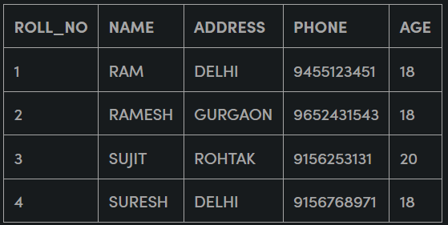

[🏠 Home](../../../README.md)  
<a href="../SQL.md">
	 Home
</a>

<h1 style="text-align: center">2. Java 'Hello World'</h1>

- [Important Terms](#important-terms)
	- [Database](#database)
	- [Database Management System](#database-management-system)
- [Evolution of DBMS](#evolution-of-dbms)
	- [Paradigm Shift from File System to DBMS](#paradigm-shift-from-file-system-to-dbms)
	- [Relational DBMS](#relational-dbms)
	- [NoSQL](#nosql)

## Important Terms

### Database 
Database is a collection of inter-related data which helps in efficient retrieval, insertion and deletion of data from database and organizes the data in the form of tables, views, schemas, reports etc. For Example, university database organizes the data about students, faculty, and admin staff etc. which helps in efficient retrieval, insertion and deletion of data from it.

### Database Management System 
The software which is used to manage the database is called Database Management System (DBMS). For Example, MySQL, Oracle, etc. are popular commercial DBMS used in different applications. DBMS allows users the following tasks:

- **Data Definition:** It helps in creation, modification, and removal of definitions that define the organization of data in the database.

- **Data Updation:** It helps in insertion, modification and deletion of the actual data in the database.

- **Data Retrieval:** It helps in retrieval of data from the database which can be used by applications for various purposes.

- **User Administration:** It helps in registering and monitoring users, enforcing data security, monitoring performance, maintaining data integrity, dealing with concurrency control and recovering information corrupted by unexpected failure.

## Evolution of DBMS

The history of DBMS evolved in three primary phases:
 
1. File-based System
2. Relational DBMS
3. NoSQL

### Paradigm Shift from File System to DBMS

- A File Management system is a DBMS that allows access to single files or tables at a time. 
- In a File System, data is directly stored in a set of files. 
- It contains flat files that have no relation to other files (when only one table is stored in a single file, then this file is known as flat file). 
- File System manages data using files in the hard disk. 
- Users are allowed to create, delete, and update the files according to their requirements.

**Example Scenario:** Let us consider the example of a file-based University Management System. Data of students is available to their respective Departments, Academics Section, Result Section, Accounts Section, Hostel Office, etc. Some of the data is common for all sections like Roll No, Name, Father Name, Address and Phone number of students but some data is available to a particular section only like Hostel allotment number which is a part of hostel office. 

**Issues with FIle-System DBMS:** Let us discuss the issues with this system:

- **Redundancy of data:** Data is said to be redundant if same data is copied at many places. 
  - If a student wants to change a Phone number, he has to get it updated at various sections. Similarly, old records must be deleted from all sections representing that student.
- **Inconsistency of Data:** Data is said to be inconsistent if multiple copies of the same data do not match with each other. 
  - If a Phone number is different in the Accounts Section and Academics Section, it will be inconsistent. Inconsistency may be because of typing errors or not updating all copies of same data.
- **Difficult Data Access:** A user should know the exact location of the file to access data, so the process is very cumbersome and tedious. 
  - If a user wants to search student hostel allotment number of a student from 10000 unsorted students’ records, how difficult it can be.
- **Unauthorized Access:** File System may lead to unauthorized access to data. 
  - If a student gets access to file having his marks, he can change it in unauthorized way.
- **No Concurrent Access:** The access of same data by multiple users at same time is known as concurrency. File system does not allow concurrency as data can be accessed by only one user at a time.
- **No Backup and Recovery:** File system does not incorporate any backup and recovery of data if a file is lost or corrupted.

These are the main reasons which made a shift from file system to Relational DBMS.

### Relational DBMS

Relational database means the data is stored as well as retrieved in the form of relations (tables). 

**Example:** The table below shows the relational database with only one relation called `STUDENT` which stores `ROLL_NO`, `NAME`, `ADDRESS`, `PHONE` and `AGE` of students.

The relational DBMS provides us with Structured Query Language or SQL which is a standard Database language that is used to create, maintain and retrieve the relational database

**Examples of RBMS softwares:** `MySQL`, `Oracle`, `Sybase`, `Microsoft SQL Server`, `Postgre`, etc.

### NoSQL

[🏠 Home](../../../README.md)  
<a href="../SQL.md">
	 Home
</a>
