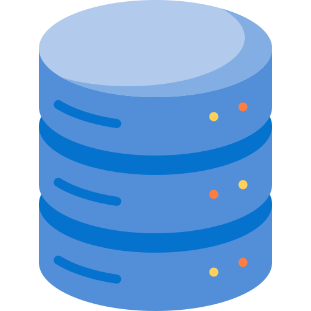

[🏠 Home](../../../README.md)  
<a href="../SQL.md">
	 Home
</a>

<h1 style="text-align: center">1. DBMS Introduction</h1>

- [Syllabus](#syllabus)
- [Important Terms](#important-terms)
	- [Database](#database)
	- [Database Management System](#database-management-system)
- [Evolution of DBMS](#evolution-of-dbms)
	- [Paradigm Shift from File System to DBMS](#paradigm-shift-from-file-system-to-dbms)
	- [Relational DBMS](#relational-dbms)
	- [NoSQL](#nosql)

## Syllabus

- Basic Indtroduction
  - Intro to DBMS
  - 2 & 3 Tire Architechture
  - Data Independance - 3 leevl or 3 Schema of Abstraction
  - Types of DBMS
    - Hierarchical databases
    - Network databases
    - Object-oriented databases
    - Relational databases
    - Cloud Database
    - Centralized Database
    - Operational Database
    - NoSQL databases
- E-R Model
  - Attributes
  - Relations
- Keys
  - Candidate Key
  - Primary Key
  - Super Key
  - Alternate Key
  - Foreign Key
  - Composite Key
- Normalization
  - Clouser Methods
  - Functional Dependencies
  - 1NF
  - 2NF
  - 3NF
  - BCNF
  - 4NF
  - 5NF
- Transaction Control & Concurrency
- SQL and Relation Algebra
- Indexing

[🏠 Home](../../../README.md)  
<a href="../SQL.md">
	 Home
</a>
