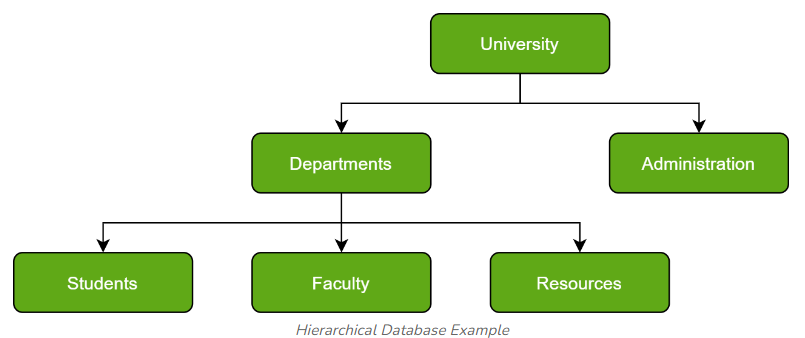

[🏠 Home](../../../README.md) <br/>
<a href="../SQL.md">
   Home
</a>

<hr/>

<h1 style="text-align: center">3. DBMS Types</h1>

- [Types of Databases](#types-of-databases)
- [1. Hierarchical databases](#1-hierarchical-databases)
- [2. Network databases](#2-network-databases)
- [3. Object-oriented databases](#3-object-oriented-databases)
- [4. Relational databases](#4-relational-databases)
- [5. Cloud Database](#5-cloud-database)
- [6. Centralized Database](#6-centralized-database)
- [7. Operational Database](#7-operational-database)
- [8. NoSQL databases](#8-nosql-databases)
- [Types of Data](#types-of-data)
	- [1. Structured Data](#1-structured-data)
	- [2. Semi-Structured Data](#2-semi-structured-data)
	- [3. Unstructured Data](#3-unstructured-data)


<hr/>

## Types of Databases

There are several types of databases, that are briefly explained below.

1. Hierarchical databases
2. Network databases
3. Object-oriented databases
4. Relational databases
5. Cloud Database
6. Centralized Database
7. Operational Database
8. NoSQL databases

## 1. Hierarchical databases

- Hierarchical databases organize data in a tree-like structure where each record has a single parent, forming a hierarchy. 
- This model is suitable for representing data with a clear hierarchical relationship.



**Characteristics:**
- **Structure:** Data is arranged in a tree structure with a parent-child relationship.
- **Parent-Child Relationship:** Each child record has only one parent record.
- **Navigation:** Data navigation is typically done by traversing the hierarchy.

**Example:**
- **IBM Information Management System (IMS)** is a classic example of a hierarchical database.

**Use Case:**
- Suitable for applications where data naturally fits a hierarchy, such as organizational structures or file systems.

**Advantages:**
- **Efficient for Hierarchical Data:** Best suited for data with a clear hierarchical relationship.
- **Data Integrity:** Enforces data integrity within the hierarchy.

**Disadvantages:**
- **Limited Flexibility:** Difficult to adapt to changes in the hierarchy.
- **Complex Navigation:** Navigating and updating data can be cumbersome if the hierarchy is deep or complex.

## 2. Network databases

Network databases extend the hierarchical model by allowing multiple parent-child relationships, forming a graph-like structure.

In Layman’s terms, a network database is a hierarchical database, but with a major tweak. The child records are given the freedom to associate with multiple parent records. As a result, a network or net of database files linked with multiple threads is observed.


**Characteristics:**
- **Structure:** Data is organized in a graph where entities can have multiple relationships.
- **Many-to-Many Relationships:** Entities can have multiple parent-child relationships.
- **Navigation:** Data is navigated through links between entities.

**Example:**
- **Integrated Data Store (IDS)** is an example of a network database.

**Use Case:**
- Ideal for complex applications with many-to-many relationships, such as telecommunication networks or transportation systems.

## 3. Object-oriented databases

Object-oriented databases store data in the form of objects, similar to how data is represented in object-oriented programming languages. This model supports complex data types and relationships.


**Characteristics:**
- **Structure:** Data is stored as objects, which include both data and methods.
- **Complex Data Types:** Supports encapsulation, inheritance, and polymorphism.
- **Navigation:** Objects are accessed through object references.

**Example:**
- ObjectDB is a popular object-oriented database.

**Use Case:**
- Suitable for applications requiring complex data modeling, such as CAD/CAM systems, multimedia databases, and real-time systems.

**Advantages:**
- **Complex Data Handling:** Ideal for applications with complex data structures.
- **Consistency with Programming Languages:** Aligns closely with object-oriented programming languages.

**Disadvantages:**
- **Learning Curve:** Requires understanding object-oriented concepts and database integration.
- **Less Mature:** Fewer tools and resources compared to relational databases.

## 4. Relational databases

Relational databases store data in tables (relations) with rows and columns. Data is accessed and manipulated using Structured Query Language (SQL). This model supports data integrity and normalization.


**Characteristics:**
- **Structure:** Data is stored in tables with rows and columns.
- **Schema:** Tables are defined by a schema with constraints and relationships.
- **SQL:** Data is queried using SQL.

**Example:**
- MySQL, PostgreSQL, Oracle Database are well-known relational databases.

**Use Case:**
- Widely used in applications requiring structured data storage and querying, such as banking systems, customer relationship management (CRM) systems, and enterprise resource planning (ERP) systems.

**Advantages:**
- **Structured Data:** Excellent for structured data and complex queries.
- **Data Integrity:** Strong data integrity through constraints and normalization.
- **Mature Technology:** Well-established with extensive tools and support.

**Disadvantages:**
- **Scalability Issues:** Can face performance issues with very large datasets or high-traffic environments.
- **Rigid Schema:** Schema changes can be complex and disruptive.


## 5. Cloud Database

Cloud databases are hosted on cloud platforms and accessed over the internet. They offer scalability, flexibility, and managed services without the need for physical hardware.

**Characteristics:**
- **Deployment:** Hosted on cloud infrastructure (e.g., AWS, Azure, Google Cloud).
- **Scalability:** Easily scalable with on-demand resources.
- **Managed Services:** Often provided as a service with maintenance, backups, and updates handled by the provider.

**Example:**
- Amazon RDS, Google Cloud SQL, Microsoft Azure SQL Database are examples of cloud databases.

**Use Case:**
- Suitable for applications requiring scalable and flexible database solutions, such as e-commerce platforms, SaaS applications, and big data analytics.

**Advantages:**
- **Scalability:** Easily scales with demand.
- **Reduced Maintenance:** Managed by cloud providers, reducing administrative overhead.
- **Accessibility:** Accessible from anywhere with an internet connection.

**Disadvantages:**
- **Data Security:** Potential concerns about data security and compliance with cloud providers.
- **Cost:** Can become expensive with high usage and storage needs.

## 6. Centralized Database

Centralized databases store all data in a single central location, with access managed by a central server.

**Characteristics:**
- **Single Location:** All data is stored and managed in a single central server.
- **Access:** Users access data through a central interface.
- **Management:** Centralized control over data access and security.

**Example:**
Traditional banking systems

**Advantages:**
- **Simplified Management:** Easier to manage and secure data from a single location.
- **Consistency:** Ensures data consistency with a central source of truth.

**Disadvantages:**
- **Single Point of Failure:** Central server issues can lead to system-wide outages.
- **Scalability:** Can become a bottleneck for large-scale or high-traffic applications.

## 7. Operational Database

Operational databases manage daily operations and transactional data, optimized for performance and real-time transactions.

**Characteristics:**
- **Transactional:** Supports day-to-day operations and transactions.
- **Performance:** Optimized for high performance and quick data retrieval.
- **Consistency:** Ensures data consistency and integrity during transactions.

**Example:**
**Retail point-of-sale (POS)** systems, inventory management systems

**Advantages:**
- **Real-Time Transactions:** Efficient for real-time data processing and transactions.
**Performance:** Optimized for high performance and fast response times.

**Disadvantages:**
- **Limited Analytical Capabilities:** May not be ideal for complex queries and analytics.
- **Maintenance:** Requires regular maintenance and monitoring to ensure performance.

## 8. NoSQL databases

NoSQL databases handle unstructured or semi-structured data and offer flexibility and scalability. They include various types like key-value, document, column-family, and graph databases.

**Characteristics:**
- **Data Models:** Includes key-value, document, column-family, and graph models.
- **Scalability:** Highly scalable and distributed.
- **Flexibility:** Schema-less, allowing for varied data types and structures.

**Example:**
MongoDB (document-based), Cassandra (column-family), Redis (key-value), Neo4j (graph)

**Advantages:**
- **Flexible Schema:** Allows for easy changes and varied data types.
- **Scalability:** Designed for distributed, high-volume data environments.
- **Performance:** Can handle large-scale, real-time applications effectively.

**Disadvantages:**
- **Consistency Models:** May use eventual consistency instead of strong consistency, which can affect data accuracy.
- **Complex Queries:** Less mature querying capabilities compared to relational databases.

## Types of Data

### 1. Structured Data 

Structured data is highly organized and easily searchable data that fits into predefined formats or schemas. It is typically stored in relational databases or spreadsheets and is easily searchable using SQL queries.

**Characteristics:**
- **Organized:** Data is organized into rows and columns.
Schema: Follows a predefined schema or structure (e.g., tables, fields).
- **Searchable:** Easily queried and analyzed using structured query languages.

**Example:**
- **Relational Databases:** An Employees table in a relational database with columns for EmployeeID, Name, Position, and Salary.
- **Spreadsheets:** A Microsoft Excel sheet with rows representing different employees and columns for their attributes (e.g., Name, Age, Department).

**Example Table**


<hr/>

### 2. Semi-Structured Data

Semi-structured data does not fit neatly into tables or predefined schemas but still has some organizational properties that make it easier to analyze compared to unstructured data. It often includes tags or markers that provide some structure.

**Characteristics:**
- **Flexible Structure:** Contains tags or markers that provide a hierarchy or metadata.
- **Less Rigid:** Does not adhere strictly to a schema but has some organization.
- **Readable:** Easier to interpret and analyze compared to unstructured data.

**Example:**
- **JSON Files:** A JSON file with nested objects and arrays, used to represent data in a hierarchical manner.

```json
{
  "employees": [
    {
      "EmployeeID": 1,
      "Name": "Alice Smith",
      "Position": "Manager",
      "Salary": 75000
    },
    {
      "EmployeeID": 2,
      "Name": "Bob Johnson",
      "Position": "Developer",
      "Salary": 60000
    },
    {
      "EmployeeID": 3,
      "Name": "Carol Lee",
      "Position": "Analyst",
      "Salary": 50000
    }
  ]
}
```

- **XML Files:** XML documents with hierarchical elements and attributes.

```xml
<employees>
  <employee>
    <EmployeeID>1</EmployeeID>
    <Name>Alice Smith</Name>
    <Position>Manager</Position>
    <Salary>75000</Salary>
  </employee>
  <employee>
    <EmployeeID>2</EmployeeID>
    <Name>Bob Johnson</Name>
    <Position>Developer</Position>
    <Salary>60000</Salary>
  </employee>
  <employee>
    <EmployeeID>3</EmployeeID>
    <Name>Carol Lee</Name>
    <Position>Analyst</Position>
    <Salary>50000</Salary>
  </employee>
</employees>
```

<hr/>

### 3. Unstructured Data

Unstructured data lacks a predefined format or structure. It includes a wide variety of data types that do not fit into traditional databases or spreadsheets easily. Analyzing unstructured data often requires more complex processing techniques.

**Characteristics:**
- **No Fixed Schema:** Does not follow a fixed schema or organization.
- **Varied Formats:** Can come in many formats including text, audio, video, and more.
- **Difficult to Analyze:** Requires advanced techniques such as natural language processing (NLP) or machine learning to analyze.

**Example:**
**Text Documents:** Emails, articles, or reports with free-form text.
- **Multimedia Files:** Audio files, videos, and images.
- **Social Media Posts:** Tweets, Facebook posts, or comments that have no standardized structure.

**Example Text Document:**

```
Subject: Team Meeting

Hi Team,

We have a meeting scheduled for Friday at 10 AM to discuss the upcoming project. Please prepare your reports and be ready to provide updates on your tasks.

Best,
Alice
```

<hr/>


<hr/>

[🏠 Home](../../../README.md) <br/>
<a href="../SQL.md">
   Home
</a>
