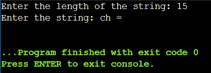
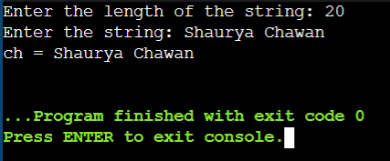

<div style="display: flex; justify-content: space-between">
<a href="../C++.md">Home</a>
<br/>
<a href="./4. Operators - C++.md">Next -> Operators</a>
</div>

<hr/>

<h1 style = "text-align:center">3. Input & Output</h1>

- [*scanf()* \& *printf()*](#scanf--printf)
	- [scanf()](#scanf)
	- [printf()](#printf)
- [*cin* \& *cout*](#cin--cout)
	- [cin](#cin)
	- [cout](#cout)
- [*getline()*](#getline)

<hr/>

## *scanf()* & *printf()*
<table style="width: 100%">
	<tr>
		<th>Format Specifier</th>
		<th style="width: 60%">Type</th>
	</tr>
	<tr>
		<td>%c</td>
		<td>Character</td>
	</tr>
	<tr>
		<td>%d</td>
		<td>Signed integer</td>
	</tr>
	<tr>
		<td>%e or %E</td>
		<td>Scientific notation of floats</td>
	</tr>
	<tr>
		<td>%f</td>
		<td>Float values</td>
	</tr>
	<tr>
		<td>%g or %G</td>
		<td>Similar as %e or %E</td>
	</tr>
	<tr>
		<td>%hi</td>
		<td>Signed integer (short)</td>
	</tr>
	<tr>
		<td>%hu</td>
		<td>Unsigned Integer (short)</td>
	</tr>
	<tr>
		<td>%i</td>
		<td>Unsigned integer</td>
	</tr>
	<tr>
		<td>%l or %ld or %li</td>
		<td>Long</td>
	</tr>
	<tr>
		<td>%lf</td>
		<td>Double</td>
	</tr>
	<tr>
		<td>%Lf</td>
		<td>Long double</td>
	</tr>
	<tr>
		<td>%lu</td>
		<td>Unsigned int or unsigned long</td>
	</tr>
	<tr>
		<td>%lli or %lld</td>
		<td>Long long</td>
	</tr>
	<tr>
		<td>%llu</td>
		<td>Unsigned long long</td>
	</tr>
	<tr>
		<td>%o</td>
		<td>Octal representation</td>
	</tr>
	<tr>
		<td>%p</td>
		<td>Pointer</td>
	</tr>
	<tr>
		<td>%s</td>
		<td>String</td>
	</tr>
	<tr>
		<td>%u</td>
		<td>Unsigned int</td>
	</tr>
	<tr>
		<td>%x or %X</td>
		<td>Hexadecimal representation</td>
	</tr>
	<tr>
		<td>%n</td>
		<td>Prints nothing</td>
	</tr>
	<tr>
		<td>%%</td>
		<td>Prints % character</td>
	</tr>
</table>

These are the basic format specifiers. We can add some other parts with the format specifiers. These are like below −
- A minus symbol (-) sign tells left alignment

- A number after % specifies the minimum field width. If string is less than the width, it will be filled with spaces

- A period (.) is used to separate field width and precision

### scanf()

- It is used for taking single input from the user.

- **Header File:** \<cstdio>

- But it can work without it too, under the <iostream> header file.

- It stops reading as soon as it encounters a white space, a new line or a tab.

**Example:**<br/> 
*Input:* Hi I am a boy. <br/>
*Output:* Hi

- So here we use the **getline()** method which we have discussed later in this chapter

<hr/>

### printf()

- It is used for printing output on the screen.

- **Header File:** \<cstdio>

- But it can work without it too, under the <iostream> header file.

**Example: of scanf() and printf()**
```
#include <iostream>
using namespace std;
 
int main()
{
    int age;
    printf("Enter your age: ");
    scanf("%d", &age);
    printf("Your age is %d\n", age);
    
return 0;
}

```
Output:
```
Enter your age: 20
Your age is 20
```

<hr/>

## *cin* & *cout*

### cin

- It is used for taking single input from the user.

- Header File: <iostream>

- **'>>'** is called an Extraction Operator, used for extracting input from the input buffer stream.

- It stops reading as soon as it encounters a white space, a new line or a tab.

**Example:** <br/> 
*Input:* Hi I am a boy. <br/>
*Output:* Hi

- So here we use the **getline()** method which we have discussed later in this chapter
  
<hr/>

### cout

- It is used for printing output on the screen.

- Header File: \<iostream>

- **'<<'** is called an Insertion Operator, used for printing the output (on the screen) from the output buffer stream.

**Example: cin & cout**
```
#include <iostream>
using namespace std;
 
int main()
{
    int age;
    cout << "Enter your age: ";
    cin >> age;
    cout << "Your age is " << age;
    
    return 0;
}
```
Output:
```
Enter your age: 20
Your age is 20
```

<hr/>

## *getline()*

- **Syntax 1:** 
```
istream& getline(istream& is, string& str, char delim);
```
- **Syntax 2:**
```
istream& getline (istream& is, string& str);
```

- It is used for string input.

- **Parameter:*
    - **is :** It is an object of the istream class and tells the function about the stream from where to read the input from.
    - **str :** It is a string object, the input is stored in this object after being read from the stream.
    - **delim :** It is the delimitation character which tells the function to stop reading further input after reaching this character. By default the delimitation character is **'\n'** newline character.

In syntax 2, the delimitation was not declared so it was set to **'\n'** newline character by default

- **Header File:** \<string>

**Example 1:** syntax 1
```
#include <bits/stdc++.h>
using namespace std;

// MACRO definitions

// Maximum len of your name can't be more than 60
#define MAX_NAME_LEN 60

// Maximum len of your address can't be more than 120
#define MAX_ADDRESS_LEN 120 

// Maximum len of your profession can't be more than 250
#define MAX_ABOUT_LEN 250   

int main()
{
    char y_name[MAX_NAME_LEN], y_address[MAX_ADDRESS_LEN], about_y[MAX_ABOUT_LEN];

    cout << "Enter your name: ";
    cin.getline(y_name, MAX_NAME_LEN);

    cout << "Enter your City: ";
    cin.getline(y_address, MAX_ADDRESS_LEN);

    cout << "Enter your profession (press $ to complete): ";
    cin.getline(about_y, MAX_ABOUT_LEN, '$'); //$ is a delimiter

    cout << "\nEntered details are:" << endl <<endl;
    cout << "Name: " << y_name << endl;
    cout << "Address: " << y_address << endl;
    cout << "Profession is: " << about_y << endl;
}

```
Output:
```
Enter your name: Shaurya Chawan
Enter your City: Thane, Mumbai, Maharashtra
Enter your profession (press $ to complete): Software Engineer$

Entered details are:

Name: Shaurya Chawan
Address: Thane, Mumbai, Maharashtra
Profession is: Software Engineer 

```

<table style="width: 100%; background-color: MediumSeaGreen; color: black; text-align:center">
    <tr>
        <td>
            NOTICE: <br/>
            Notice that the 'cin' is used before the 'getline()' ie. 'cin.getline()'
            We do this when we have to declare the third parameter of 'getline()' function ie. the delim part
        </td>
    </tr>
</table>

**Example:** syntax 2:
```
#include <bits/stdc++.h>
using namespace std;

int main()
{
    string y_name;
    cout << "Enter your name: ";
    getline(cin, y_name);
    cout << "Name: " << y_name << endl;

    return 0;
}

```
Output:
```
Enter your name: Shaurya Chawan
Name: Shaurya Chawan
```

**Problem with 'getline()':**

- There is one problem with the **'getline()'** function. This problem arises when we use getline after **'cin'**.

- The **'getline()'** function does not ignore leading white space characters. On the other hand, cin ignores white space characters and leaves it in the stream as garbage.

**Example:** Below is the demonstration of the problem
```
#include <bits/stdc++.h>
using namespace std;


int main(){
    
    int n;
    string ch;
    
    cout << "Enter the length of the string: ";
    // The cin statement uses the n and leaves the \n
    // in the stream as garbage
    cin >> n;
    cout << "Enter the string: ";
    // here, getline() reads \n and finish reading   
    getline(cin, ch);
    cout << "ch = " << ch << endl;
    
    return 0;
}
```
Output: <br/>
<!--  -->


- Solution for the above problem is to use something which extracts all white space characters after cin. 

- **'std::ws'** in C++ to do the same thing. This is actually used with the **'>>'** operator on input streams.

**Example:** Above problem can be solved using **'std::ws'**
```
#include <bits/stdc++.h>
using namespace std;


int main()
{
    int n;
    string ch;

    cout << "Enter the length of the string: ";
    // The cin statement uses the n and leaves the \n
    // in the stream as garbage
    cin >> n;

    // getline() reads \n and finish reading
    cout << "Enter the string: ";
    getline(cin >> ws, ch);
    cout << "ch = " << ch << endl;
    return 0;
}

```
Output: <br/>
<!--  -->


<hr/>

<div style="display: flex; justify-content: space-between">
<a href="../C++.md">Home</a>
<br/>
<a href="./4. Operators - C++.md">Next -> Operators</a>
</div>