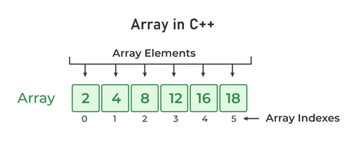

<div style="display: flex; justify-content: space-between">
<a href="../C++.md">Home</a>
</div>

<hr/>

<h1 style = "text-align:center">8. Arrays</h1>

- [What is an Arrays?](#what-is-an-arrays)
- [Advantages of C++ Array](#advantages-of-c-array)
- [Disadvantages of C++ Array](#disadvantages-of-c-array)
- [Array Category](#array-category)
- [1D Array - Fixed Size](#1d-array---fixed-size)
- [1D Array - Dynamic Size](#1d-array---dynamic-size)
- [Multi-Dimension - Fixed Size](#multi-dimension---fixed-size)
- [Multi-Dimension - Dynamic Size](#multi-dimension---dynamic-size)
- [Passing an Array to a Function](#passing-an-array-to-a-function)
- [Operations on Arrays](#operations-on-arrays)
  - [Traversing Over all the elements of an Array](#traversing-over-all-the-elements-of-an-array)
  - [Taking input and storing in Array](#taking-input-and-storing-in-array)
  - [Find the Size of the Array](#find-the-size-of-the-array)
  - [Add an element to a specific position(this can be applied for first and last position too)](#add-an-element-to-a-specific-positionthis-can-be-applied-for-first-and-last-position-too)
  - [Delete an element to a specific position(this can be applied for first and last position too)](#delete-an-element-to-a-specific-positionthis-can-be-applied-for-first-and-last-position-too)


<hr/>

## What is an Arrays?

- An array is a collection of similar types of data.

- It is a data structure.

- It is used to store multiple values in a single variable, instead of declaring separate variables for each value.

- They can be used to store collections of primitive data types such as int, float, double, char, etc of any particular type. Or can store derived data types such as the structures, pointers etc.


<!--  -->

<hr/>

## Advantages of C++ Array

- Code Optimization (less code)
- Random Access
- Easy to traverse data
- Easy to manipulate data
- Easy to sort data etc.

<hr/>

## Disadvantages of C++ Array
- Fixed size

<hr/>

## Array Category

- Size
  - Fixed Size
  - Dynamic Size
- Dimension
  - Single Dimension (1D)
  - Multi-Dimension

<hr/>

## 1D Array - Fixed Size

**Syntax:** Declaring an Array
```
data_type variable_name[size_of_array];
```
**Syntax:** Declaring and Initializing / Denining an Array
```
data_type variable_name[size_of_array] = {element1, element2, ..etc};;
```

**Examples:** Following are different ways of declring and initializing an array
```
    //size of all arrays
    int size = 4;
    
    //type 1
    int arr1[size] = {0,1,2,3};     //arr1 => |0|1|2|3|

    //type 2
    int arr2[size];
    arr2 = {0,1,2,3};               //arr2 => |0|1|2|3|

    //type 3
    int arr3[size] = {0};           // arr3 => |0|0|0|0|

    //type 4
    int arr4[size] = {1};           // arr4 => |1|0|0|0|

    //type 5
    int arr5[size] = {};            // arr5 => |0|0|0|0|
    
    //type 6
    int arr6[] = {0,2};             // arr6 => |0|2|0|0|
```

<hr/>


## 1D Array - Dynamic Size

**Example:** of declaring and initializing an dynamic array
```
// size of the dynamic array
int size = 4; 

//type 1
int* arr1= new int[size];              //arr1 => |0|0|0|0|

//type 2
int* arr2 = new int[size]{0,1,2,3};    //arr2 => |0|1|2|3|

//type 3
int* arr3 = new int[size]{0};          // arr3 => |0|0|0|0|

//type 4
int* arr4 = new int[size]{1};          // arr4 => |1|0|0|0|

//type 5
int* arr5 = new int[size]{};           // arr5 => |0|0|0|0|

//type 6
int* arr6 = new int[size]{0,2};        // arr6 => |0|2|0|0|
```
<hr/>


## Multi-Dimension - Fixed Size

A multi-dimensional array is an array of arrays.

```
// 2D array
<datatype> <arrNamr>[row_size][column_size];

// 3D array
<datatype> <arrNamr>[plane][row_size][column_size];
```

**Example:**
**2D Array**
```
string letters[2][4] = {
  { "A", "B", "C", "D" },
  { "E", "F", "G", "H" }
};
```

**3D Array**
```
string letters[2][2][2] = {
  {
    { "A", "B" },
    { "C", "D" }
  },
  {
    { "E", "F" },
    { "G", "H" }
  }
};
```


<hr/>

## Multi-Dimension - Dynamic Size

In C++, dynamic multidimensional arrays are typically implemented using pointers to pointers (also known as a "pointer to an array"). This allows you to create arrays whose dimensions can be determined at runtime. 

```
#include <iostream>
using namespace std;

int main()
{
  int numRows, numCols;

  // Get the number of rows and columns from the user
  cout << "Enter the number of rows: ";
  cin >> numRows;
  cout << "Enter the number of columns: ";
  cin >> numCols;

  // Allocate memory for the dynamic multidimensional array
  int **dynamicArray = new int *[numRows]; // Create an array of int* (pointers to int)

  for (int i = 0; i < numRows; ++i)
  {
    dynamicArray[i] = new int[numCols]; // Each int* points to an array of int (a row)
  }

  // Initialize the elements of the array
  int value = 1;
  for (int i = 0; i < numRows; ++i)
  {
    for (int j = 0; j < numCols; ++j)
    {
      dynamicArray[i][j] = value;
      value++;
    }
  }

  // Access and print the elements of the array
  cout << "Dynamic Array Contents:" << endl;
  for (int i = 0; i < numRows; ++i)
  {
    for (int j = 0; j < numCols; ++j)
    {
      cout << dynamicArray[i][j] << " ";
    }
    cout << endl;
  }

  // Deallocate memory to prevent memory leaks
  for (int i = 0; i < numRows; ++i)
  {
    delete[] dynamicArray[i]; // Delete each row
  }
  delete[] dynamicArray; // Delete the array of pointers

  return 0;
}
```
Output:
```
Enter the number of rows: 5
Enter the number of columns: 8
Dynamic Array Contents:
1 2 3 4 5 6 7 8 
9 10 11 12 13 14 15 16 
17 18 19 20 21 22 23 24 
25 26 27 28 29 30 31 32 
33 34 35 36 37 38 39 40 
```

**Keep in mind that when working with dynamic arrays, you should always remember to deallocate the memory when you are done using the array to avoid memory leaks. In practice, it's often a good idea to use smart pointers or standard containers like *'std::vector'* for dynamic arrays to simplify memory management.**

<hr/>

## Passing an Array to a Function


<hr/>

## Operations on Arrays

### Traversing Over all the elements of an Array

**Example:**
```
#include <iostream>

using namespace std;

int main()
{
    int arr[4] = {0,1,2,3};

    for(int i = 0; i < 4; i++){
        cout << arr[i] << ", ";
    }

    return 0;
}
```
Output:
```
0, 1, 2, 3, 
```

<hr/>

### Taking input and storing in Array
```
#include <iostream>

using namespace std;

int main()
{
    int arr[4];

    cout << "Enter Array elements: ";
    for(int i = 0; i < 4; i++){
        cin >> arr[i];
    }
    
    cout << "Array elements: ";
    for(int i = 0; i < 4; i++){
        cout << arr[i] << ", ";
    }

    return 0;
}
```
Output:
```
Enter Array elements: 0 1 2 3
Array elements: 0, 1, 2, 3, 
```

<hr/>

### Find the Size of the Array
```
#include <iostream>

using namespace std;

int main()
{
    int arr[4];

    int arrSize = sizeof(arr)/sizeof(arr[0]);
    
    cout << "Size of Array: " << arrSize;

    return 0;
}
```
Output:
```
Size of Array: 4
```

<hr/>

### Add an element to a specific position(this can be applied for first and last position too)


<hr/>

### Delete an element to a specific position(this can be applied for first and last position too)


<hr/>


<hr/>
<div style="display: flex; justify-content: space-between">
<a href="../C++.md">Home</a>
</div>