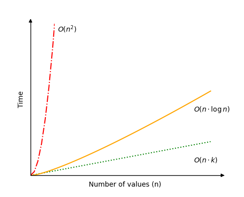

[🏠 Home](../../../README.md) <br/>
[🛠️ DSA Home](../DSA.md)

<hr>

<h1> Radix Sort </h1>

## Index
- [Index](#index)
- [How it works (LSD Radix Sort)](#how-it-works-lsd-radix-sort)
- [Time Complexity](#time-complexity)
- [Example Run Up](#example-run-up)
- [Radix Sort Implementation](#radix-sort-implementation)
  - [In Java](#in-java)
  - [In Python](#in-python)
  - [In C++](#in-c)
- [Radix Sort Using Other Sorting Algorithms](#radix-sort-using-other-sorting-algorithms)
  - [In Java](#in-java-1)
  - [In Python](#in-python-1)
  - [In C++](#in-c-1)

<hr>

👉 [W3schools.com - Radix Sort](https://www.w3schools.com/dsa/dsa_algo_radixsort.php)

<hr>

- The Radix Sort algorithm sorts an array by individual digits, starting with the least significant digit (the rightmost one).
- Radix Sort is a non-comparison-based sorting algorithm that sorts integers (or strings) by processing individual digits or characters one at a time.
- It uses another stable sorting algorithm, such as Counting Sort, as a subroutine to sort elements by each digit or character, starting from the least significant digit (LSD) to the most significant digit (MSD).

[⬆️ Back to TOP ⬆️](#index)

## How it works (LSD Radix Sort)

- Identify the maximum number in the array to determine the number of digits (or character places) to process.
- Sort the array based on each digit, starting from the least significant digit (rightmost) to the most significant digit (leftmost), using a stable sorting algorithm (like Counting Sort).
- Repeat this process for each digit, ensuring that numbers are placed in the correct order based on progressively more significant digits.

[⬆️ Back to TOP ⬆️](#index)

## Time Complexity

- **General Time Complexity**: `O(n⋅k)`
  - `n` = number of elements, `k` = number of digits in the largest element.
- **Best-case**: `O(n)`
  - Occurs when there are many elements, but few digits (e.g., a million elements with values up to 999).
- **Worst-case**: `O(n²)`
  - Happens when the number of digits `k` is equal to the number of elements `n`.
- **Average-case**: `O(n⋅log n)`
  - Typically occurs when the number of digits grows logarithmically with n (e.g., a million elements with 6-digit values).



[⬆️ Back to TOP ⬆️](#index)

## Example Run Up

Array: `[170, 45, 75, 90, 802, 24, 2, 66]`

- First, sort by the least significant digit: `[170, 90, 802, 2, 24, 45, 75, 66]`
- Next, sort by the tens digit: `[802, 2, 24, 45, 66, 170, 75, 90]`
- Finally, sort by the hundreds digit: `[2, 24, 45, 66, 75, 90, 170, 802]`
  
Now the array is sorted: `[2, 24, 45, 66, 75, 90, 170, 802]`.

## Radix Sort Implementation

To implement the Radix Sort algorithm we need:

1. An array with non negative integers that needs to be sorted.
2. A two dimensional array with index 0 to 9 to hold values with the current radix in focus.
3. A loop that takes values from the unsorted array and places them in the correct position in the two dimensional radix array.
4. A loop that puts values back into the initial array from the radix array.
5. An outer loop that runs as many times as there are digits in the highest value.

[⬆️ Back to TOP ⬆️](#index)

### In Java

```java
public class Main {
    public static void main(String[] args) {
        int[] myArray = {170, 45, 75, 90, 802, 24, 2, 66};
        System.out.print("Original array: ");
        for(int val : myArray) {
            System.out.print(val + " ");
        }
        System.out.println();

        int[][] radixArray = new int[10][myArray.length];
        int[] counts = new int[10];
        int maxVal = findMax(myArray);
        int exp = 1;

        while (maxVal / exp > 0) {
            for(int val : myArray) {
                int radixIndex = (val / exp) % 10;
                radixArray[radixIndex][counts[radixIndex]] = val;
                counts[radixIndex]++;
            }

            int pos = 0;
            for(int i = 0; i < 10; i++) {
                for(int j = 0; j < counts[i]; j++) {
                    myArray[pos] = radixArray[i][j];
                    pos++;
                }
                counts[i] = 0;
            }

            exp *= 10;
        }

        System.out.print("Sorted array: ");
        for(int val : myArray) {
            System.out.print(val + " ");
        }
        System.out.println();
    }

    public static int findMax(int[] arr) {
        int max = arr[0];
        for(int val : arr) {
            if(val > max) {
                max = val;
            }
        }
        return max;
    }
}

// Output:
// Original array: 170 45 75 90 802 24 2 66
// Sorted array: 2 24 45 66 75 90 170 802
```

[⬆️ Back to TOP ⬆️](#index)

### In Python

```python
myArray = [170, 45, 75, 90, 802, 24, 2, 66]
print("Original array:", myArray)
radixArray = [[], [], [], [], [], [], [], [], [], []]
maxVal = max(myArray)
exp = 1

while maxVal // exp > 0:

    while len(myArray) > 0:
        val = myArray.pop()
        radixIndex = (val // exp) % 10
        radixArray[radixIndex].append(val)

    for bucket in radixArray:
        while len(bucket) > 0:
            val = bucket.pop()
            myArray.append(val)

    exp *= 10

print("Sorted array:", myArray)

# Output:
# Original array: [170, 45, 75, 90, 802, 24, 2, 66]
# Sorted array: [2, 24, 45, 66, 75, 90, 170, 802]
```

[⬆️ Back to TOP ⬆️](#index)

### In C++

```c++
#include <iostream>
#include <vector>
using namespace std;

#define SIZE 8

void radix_sort(int arr[], int size) {
    // Find the maximum value in the array
    int max_val = arr[0];
    for(int i = 1; i < size; i++) {
        if(arr[i] > max_val) {
            max_val = arr[i];
        }
    }

    int exp = 1;
    vector<vector<int>> radix_array(10, vector<int>(size));
    vector<int> counts(10, 0);

    while (max_val / exp > 0) {
        // Distribute the elements into buckets based on the current digit
        for(int i = 0; i < size; i++) {
            int radix_index = (arr[i] / exp) % 10;
            radix_array[radix_index][counts[radix_index]] = arr[i];
            counts[radix_index]++;
        }

        // Collect the elements from the buckets back into the array
        int pos = 0;
        for(int i = 0; i < 10; i++) {
            for(int j = 0; j < counts[i]; j++) {
                arr[pos] = radix_array[i][j];
                pos++;
            }
            counts[i] = 0;
        }

        // Move to the next digit
        exp *= 10;
    }
}

int main() {
    int arr[SIZE] = {170, 45, 75, 90, 802, 24, 2, 66};

    cout << "Original array: ";
    for(int i = 0; i < SIZE; i++) {
        cout << arr[i] << " ";
    }
    cout << endl;

    radix_sort(arr, SIZE);

    cout << "Sorted array: ";
    for(int i = 0; i < SIZE; i++) {
        cout << arr[i] << " ";
    }
    cout << endl;

    return 0;
}

// Output:
// Original array: 170 45 75 90 802 24 2 66
// Sorted array: 2 24 45 66 75 90 170 802
```

[⬆️ Back to TOP ⬆️](#index)

## Radix Sort Using Other Sorting Algorithms

- Radix Sort can actually be implemented together with any other sorting algorithm as long as it is stable. 
- This means that when it comes down to sorting on a specific digit, any stable sorting algorithm will work, such as `Counting sort` or `Bubble sort`.
- This is an implementation of Radix Sort that uses Bubble Sort to sort on the individual digits:

### In Java

```java
public class Main {

    public static void bubbleSort(int[] arr) {
        int n = arr.length;
        for (int i = 0; i < n; i++) {
            for (int j = 0; j < n - i - 1; j++) {
                if (arr[j] > arr[j + 1]) {
                    int temp = arr[j];
                    arr[j] = arr[j + 1];
                    arr[j + 1] = temp;
                }
            }
        }
    }

    public static void radixSortWithBubbleSort(int[] arr) {
        int maxVal = arr[0];
        for (int num : arr) {
            if (num > maxVal) maxVal = num;
        }
        
        int exp = 1;
        while (maxVal / exp > 0) {
            int[][] radixArray = new int[10][arr.length];
            int[] count = new int[10];
            
            for (int num : arr) {
                int radixIndex = (num / exp) % 10;
                radixArray[radixIndex][count[radixIndex]++] = num;
            }
            
            for (int i = 0; i < 10; i++) {
                int[] tempArray = new int[count[i]];
                System.arraycopy(radixArray[i], 0, tempArray, 0, count[i]);
                bubbleSort(tempArray);
                System.arraycopy(tempArray, 0, radixArray[i], 0, count[i]);
            }
            
            int index = 0;
            for (int i = 0; i < 10; i++) {
                for (int j = 0; j < count[i]; j++) {
                    arr[index++] = radixArray[i][j];
                }
            }
            
            exp *= 10;
        }
    }

    public static void main(String[] args) {
        int[] myArray = {170, 45, 75, 90, 802, 24, 2, 66};
        System.out.print("Original array: ");
        for (int num : myArray) System.out.print(num + " ");
        System.out.println();
        
        radixSortWithBubbleSort(myArray);
        
        System.out.print("Sorted array: ");
        for (int num : myArray) System.out.print(num + " ");
        System.out.println();
    }
}

// Output:
// Original array: 170 45 75 90 802 24 2 66
// Sorted array: 2 24 45 66 75 90 170 802
```

[⬆️ Back to TOP ⬆️](#index)

### In Python

```python
def bubbleSort(arr):
    n = len(arr)
    for i in range(n):
        for j in range(0, n - i - 1):
            if arr[j] > arr[j + 1]:
                arr[j], arr[j + 1] = arr[j + 1], arr[j]
                
def radixSortWithBubbleSort(arr):
    max_val = max(arr)
    exp = 1
    
    while max_val // exp > 0:
        radixArray = [[],[],[],[],[],[],[],[],[],[]]
        
        for num in arr:
            radixIndex = (num // exp) % 10
            radixArray[radixIndex].append(num)
        
        for bucket in radixArray:
            bubbleSort(bucket)
        
        i = 0
        for bucket in radixArray:
            for num in bucket:
                arr[i] = num
                i += 1
        
        exp *= 10

myArray = [170, 45, 75, 90, 802, 24, 2, 66]
print("Original array:", myArray)
radixSortWithBubbleSort(myArray)
print("Sorted array:", myArray)

# Output:
# Original array: [170, 45, 75, 90, 802, 24, 2, 66]
# Sorted array: [2, 24, 45, 66, 75, 90, 170, 802]
```

[⬆️ Back to TOP ⬆️](#index)

### In C++

```c++
#include <iostream>
#include <vector>
using namespace std;

void bubbleSort(vector<int>& arr, int n) {
    for (int i = 0; i < n; ++i) {
        for (int j = 0; j < n - i - 1; ++j) {
            if (arr[j] > arr[j + 1]) {
                int temp = arr[j];
                arr[j] = arr[j + 1];
                arr[j + 1] = temp;
            }
        }
    }
}

void radixSortWithBubbleSort(vector<int>& arr, int n) {
    int max_val = arr[0];
    for (int i = 1; i < n; ++i) {
        if (arr[i] > max_val) max_val = arr[i];
    }

    int exp = 1;
    while (max_val / exp > 0) {
        vector<vector<int>> radixArray(10, vector<int>(n));
        vector<int> count(10, 0);

        for (int i = 0; i < n; ++i) {
            int radixIndex = (arr[i] / exp) % 10;
            radixArray[radixIndex][count[radixIndex]++] = arr[i];
        }

        for (int i = 0; i < 10; ++i) {
            bubbleSort(radixArray[i], count[i]);
        }

        int index = 0;
        for (int i = 0; i < 10; ++i) {
            for (int j = 0; j < count[i]; ++j) {
                arr[index++] = radixArray[i][j];
            }
        }

        exp *= 10;
    }
}

int main() {
    vector<int> myArray = {170, 45, 75, 90, 802, 24, 2, 66};
    int n = myArray.size();
    cout << "Original array: ";
    for (int i = 0; i < n; ++i) cout << myArray[i] << " ";
    cout << endl;

    radixSortWithBubbleSort(myArray, n);

    cout << "Sorted array: ";
    for (int i = 0; i < n; ++i) cout << myArray[i] << " ";
    cout << endl;

    return 0;
}

// Output
// Original array: [170, 45, 75, 90, 802, 24, 2, 66]
// Sorted array: [2, 24, 45, 66, 75, 90, 170, 802]
```

<hr>

[🏠 Home](../../../README.md) <br/>
[🛠️ DSA Home](../DSA.md)