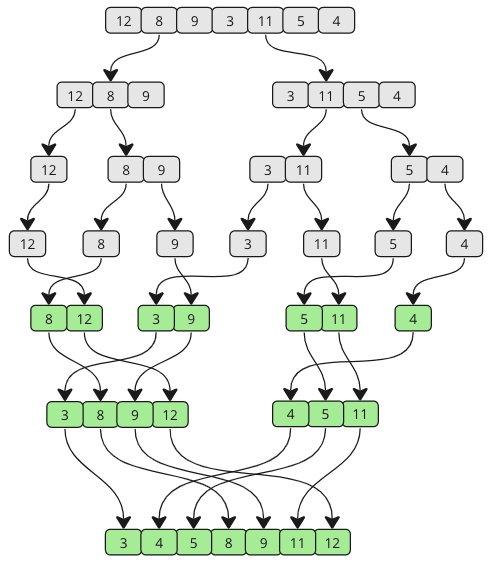
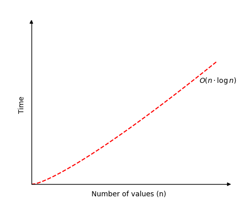

[🏠 Home](../../../README.md) <br/>
[🛠️ DSA Home](../DSA.md)

<hr>

<h1> Merge Sort </h1>

## Index
- [Index](#index)
- [How it works](#how-it-works)
- [Example Run Up 1](#example-run-up-1)
- [Example Run Up 2](#example-run-up-2)
- [Time Complexity](#time-complexity)
- [Merge Sort Implementation](#merge-sort-implementation)
  - [In Java](#in-java)
  - [In Python](#in-python)
  - [In C++](#in-c)
- [Merge Sort without Recursion](#merge-sort-without-recursion)
  - [In Java](#in-java-1)
  - [In Python](#in-python-1)
  - [In C++](#in-c-1)

<hr>

👉 [W3schools.com - Merge Sort](https://www.w3schools.com/dsa/dsa_algo_mergesort.php)

<hr>

- The Merge Sort algorithm is a divide-and-conquer algorithm that sorts an array by first breaking it down into smaller arrays, and then building the array back together the correct way so that it is sorted.

## How it works

- Divide the array into two halves recursively until each subarray contains only one element (which is trivially sorted).
- Merge the subarrays back together by comparing the smallest elements of each subarray and placing them in the correct order.
- Continue merging until the entire array is sorted.

## Example Run Up 1



## Example Run Up 2

Array: `[38, 27, 43, 3, 9, 82, 10]`

- First, divide the array into smaller subarrays:
  - `[38, 27, 43, 3, 9, 82, 10]` → `[38, 27, 43]` and `[3, 9, 82, 10]` → `[38]`, `[27, 43]`, `[3, 9]`, `[82, 10]`
- Sort and merge:
  - Merge [27, 43] → [27, 43]
  - Merge [3, 9] → [3, 9]
  - Merge [82, 10] → [10, 82]
- Continue merging the sorted subarrays:
  - `[38]` and `[27, 43]` → `[27, 38, 43]`
  - `[3, 9]` and `[10, 82]` → `[3, 9, 10, 82]`
- Finally, merge `[27, 38, 43]` and `[3, 9, 10, 82]` → `[3, 9, 10, 27, 38, 43, 82]`

## Time Complexity

- **Worst-case**: `O(n log n)`, where `n` is the number of elements (because the array is divided in half repeatedly, and merging takes linear time).
- **Best-case**: `O(n log n)` (even for a sorted array, the process of dividing and merging occurs).
- **Space Complexity**: `O(n)`, as it requires additional space to hold the temporary subarrays during merging.



## Merge Sort Implementation

To implement the Merge Sort algorithm we need:

- An array with values that needs to be sorted.
- A function that takes an array, splits it in two, and calls itself with each half of that array so that the arrays are split again and again recursively, until a sub-array only consist of one value.
- Another function that merges the sub-arrays back together in a sorted way.

### In Java

```java
import java.util.Arrays;

public class Main {
    public static void main(String[] args) {
        double[] unsortedArr = {3, 7, 6, -10, 15, 23.5, 55, -13};
        double[] sortedArr = mergeSort(unsortedArr);
        System.out.println("Sorted array: " + Arrays.toString(sortedArr));
    }

    public static double[] mergeSort(double[] arr) {
        if (arr.length <= 1) {
            return arr;
        }

        int mid = arr.length / 2;
        double[] leftHalf = Arrays.copyOfRange(arr, 0, mid);
        double[] rightHalf = Arrays.copyOfRange(arr, mid, arr.length);

        double[] sortedLeft = mergeSort(leftHalf);
        double[] sortedRight = mergeSort(rightHalf);

        return merge(sortedLeft, sortedRight);
    }

    public static double[] merge(double[] left, double[] right) {
        double[] result = new double[left.length + right.length];
        int i = 0, j = 0, k = 0;

        while (i < left.length && j < right.length) {
            if (left[i] < right[j]) {
                result[k++] = left[i++];
            } else {
                result[k++] = right[j++];
            }
        }

        while (i < left.length) {
            result[k++] = left[i++];
        }

        while (j < right.length) {
            result[k++] = right[j++];
        }

        return result;
    }
}

// Output: Sorted array: [-13.0, -10.0, 3.0, 6.0, 7.0, 15.0, 23.5, 55.0]
```

### In Python

```python
def mergeSort(arr):
    if len(arr) <= 1:
        return arr

    mid = len(arr) // 2
    leftHalf = arr[:mid]
    rightHalf = arr[mid:]

    sortedLeft = mergeSort(leftHalf)
    sortedRight = mergeSort(rightHalf)

    return merge(sortedLeft, sortedRight)

def merge(left, right):
    result = []
    i = j = 0

    while i < len(left) and j < len(right):
        if left[i] < right[j]:
            result.append(left[i])
            i += 1
        else:
            result.append(right[j])
            j += 1

    result.extend(left[i:])
    result.extend(right[j:])

    return result

unsortedArr = [3, 7, 6, -10, 15, 23.5, 55, -13]
sortedArr = mergeSort(unsortedArr)
print("Sorted array:", sortedArr)

# Output: Sorted array: [-13, -10, 3, 6, 7, 15, 23.5, 55]
```

### In C++

```c++
#include <iostream>
using namespace std;

void mergeSort(double arr[], int start, int end);
void merge(double arr[], int start, int mid, int end);

int main() {
    double unsortedArr[] = {3, 7, 6, -10, 15, 23.5, 55, -13};
    int size = sizeof(unsortedArr) / sizeof(unsortedArr[0]);

    mergeSort(unsortedArr, 0, size - 1);

    cout << "Sorted array: ";
    for (int i = 0; i < size; i++) {
        cout << unsortedArr[i] << " ";
    }
    cout << endl;

    return 0;
}

void mergeSort(double arr[], int start, int end) {
    if (start < end) {
        int mid = (start + end) / 2;
        mergeSort(arr, start, mid);
        mergeSort(arr, mid + 1, end);
        merge(arr, start, mid, end);
    }
}

void merge(double arr[], int start, int mid, int end) {
    int i, j, k;
    int n1 = mid - start + 1;
    int n2 = end - mid;

    double *left = new double[n1];
    double *right = new double[n2];

    for (i = 0; i < n1; i++)
        left[i] = arr[start + i];
    for (j = 0; j < n2; j++)
        right[j] = arr[mid + 1 + j];

    i = 0;
    j = 0;
    k = start;

    while (i < n1 && j < n2) {
        if (left[i] <= right[j]) {
            arr[k] = left[i];
            i++;
        } else {
            arr[k] = right[j];
            j++;
        }
        k++;
    }

    while (i < n1) {
        arr[k] = left[i];
        i++;
        k++;
    }

    while (j < n2) {
        arr[k] = right[j];
        j++;
        k++;
    }

    delete[] left;
    delete[] right;
}

// Output: Sorted array: -13.0 -10.0 3.0 6.0 7.0 15.0 23.5 55.0
```

## Merge Sort without Recursion

### In Java

```java
import java.util.Arrays;

public class Main {
    public static double[] merge(double[] left, double[] right) {
        double[] result = new double[left.length + right.length];
        int i = 0, j = 0, k = 0;

        while (i < left.length && j < right.length) {
            if (left[i] < right[j]) {
                result[k++] = left[i++];
            } else {
                result[k++] = right[j++];
            }
        }

        while (i < left.length) {
            result[k++] = left[i++];
        }

        while (j < right.length) {
            result[k++] = right[j++];
        }

        return result;
    }

    public static double[] mergeSort(double[] arr) {
        int step = 1;
        int length = arr.length;

        while (step < length) {
            for (int i = 0; i < length; i += 2 * step) {
                double[] left = Arrays.copyOfRange(arr, i, Math.min(i + step, length));
                double[] right = Arrays.copyOfRange(arr, i + step, Math.min(i + 2 * step, length));

                double[] merged = merge(left, right);

                System.arraycopy(merged, 0, arr, i, merged.length);
            }
            step *= 2;
        }

        return arr;
    }

    public static void main(String[] args) {
        double[] unsortedArr = {3, 7, 6, -10, 15, 23.5, 55, -13};
        double[] sortedArr = mergeSort(unsortedArr);

        System.out.println("Sorted array: " + Arrays.toString(sortedArr));
    }
}

// Output: Sorted array: [-13.0, -10.0, 3.0, 6.0, 7.0, 15.0, 23.5, 55.0]
```

### In Python

```python
def merge(left, right):
    result = []
    i = j = 0
    
    while i < len(left) and j < len(right):
        if left[i] < right[j]:
            result.append(left[i])
            i += 1
        else:
            result.append(right[j])
            j += 1
            
    result.extend(left[i:])
    result.extend(right[j:])
    
    return result

def mergeSort(arr):
    step = 1  # Starting with sub-arrays of length 1
    length = len(arr)
    
    while step < length:
        for i in range(0, length, 2 * step):
            left = arr[i:i + step]
            right = arr[i + step:i + 2 * step]
            
            merged = merge(left, right)
            
            # Place the merged array back into the original array
            for j, val in enumerate(merged):
                arr[i + j] = val
                
        step *= 2  # Double the sub-array length for the next iteration
        
    return arr

unsortedArr = [3, 7, 6, -10, 15, 23.5, 55, -13]
sortedArr = mergeSort(unsortedArr)
print("Sorted array:", sortedArr)

# Output: Sorted array: [-13, -10, 3, 6, 7, 15, 23.5, 55]
```

### In C++

```c++
#include <iostream>
#include <vector>

void merge(const std::vector<double>& left, const std::vector<double>& right, std::vector<double>& result) {
    int i = 0, j = 0, k = 0;
    int leftSize = left.size();
    int rightSize = right.size();

    while (i < leftSize && j < rightSize) {
        if (left[i] < right[j]) {
            result[k++] = left[i++];
        } else {
            result[k++] = right[j++];
        }
    }

    while (i < leftSize) {
        result[k++] = left[i++];
    }

    while (j < rightSize) {
        result[k++] = right[j++];
    }
}

void mergeSort(std::vector<double>& arr) {
    int length = arr.size();
    int step = 1;

    while (step < length) {
        for (int i = 0; i < length; i += 2 * step) {
            int leftSize = step;
            int rightSize = step;
            if (i + step >= length) leftSize = length - i;
            if (i + 2 * step >= length) rightSize = length - i - step;

            std::vector<double> left(leftSize);
            std::vector<double> right(rightSize);

            for (int j = 0; j < leftSize; ++j) {
                left[j] = arr[i + j];
            }

            for (int j = 0; j < rightSize; ++j) {
                right[j] = arr[i + step + j];
            }

            std::vector<double> merged(leftSize + rightSize);
            merge(left, right, merged);

            for (int j = 0; j < leftSize + rightSize; ++j) {
                arr[i + j] = merged[j];
            }
        }

        step *= 2;
    }
}

int main() {
    std::vector<double> arr = {3, 7, 6, -10, 15, 23.5, 55, -13};
    int length = arr.size();

    mergeSort(arr);

    std::cout << "Sorted array: ";
    for (int i = 0; i < length; ++i) {
        std::cout << arr[i] << " ";
    }
    std::cout << std::endl;

    return 0;
}

// Output: Sorted array: -13.0 -10.0 3.0 6.0 7.0 15.0 23.5 55.0
```


<hr>

[🏠 Home](../../../README.md) <br/>
[🛠️ DSA Home](../DSA.md)