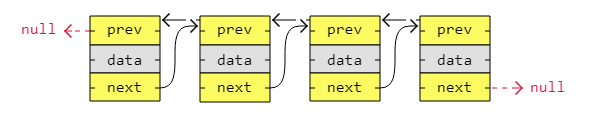

[🠠Home](../../../README.md)  
[🛠️ DSA Home](../DSA.md)

<h1> Linked List </h1>

## Index

- [Index](#index)
- [LinkedList vs Array](#linkedlist-vs-array)
- [Types of Linked Lists](#types-of-linked-lists)
	- [1. Singly Linked List](#1-singly-linked-list)
	- [2. Doubly linked lists](#2-doubly-linked-lists)
	- [3. Circular linked lists](#3-circular-linked-lists)

👉 [W3schools.com - LinkedList](https://www.w3schools.com/dsa/dsa_theory_linkedlists.php)

👉 [W3schools.com - LinkedList in Memory](https://www.w3schools.com/dsa/dsa_theory_linkedlists_memory.php)

👉 [W3schools.com - LinkedList Types](https://www.w3schools.com/dsa/dsa_data_linkedlists_types.php)

-  Linked List is, as the word implies, a list where the nodes are linked together. 
-  Each node contains data and a pointer. 
-  The way they are linked together is that each node points to where in the memory the next node is placed.
- A linked list consists of nodes with some sort of data, and a pointer, or link, to the next node.

[⬆️ Back to TOP ⬆️](#index)

## LinkedList vs Array

| **Feature**                     | **Array**                                                   | **LinkedList**                                               |
|----------------------------------|-------------------------------------------------------------|--------------------------------------------------------------|
| **Data Structure Type**          | Linear data structure with contiguous memory allocation     | Linear data structure with non-contiguous memory allocation   |
| **Access Time**                  | O(1) for accessing elements by index                        | O(n) for accessing elements, as traversal is required         |
| **Insertion/Deletion (at start)**| O(n) due to shifting of elements                            | O(1) as pointers are adjusted                                 |
| **Insertion/Deletion (at end)**  | O(1) (if dynamic and room available, otherwise O(n))         | O(1) if tail pointer is maintained, otherwise O(n)            |
| **Insertion/Deletion (in middle)**| O(n) as elements need to be shifted                        | O(n) as traversal is required to find the location            |
| **Memory Usage**                 | Fixed size, allocated at the start (wastes memory if underutilized) | Dynamic size, allocated as needed                            |
| **Cache Friendliness**           | Excellent, as elements are stored contiguously in memory    | Poor, as elements are scattered across memory                 |
| **Memory Overhead**              | No extra memory overhead for pointers                       | Extra memory required for storing pointers (next and prev)    |
| **Resizing**                     | Requires resizing and copying elements when full            | Not required, as memory is dynamically allocated              |
| **Random Access**                | Direct random access via index (O(1))                       | No direct access; sequential traversal is required (O(n))     |
| **Complexity of Operations**     | Simple, due to contiguous storage                          | More complex due to pointer manipulation                      |
| **Suitability for**              | Use cases with frequent access and minimal insertions/deletions | Use cases with frequent insertions/deletions                 |

[⬆️ Back to TOP ⬆️](#index)

## Types of Linked Lists

There are three basic forms of linked lists:

1. Singly linked lists
2. Doubly linked lists
3. Circular linked lists

### 1. Singly Linked List

- A singly linked list is the simplest kind of linked lists. 
- It takes up less space in memory because each node has only one address to the next node, like in the image below.

[⬆️ Back to TOP ⬆️](#index)

### 2. Doubly linked lists

- A doubly linked list has nodes with addresses to both the previous and the next node, like in the image below, and therefore takes up more memory. 
- But doubly linked lists are good if you want to be able to move both up and down in the list.

[⬆️ Back to TOP ⬆️](#index)

### 3. Circular linked lists

- A circular linked list is like a singly or doubly linked list with the first node, the "head", and the last node, the "tail", connected.
- In singly or doubly linked lists, we can find the start and end of a list by just checking if the links are `null`. 
- But for circular linked lists, more complex code is needed to explicitly check for start and end nodes in certain applications.
- Circular linked lists are good for lists you need to cycle through continuously.
- The image below is an example of a singly circular linked list:

The image below is an example of a doubly circular linked list:

[🠠Home](../../../README.md)  
[🛠️ DSA Home](../DSA.md)
