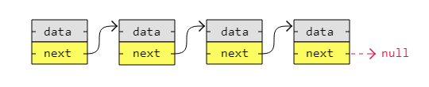

[🏠 Home](../../../README.md) <br/>
[🛠️ DSA Home](../DSA.md)

<hr>

<h1> Singly Linked List (SLL) </h1>

## Index

- [Index](#index)
- [SLL - Introduction](#sll---introduction)
- [SLL - Traversal](#sll---traversal)
  - [In Java](#in-java)
  - [In Python](#in-python)
  - [In C++](#in-c)
- [SLL - Remove a node](#sll---remove-a-node)
  - [In Java](#in-java-1)
  - [In Python](#in-python-1)
  - [In C++](#in-c-1)
- [SLL - Insert a node](#sll---insert-a-node)
  - [In Java](#in-java-2)
  - [In Python](#in-python-2)
  - [In C++](#in-c-2)
- [SLL - Sort](#sll---sort)
  - [Algorithms that *can be used* with Linked Lists:](#algorithms-that-can-be-used-with-linked-lists)
  - [Algorithms that *cannot be used* effectively with Linked Lists:](#algorithms-that-cannot-be-used-effectively-with-linked-lists)
  - [Best Choice for Linked Lists:](#best-choice-for-linked-lists)
  - [Implementation of Merge Sort Algorithm on SLL](#implementation-of-merge-sort-algorithm-on-sll)
  - [In Java](#in-java-3)
  - [In Python](#in-python-3)
  - [In C++](#in-c-3)
- [Time Complexity](#time-complexity)

<hr>

Performing Following operation on SLL

- Traversal
- Remove a node
- Insert a node
- Sort

[⬆️ Back to TOP ⬆️](#index)

## SLL - Introduction

- A singly linked list is the simplest kind of linked lists. 
- It takes up less space in memory because each node has only one address to the next node, like in the image below.



[⬆️ Back to TOP ⬆️](#index)

## SLL - Traversal

### In Java

```java
public class Main {

    static class Node {
        int data;
        Node next;

        Node(int data) {
            this.data = data;
            this.next = null;
        }
    }

    public static void main(String[] args) {
        // Creating individual nodes
        Node firstNode = new Node(3);
        Node secondNode = new Node(5);
        Node thirdNode = new Node(13);
        Node fourthNode = new Node(2);

        // Linking nodes together
        firstNode.next = secondNode;
        secondNode.next = thirdNode;
        thirdNode.next = fourthNode;

        // Printing linked list
        Node currentNode = firstNode;
        while (currentNode != null) {
            System.out.print(currentNode.data + " -> ");
            currentNode = currentNode.next;
        }
        System.out.println("null");
    }
}

// Output: 3 -> 5 -> 13 -> 2 -> null
```

[⬆️ Back to TOP ⬆️](#index)

### In Python

```python
class Node:
    def __init__(self, data):
        self.data = data
        self.next = None
    
node1 = Node(3)
node2 = Node(5)
node3 = Node(13)
node4 = Node(2)

node1.next = node2
node2.next = node3
node3.next = node4

currentNode = node1
while currentNode:
    print(currentNode.data, end=" -> ")
    currentNode = currentNode.next
print("null")

# Output: 3 -> 5 -> 13 -> 2 -> null
```

[⬆️ Back to TOP ⬆️](#index)

### In C++

```c++
#include <iostream>
#include <cstdlib> // For std::malloc and std::free

// Define the Node struct
struct Node {
    int data;
    Node* next;
};

// Create a new node
Node* createNode(int data) {
    Node* newNode = (Node*)std::malloc(sizeof(Node));
    if (!newNode) {
        std::cerr << "Memory allocation failed!" << std::endl;
        std::exit(1);
    }
    newNode->data = data;
    newNode->next = nullptr;
    return newNode;
}

// Print the linked list
void printList(Node* node) {
    while (node) {
        std::cout << node->data << " -> ";
        node = node->next;
    }
    std::cout << "null" << std::endl;
}

int main() {
    // Explicitly creating and connecting nodes
    Node* node1 = createNode(3);
    Node* node2 = createNode(5);
    Node* node3 = createNode(13);
    Node* node4 = createNode(2);

    node1->next = node2;
    node2->next = node3;
    node3->next = node4;

    printList(node1);

    // Free the memory
    std::free(node1);
    std::free(node2);
    std::free(node3);
    std::free(node4);

    return 0;
}

// Output: 3 -> 5 -> 13 -> 2 -> null
```

[⬆️ Back to TOP ⬆️](#index)

## SLL - Remove a node

Our code implements the following methods:

1. `removeNode()`: should remove the last node
2. `reoveNode(<value>)`: should remove the node that contains the value.
3. `removeNodeAtIndex(<index>)`: remove node on the specified index
4. `removeFirst()`: should remove the first node
5. `removeLast()`: should remove the last node. (it works same as `removeNode()` with no parameters)

### In Java

```java
class Node {
	int data;
	Node next;

	Node(int data) {
		this.data = data;
		this.next = null;
	}
}

class SinglyLinkedList {
	public static void traverseAndPrint(Node head) {
		Node currentNode = head;
		while (currentNode != null) {
			System.out.print(currentNode.data + " -> ");
			currentNode = currentNode.next;
		}
		System.out.println("null");
	}

	public static Node removeFirst(Node head) {
		if (head == null) {
			return null; // List is empty
		}
		return head.next; // Return the new head
	}

	public static Node removeLast(Node head) {
		if (head == null) {
			return null; // List is empty
		}
		if (head.next == null) {
			return null; // Only one node, return null
		}

		Node currentNode = head;
		while (currentNode.next.next != null) {
			currentNode = currentNode.next;
		}
		currentNode.next = null; // Remove last node
		return head;
	}

	public static Node removeNode(Node head, int value) {
		if (head == null) {
			return null; // List is empty
		}
		if (head.data == value) {
			return head.next; // Remove first node if it matches the value
		}

		Node currentNode = head;
		while (currentNode.next != null && currentNode.next.data != value) {
			currentNode = currentNode.next;
		}

		if (currentNode.next != null) {
			currentNode.next = currentNode.next.next; // Remove node with matching value
		}

		return head;
	}

	public static Node removeNodeAtIndex(Node head, int index) {
		if (head == null || index < 0) {
			return head; // List is empty or invalid index
		}
		if (index == 0) {
			return head.next; // Remove first node
		}

		Node currentNode = head;
		for (int i = 0; i < index - 1; i++) {
			if (currentNode == null || currentNode.next == null) {
				return head; // Index out of bounds
			}
			currentNode = currentNode.next;
		}

		if (currentNode.next != null) {
			currentNode.next = currentNode.next.next; // Remove node at specified index
		}

		return head;
	}
}

public class Main {

	public static void main(String[] args) {
		SinglyLinkedList sll = new SinglyLinkedList();
		Node node1 = new Node(7);
		Node node2 = new Node(11);
		Node node3 = new Node(3);
		Node node4 = new Node(2);
		Node node5 = new Node(9);

		node1.next = node2;
		node2.next = node3;
		node3.next = node4;
		node4.next = node5;

		System.out.println("Original list:");
		sll.traverseAndPrint(node1);

		node1 = sll.removeFirst(node1);
		System.out.println("After removing first node:");
		sll.traverseAndPrint(node1);

		node1 = sll.removeLast(node1);
		System.out.println("After removing last node:");
		sll.traverseAndPrint(node1);

		node1 = sll.removeNode(node1, 3);
		System.out.println("After removing node with value 3:");
		sll.traverseAndPrint(node1);

		node1 = sll.removeNodeAtIndex(node1, 1);
		System.out.println("After removing node at index 1:");
		sll.traverseAndPrint(node1);
	}
}

// Output:

// Original list:
// 7 -> 11 -> 3 -> 2 -> 9 -> null
// After removing first node:
// 11 -> 3 -> 2 -> 9 -> null
// After removing last node:
// 11 -> 3 -> 2 -> null
// After removing node with value 3:
// 11 -> 2 -> null
// After removing node at index 1:
// 11 -> null
```

[⬆️ Back to TOP ⬆️](#index)

### In Python

```python
class Node:
    def __init__(self, data):
        self.data = data
        self.next = None

class SinglyLinkedList:
    @staticmethod
    def traverse_and_print(head):
        current_node = head
        while current_node is not None:
            print(f"{current_node.data} -> ", end="")
            current_node = current_node.next
        print("null")

    @staticmethod
    def remove_first(head):
        if head is None:
            return None  # List is empty
        return head.next  # Return the new head

    @staticmethod
    def remove_last(head):
        if head is None:
            return None  # List is empty
        if head.next is None:
            return None  # Only one node, return None

        current_node = head
        while current_node.next.next is not None:
            current_node = current_node.next
        current_node.next = None  # Remove last node
        return head

    @staticmethod
    def remove_node(head, value):
        if head is None:
            return None  # List is empty
        if head.data == value:
            return head.next  # Remove first node if it matches the value

        current_node = head
        while current_node.next is not None and current_node.next.data != value:
            current_node = current_node.next

        if current_node.next is not None:
            current_node.next = current_node.next.next  # Remove node with matching value

        return head

    @staticmethod
    def remove_node_at_index(head, index):
        if head is None or index < 0:
            return head  # List is empty or invalid index
        if index == 0:
            return head.next  # Remove first node

        current_node = head
        for i in range(index - 1):
            if current_node is None or current_node.next is None:
                return head  # Index out of bounds
            current_node = current_node.next

        if current_node.next is not None:
            current_node.next = current_node.next.next  # Remove node at specified index

        return head


if __name__ == "__main__":
    sll = SinglyLinkedList()
    node1 = Node(7)
    node2 = Node(11)
    node3 = Node(3)
    node4 = Node(2)
    node5 = Node(9)

    node1.next = node2
    node2.next = node3
    node3.next = node4
    node4.next = node5

    print("Original list:")
    sll.traverse_and_print(node1)

    node1 = sll.remove_first(node1)
    print("After removing first node:")
    sll.traverse_and_print(node1)

    node1 = sll.remove_last(node1)
    print("After removing last node:")
    sll.traverse_and_print(node1)

    node1 = sll.remove_node(node1, 3)
    print("After removing node with value 3:")
    sll.traverse_and_print(node1)

    node1 = sll.remove_node_at_index(node1, 1)
    print("After removing node at index 1:")
    sll.traverse_and_print(node1)

# Output:

# Original list:
# 7 -> 11 -> 3 -> 2 -> 9 -> null
# After removing first node:
# 11 -> 3 -> 2 -> 9 -> null
# After removing last node:
# 11 -> 3 -> 2 -> null
# After removing node with value 3:
# 11 -> 2 -> null
# After removing node at index 1:
# 11 -> null
```

[⬆️ Back to TOP ⬆️](#index)

### In C++

```c++
#include <iostream>
using namespace std;

class Node {
public:
    int data;
    Node* next;

    Node(int data) {
        this->data = data;
        this->next = nullptr;
    }
};

class SinglyLinkedList {
public:
    static void traverseAndPrint(Node* head) {
        Node* currentNode = head;
        while (currentNode != nullptr) {
            cout << currentNode->data << " -> ";
            currentNode = currentNode->next;
        }
        cout << "null" << endl;
    }

    static Node* removeFirst(Node* head) {
        if (head == nullptr) {
            return nullptr; // List is empty
        }
        return head->next; // Return the new head
    }

    static Node* removeLast(Node* head) {
        if (head == nullptr) {
            return nullptr; // List is empty
        }
        if (head->next == nullptr) {
            return nullptr; // Only one node, return nullptr
        }

        Node* currentNode = head;
        while (currentNode->next->next != nullptr) {
            currentNode = currentNode->next;
        }
        currentNode->next = nullptr; // Remove last node
        return head;
    }

    static Node* removeNode(Node* head, int value) {
        if (head == nullptr) {
            return nullptr; // List is empty
        }
        if (head->data == value) {
            return head->next; // Remove first node if it matches the value
        }

        Node* currentNode = head;
        while (currentNode->next != nullptr && currentNode->next->data != value) {
            currentNode = currentNode->next;
        }

        if (currentNode->next != nullptr) {
            currentNode->next = currentNode->next->next; // Remove node with matching value
        }

        return head;
    }

    static Node* removeNodeAtIndex(Node* head, int index) {
        if (head == nullptr || index < 0) {
            return head; // List is empty or invalid index
        }
        if (index == 0) {
            return head->next; // Remove first node
        }

        Node* currentNode = head;
        for (int i = 0; i < index - 1; i++) {
            if (currentNode == nullptr || currentNode->next == nullptr) {
                return head; // Index out of bounds
            }
            currentNode = currentNode->next;
        }

        if (currentNode->next != nullptr) {
            currentNode->next = currentNode->next->next; // Remove node at specified index
        }

        return head;
    }
};

int main() {
    SinglyLinkedList sll;
    Node* node1 = new Node(7);
    Node* node2 = new Node(11);
    Node* node3 = new Node(3);
    Node* node4 = new Node(2);
    Node* node5 = new Node(9);

    node1->next = node2;
    node2->next = node3;
    node3->next = node4;
    node4->next = node5;

    cout << "Original list:" << endl;
    sll.traverseAndPrint(node1);

    node1 = sll.removeFirst(node1);
    cout << "After removing first node:" << endl;
    sll.traverseAndPrint(node1);

    node1 = sll.removeLast(node1);
    cout << "After removing last node:" << endl;
    sll.traverseAndPrint(node1);

    node1 = sll.removeNode(node1, 3);
    cout << "After removing node with value 3:" << endl;
    sll.traverseAndPrint(node1);

    node1 = sll.removeNodeAtIndex(node1, 1);
    cout << "After removing node at index 1:" << endl;
    sll.traverseAndPrint(node1);

    // Free allocated memory
    while (node1 != nullptr) {
        Node* temp = node1;
        node1 = node1->next;
        delete temp;
    }

    return 0;
}

// Output:

// Original list:
// 7 -> 11 -> 3 -> 2 -> 9 -> null
// After removing first node:
// 11 -> 3 -> 2 -> 9 -> null
// After removing last node:
// 11 -> 3 -> 2 -> null
// After removing node with value 3:
// 11 -> 2 -> null
// After removing node at index 1:
// 11 -> null
```

[⬆️ Back to TOP ⬆️](#index)

## SLL - Insert a node

Our code implements the following methods:

1. `insertNode(<value>)`: should insert the new node, with the specified value, at last.
2. `insertNode(<value>, <index>)`: should insert the new node at the specifid index with the specified value
3. `insertFirst(<value>)`: should insert the new node with the specified value at the first
4. `insertLast(<value>)`: should insert the new node with the specified value at the last (it works same as `insertNode(<value>)`)

### In Java

```java
class Node {
	int data;
	Node next;

	public Node(int data) {
		this.data = data;
		this.next = null;
	}
}

class SinglyLinkedList {
	public static void traverseAndPrint(Node head) {
		Node currentNode = head;
		while (currentNode != null) {
			System.out.print(currentNode.data + " -> ");
			currentNode = currentNode.next;
		}
		System.out.println("null");
	}

	public static Node insertNode(Node head, int value) {
		Node newNode = new Node(value);
		if (head == null) {
			return newNode; // Empty list
		}

		Node currentNode = head;
		while (currentNode.next != null) {
			currentNode = currentNode.next;
		}
		currentNode.next = newNode; // Insert at the end
		return head;
	}

	public static Node insertNodeAtIndex(Node head, int value, int index) {
		Node newNode = new Node(value);
		if (index == 0) {
			newNode.next = head;
			return newNode; // Insert at the beginning
		}

		Node currentNode = head;
		for (int i = 0; i < index - 1 && currentNode != null; i++) {
			currentNode = currentNode.next;
		}

		if (currentNode != null) {
			newNode.next = currentNode.next;
			currentNode.next = newNode; // Insert at specified index
		}
		return head;
	}

	public static Node insertFirst(Node head, int value) {
		Node newNode = new Node(value);
		newNode.next = head; // New node points to current head
		return newNode; // New node is the new head
	}

	public static Node insertLast(Node head, int value) {
		return insertNode(head, value); // Same as insertNode
	}
}

public class Main {

	public static void main(String[] args) {
		SinglyLinkedList sll = new SinglyLinkedList();
		Node node1 = new Node(7);
		Node node2 = new Node(3);
		Node node3 = new Node(2);
		Node node4 = new Node(9);

		node1.next = node2;
		node2.next = node3;
		node3.next = node4;

		System.out.println("Original list:");
		sll.traverseAndPrint(node1);

		// Insert a new node with value 97 at position 2
		node1 = sll.insertNodeAtIndex(node1, 97, 1);
		System.out.println("After inserting 97 at index 1:");
		sll.traverseAndPrint(node1);

		// Insert a new node with value 42 at the first position
		node1 = sll.insertFirst(node1, 42);
		System.out.println("After inserting 42 at the first position:");
		sll.traverseAndPrint(node1);

		// Insert a new node with value 100 at the last position
		node1 = sll.insertLast(node1, 100);
		System.out.println("After inserting 100 at the last position:");
		sll.traverseAndPrint(node1);
	}
}

// Ouptut:

// Original list:
// 7 -> 3 -> 2 -> 9 -> null
// After inserting 97 at index 1:
// 7 -> 97 -> 3 -> 2 -> 9 -> null
// After inserting 42 at the first position:
// 42 -> 7 -> 97 -> 3 -> 2 -> 9 -> null
// After inserting 100 at the last position:
// 42 -> 7 -> 97 -> 3 -> 2 -> 9 -> 100 -> null
```

[⬆️ Back to TOP ⬆️](#index)

### In Python

```python
class Node:
    def __init__(self, data):
        self.data = data
        self.next = None

class SinglyLinkedList:
    @staticmethod
    def traverse_and_print(head):
        current_node = head
        while current_node is not None:
            print(f"{current_node.data} -> ", end="")
            current_node = current_node.next
        print("null")

    @staticmethod
    def insert_node(head, value):
        new_node = Node(value)
        if head is None:
            return new_node  # Empty list

        current_node = head
        while current_node.next is not None:
            current_node = current_node.next
        current_node.next = new_node  # Insert at the end
        return head

    @staticmethod
    def insert_node_at_index(head, value, index):
        new_node = Node(value)
        if index == 0:
            new_node.next = head
            return new_node  # Insert at the beginning

        current_node = head
        for i in range(index - 1):
            if current_node is None:
                return head  # Index out of bounds
            current_node = current_node.next

        if current_node is not None:
            new_node.next = current_node.next
            current_node.next = new_node  # Insert at specified index
        return head

    @staticmethod
    def insert_first(head, value):
        new_node = Node(value)
        new_node.next = head  # New node points to current head
        return new_node  # New node is the new head

    @staticmethod
    def insert_last(head, value):
        return SinglyLinkedList.insert_node(head, value)  # Same as insert_node

if __name__ == "__main__":
    sll = SinglyLinkedList()
    node1 = Node(7)
    node2 = Node(3)
    node3 = Node(2)
    node4 = Node(9)

    node1.next = node2
    node2.next = node3
    node3.next = node4

    print("Original list:")
    sll.traverse_and_print(node1)

    # Insert a new node with value 97 at position 1
    node1 = sll.insert_node_at_index(node1, 97, 1)
    print("After inserting 97 at index 1:")
    sll.traverse_and_print(node1)

    # Insert a new node with value 42 at the first position
    node1 = sll.insert_first(node1, 42)
    print("After inserting 42 at the first position:")
    sll.traverse_and_print(node1)

    # Insert a new node with value 100 at the last position
    node1 = sll.insert_last(node1, 100)
    print("After inserting 100 at the last position:")
    sll.traverse_and_print(node1)

# Ouptut:

# Original list:
# 7 -> 3 -> 2 -> 9 -> null
# After inserting 97 at index 1:
# 7 -> 97 -> 3 -> 2 -> 9 -> null
# After inserting 42 at the first position:
# 42 -> 7 -> 97 -> 3 -> 2 -> 9 -> null
# After inserting 100 at the last position:
# 42 -> 7 -> 97 -> 3 -> 2 -> 9 -> 100 -> null
```

[⬆️ Back to TOP ⬆️](#index)

### In C++

```c++
#include <iostream>
using namespace std;

class Node {
public:
    int data;
    Node* next;

    Node(int data) {
        this->data = data;
        this->next = nullptr;
    }
};

class SinglyLinkedList {
public:
    static void traverseAndPrint(Node* head) {
        Node* currentNode = head;
        while (currentNode != nullptr) {
            cout << currentNode->data << " -> ";
            currentNode = currentNode->next;
        }
        cout << "null" << endl;
    }

    static Node* insertNode(Node* head, int value) {
        Node* newNode = new Node(value);
        if (head == nullptr) {
            return newNode; // Empty list
        }

        Node* currentNode = head;
        while (currentNode->next != nullptr) {
            currentNode = currentNode->next;
        }
        currentNode->next = newNode; // Insert at the end
        return head;
    }

    static Node* insertNodeAtIndex(Node* head, int value, int index) {
        Node* newNode = new Node(value);
        if (index == 0) {
            newNode->next = head;
            return newNode; // Insert at the beginning
        }

        Node* currentNode = head;
        for (int i = 0; i < index - 1 && currentNode != nullptr; i++) {
            currentNode = currentNode->next;
        }

        if (currentNode != nullptr) {
            newNode->next = currentNode->next;
            currentNode->next = newNode; // Insert at specified index
        }
        return head;
    }

    static Node* insertFirst(Node* head, int value) {
        Node* newNode = new Node(value);
        newNode->next = head; // New node points to current head
        return newNode; // New node is the new head
    }

    static Node* insertLast(Node* head, int value) {
        return insertNode(head, value); // Same as insertNode
    }
};

int main() {
    SinglyLinkedList sll;
    Node* node1 = new Node(7);
    Node* node2 = new Node(3);
    Node* node3 = new Node(2);
    Node* node4 = new Node(9);

    node1->next = node2;
    node2->next = node3;
    node3->next = node4;

    cout << "Original list:" << endl;
    sll.traverseAndPrint(node1);

    // Insert a new node with value 97 at position 1
    node1 = sll.insertNodeAtIndex(node1, 97, 1);
    cout << "After inserting 97 at index 1:" << endl;
    sll.traverseAndPrint(node1);

    // Insert a new node with value 42 at the first position
    node1 = sll.insertFirst(node1, 42);
    cout << "After inserting 42 at the first position:" << endl;
    sll.traverseAndPrint(node1);

    // Insert a new node with value 100 at the last position
    node1 = sll.insertLast(node1, 100);
    cout << "After inserting 100 at the last position:" << endl;
    sll.traverseAndPrint(node1);

    // Free allocated memory
    while (node1 != nullptr) {
        Node* temp = node1;
        node1 = node1->next;
        delete temp;
    }

    return 0;
}

// Ouptut:

// Original list:
// 7 -> 3 -> 2 -> 9 -> null
// After inserting 97 at index 1:
// 7 -> 97 -> 3 -> 2 -> 9 -> null
// After inserting 42 at the first position:
// 42 -> 7 -> 97 -> 3 -> 2 -> 9 -> null
// After inserting 100 at the last position:
// 42 -> 7 -> 97 -> 3 -> 2 -> 9 -> 100 -> null
```

[⬆️ Back to TOP ⬆️](#index)

## SLL - Sort

### Algorithms that *can be used* with Linked Lists:

1. **Bubble Sort**  
   - Works on linked lists but is inefficient with a time complexity of **O(n²)**.

2. **Selection Sort**  
   - Can be applied to linked lists, but also inefficient with **O(n²)** time complexity.

3. **Insertion Sort**  
   - Works well with linked lists, especially when sorting data as it arrives. It has a time complexity of **O(n²)** in the worst case but is easier to implement with linked lists than arrays.

4. **Quick Sort**  
   - Can be used on linked lists with slight modifications (using pointer-based partitioning). It has an average time complexity of **O(n log n)**.

5. **Merge Sort**  
   - Ideal for linked lists due to their sequential access nature. It has a time complexity of **O(n log n)** and is the most commonly used efficient algorithm for sorting linked lists.

[⬆️ Back to TOP ⬆️](#index)

### Algorithms that *cannot be used* effectively with Linked Lists:

6. **Counting Sort**  
   - Not suitable for linked lists because it relies on accessing elements by index and works best with arrays.

7. **Radix Sort**  
   - Requires random access to array elements for sorting digits/characters, making it inefficient for linked lists.

[⬆️ Back to TOP ⬆️](#index)

### Best Choice for Linked Lists:
**Merge Sort** is the most efficient and commonly used sorting algorithm for linked lists. 

### Implementation of Merge Sort Algorithm on SLL

1. **`mergeSort()` Function:** This function is the core of the merge sort implementation. It sorts the linked list in a recursive divide-and-conquer manner:
   - **Base Case:** If the list is empty (`head == null`) or contains only one element (`head.next == null`), it returns the head (the list is already sorted).
   - **Finding the Middle:** It uses the `getMiddle()` function to find the middle node of the list. This is the point where the list is split into two halves.
   - **Splitting the List:** The list is split into two parts by breaking the link from the middle node (`middle.next = null`).
   - **Recursive Sorting:** The `mergeSort()` function is recursively called on both halves of the list (`left` and `right`).
   - **Merging Sorted Lists:** Once both halves are sorted, the `merge()` function is used to merge the two sorted halves back together into a single sorted list.

2. **`merge()` Function**: This function merges two sorted linked lists into one sorted list:
   - It compares the `data` of the nodes from two lists (`left` and `right`).
   - The node with the smaller value is chosen to be the next node in the merged list.
   - The process is repeated recursively for the remaining nodes in the two lists.
   - The base cases are when one of the lists is empty (`left == null` or `right == null`), in which case it returns the remaining nodes of the other list.

3. **`getMiddle()` Function**: This utility function helps to find the middle of the linked list:
   - It uses the "slow and fast pointer" technique:
     - `slow` moves one step at a time.
     - `fast` moves two steps at a time.
   - When `fast` reaches the end of the list(or `fast.next == null`), `slow` will be at the middle node.
   - This middle node is returned to split the list in half.

4. **`sort()` Function:**
   - This function initiates the sorting process.
   - It calls the `mergeSort()` function, passing the head of the list.
   - The head is updated with the new sorted list after the sorting process is complete.

Following are sample codes of soring a SLL using Merge Sort:

[⬆️ Back to TOP ⬆️](#index)

### In Java

```java
class Node {
    int data;
    Node next;

    Node(int data) {
        this.data = data;
        this.next = null;
    }
}

public class LinkedList {
    private Node head;

    // Function to add a node at the end of the list
    public void add(int data) {
        Node newNode = new Node(data);
        if (head == null) {
            head = newNode;
        } else {
            Node current = head;
            while (current.next != null) {
                current = current.next;
            }
            current.next = newNode;
        }
    }

    // Function to print the linked list
    public void traverseAndPrint() {
        Node current = head;
        while (current != null) {
            System.out.print(current.data + " -> ");
            current = current.next;
        }
        System.out.println("null");
    }

    // Merge Sort function
    public Node mergeSort(Node head) {
        if (head == null || head.next == null) {
            return head;
        }

        // Get the middle of the list
        Node middle = getMiddle(head);
        Node nextOfMiddle = middle.next;

        // Split the list into two halves
        middle.next = null;

        // Recursively sort both halves
        Node left = mergeSort(head);
        Node right = mergeSort(nextOfMiddle);

        // Merge the sorted halves
        return merge(left, right);
    }

    // Function to merge two sorted linked lists
    public Node merge(Node left, Node right) {
        if (left == null) return right;
        if (right == null) return left;

        Node result;
        if (left.data <= right.data) {
            result = left;
            result.next = merge(left.next, right);
        } else {
            result = right;
            result.next = merge(left, right.next);
        }
        return result;
    }

    // Utility function to find the middle of the linked list
    public Node getMiddle(Node head) {
        if (head == null) return head;

        Node slow = head, fast = head;
        while (fast.next != null && fast.next.next != null) {
            slow = slow.next;
            fast = fast.next.next;
        }
        return slow;
    }

    // Function to sort the linked list using merge sort
    public void sort() {
        head = mergeSort(head);
    }

    public static void main(String[] args) {
        LinkedList list = new LinkedList();
        list.add(7);
        list.add(3);
        list.add(10);
        list.add(2);
        list.add(8);

        System.out.println("Original list:");
        list.traverseAndPrint();

        // Sort the linked list using merge sort
        list.sort();

        System.out.println("Sorted list:");
        list.traverseAndPrint();
    }
}

// Output:

// Original list:
// 7 -> 3 -> 10 -> 2 -> 8 -> null
// Sorted list:
// 2 -> 3 -> 7 -> 8 -> 10 -> null
```

[⬆️ Back to TOP ⬆️](#index)

### In Python

```python
class Node:
    def __init__(self, data):
        self.data = data
        self.next = None

class LinkedList:
    def __init__(self):
        self.head = None

    # Function to add a node at the end of the list
    def add(self, data):
        new_node = Node(data)
        if not self.head:
            self.head = new_node
        else:
            current = self.head
            while current.next:
                current = current.next
            current.next = new_node

    # Function to print the linked list
    def traverse_and_print(self):
        current = self.head
        while current:
            print(current.data, end=" -> ")
            current = current.next
        print("null")

    # Merge Sort function
    def merge_sort(self, head):
        if head is None or head.next is None:
            return head

        # Get the middle of the list
        middle = self.get_middle(head)
        next_of_middle = middle.next

        # Split the list into two halves
        middle.next = None

        # Recursively sort both halves
        left = self.merge_sort(head)
        right = self.merge_sort(next_of_middle)

        # Merge the sorted halves
        return self.merge(left, right)

    # Function to merge two sorted linked lists
    def merge(self, left, right):
        if not left:
            return right
        if not right:
            return left

        if left.data <= right.data:
            result = left
            result.next = self.merge(left.next, right)
        else:
            result = right
            result.next = self.merge(left, right.next)
        return result

    # Utility function to find the middle of the linked list
    def get_middle(self, head):
        if head is None:
            return head

        slow, fast = head, head
        while fast.next and fast.next.next:
            slow = slow.next
            fast = fast.next.next

        return slow

    # Function to sort the linked list
    def sort(self):
        self.head = self.merge_sort(self.head)

# Test the implementation
if __name__ == "__main__":
    ll = LinkedList()
    ll.add(7)
    ll.add(3)
    ll.add(10)
    ll.add(2)
    ll.add(8)

    print("Original list:")
    ll.traverse_and_print()

    ll.sort()

    print("Sorted list:")
    ll.traverse_and_print()

# Output: 

# Original list:
# 7 -> 3 -> 10 -> 2 -> 8 -> null
# Sorted list:
# 2 -> 3 -> 7 -> 8 -> 10 -> null
```

[⬆️ Back to TOP ⬆️](#index)

### In C++

```c++
#include <iostream>
using namespace std;

struct Node {
    int data;
    Node* next;
    Node(int data) : data(data), next(nullptr) {}
};

class LinkedList {
private:
    Node* head;

public:
    LinkedList() : head(nullptr) {}

    // Function to add a node at the end of the list
    void add(int data) {
        Node* newNode = new Node(data);
        if (head == nullptr) {
            head = newNode;
        } else {
            Node* current = head;
            while (current->next != nullptr) {
                current = current->next;
            }
            current->next = newNode;
        }
    }

    // Function to print the linked list
    void traverseAndPrint() {
        Node* current = head;
        while (current != nullptr) {
            cout << current->data << " -> ";
            current = current->next;
        }
        cout << "null" << endl;
    }

    // Merge Sort function
    Node* mergeSort(Node* head) {
        if (head == nullptr || head->next == nullptr) {
            return head;
        }

        // Get the middle of the list
        Node* middle = getMiddle(head);
        Node* nextOfMiddle = middle->next;

        // Split the list into two halves
        middle->next = nullptr;

        // Recursively sort both halves
        Node* left = mergeSort(head);
        Node* right = mergeSort(nextOfMiddle);

        // Merge the sorted halves
        return merge(left, right);
    }

    // Function to merge two sorted linked lists
    Node* merge(Node* left, Node* right) {
        if (!left) return right;
        if (!right) return left;

        Node* result;
        if (left->data <= right->data) {
            result = left;
            result->next = merge(left->next, right);
        } else {
            result = right;
            result->next = merge(left, right->next);
        }
        return result;
    }

    // Utility function to find the middle of the linked list
    Node* getMiddle(Node* head) {
        if (!head) return head;

        Node* slow = head;
        Node* fast = head;
        while (fast->next != nullptr && fast->next->next != nullptr) {
            slow = slow->next;
            fast = fast->next->next;
        }
        return slow;
    }

    // Function to sort the linked list
    void sort() {
        head = mergeSort(head);
    }

    // Destructor to free memory
    ~LinkedList() {
        Node* current = head;
        while (current != nullptr) {
            Node* nextNode = current->next;
            delete current;
            current = nextNode;
        }
    }
};

int main() {
    LinkedList list;
    list.add(7);
    list.add(3);
    list.add(10);
    list.add(2);
    list.add(8);

    cout << "Original list:" << endl;
    list.traverseAndPrint();

    // Sort the linked list using merge sort
    list.sort();

    cout << "Sorted list:" << endl;
    list.traverseAndPrint();

    return 0;
}

// Output:

// Original list:
// 7 -> 3 -> 10 -> 2 -> 8 -> null
// Sorted list:
// 2 -> 3 -> 7 -> 8 -> 10 -> null
```

[⬆️ Back to TOP ⬆️](#index)

## Time Complexity

- Insertion:
  - At the beginning: `O(1)`
  - At the end: `O(n)` (traverse to the end)
  - At a given position: `O(n)`
- Deletion:
  - At the beginning: `O(1)`
  - At the end: `O(n)` (traverse to the node before the last)
  - At a given position: `O(n)`
- Searching (Linear Search): `O(n)`
- Sorting (Merge Sort): `O(n log n)`
