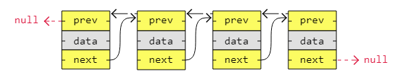

[🏠 Home](../../../README.md) <br/>
[🛠️ DSA Home](../DSA.md)

<hr>

<h1> Doubly Linked List (DLL) </h1>

## Index

- [Index](#index)
- [DLL - Introduction](#dll---introduction)
- [DLL - Traversal](#dll---traversal)
  - [In Java](#in-java)
  - [In Python](#in-python)
  - [In C++](#in-c)
- [DLL - Remove a node](#dll---remove-a-node)
  - [In Java](#in-java-1)
  - [In Python](#in-python-1)
  - [In C++](#in-c-1)
- [DLL - Insert a node](#dll---insert-a-node)
  - [In Java](#in-java-2)
  - [In Python](#in-python-2)
  - [In C++](#in-c-2)
- [DLL - Sort](#dll---sort)
  - [Algorithms that **can be used** with doubly linked lists](#algorithms-that-can-be-used-with-doubly-linked-lists)
  - [Algorithms that **cannot be used** effectively with doubly linked lists](#algorithms-that-cannot-be-used-effectively-with-doubly-linked-lists)
  - [Best choice for doubly linked lists](#best-choice-for-doubly-linked-lists)
  - [Implementation of Merge Sort Algorithm on SLL](#implementation-of-merge-sort-algorithm-on-sll)
  - [In Java](#in-java-3)
  - [In Python](#in-python-3)
  - [In C++](#in-c-3)
- [Time Complexity](#time-complexity)

<hr>


## DLL - Introduction

- A doubly linked list has nodes with addresses to both the previous and the next node, like in the image below, and therefore takes up more memory.
- But doubly linked lists are good if you want to be able to move both up and down in the list.



Performing Following operation on DLL

- Traversal
- Remove a node
- Insert a node
- Sort

[⬆️ Back to TOP ⬆️](#index)

## DLL - Traversal

### In Java

```java
class Node {
  int data;
  Node next;
  Node prev; // Reference to the previous node

  Node(int data) {
      this.data = data;
      this.next = null;
      this.prev = null;
  }
}

public class DoublyLinkedList {
  Node head;

  // Traverse the list from front to back
  public void traverseFront() {
      Node current = head;
      while (current != null) {
          System.out.print(current.data + " -> ");
          current = current.next;  // Move to the next node
      }
      System.out.print("null");
      System.out.println();
  }

  // Traverse the list from back to front
  public void traverseBack() {
      // First, move to the last node
      Node current = head;
      if (current == null) {
          return; // Empty list
      }
      
      // Find the last node
      while (current.next != null) {
          current = current.next;
      }

      // Now traverse backward using the prev reference
      while (current != null) {
          System.out.print(current.data + " -> ");
          current = current.prev;  // Move to the previous node
      }
      System.out.print("null");
      System.out.println();
  }

  // Utility function to add a node to the end of the list
  public void addNode(int data) {
      Node newNode = new Node(data);
      if (head == null) {
          head = newNode;
          return;
      }

      Node current = head;
      // Traverse to the last node
      while (current.next != null) {
          current = current.next;
      }

      // Add new node at the end
      current.next = newNode;
      newNode.prev = current;  // Set the previous pointer of new node
  }

  public static void main(String[] args) {
      DoublyLinkedList list = new DoublyLinkedList();
      list.addNode(1);
      list.addNode(2);
      list.addNode(3);
      list.addNode(4);
      list.addNode(5);

      System.out.println("Traversal from front to back:");
      list.traverseFront();

      System.out.println("Traversal from back to front:");
      list.traverseBack();
  }
}

// Output: 

// Traversal from front to back:
// 1 -> 2 -> 3 -> 4 -> 5 -> null
// Traversal from back to front:
// 5 -> 4 -> 3 -> 2 -> 1 -> null
```

[⬆️ Back to TOP ⬆️](#index)

### In Python

```python
class Node:
    def __init__(self, data):
        self.data = data
        self.next = None
        self.prev = None

class DoublyLinkedList:
    def __init__(self):
        self.head = None

    # Traverse the list from front to back
    def traverse_front(self):
        current = self.head
        while current:
            print(current.data, end="->")
            current = current.next
        print("null")

    # Traverse the list from back to front
    def traverse_back(self):
        # First, move to the last node
        current = self.head
        if not current:
            return  # Empty list

        # Move to the last node
        while current.next:
            current = current.next

        # Now traverse backward using the prev reference
        while current:
            print(current.data, end="->")
            current = current.prev
        print("null")

    # Utility function to add a node to the end of the list
    def add_node(self, data):
        new_node = Node(data)
        if not self.head:
            self.head = new_node
            return

        current = self.head
        # Traverse to the last node
        while current.next:
            current = current.next

        # Add new node at the end
        current.next = new_node
        new_node.prev = current  # Set the previous pointer of the new node

# Main logic to test the doubly linked list
if __name__ == "__main__":
    dll = DoublyLinkedList()
    dll.add_node(1)
    dll.add_node(2)
    dll.add_node(3)
    dll.add_node(4)
    dll.add_node(5)

    print("Traversal from front to back:")
    dll.traverse_front()

    print("Traversal from back to front:")
    dll.traverse_back()

# Output: 

# Traversal from front to back:
# 1 -> 2 -> 3 -> 4 -> 5 -> null
# Traversal from back to front:
# 5 -> 4 -> 3 -> 2 -> 1 -> null
```

[⬆️ Back to TOP ⬆️](#index)

### In C++

```c++
#include <iostream>
using namespace std;

// Definition for a node in the doubly linked list
class Node {
public:
    int data;
    Node* next;
    Node* prev;

    Node(int data) {
        this->data = data;
        this->next = nullptr;
        this->prev = nullptr;
    }
};

// Doubly Linked List class
class Main {
private:
    Node* head;

public:
    Main() {
        head = nullptr;
    }

    // Traverse the list from front to back
    void traverseFront() {
        Node* current = head;
        while (current != nullptr) {
            cout << current->data << "->";
            current = current->next;  // Move to the next node
        }
        cout << "null" << endl;
    }

    // Traverse the list from back to front
    void traverseBack() {
        // First, move to the last node
        Node* current = head;
        if (current == nullptr) {
            return; // Empty list
        }

        // Move to the last node
        while (current->next != nullptr) {
            current = current->next;
        }

        // Now traverse backward using the prev reference
        while (current != nullptr) {
            cout << current->data << "->";
            current = current->prev;  // Move to the previous node
        }
        cout << "null" << endl;
    }

    // Utility function to add a node to the end of the list
    void addNode(int data) {
        Node* newNode = new Node(data);
        if (head == nullptr) {
            head = newNode;
            return;
        }

        Node* current = head;
        // Traverse to the last node
        while (current->next != nullptr) {
            current = current->next;
        }

        // Add new node at the end
        current->next = newNode;
        newNode->prev = current;  // Set the previous pointer of the new node
    }
};

int main() {
    Main dll;
    dll.addNode(1);
    dll.addNode(2);
    dll.addNode(3);
    dll.addNode(4);
    dll.addNode(5);

    cout << "Traversal from front to back:" << endl;
    dll.traverseFront();

    cout << "Traversal from back to front:" << endl;
    dll.traverseBack();

    return 0;
}

// Output: 

// Traversal from front to back:
// 1 -> 2 -> 3 -> 4 -> 5 -> null
// Traversal from back to front:
// 5 -> 4 -> 3 -> 2 -> 1 -> null
```

[⬆️ Back to TOP ⬆️](#index)

## DLL - Remove a node

### In Java

```java
class Node {
  int data;
  Node prev, next;
  Node(int d) {
      data = d;
      prev = next = null;
  }
}

class DoublyLinkedList {
  Node head;

  // Function to delete a node at a given index
  public void removeAtIndex(int index) {
      if (head == null || index < 0) {
          return;  // Invalid operation
      }

      Node current = head;
      int count = 0;

      // Traverse the list to the node at index
      while (current != null && count != index) {
          current = current.next;
          count++;
      }

      // If index is out of bounds
      if (current == null) {
          return;
      }

      // If node to be deleted is head
      if (current == head) {
          head = current.next;
      }

      // Change next only if node to be deleted is NOT the last node
      if (current.next != null) {
          current.next.prev = current.prev;
      }

      // Change prev only if node to be deleted is NOT the first node
      if (current.prev != null) {
          current.prev.next = current.next;
      }
  }

  // Helper function to print the list
  public void printList() {
      Node temp = head;
      while (temp != null) {
          System.out.print(temp.data + " <-> ");
          temp = temp.next;
      }
      System.out.println("null");
  }
  
  // Insert a new node at the end of the list (for testing)
  public void insertEnd(int data) {
      Node newNode = new Node(data);
      if (head == null) {
          head = newNode;
          return;
      }
      Node temp = head;
      while (temp.next != null) {
          temp = temp.next;
      }
      temp.next = newNode;
      newNode.prev = temp;
  }

  public static void main(String[] args) {
      DoublyLinkedList dll = new DoublyLinkedList();
      dll.insertEnd(1);
      dll.insertEnd(2);
      dll.insertEnd(3);
      dll.insertEnd(4);
      dll.insertEnd(5);

      System.out.println("Original List:");
      dll.printList();

      // removing 3rd node from the linkedlist
      // '0' based indexing
      dll.removeAtIndex(2); 
      System.out.println("List after removing node at index 2:");
      dll.printList();
  }
}

// Output

// Original List:
// 1 <-> 2 <-> 3 <-> 4 <-> 5 <-> null
// List after removing node at index 2:
// 1 <-> 2 <-> 4 <-> 5 <-> null
```

[⬆️ Back to TOP ⬆️](#index)

### In Python

```python
class Node:
    def __init__(self, data):
        self.data = data
        self.prev = None
        self.next = None

class DoublyLinkedList:
    def __init__(self):
        self.head = None

    # Function to remove a node at a given index
    def remove_at_index(self, index):
        if self.head is None or index < 0:
            return  # Invalid operation

        current = self.head
        count = 0

        # Traverse to the node at the given index
        while current is not None and count != index:
            current = current.next
            count += 1

        # If index is out of bounds
        if current is None:
            return

        # If node to be deleted is head
        if current == self.head:
            self.head = current.next

        # If the node is not the last node, adjust the next node's prev pointer
        if current.next is not None:
            current.next.prev = current.prev

        # If the node is not the first node, adjust the prev node's next pointer
        if current.prev is not None:
            current.prev.next = current.next

    # Helper function to print the list
    def print_list(self):
        current = self.head
        while current:
            print(current.data, end=" <-> ")
            current = current.next
        print()

    # Function to insert a node at the end of the list (for testing)
    def insert_end(self, data):
        new_node = Node(data)
        if self.head is None:
            self.head = new_node
            return
        last = self.head
        while last.next:
            last = last.next
        last.next = new_node
        new_node.prev = last

# Example usage:
dll = DoublyLinkedList()
dll.insert_end(1)
dll.insert_end(2)
dll.insert_end(3)
dll.insert_end(4)
dll.insert_end(5)

print("Original list:")
dll.print_list()

dll.remove_at_index(2)
print("List after removing node at index 2:")
dll.print_list()

# Output

# Original List:
# 1 <-> 2 <-> 3 <-> 4 <-> 5 <-> null
# List after removing node at index 2:
# 1 <-> 2 <-> 4 <-> 5 <-> null
```

[⬆️ Back to TOP ⬆️](#index)

### In C++

```c++
#include <iostream>
using namespace std;

class Node {
public:
    int data;
    Node* prev;
    Node* next;
    Node(int d) {
        data = d;
        prev = next = nullptr;
    }
};

class DoublyLinkedList {
public:
    Node* head;

    DoublyLinkedList() {
        head = nullptr;
    }

    // Function to remove a node at a given index
    void removeAtIndex(int index) {
        if (head == nullptr || index < 0) {
            return;  // Invalid operation
        }

        Node* current = head;
        int count = 0;

        // Traverse the list to the node at index
        while (current != nullptr && count != index) {
            current = current->next;
            count++;
        }

        // If index is out of bounds
        if (current == nullptr) {
            return;
        }

        // If node to be deleted is head
        if (current == head) {
            head = current->next;
        }

        // Change next only if node to be deleted is NOT the last node
        if (current->next != nullptr) {
            current->next->prev = current->prev;
        }

        // Change prev only if node to be deleted is NOT the first node
        if (current->prev != nullptr) {
            current->prev->next = current->next;
        }

        delete current;  // Free the memory
    }

    // Helper function to print the list
    void printList() {
        Node* temp = head;
        while (temp != nullptr) {
            cout << temp->data << " ";
            temp = temp->next;
        }
        cout << endl;
    }

    // Insert a new node at the end of the list (for testing)
    void insertEnd(int data) {
        Node* newNode = new Node(data);
        if (head == nullptr) {
            head = newNode;
            return;
        }
        Node* temp = head;
        while (temp->next != nullptr) {
            temp = temp->next;
        }
        temp->next = newNode;
        newNode->prev = temp;
    }
};

int main() {
    DoublyLinkedList dll;
    dll.insertEnd(1);
    dll.insertEnd(2);
    dll.insertEnd(3);
    dll.insertEnd(4);
    dll.insertEnd(5);

    cout << "Original list:" << endl;
    dll.printList();

    dll.removeAtIndex(2);
    cout << "List after removing node at index 2:" << endl;
    dll.printList();

    return 0;
}

// Output

// Original List:
// 1 <-> 2 <-> 3 <-> 4 <-> 5 <-> null
// List after removing node at index 2:
// 1 <-> 2 <-> 4 <-> 5 <-> null
```

[⬆️ Back to TOP ⬆️](#index)

## DLL - Insert a node

### In Java

```java
class Node {
    int data;
    Node prev, next;

    Node(int d) {
        data = d;
        prev = next = null;
    }
}

class DoublyLinkedList {
    Node head;

    // Insert a new node at the end of the list
    public void insertNode(int data) {
        Node newNode = new Node(data);
        if (head == null) {
            head = newNode;
            return;
        }
        Node temp = head;
        while (temp.next != null) {
            temp = temp.next;
        }
        temp.next = newNode;
        newNode.prev = temp;
    }

    // Overloaded insertNode to insert at a specified index
    public void insertNode(int data, int index) {
        Node newNode = new Node(data);

        if (index == 0) { // Insert at the head
            if (head != null) {
                newNode.next = head;
                head.prev = newNode;
            }
            head = newNode;
            return;
        }

        Node current = head;
        int count = 0;

        // Traverse to the node just before the insertion point
        while (current != null && count < index - 1) {
            current = current.next;
            count++;
        }

        if (current == null) {
            throw new IndexOutOfBoundsException("Index is out of bounds");
        }

        newNode.next = current.next;
        if (current.next != null) {
            current.next.prev = newNode;
        }
        current.next = newNode;
        newNode.prev = current;
    }

    // Helper function to print the list
    public void printList() {
        Node temp = head;
        while (temp != null) {
            System.out.print(temp.data + " <-> ");
            temp = temp.next;
        }
        System.out.println();
    }

    public static void main(String[] args) {
        DoublyLinkedList dll = new DoublyLinkedList();
        dll.insertNode(1);
        dll.insertNode(2);
        dll.insertNode(3);

        System.out.println("Original List:");
        dll.printList();

        dll.insertNode(4);
        System.out.println("List after inserting 4 at the end:");
        dll.printList();

        dll.insertNode(5, 2);
        System.out.println("List after inserting 5 at index 2:");
        dll.printList();
    }
}

// Output:

// Original List:
// 1 <-> 2 <-> 3 <-> null
// List after inserting 4 at the end:
// 1 <-> 2 <-> 3 <-> 4 <-> null
// List after inserting 5 at index 2:
// 1 <-> 2 <-> 5 <-> 3 <-> 4 <-> null
```

[⬆️ Back to TOP ⬆️](#index)

### In Python

```python
class Node:
    def __init__(self, data):
        self.data = data
        self.prev = None
        self.next = None

class DoublyLinkedList:
    def __init__(self):
        self.head = None

    # Insert a new node at the end of the list
    def insert_node(self, data, index=None):
        new_node = Node(data)

        # Insert at the end (if index is not provided)
        if index is None:
            if self.head is None:
                self.head = new_node
            else:
                last = self.head
                while last.next:
                    last = last.next
                last.next = new_node
                new_node.prev = last
            return

        # Insert at a specific index
        if index == 0:  # Insert at the head
            if self.head is not None:
                new_node.next = self.head
                self.head.prev = new_node
            self.head = new_node
            return

        current = self.head
        count = 0

        while current is not None and count < index - 1:
            current = current.next
            count += 1

        if current is None:
            raise IndexError("Index is out of bounds")

        new_node.next = current.next
        if current.next is not None:
            current.next.prev = new_node
        current.next = new_node
        new_node.prev = current

    # Helper function to print the list
    def print_list(self):
        current = self.head
        while current:
            print(current.data, end=" <-> ")
            current = current.next
        print("null")

# Example usage:
dll = DoublyLinkedList()
dll.insert_node(1)
dll.insert_node(2)
dll.insert_node(3)

print("Original list:")
dll.print_list()

dll.insert_node(4)
print("List after inserting 4 at the end:")
dll.print_list()

dll.insert_node(5, 2)
print("List after inserting 5 at index 2:")
dll.print_list()

# Output:

# Original List:
# 1 <-> 2 <-> 3 <-> null
# List after inserting 4 at the end:
# 1 <-> 2 <-> 3 <-> 4 <-> null
# List after inserting 5 at index 2:
# 1 <-> 2 <-> 5 <-> 3 <-> 4 <-> null
```

[⬆️ Back to TOP ⬆️](#index)

### In C++

```c++
#include <iostream>
using namespace std;

class Node {
public:
    int data;
    Node* prev;
    Node* next;

    Node(int d) {
        data = d;
        prev = next = nullptr;
    }
};

class DoublyLinkedList {
public:
    Node* head;

    DoublyLinkedList() {
        head = nullptr;
    }

    // Insert a new node at the end of the list
    void insertNode(int data) {
        Node* newNode = new Node(data);

        if (head == nullptr) {
            head = newNode;
            return;
        }

        Node* temp = head;
        while (temp->next != nullptr) {
            temp = temp->next;
        }
        temp->next = newNode;
        newNode->prev = temp;
    }

    // Overloaded insertNode to insert at a specified index
    void insertNode(int data, int index) {
        Node* newNode = new Node(data);

        if (index == 0) { // Insert at the head
            if (head != nullptr) {
                newNode->next = head;
                head->prev = newNode;
            }
            head = newNode;
            return;
        }

        Node* current = head;
        int count = 0;

        // Traverse to the node just before the insertion point
        while (current != nullptr && count < index - 1) {
            current = current->next;
            count++;
        }

        if (current == nullptr) {
            throw out_of_range("Index is out of bounds");
        }

        newNode->next = current->next;
        if (current->next != nullptr) {
            current->next->prev = newNode;
        }
        current->next = newNode;
        newNode->prev = current;
    }

    // Helper function to print the list
    void printList() {
        Node* temp = head;
        while (temp != nullptr) {
            cout << temp->data << " -> ";
            temp = temp->next;
        }
        cout << "null" << endl;
    }
};

int main() {
    DoublyLinkedList dll;
    dll.insertNode(1);
    dll.insertNode(2);
    dll.insertNode(3);

    cout << "Original list:" << endl;
    dll.printList();

    dll.insertNode(4);
    cout << "List after inserting 4 at the end:" << endl;
    dll.printList();

    dll.insertNode(5, 2);
    cout << "List after inserting 5 at index 2:" << endl;
    dll.printList();

    return 0;
}

// Output:

// Original List:
// 1 <-> 2 <-> 3 <-> null
// List after inserting 4 at the end:
// 1 <-> 2 <-> 3 <-> 4 <-> null
// List after inserting 5 at index 2:
// 1 <-> 2 <-> 5 <-> 3 <-> 4 <-> null
```

[⬆️ Back to TOP ⬆️](#index)

## DLL - Sort

### Algorithms that **can be used** with doubly linked lists

1. **Bubble Sort**  
   - Works with doubly linked lists and can traverse in both directions, but it's inefficient with **O(n²)** time complexity.
   
2. **Selection Sort**  
   - Can be applied to doubly linked lists, but like with singly linked lists, it's inefficient with **O(n²)** time complexity.
   
3. **Insertion Sort**  
   - Works well with doubly linked lists. The ability to traverse backward makes it slightly more efficient for sorted or nearly sorted data, but the time complexity remains **O(n²)**.

4. **Quick Sort**  
   - Can be used efficiently with doubly linked lists, particularly when using pointers for partitioning. Time complexity is **O(n log n)** on average.

5. **Merge Sort**  
   - One of the best sorting algorithms for doubly linked lists. It has **O(n log n)** time complexity and is well-suited for linked lists due to its sequential access pattern.

[⬆️ Back to TOP ⬆️](#index)

### Algorithms that **cannot be used** effectively with doubly linked lists

6. **Counting Sort**  
   - Requires random access and works best with arrays, making it unsuitable for doubly linked lists.

7. **Radix Sort**  
   - Like Counting Sort, it needs random access to elements, so it is not efficient for doubly linked lists.

[⬆️ Back to TOP ⬆️](#index)

### Best choice for doubly linked lists

- **Merge Sort** and **Quick Sort** are the most efficient algorithms for doubly linked lists due to their **O(n log n)** time complexity. **Insertion Sort** can be useful for small or nearly sorted lists.

### Implementation of Merge Sort Algorithm on SLL

1. **`mergeSort()` Function:** This function is the core of the merge sort implementation. It sorts the linked list in a recursive divide-and-conquer manner:
   - **Base Case:** If the list is empty (`head == null`) or contains only one element (`head.next == null`), it returns the head (the list is already sorted).
   - **Finding the Middle:** It uses the `getMiddle()` function to find the middle node of the list. This is the point where the list is split into two halves.
   - **Splitting the List:** The list is split into two parts by breaking the link from the middle node (`middle.next = null`).
   - **Recursive Sorting:** The `mergeSort()` function is recursively called on both halves of the list (`left` and `right`).
   - **Merging Sorted Lists:** Once both halves are sorted, the `merge()` function is used to merge the two sorted halves back together into a single sorted list.

2. **`merge()` Function**: This function merges two sorted linked lists into one sorted list:
   - If one list is empty (`left == null` or `right == null`), the other list is returned as it is.
   - The function compares the `data` values of the two nodes (`left` and `right`):
     - If `left.data <= right.data`, the `left` node is added to the result, and its next is recursively set to the result of merging the rest of the list. The `prev` pointer of the newly linked node is updated.
     - If `right.data < left.data`, the `right` node is added to the result, and its next is recursively set. Again, the `prev` pointer of the merged node is updated.
   - At each step, the `prev` pointers are properly set to maintain the doubly linked nature of the list.

3. **`getMiddle()` Function**: This utility function helps to find the middle of the linked list:
   - It uses the "slow and fast pointer" technique:
     - `slow` moves one step at a time.
     - `fast` moves two steps at a time.
   - When `fast` reaches the end of the list (or `fast.next == null`), `slow` will be at the middle node.
   - This middle node is returned to split the list in half.

4. **`sort()` Function:**
   - This function initiates the sorting process.
   - It calls the `mergeSort()` function, passing the head of the list.
   - The head is updated with the new sorted list after the sorting process is complete.

Following are sample codes of soring a SLL using Merge Sort:

[⬆️ Back to TOP ⬆️](#index)

### In Java

```java
class Node {
    int data;
    Node prev, next;

    Node(int data) {
            this.data = data;
            prev = next = null;
    }
}

public class DoublyLinkedList {
    private Node head;

    // Function to add a node at the end of the list
    public void add(int data) {
            Node newNode = new Node(data);
            if (head == null) {
                    head = newNode;
            } else {
                    Node current = head;
                    while (current.next != null) {
                            current = current.next;
                    }
                    current.next = newNode;
                    newNode.prev = current;
            }
    }

    // Function to print the doubly linked list
    public void traverseAndPrint() {
            Node current = head;
            while (current != null) {
                    System.out.print(current.data + " <-> ");
                    current = current.next;
            }
            System.out.println("null");
    }

    // Function to sort the doubly linked list using merge sort
    public Node mergeSort(Node node) {
            if (node == null || node.next == null) {
                    return node;
            }

            // Get the middle node
            Node middle = getMiddle(node);
            Node nextOfMiddle = middle.next;

            // Split the list into two halves
            middle.next = null;

            // Recursively sort both halves
            Node left = mergeSort(node);
            Node right = mergeSort(nextOfMiddle);

            // Merge the sorted halves
            return merge(left, right);
    }

    // Utility function to merge two sorted linked lists
    public Node merge(Node left, Node right) {
            if (left == null) return right;
            if (right == null) return left;

            if (left.data <= right.data) {
                    left.next = merge(left.next, right);
                    if (left.next != null) left.next.prev = left;
                    left.prev = null;
                    return left;
            } else {
                    right.next = merge(left, right.next);
                    if (right.next != null) right.next.prev = right;
                    right.prev = null;
                    return right;
            }
    }

    // Utility function to find the middle of the linked list
    public Node getMiddle(Node node) {
            if (node == null) return null;

            Node slow = node, fast = node;
            while (fast.next != null && fast.next.next != null) {
                    slow = slow.next;
                    fast = fast.next.next;
            }
            return slow;
    }

    // Function to sort the list
    public void sort() {
            head = mergeSort(head);
    }

    public static void main(String[] args) {
            DoublyLinkedList dll = new DoublyLinkedList();
            dll.add(7);
            dll.add(3);
            dll.add(10);
            dll.add(2);
            dll.add(8);

            System.out.println("Original list:");
            dll.traverseAndPrint();

            dll.sort();

            System.out.println("Sorted list:");
            dll.traverseAndPrint();
    }
}

// Output:

// Original list:
// 7 <-> 3 <-> 10 <-> 2 <-> 8 <-> null
// Sorted list:
// 2 <-> 3 <-> 7 <-> 8 <-> 10 <-> null
```

[⬆️ Back to TOP ⬆️](#index)

### In Python

```python
class Node:
    def __init__(self, data):
        self.data = data
        self.prev = None
        self.next = None

class DoublyLinkedList:
    def __init__(self):
        self.head = None

    # Function to add a node at the end of the list
    def add(self, data):
        new_node = Node(data)
        if self.head is None:
            self.head = new_node
        else:
            current = self.head
            while current.next:
                current = current.next
            current.next = new_node
            new_node.prev = current

    # Function to print the list
    def traverse_and_print(self):
        current = self.head
        while current:
            print(current.data, end=" <-> ")
            current = current.next
        print("null")

    # Function to sort the list using merge sort
    def merge_sort(self, node):
        if node is None or node.next is None:
            return node

        # Get the middle node
        middle = self.get_middle(node)
        next_of_middle = middle.next

        # Split the list into two halves
        middle.next = None

        # Recursively sort both halves
        left = self.merge_sort(node)
        right = self.merge_sort(next_of_middle)

        # Merge the sorted halves
        return self.merge(left, right)

    # Utility function to merge two sorted linked lists
    def merge(self, left, right):
        if left is None:
            return right
        if right is None:
            return left

        if left.data <= right.data:
            left.next = self.merge(left.next, right)
            if left.next is not None:
                left.next.prev = left
            left.prev = None
            return left
        else:
            right.next = self.merge(left, right.next)
            if right.next is not None:
                right.next.prev = right
            right.prev = None
            return right

    # Utility function to find the middle of the list
    def get_middle(self, node):
        if node is None:
            return None

        slow = node
        fast = node
        while fast.next is not None and fast.next.next is not None:
            slow = slow.next
            fast = fast.next.next
        return slow

    # Function to sort the list
    def sort(self):
        self.head = self.merge_sort(self.head)

# Example usage
dll = DoublyLinkedList()
dll.add(7)
dll.add(3)
dll.add(10)
dll.add(2)
dll.add(8)

print("Original list:")
dll.traverse_and_print()

dll.sort()

print("Sorted list:")
dll.traverse_and_print()

# Output:

# Original list:
# 7 <-> 3 <-> 10 <-> 2 <-> 8 <-> null
# Sorted list:
# 2 <-> 3 <-> 7 <-> 8 <-> 10 <-> null
```

[⬆️ Back to TOP ⬆️](#index)

### In C++

```c++
#include <iostream>
using namespace std;

class Node {
public:
    int data;
    Node* prev;
    Node* next;

    Node(int d) {
        data = d;
        prev = next = nullptr;
    }
};

class DoublyLinkedList {
public:
    Node* head;

    DoublyLinkedList() {
        head = nullptr;
    }

    // Function to add a node at the end of the list
    void add(int data) {
        Node* newNode = new Node(data);
        if (head == nullptr) {
            head = newNode;
        } else {
            Node* current = head;
            while (current->next != nullptr) {
                current = current->next;
            }
            current->next = newNode;
            newNode->prev = current;
        }
    }

    // Function to print the list
    void traverseAndPrint() {
        Node* current = head;
        while (current != nullptr) {
            cout << current->data << " <-> ";
            current = current->next;
        }
        cout << "null" << endl;
    }

    // Merge sort function
    Node* mergeSort(Node* node) {
        if (node == nullptr || node->next == nullptr) {
            return node;
        }

        // Get the middle node
        Node* middle = getMiddle(node);
        Node* nextOfMiddle = middle->next;

        // Split the list into two halves
        middle->next = nullptr;

        // Recursively sort both halves
        Node* left = mergeSort(node);
        Node* right = mergeSort(nextOfMiddle);

        // Merge the sorted halves
        return merge(left, right);
    }

    // Utility function to merge two sorted linked lists
    Node* merge(Node* left, Node* right) {
        if (left == nullptr) return right;
        if (right == nullptr) return left;

        if (left->data <= right->data) {
            left->next = merge(left->next, right);
            if (left->next != nullptr) left->next->prev = left;
            left->prev = nullptr;
            return left;
        } else {
            right->next = merge(left, right->next);
            if (right->next != nullptr) right->next->prev = right;
            right->prev = nullptr;
            return right;
        }
    }

    // Utility function to find the middle of the linked list
    Node* getMiddle(Node* node) {
        if (node == nullptr) return node;

        Node* slow = node;
        Node* fast = node;

        while (fast->next != nullptr && fast->next->next != nullptr) {
            slow = slow->next;
            fast = fast->next->next;
        }
        return slow;
    }

    // Function to sort the list
    void sort() {
        head = mergeSort(head);
    }
};

int main() {
    DoublyLinkedList dll;
    dll.add(7);
    dll.add(3);
    dll.add(10);
    dll.add(2);
    dll.add(8);

    cout << "Original list:" << endl;
    dll.traverseAndPrint();

    dll.sort();

    cout << "Sorted list:" << endl;
    dll.traverseAndPrint();

    return 0;
}

// Output:

// Original list:
// 7 <-> 3 <-> 10 <-> 2 <-> 8 <-> null
// Sorted list:
// 2 <-> 3 <-> 7 <-> 8 <-> 10 <-> null
```

[⬆️ Back to TOP ⬆️](#index)

## Time Complexity

- Insertion:
  - At the beginning: `O(1)`
  - At the end: `O(1)` (if tail pointer is maintained, otherwise `O(n)`)
  - At a given position: `O(n)` (traverse to the position)
- Deletion:
  - At the beginning: `O(1)`
  - At the end: `O(1)` (if tail pointer is maintained, otherwise `O(n)`)
  - At a given position: `O(n)` (traverse to the position)
- Searching (Linear Search): `O(n)`
- Sorting (Merge Sort): `O(n log n)`