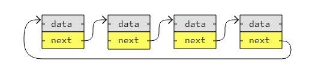
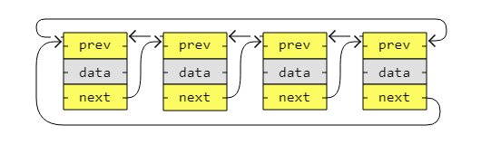

[🏠 Home](../../../README.md) <br/>
[🛠️ DSA Home](../DSA.md)

<hr>

<h1> Circular Linked List (CLL) </h1>

## Index
- [Index](#index)
- [CLL - Introduction](#cll---introduction)
- [CLL - Traversal](#cll---traversal)
  - [In Java](#in-java)
  - [In Python](#in-python)
  - [In C++](#in-c)
- [CLL - Remove a node](#cll---remove-a-node)
  - [In Java](#in-java-1)
  - [In Python](#in-python-1)
  - [In C++](#in-c-1)
- [CLL - Insert a node](#cll---insert-a-node)
  - [In Java](#in-java-2)
  - [In Python](#in-python-2)
  - [In C++](#in-c-2)
- [CLL - Sort](#cll---sort)
  - [Algorithms that can be used with circular linked lists](#algorithms-that-can-be-used-with-circular-linked-lists)
  - [Algorithms that cannot be used effectively with circular linked lists](#algorithms-that-cannot-be-used-effectively-with-circular-linked-lists)
  - [Best choice for circular linked lists](#best-choice-for-circular-linked-lists)
  - [Implementation of Merge Sort Algorithm on CLL](#implementation-of-merge-sort-algorithm-on-cll)
  - [In Java](#in-java-3)
  - [In Python](#in-python-3)
  - [In C++](#in-c-3)
- [Time Complextiy](#time-complextiy)

<hr>

## CLL - Introduction

- A circular linked list is like a singly or doubly linked list with the first node, the "head", and the last node, the "tail", connected.
- In singly or doubly linked lists, we can find the start and end of a list by just checking if the links are `null`. 
- But for circular linked lists, more complex code is needed to explicitly check for start and end nodes in certain applications.
- Circular linked lists are good for lists you need to cycle through continuously.
- The image below is an example of a singly circular linked list:



The image below is an example of a doubly circular linked list:



Performing Following operation on CLL

- Traversal
- Remove a node
- Insert a node
- Sort

[⬆️ Back to TOP ⬆️](#index)

## CLL - Traversal

### In Java

```java
public class Main {

    static class Node {
        int data;
        Node next;

        Node(int data) {
            this.data = data;
            this.next = null;
        }
    }

    public static void main(String[] args) {
        Node node1 = new Node(3);
        Node node2 = new Node(5);
        Node node3 = new Node(13);
        Node node4 = new Node(2);

        node1.next = node2;
        node2.next = node3;
        node3.next = node4;
				
				// Circular link
        node4.next = node1;  

        Node currentNode = node1;
        Node startNode = node1;
        System.out.print(currentNode.data + " -> ");
        currentNode = currentNode.next;

        while (currentNode != startNode) {
            System.out.print(currentNode.data + " -> ");
            currentNode = currentNode.next;
        }

				// Indicating the list loops back
        System.out.println("...");  
    }
}

// Output: 3 -> 5 -> 13 -> 2 -> ...
```

[⬆️ Back to TOP ⬆️](#index)

### In Python

```python
class Node:
    def __init__(self, data):
        self.data = data
        self.next = None
    
node1 = Node(3)
node2 = Node(5)
node3 = Node(13)
node4 = Node(2)

node1.next = node2
node2.next = node3
node3.next = node4
# Circular link
node4.next = node1 

currentNode = node1
startNode = node1
print(currentNode.data, end=" -> ") 
currentNode = currentNode.next 

while currentNode != startNode:
    print(currentNode.data, end=" -> ")
    currentNode = currentNode.next

# Indicating the list loops back
print("...") 

# Output: 3 -> 5 -> 13 -> 2 -> ...
```

[⬆️ Back to TOP ⬆️](#index)

### In C++

```c++
#include <iostream>

using namespace std;

struct Node {
    int data;
    Node* next;
};

int main() {
    // Dynamically allocate memory for the nodes
    Node* node1 = new Node();
    Node* node2 = new Node();
    Node* node3 = new Node();
    Node* node4 = new Node();

    // Assign data to each node
    node1->data = 3;
    node2->data = 5;
    node3->data = 13;
    node4->data = 2;

    // Create the circular linked list
    node1->next = node2;
    node2->next = node3;
    node3->next = node4;
    node4->next = node1;  // Circular link

    // Traverse and print the circular linked list
    Node* currentNode = node1;
    Node* startNode = node1;
    cout << currentNode->data << " -> ";
    currentNode = currentNode->next;

    while (currentNode != startNode) {
        cout << currentNode->data << " -> ";
        currentNode = currentNode->next;
    }

	// Indicating the list loops back
    cout << "...\n";  

    // Free the allocated memory
    delete node1;
    delete node2;
    delete node3;
    delete node4;

    return 0;
}

// Output: 3 -> 5 -> 13 -> 2 -> ...
```

[⬆️ Back to TOP ⬆️](#index)

## CLL - Remove a node

Our code implements the following methods:

1. `removeNode()`: should remove the last node
2. `reoveNode(<value>)`: should remove the node that contains the value.
3. `removeNodeAtIndex(<index>)`: remove node on the specified index
4. `removeFirst()`: should remove the first node
5. `removeLast()`: should remove the last node. (it works same as `removeNode()` with no parameters)

### In Java

```java
class Node {
    int data;
    Node next;

    Node(int data) {
        this.data = data;
        this.next = null;
    }
}

class CircularLinkedList {
    Node head;

    // Method to remove the last node
    public void removeNode() {
        if (head == null) return;

        if (head.next == head) { // Only one node
            head = null;
            return;
        }

        Node current = head;
        while (current.next != head) {
            current = current.next;
        }
        current.next = head.next; // Remove last node
        head = current.next; // Update head if needed
    }

    // Method to remove a node by value
    public void removeNode(int value) {
        if (head == null) return;

        Node current = head;
        Node previous = null;

        do {
            if (current.data == value) {
                if (previous != null) {
                    previous.next = current.next;
                } else { // Node to remove is the head
                    if (current.next == head) {
                        head = null; // List will be empty
                    } else {
                        Node tail = head;
                        while (tail.next != head) {
                            tail = tail.next;
                        }
                        head = current.next; // Move head
                        tail.next = head; // Update tail
                    }
                }
                return;
            }
            previous = current;
            current = current.next;
        } while (current != head);
    }

    // Method to remove node at specified index
    public void removeNodeAtIndex(int index) {
        if (head == null || index < 0) return;

        if (index == 0) {
            removeFirst();
            return;
        }

        Node current = head;
        Node previous = null;
        int count = 0;

        do {
            if (count == index) {
                if (previous != null) {
                    previous.next = current.next;
                }
                return;
            }
            previous = current;
            current = current.next;
            count++;
        } while (current != head);
    }

    // Method to remove the first node
    public void removeFirst() {
        if (head == null) return;

        if (head.next == head) {
            head = null; // Only one node
            return;
        }

        Node tail = head;
        while (tail.next != head) {
            tail = tail.next;
        }
        head = head.next; // Move head to the next node
        tail.next = head; // Update tail
    }

    // Method to remove the last node (same as removeNode)
    public void removeLast() {
        removeNode();
    }

    // Method to display the list
    public void display() {
        if (head == null) return;

        Node current = head;
        do {
            System.out.print(current.data + " -> ");
            current = current.next;
        } while (current != head);
        System.out.println("...");
    }
}

public class Main {
    public static void main(String[] args) {
        CircularLinkedList list = new CircularLinkedList();
        
        // Example usage
        list.head = new Node(3);
        Node second = new Node(5);
        Node third = new Node(13);
        Node fourth = new Node(2);
        
        list.head.next = second;
        second.next = third;
        third.next = fourth;
        fourth.next = list.head; // Circular link

        list.display();

        list.removeNode(5); // Remove node with value 5
        list.display();

        list.removeNodeAtIndex(1); // Remove node at index 1
        list.display();

        list.removeFirst(); // Remove the first node
        list.display();

        list.removeLast(); // Remove the last node
        list.display();
    }
}

// Output:

// 3 -> 5 -> 13 -> 2 -> ...
// 3 -> 13 -> 2 -> ...
// 3 -> 2 -> ...
// 2 -> ...
```

[⬆️ Back to TOP ⬆️](#index)

### In Python

```python
class Node:
    def __init__(self, data):
        self.data = data
        self.next = None

class CircularLinkedList:
    def __init__(self):
        self.head = None

    # Method to remove the last node
    def remove_node(self):
        if self.head is None:
            return

        if self.head.next == self.head:  # Only one node
            self.head = None
            return

        current = self.head
        while current.next != self.head:
            current = current.next
        current.next = self.head.next  # Remove last node
        self.head = current.next  # Update head if needed

    # Method to remove a node by value
    def remove_node_by_value(self, value):
        if self.head is None:
            return

        current = self.head
        previous = None

        while True:
            if current.data == value:
                if previous is not None:
                    previous.next = current.next
                else:  # Node to remove is the head
                    if current.next == self.head:
                        self.head = None  # List will be empty
                    else:
                        tail = self.head
                        while tail.next != self.head:
                            tail = tail.next
                        self.head = current.next  # Move head
                        tail.next = self.head  # Update tail
                return
            previous = current
            current = current.next
            if current == self.head:
                break

    # Method to remove node at specified index
    def remove_node_by_index(self, index):
        if self.head is None or index < 0:
            return

        if index == 0:
            self.remove_first()
            return

        current = self.head
        previous = None
        count = 0

        while True:
            if count == index:
                if previous is not None:
                    previous.next = current.next
                return
            previous = current
            current = current.next
            count += 1
            if current == self.head:
                break

    # Method to remove the first node
    def remove_first(self):
        if self.head is None:
            return

        if self.head.next == self.head:
            self.head = None  # Only one node
            return

        tail = self.head
        while tail.next != self.head:
            tail = tail.next
        self.head = self.head.next  # Move head to the next node
        tail.next = self.head  # Update tail

    # Method to remove the last node (same as remove_node)
    def remove_last(self):
        self.remove_node()

    # Method to display the list
    def display(self):
        if self.head is None:
            return

        current = self.head
        result = []
        while True:
            result.append(current.data)
            current = current.next
            if current == self.head:
                break
        print(" -> ".join(map(str, result)) + " -> ...")

# Example usage
if __name__ == "__main__":
    cll = CircularLinkedList()
    
    # Initialize nodes and create a circular linked list
    cll.head = Node(3)
    second = Node(5)
    third = Node(13)
    fourth = Node(2)
    
    cll.head.next = second
    second.next = third
    third.next = fourth
    fourth.next = cll.head  # Circular link

    cll.display()

    cll.remove_node_by_value(5)  # Remove node with value 5
    cll.display()

    cll.remove_node_by_index(1)  # Remove node at index 1
    cll.display()

    cll.remove_first()  # Remove the first node
    cll.display()

    cll.remove_last()  # Remove the last node
    cll.display()

# Output:

# 3 -> 5 -> 13 -> 2 -> ...
# 3 -> 13 -> 2 -> ...
# 3 -> 2 -> ...
# 2 -> ...
```

[⬆️ Back to TOP ⬆️](#index)

### In C++

```c++
#include <iostream>

using namespace std;

struct Node {
    int data;
    Node* next;

    Node(int data) : data(data), next(nullptr) {}
};

class CircularLinkedList {
public:
    Node* head;

    CircularLinkedList() : head(nullptr) {}

    // Method to remove the last node
    void removeNode() {
        if (head == nullptr) return;

        if (head->next == head) { // Only one node
            delete head;
            head = nullptr;
            return;
        }

        Node* current = head;
        while (current->next != head) {
            current = current->next;
        }
        current->next = head->next; // Remove last node
        delete head;
        head = current->next; // Update head if needed
    }

    // Method to remove a node by value
    void removeNode(int value) {
        if (head == nullptr) return;

        Node* current = head;
        Node* previous = nullptr;

        do {
            if (current->data == value) {
                if (previous != nullptr) {
                    previous->next = current->next;
                } else { // Node to remove is the head
                    if (current->next == head) {
                        delete head;
                        head = nullptr; // List will be empty
                    } else {
                        Node* tail = head;
                        while (tail->next != head) {
                            tail = tail->next;
                        }
                        head = current->next; // Move head
                        tail->next = head; // Update tail
                        delete current;
                    }
                }
                return;
            }
            previous = current;
            current = current->next;
        } while (current != head);
    }

    // Method to remove node at specified index
    void removeNodeIndex(int index) {
        if (head == nullptr || index < 0) return;

        if (index == 0) {
            removeFirst();
            return;
        }

        Node* current = head;
        Node* previous = nullptr;
        int count = 0;

        do {
            if (count == index) {
                if (previous != nullptr) {
                    previous->next = current->next;
                }
                delete current;
                return;
            }
            previous = current;
            current = current->next;
            count++;
        } while (current != head);
    }

    // Method to remove the first node
    void removeFirst() {
        if (head == nullptr) return;

        if (head->next == head) {
            delete head; // Only one node
            head = nullptr;
            return;
        }

        Node* tail = head;
        while (tail->next != head) {
            tail = tail->next;
        }
        tail->next = head->next; // Update tail
        delete head; // Remove head
        head = tail->next; // Move head to the next node
    }

    // Method to remove the last node (same as removeNode)
    void removeLast() {
        removeNode();
    }

    // Method to display the list
    void display() {
        if (head == nullptr) return;

        Node* current = head;
        do {
            cout << current->data << " -> ";
            current = current->next;
        } while (current != head);
        cout << "...\n";
    }

    // Destructor to free memory
    ~CircularLinkedList() {
        if (head == nullptr) return;

        Node* current = head;
        Node* nextNode;
        do {
            nextNode = current->next;
            delete current;
            current = nextNode;
        } while (current != head);
    }
};

int main() {
    CircularLinkedList list;

    // Initialize nodes and create a circular linked list
    list.head = new Node(3);
    Node* second = new Node(5);
    Node* third = new Node(13);
    Node* fourth = new Node(2);

    list.head->next = second;
    second->next = third;
    third->next = fourth;
    fourth->next = list.head; // Circular link

    list.display();

    list.removeNode(5); // Remove node with value 5
    list.display();

    list.removeNodeIndex(1); // Remove node at index 1
    list.display();

    list.removeFirst(); // Remove the first node
    list.display();

    list.removeLast(); // Remove the last node
    list.display();

    return 0;
}

// Output:

// 3 -> 5 -> 13 -> 2 -> ...
// 3 -> 13 -> 2 -> ...
// 3 -> 2 -> ...
// 2 -> ...
```

[⬆️ Back to TOP ⬆️](#index)

## CLL - Insert a node

Our code implements the following methods:

1. `insertNode(<value>)`: should insert the new node, with the specified value, at last.
2. `insertNode(<value>, <index>)`: should insert the new node at the specifid index with the specified value
3. `insertFirst(<value>)`: should insert the new node with the specified value at the first
4. `insertLast(<value>)`: should insert the new node with the specified value at the last (it works same as `insertNode(<value>)`)

### In Java

```java
class Node {
    int data;
    Node next;

    Node(int data) {
        this.data = data;
        this.next = null;
    }
}

class CircularLinkedList {
    Node head;

    // Method to insert a node at the end
    public void insertNode(int value) {
        Node newNode = new Node(value);
        if (head == null) {
            head = newNode;
            head.next = head; // Circular link
        } else {
            Node tail = head;
            while (tail.next != head) {
                tail = tail.next;
            }
            tail.next = newNode;
            newNode.next = head; // Maintain circular link
        }
    }

    // Method to insert a node at specified index
    public void insertNode(int value, int index) {
        if (index < 0) return; // Invalid index

        Node newNode = new Node(value);

        if (index == 0) {
            insertFirst(value);
            return;
        }

        if (head == null) {
            head = newNode;
            head.next = head; // Circular link
            return;
        }

        Node current = head;
        Node previous = null;
        int count = 0;

        while (count < index && current.next != head) {
            previous = current;
            current = current.next;
            count++;
        }

        if (previous != null) {
            previous.next = newNode;
        }
        newNode.next = current; // Link the new node
    }

    // Method to insert a node at the beginning
    public void insertFirst(int value) {
        Node newNode = new Node(value);
        if (head == null) {
            head = newNode;
            head.next = head; // Circular link
        } else {
            Node tail = head;
            while (tail.next != head) {
                tail = tail.next;
            }
            tail.next = newNode; // Update tail to point to new node
            newNode.next = head; // New node points to old head
            head = newNode; // Update head to new node
        }
    }

    // Method to insert a node at the end (same as insertNode)
    public void insertLast(int value) {
        insertNode(value);
    }

    // Method to display the list
    public void display() {
        if (head == null) return;

        Node current = head;
        do {
            System.out.print(current.data + " -> ");
            current = current.next;
        } while (current != head);
        System.out.println("...");
    }
}

public class Main {
    public static void main(String[] args) {
        CircularLinkedList list = new CircularLinkedList();

        // Insert nodes
        list.insertNode(3);
        list.insertNode(5);
        list.insertNode(13);
        list.insertNode(2);
		System.out.println("After inserting nodes at the end:");
        list.display();

		// Insert at the beginning
        list.insertFirst(1); 
		System.out.println("After inserting 1 at the beginning:");
        list.display();

		// Insert at index 2
        list.insertNode(4, 2);
		System.out.println("After inserting 4 at index 2:"); 
        list.display();

		// Insert at the end
        list.insertLast(6);
		System.out.println("After inserting 6 at the end:");
        list.display();
    }
}

// Output:

// After inserting nodes at the end:
// 3 -> 5 -> 13 -> 2 -> ...
// After inserting 1 at the beginning:
// 1 -> 3 -> 5 -> 13 -> 2 -> ...
// After inserting 4 at index 2:
// 1 -> 3 -> 4 -> 5 -> 13 -> 2 -> ...
// After inserting 6 at the end:
// 1 -> 3 -> 4 -> 5 -> 13 -> 2 -> 6 -> ...
```

[⬆️ Back to TOP ⬆️](#index)

### In Python

```python
class Node:
    def __init__(self, data):
        self.data = data
        self.next = None

class CircularLinkedList:
    def __init__(self):
        self.head = None

    # Method to insert a node at the end
    def insert_node(self, value):
        new_node = Node(value)
        if self.head is None:
            self.head = new_node
            self.head.next = self.head  # Circular link
        else:
            tail = self.head
            while tail.next != self.head:
                tail = tail.next
            tail.next = new_node
            new_node.next = self.head  # Maintain circular link

    # Method to insert a node at specified index
    def insert_node_at_index(self, value, index):
        if index < 0:
            return  # Invalid index

        new_node = Node(value)

        if index == 0:
            self.insert_first(value)
            return

        if self.head is None:
            self.head = new_node
            self.head.next = self.head  # Circular link
            return

        current = self.head
        previous = None
        count = 0

        while count < index and current.next != self.head:
            previous = current
            current = current.next
            count += 1

        if previous is not None:
            previous.next = new_node
        new_node.next = current  # Link the new node

    # Method to insert a node at the beginning
    def insert_first(self, value):
        new_node = Node(value)
        if self.head is None:
            self.head = new_node
            self.head.next = self.head  # Circular link
        else:
            tail = self.head
            while tail.next != self.head:
                tail = tail.next
            tail.next = new_node  # Update tail to point to new node
            new_node.next = self.head  # New node points to old head
            self.head = new_node  # Update head to new node

    # Method to insert a node at the end (same as insert_node)
    def insert_last(self, value):
        self.insert_node(value)

    # Method to display the list
    def display(self):
        if self.head is None:
            return

        current = self.head
        result = []
        while True:
            result.append(str(current.data))
            current = current.next
            if current == self.head:
                break
        print(" -> ".join(result) + " -> ...")

# Example usage
if __name__ == "__main__":
    cll = CircularLinkedList()

    # Insert nodes
    cll.insert_node(3)
    cll.insert_node(5)
    cll.insert_node(13)
    cll.insert_node(2)
    print("After inserting nodes at the end:")
    cll.display()

    cll.insert_first(1)  # Insert at the beginning
    print("After inserting 1 at the beginning:")
    cll.display()

    cll.insert_node_at_index(4, 2)  # Insert at index 2
    print("After inserting 4 at index 2:")
    cll.display()

    cll.insert_last(6)  # Insert at the end
    print("After inserting 6 at the end:")
    cll.display()

# Output:

# After inserting nodes at the end:
# 3 -> 5 -> 13 -> 2 -> ...
# After inserting 1 at the beginning:
# 1 -> 3 -> 5 -> 13 -> 2 -> ...
# After inserting 4 at index 2:
# 1 -> 3 -> 4 -> 5 -> 13 -> 2 -> ...
# After inserting 6 at the end:
# 1 -> 3 -> 4 -> 5 -> 13 -> 2 -> 6 -> ...
```

[⬆️ Back to TOP ⬆️](#index)

### In C++

```c++
#include <iostream>

using namespace std;

struct Node {
    int data;
    Node* next;

    Node(int data) : data(data), next(nullptr) {}
};

class CircularLinkedList {
public:
    Node* head;

    CircularLinkedList() : head(nullptr) {}

    // Method to insert a node at the end
    void insertNode(int value) {
        Node* newNode = new Node(value);
        if (head == nullptr) {
            head = newNode;
            head->next = head; // Circular link
        } else {
            Node* tail = head;
            while (tail->next != head) {
                tail = tail->next;
            }
            tail->next = newNode;
            newNode->next = head; // Maintain circular link
        }
    }

    // Method to insert a node at specified index
    void insertNode(int value, int index) {
        if (index < 0) return; // Invalid index

        Node* newNode = new Node(value);
        if (index == 0) {
            insertFirst(value);
            return;
        }

        if (head == nullptr) {
            head = newNode;
            head->next = head; // Circular link
            return;
        }

        Node* current = head;
        Node* previous = nullptr;
        int count = 0;

        while (count < index && current->next != head) {
            previous = current;
            current = current->next;
            count++;
        }

        if (previous != nullptr) {
            previous->next = newNode;
        }
        newNode->next = current; // Link the new node
    }

    // Method to insert a node at the beginning
    void insertFirst(int value) {
        Node* newNode = new Node(value);
        if (head == nullptr) {
            head = newNode;
            head->next = head; // Circular link
        } else {
            Node* tail = head;
            while (tail->next != head) {
                tail = tail->next;
            }
			// Update tail to point to new node
            tail->next = newNode; 
			// New node points to old head
            newNode->next = head; 
		    // Update head to new node
            head = newNode; 
        }
    }

    // Method to insert a node at the end (same as insertNode)
    void insertLast(int value) {
        insertNode(value);
    }

    // Method to display the list
    void display() {
        if (head == nullptr) return;

        Node* current = head;
        do {
            cout << current->data << " -> ";
            current = current->next;
        } while (current != head);
        cout << "...\n";
    }

    // Destructor to free memory
    ~CircularLinkedList() {
        if (head == nullptr) return;

        Node* current = head;
        Node* nextNode;
        do {
            nextNode = current->next;
            delete current;
            current = nextNode;
        } while (current != head);
    }
};

int main() {
    CircularLinkedList list;

    // Insert nodes
    list.insertNode(3);
    list.insertNode(5);
    list.insertNode(13);
    list.insertNode(2);
    cout << "After inserting nodes at the end:\n";
    list.display();

    list.insertFirst(1); // Insert at the beginning
    cout << "After inserting 1 at the beginning:\n";
    list.display();

    list.insertNode(4, 2); // Insert at index 2
    cout << "After inserting 4 at index 2:\n";
    list.display();

    list.insertLast(6); // Insert at the end
    cout << "After inserting 6 at the end:\n";
    list.display();

    return 0;
}

```

[⬆️ Back to TOP ⬆️](#index)

## CLL - Sort

### Algorithms that can be used with circular linked lists

1. **Bubble Sort**: Works with circular linked lists, allowing traversal in both directions. However, it's inefficient with a time complexity of `O(n²)`.
2. **Selection Sort**: Applicable to circular linked lists, but like with singly linked lists, it remains inefficient with a time complexity of `O(n²)`.
3. **Insertion Sort**: Can be effectively applied to circular linked lists. The circular nature allows easy insertion, particularly for sorted or nearly sorted data, though the time complexity remains `O(n²)`.
4. **Quick Sort**: Can be efficiently implemented with circular linked lists, especially when using pointers for partitioning. The average time complexity is `O(n log n)`.
5. **Merge Sort**: A strong candidate for circular linked lists. It boasts a time complexity of `O(n log n)` and works well due to its sequential access pattern, even when the list wraps around.

[⬆️ Back to TOP ⬆️](#index)

### Algorithms that cannot be used effectively with circular linked lists

6. **Counting Sort**: Requires random access to elements and works best with arrays, making it unsuitable for circular linked lists.
7. **Radix Sort**: Like Counting Sort, it relies on random access, rendering it inefficient for circular linked lists.

[⬆️ Back to TOP ⬆️](#index)

### Best choice for circular linked lists

8. **Merge Sort** and **Quick Sort** are the most efficient algorithms for circular linked lists due to their `O(n log n)` time complexity. **Insertion Sort** can also be beneficial for small or nearly sorted lists.

[⬆️ Back to TOP ⬆️](#index)

### Implementation of Merge Sort Algorithm on CLL

- **`mergeSort()` Function**: This function implements the merge sort algorithm recursively:
  - **Base Case**: If the list is empty (`head == null`) or contains only one element (`head.next == head`), it returns the head (the list is already sorted).
  - **Finding the Middle**: It uses the `getMiddle()` function to find the middle node of the circular list, which serves as the split point.
  - **Splitting the List**: The list is split into two halves by temporarily breaking the circular links.
  - **Recursive Sorting**: The `mergeSort()` function is recursively called on both halves of the list (`left` and `right`).
  - **Merging Sorted Lists**: After sorting both halves, the `merge()` function merges them back into a single sorted list.
- **`merge()` Function**: This function merges two sorted circular linked lists:
  - If one list is empty (`left == null` or `right == null`), the other list is returned directly.
  - The function compares the data values of the nodes (`left` and `right`):
    - If `left.data <= right.data`, the `left` node is added to the result, and its `next` is recursively set to the result of merging the rest of the list.
    - If `right.data < left.data`, the `right` node is added, and its `next` is set similarly.
  - Proper handling of pointers ensures the merged list maintains its circular structure.
- **`getMiddle()` Function**: This utility function finds the middle of the circular linked list:
  - It uses the "slow and fast pointer" technique:
    - `slow` moves one step at a time, while `fast` moves two steps.
  - When `fast` completes a full circle or reaches the end of the list, `slow` will point to the middle node, which is then returned for splitting.
- **`sort()` Function**:
  - This function initiates the sorting process.
  - It calls the `mergeSort()` function, passing the head of the circular linked list.
  - The head is updated with the new sorted list after completion of the sorting process.

[⬆️ Back to TOP ⬆️](#index)

### In Java

```java
```

[⬆️ Back to TOP ⬆️](#index)

### In Python

```python
```

[⬆️ Back to TOP ⬆️](#index)

### In C++

```c++
```

## Time Complextiy

- **Insertion**:
  - At the beginning: `O(1)`  
    (We can insert at the head in constant time, adjusting the head's pointer and the last node's pointer to maintain circular structure.)
  - At the end: `O(n)`  
    (We need to traverse to the last node to update its next pointer to point to the new node, unless we maintain a tail pointer, in which case it is `O(1)`.)
  - At a given position: `O(n)`  
    (We need to traverse the list to find the correct position for insertion.)

- **Deletion**:
  - At the beginning: `O(1)`  
    (We can remove the head node and update the last node's next pointer to the new head in constant time.)
  - At the end: `O(n)`  
    (We need to traverse the list to find the second-to-last node to update its next pointer unless a tail pointer is maintained.)
  - At a given position: `O(n)`  
    (We need to traverse the list to find the correct node to delete.)

- **Searching (Linear Search)**: `O(n)`  
  (We may need to traverse the entire list to find the element.)

- **Sorting (Merge Sort)**: `O(n log n)`  
  (Merge sort can be applied, but requires breaking and re-linking the circular structure during sorting.)


<hr>

[🏠 Home](../../../README.md) <br/>
[🛠️ DSA Home](../DSA.md)