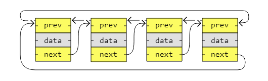

[🏠 Home](../../../README.md) <br/>
[🛠️ DSA Home](../DSA.md)

<hr>

<h1> Circular Doubly Linked List (CDLL) </h1>

## Index
- [Index](#index)
- [Introduction](#introduction)
- [CDLL - Traversal](#cdll---traversal)
  - [In Java](#in-java)
  - [In Python](#in-python)
  - [In C++](#in-c)
- [CDLL - Remove a node](#cdll---remove-a-node)
  - [In Java](#in-java-1)
  - [In Python](#in-python-1)
  - [In C++](#in-c-1)
- [CDLL - Insert a node](#cdll---insert-a-node)
  - [In Java](#in-java-2)
  - [In Python](#in-python-2)
  - [In C++](#in-c-2)
- [CDLL - Sort](#cdll---sort)
  - [Algorithms that can be used with circular doubly linked lists](#algorithms-that-can-be-used-with-circular-doubly-linked-lists)
  - [Algorithms that cannot be used effectively with circular doubly linked lists](#algorithms-that-cannot-be-used-effectively-with-circular-doubly-linked-lists)
  - [Best choice for circular doubly linked lists](#best-choice-for-circular-doubly-linked-lists)
  - [Implementation of Merge Sort Algorithm on CDLL](#implementation-of-merge-sort-algorithm-on-cdll)
  - [In Java](#in-java-3)
  - [In Python](#in-python-3)
  - [In C++](#in-c-3)
- [Time Complexity](#time-complexity)
- [CDLL vs DLL](#cdll-vs-dll)

<hr>

## Introduction

- A circular linked list is like a singly or doubly linked list with the first node, the "head", and the last node, the "tail", connected.
- In singly or doubly linked lists, we can find the start and end of a list by just checking if the links are `null`. 
- But for circular linked lists, more complex code is needed to explicitly check for start and end nodes in certain applications.
- Circular linked lists are good for lists you need to cycle through continuously.
- The image below is an example of a singly circular linked list:


The image below is an example of a doubly circular linked list:



Performing Following operation on CLL

- Traversal
- Remove a node
- Insert a node
- Sort

[⬆️ Back to TOP ⬆️](#index)

## CDLL - Traversal

### In Java

```java

class Node {
  int data;
  Node next;
  Node prev;

  Node(int data) {
    this.data = data;
  }
}

public class Main {
  public static void main(String[] args) {
    Node node1 = new Node(3);
    Node node2 = new Node(5);
    Node node3 = new Node(13);
    Node node4 = new Node(2);

    node1.next = node2;
    node1.prev = node4; // Circular link

    node2.prev = node1;
    node2.next = node3;

    node3.prev = node2;
    node3.next = node4;

    node4.prev = node3;
    node4.next = node1; // Circular link

    System.out.println("Traversing forward:");
    Node currentNode = node1;
    Node startNode = node1;
    System.out.print(currentNode.data + " <-> ");
    currentNode = currentNode.next;

    while (currentNode != startNode) {
      System.out.print(currentNode.data + " <-> ");
      currentNode = currentNode.next;
    }
    System.out.println("..."); // Indicating the list loops back

    System.out.println("Traversing backward:");
    currentNode = node4;
    startNode = node4;
    System.out.print(currentNode.data + " <-> ");
    currentNode = currentNode.prev;

    while (currentNode != startNode) {
      System.out.print(currentNode.data + " <-> ");
      currentNode = currentNode.prev;
    }
    System.out.println("..."); // Indicating the list loops back
  }
}

// Output:

// Traversing forward:
// 3 -> 5 -> 13 -> 2 -> ...
// Traversing backward:
// 2 -> 13 -> 5 -> 3 -> ...
```

[⬆️ Back to TOP ⬆️](#index)

### In Python

```python
class Node:
    def __init__(self, data):
        self.data = data
        self.next = None
        self.prev = None

node1 = Node(3)
node2 = Node(5)
node3 = Node(13)
node4 = Node(2)

node1.next = node2
node1.prev = node4  # Circular link

node2.prev = node1
node2.next = node3

node3.prev = node2
node3.next = node4

node4.prev = node3
node4.next = node1  # Circular link

print("\nTraversing forward:")
currentNode = node1
startNode = node1
print(currentNode.data, end=" -> ")
currentNode = currentNode.next

while currentNode != startNode:
    print(currentNode.data, end=" -> ")
    currentNode = currentNode.next
print("...")  # Indicating it's circular

print("\nTraversing backward:")
currentNode = node4
startNode = node4
print(currentNode.data, end=" -> ")
currentNode = currentNode.prev

while currentNode != startNode:
    print(currentNode.data, end=" -> ")
    currentNode = currentNode.prev
print("...")  # Indicating it's circular

#Python
# Output:

# Traversing forward:
# 3 -> 5 -> 13 -> 2 -> ...
# Traversing backward:
# 2 -> 13 -> 5 -> 3 -> ...
```

[⬆️ Back to TOP ⬆️](#index)

### In C++

```c++
#include <iostream>

using namespace std;

struct Node {
    int data;
    Node* next;
    Node* prev;
};

int main() {
    // Create nodes using 'new' for dynamic memory allocation
    Node* node1 = new Node();
    Node* node2 = new Node();
    Node* node3 = new Node();
    Node* node4 = new Node();

    // Assign data to each node
    node1->data = 3;
    node2->data = 5;
    node3->data = 13;
    node4->data = 2;

    // Link the nodes together, creating a circular doubly linked list
    node1->next = node2;
    node1->prev = node4;  // Circular link

    node2->prev = node1;
    node2->next = node3;

    node3->prev = node2;
    node3->next = node4;

    node4->prev = node3;
    node4->next = node1;  // Circular link

    // Forward traversal
    cout << "\nTraversing forward:\n";
    Node* currentNode = node1;
    Node* startNode = node1;
    cout << currentNode->data << " -> ";
    currentNode = currentNode->next;

    while (currentNode != startNode) {
        cout << currentNode->data << " -> ";
        currentNode = currentNode->next;
    }
    cout << "...\n";  // Indicating the list loops back

    // Backward traversal
    cout << "\nTraversing backward:\n";
    currentNode = node4;
    startNode = node4;
    cout << currentNode->data << " -> ";
    currentNode = currentNode->prev;

    while (currentNode != startNode) {
        cout << currentNode->data << " -> ";
        currentNode = currentNode->prev;
    }
    cout << "...\n";  // Indicating the list loops back

    // Clean up dynamically allocated memory
    delete node1;
    delete node2;
    delete node3;
    delete node4;

    return 0;
}

// Output:

// Traversing forward:
// 3 -> 5 -> 13 -> 2 -> ...
// Traversing backward:
// 2 -> 13 -> 5 -> 3 -> ...
```

[⬆️ Back to TOP ⬆️](#index)

## CDLL - Remove a node

Our code implements the following methods:

1. `removeNode()`: should remove the last node
2. `reoveNode(<value>)`: should remove the node that contains the value.
3. `removeNodeAtIndex(<index>)`: remove node on the specified index
4. `removeFirst()`: should remove the first node
5. `removeLast()`: should remove the last node. (it works same as `removeNode()` with no parameters)

[⬆️ Back to TOP ⬆️](#index)

### In Java

```java
class Node {
    int data;
    Node next;
    Node prev;

    Node(int data) {
        this.data = data;
        this.next = null;
        this.prev = null;
    }
}

class CircularDoublyLinkedList {
    Node head;

    // Helper method to check if the list is empty
    private boolean isEmpty() {
        return head == null;
    }

    // Method to remove the last node (same as removeLast())
    public void removeNode() {
        removeLast();
    }

    // Method to remove the node containing the specified value
    public void removeNode(int value) {
        if (isEmpty()) return;

        Node current = head;

        // Check if the node to remove is the head
        if (head.data == value) {
            removeFirst();
            return;
        }

        do {
            if (current.data == value) {
                // Adjust the pointers to bypass the current node
                current.prev.next = current.next;
                current.next.prev = current.prev;
                return;
            }
            current = current.next;
        } while (current != head);
    }

    // Method to remove the node at a specific index
    public void removeNodeAtIndex(int index) {
        if (isEmpty() || index < 0) return;

        Node current = head;
        int count = 0;

        // If removing the head node
        if (index == 0) {
            removeFirst();
            return;
        }

        // Traverse to the node at the specified index
        do {
            if (count == index) {
                current.prev.next = current.next;
                current.next.prev = current.prev;
                return;
            }
            current = current.next;
            count++;
        } while (current != head);
    }

    // Method to remove the first node
    public void removeFirst() {
        if (isEmpty()) return;

        // If the list contains only one node
        if (head.next == head) {
            head = null;
        } else {
            // Adjust pointers to remove the head node
            Node tail = head.prev;
            head = head.next;
            head.prev = tail;
            tail.next = head;
        }
    }

    // Method to remove the last node (same as removeNode())
    public void removeLast() {
        if (isEmpty()) return;

        // If there's only one node
        if (head.next == head) {
            head = null;
        } else {
            Node tail = head.prev;
            Node secondLast = tail.prev;
            secondLast.next = head;
            head.prev = secondLast;
        }
    }

    // Helper method to add a node to the end of the list for testing purposes
    public void insertNode(int data) {
        Node newNode = new Node(data);
        if (isEmpty()) {
            head = newNode;
            head.next = head;
            head.prev = head;
        } else {
            Node tail = head.prev;
            tail.next = newNode;
            newNode.prev = tail;
            newNode.next = head;
            head.prev = newNode;
        }
    }

    // Helper method to print the list for testing purposes
    public void printList() {
        if (isEmpty()) {
            System.out.println("List is empty");
            return;
        }
        Node current = head;
        do {
            System.out.print(current.data + " <-> ");
            current = current.next;
        } while (current != head);
        System.out.println("(head)");
    }
}

class Main{
    public static void main(String[] args) {
        CircularDoublyLinkedList dll = new CircularDoublyLinkedList();

        dll.insertNode(10);
        dll.insertNode(20);
        dll.insertNode(30);
        dll.insertNode(40);
        dll.insertNode(50);

        System.out.println("Original List:");
        dll.printList();

        System.out.println("\nRemoving last node:");
        dll.removeLast();
        dll.printList();

        System.out.println("\nRemoving node with value 20:");
        dll.removeNode(20);
        dll.printList();

        System.out.println("\nRemoving node at index 1:");
        dll.removeNodeAtIndex(1);
        dll.printList();

        System.out.println("\nRemoving first node:");
        dll.removeFirst();
        dll.printList();
    }
}

Output:

Original List:
10 <-> 20 <-> 30 <-> 40 <-> 50 <-> (head)

Removing last node:
10 <-> 20 <-> 30 <-> 40 <-> (head)

Removing node with value 20:
10 <-> 30 <-> 40 <-> (head)

Removing node at index 1:
10 <-> 40 <-> (head)

Removing first node:
40 <-> (head)
```

[⬆️ Back to TOP ⬆️](#index)

### In Python

```python
class Node:
    def __init__(self, data):
        self.data = data
        self.next = None
        self.prev = None

class CircularDoublyLinkedList:
    def __init__(self):
        self.head = None

    def is_empty(self):
        return self.head is None

    def remove_node(self):
        self.remove_last()

    def remove_node_by_value(self, value):
        if self.is_empty():
            return

        current = self.head

        # Check if the node to remove is the head
        if self.head.data == value:
            self.remove_first()
            return

        # Traverse the list to find the node to remove
        while current:
            if current.data == value:
                current.prev.next = current.next
                current.next.prev = current.prev
                return
            current = current.next
            if current == self.head:
                break

    def remove_node_at_index(self, index):
        if self.is_empty() or index < 0:
            return

        current = self.head
        count = 0

        if index == 0:
            self.remove_first()
            return

        while current:
            if count == index:
                current.prev.next = current.next
                current.next.prev = current.prev
                return
            current = current.next
            count += 1
            if current == self.head:
                break

    def remove_first(self):
        if self.is_empty():
            return

        if self.head.next == self.head:  # Only one node in the list
            self.head = None
        else:
            tail = self.head.prev
            self.head = self.head.next
            self.head.prev = tail
            tail.next = self.head

    def remove_last(self):
        if self.is_empty():
            return

        if self.head.next == self.head:  # Only one node in the list
            self.head = None
        else:
            tail = self.head.prev
            second_last = tail.prev
            second_last.next = self.head
            self.head.prev = second_last

    # Helper method to add node for testing
    def insert_node(self, data):
        new_node = Node(data)
        if self.is_empty():
            self.head = new_node
            new_node.next = new_node
            new_node.prev = new_node
        else:
            tail = self.head.prev
            tail.next = new_node
            new_node.prev = tail
            new_node.next = self.head
            self.head.prev = new_node

    def print_list(self):
        if self.is_empty():
            print("List is empty")
            return
        current = self.head
        while True:
            print(f"{current.data} <-> ", end="")
            current = current.next
            if current == self.head:
                break
        print("(head)")

# Example usage
if __name__ == "__main__":
    dll = CircularDoublyLinkedList()
    dll.insert_node(10)
    dll.insert_node(20)
    dll.insert_node(30)
    dll.insert_node(40)
    dll.insert_node(50)

    print("Original List:")
    dll.print_list()

    print("\nRemoving last node:")
    dll.remove_last()
    dll.print_list()

    print("\nRemoving node with value 20:")
    dll.remove_node_by_value(20)
    dll.print_list()

    print("\nRemoving node at index 1:")
    dll.remove_node_at_index(1)
    dll.print_list()

    print("\nRemoving first node:")
    dll.remove_first()
    dll.print_list()

# Output:

# Original List:
# 10 <-> 20 <-> 30 <-> 40 <-> 50 <-> (head)

# Removing last node:
# 10 <-> 20 <-> 30 <-> 40 <-> (head)

# Removing node with value 20:
# 10 <-> 30 <-> 40 <-> (head)

# Removing node at index 1:
# 10 <-> 40 <-> (head)

# Removing first node:
# 40 <-> (head)
```

[⬆️ Back to TOP ⬆️](#index)

### In C++

```c++
#include <iostream>

struct Node {
    int data;
    Node* next;
    Node* prev;

    Node(int val) : data(val), next(nullptr), prev(nullptr) {}
};

class CircularDoublyLinkedList {
    Node* head;

public:
    CircularDoublyLinkedList() : head(nullptr) {}

    bool is_empty() {
        return head == nullptr;
    }

    void remove_node() {
        remove_last();
    }

    void remove_node(int value) {
        if (is_empty()) return;

        Node* current = head;

        if (head->data == value) {
            remove_first();
            return;
        }

        do {
            if (current->data == value) {
                current->prev->next = current->next;
                current->next->prev = current->prev;
                return;
            }
            current = current->next;
        } while (current != head);
    }

    void remove_node_at_index(int index) {
        if (is_empty() || index < 0) return;

        Node* current = head;
        int count = 0;

        if (index == 0) {
            remove_first();
            return;
        }

        do {
            if (count == index) {
                current->prev->next = current->next;
                current->next->prev = current->prev;
                return;
            }
            current = current->next;
            count++;
        } while (current != head);
    }

    void remove_first() {
        if (is_empty()) return;

        if (head->next == head) {
            head = nullptr;
        } else {
            Node* tail = head->prev;
            head = head->next;
            head->prev = tail;
            tail->next = head;
        }
    }

    void remove_last() {
        if (is_empty()) return;

        if (head->next == head) {
            head = nullptr;
        } else {
            Node* tail = head->prev;
            Node* second_last = tail->prev;
            second_last->next = head;
            head->prev = second_last;
        }
    }

    void insert_node(int data) {
        Node* new_node = new Node(data);
        if (is_empty()) {
            head = new_node;
            head->next = head;
            head->prev = head;
        } else {
            Node* tail = head->prev;
            tail->next = new_node;
            new_node->prev = tail;
            new_node->next = head;
            head->prev = new_node;
        }
    }

    void print_list() {
        if (is_empty()) {
            std::cout << "List is empty" << std::endl;
            return;
        }
        Node* current = head;
        do {
            std::cout << current->data << " <-> ";
            current = current->next;
        } while (current != head);
        std::cout << "(head)" << std::endl;
    }
};

int main() {
    CircularDoublyLinkedList dll;
    dll.insert_node(10);
    dll.insert_node(20);
    dll.insert_node(30);
    dll.insert_node(40);
    dll.insert_node(50);

    std::cout << "Original List:" << std::endl;
    dll.print_list();

    std::cout << "\nRemoving last node:" << std::endl;
    dll.remove_last();
    dll.print_list();

    std::cout << "\nRemoving node with value 20:" << std::endl;
    dll.remove_node(20);
    dll.print_list();

    std::cout << "\nRemoving node at index 1:" << std::endl;
    dll.remove_node_at_index(1);
    dll.print_list();

    std::cout << "\nRemoving first node:" << std::endl;
    dll.remove_first();
    dll.print_list();

    return 0;
}

// Output:

// Original List:
// 10 <-> 20 <-> 30 <-> 40 <-> 50 <-> (head)

// Removing last node:
// 10 <-> 20 <-> 30 <-> 40 <-> (head)

// Removing node with value 20:
// 10 <-> 30 <-> 40 <-> (head)

// Removing node at index 1:
// 10 <-> 40 <-> (head)

// Removing first node:
// 40 <-> (head)
```

[⬆️ Back to TOP ⬆️](#index)

## CDLL - Insert a node

Our code implements the following methods:

1. `insertNode(<value>)`: should insert the new node, with the specified value, at last.
2. `insertNode(<value>, <index>)`: should insert the new node at the specifid index with the specified value
3. `insertFirst(<value>)`: should insert the new node with the specified value at the first
4. `insertLast(<value>)`: should insert the new node with the specified value at the last (it works same as `insertNode(<value>)`)

[⬆️ Back to TOP ⬆️](#index)

### In Java

```java
class Node {
	int data;
	Node prev, next;

	Node(int data) {
		this.data = data;
		this.prev = this.next = null;
	}
}

class CircularDoublyLinkedList {
	private Node head;

	// Insert a new node at the end of the list
	public void insertNode(int data) {
		insertLast(data);
	}

	// Overloaded insertNode to insert at a specified index
	public void insertNode(int data, int index) {
		Node newNode = new Node(data);

		if (index == 0) {
			insertFirst(data);
			return;
		}

		Node current = head;
		int count = 0;

		// Traverse to the node just before the insertion point
		while (count < index - 1 && current.next != head) {
			current = current.next;
			count++;
		}

		if (current == head && count != index - 1) {
			System.out.println("Index out of bounds");
			return;
		}

		newNode.next = current.next;
		newNode.prev = current;
		current.next.prev = newNode;
		current.next = newNode;
	}

	// Insert a new node at the beginning of the list
	public void insertFirst(int data) {
		Node newNode = new Node(data);

		if (head == null) {
			// For an empty list, point next and prev to itself (circular nature)
			newNode.next = newNode.prev = newNode;
			head = newNode;
		} else {
			Node last = head.prev; // Get the last node

			// Insert the new node at the beginning
			newNode.next = head;
			newNode.prev = last;
			last.next = newNode;
			head.prev = newNode;
			head = newNode; // Move head to the new node
		}
	}

	// Insert a new node at the end of the list
	public void insertLast(int data) {
		Node newNode = new Node(data);

		if (head == null) {
			// For an empty list, point next and prev to itself (circular nature)
			newNode.next = newNode.prev = newNode;
			head = newNode;
		} else {
			Node last = head.prev; // Get the last node

			// Insert the new node at the end
			last.next = newNode;
			newNode.prev = last;
			newNode.next = head;
			head.prev = newNode;
		}
	}

	// Helper function to print the list
	public void printList() {
		if (head == null) {
			System.out.println("List is empty");
			return;
		}

		Node temp = head;
		do {
			System.out.print(temp.data + " <-> ");
			temp = temp.next;
		} while (temp != head);
		System.out.println("(head)");
	}
}

class Main {
	public static void main(String[] args) {
		CircularDoublyLinkedList cdll = new CircularDoublyLinkedList();

		// Inserting nodes at the end
		cdll.insertNode(10);
		cdll.insertNode(20);
		cdll.insertNode(30);
		cdll.insertNode(40);

		System.out.println("List after inserting nodes at the end:");
		cdll.printList();

		// Inserting a node at the beginning
		cdll.insertFirst(5);
		System.out.println("List after inserting 5 at the beginning:");
		cdll.printList();

		// Inserting a node at index 2
		cdll.insertNode(15, 2);
		System.out.println("List after inserting 15 at index 2:");
		cdll.printList();

		// Inserting a node at the end (equivalent to insertNode)
		cdll.insertLast(50);
		System.out.println("List after inserting 50 at the end:");
		cdll.printList();
	}
}

Output:

List after inserting nodes at the end:
10 <-> 20 <-> 30 <-> 40 <-> (head)
List after inserting 5 at the beginning:
5 <-> 10 <-> 20 <-> 30 <-> 40 <-> (head)
List after inserting 15 at index 2:
5 <-> 10 <-> 15 <-> 20 <-> 30 <-> 40 <-> (head)
List after inserting 50 at the end:
5 <-> 10 <-> 15 <-> 20 <-> 30 <-> 40 <-> 50 <-> (head)
```

[⬆️ Back to TOP ⬆️](#index)

### In Python

```python
class Node:
    def __init__(self, data):
        self.data = data
        self.next = None
        self.prev = None

class CircularDoublyLinkedList:
    def __init__(self):
        self.head = None

    # Insert a new node at the end of the list
    def insertNode(self, data):
        self.insertLast(data)

    # Insert a new node at the specified index
    def insertNodeAtIndex(self, data, index):
        new_node = Node(data)
        
        if index == 0:
            self.insertFirst(data)
            return

        current = self.head
        count = 0

        # Traverse to the node just before the insertion point
        while count < index - 1 and current.next != self.head:
            current = current.next
            count += 1

        if current == self.head and count != index - 1:
            print("Index out of bounds")
            return

        new_node.next = current.next
        new_node.prev = current
        current.next.prev = new_node
        current.next = new_node

    # Insert a new node at the beginning of the list
    def insertFirst(self, data):
        new_node = Node(data)

        if self.head is None:
            new_node.next = new_node.prev = new_node
            self.head = new_node
        else:
            last = self.head.prev  # Get the last node

            # Insert the new node at the beginning
            new_node.next = self.head
            new_node.prev = last
            last.next = new_node
            self.head.prev = new_node
            self.head = new_node

    # Insert a new node at the end of the list
    def insertLast(self, data):
        new_node = Node(data)

        if self.head is None:
            new_node.next = new_node.prev = new_node
            self.head = new_node
        else:
            last = self.head.prev  # Get the last node

            last.next = new_node
            new_node.prev = last
            new_node.next = self.head
            self.head.prev = new_node

    # Helper function to print the list
    def printList(self):
        if self.head is None:
            print("List is empty")
            return

        temp = self.head
        while True:
            print(f"{temp.data} <-> ", end="")
            temp = temp.next
            if temp == self.head:
                break
        print("(head)")

# Testing the CircularDoublyLinkedList
if __name__ == "__main__":
    cdll = CircularDoublyLinkedList()

    # Inserting nodes at the end
    cdll.insertNode(10)
    cdll.insertNode(20)
    cdll.insertNode(30)
    cdll.insertNode(40)

    print("List after inserting nodes at the end:")
    cdll.printList()

    # Inserting a node at the beginning
    cdll.insertFirst(5)
    print("List after inserting 5 at the beginning:")
    cdll.printList()

    # Inserting a node at index 2
    cdll.insertNodeAtIndex(15, 2)
    print("List after inserting 15 at index 2:")
    cdll.printList()

    # Inserting a node at the end
    cdll.insertLast(50)
    print("List after inserting 50 at the end:")
    cdll.printList()

# Output:

# List after inserting nodes at the end:
# 10 <-> 20 <-> 30 <-> 40 <-> (head)
# List after inserting 5 at the beginning:
# 5 <-> 10 <-> 20 <-> 30 <-> 40 <-> (head)
# List after inserting 15 at index 2:
# 5 <-> 10 <-> 15 <-> 20 <-> 30 <-> 40 <-> (head)
# List after inserting 50 at the end:
# 5 <-> 10 <-> 15 <-> 20 <-> 30 <-> 40 <-> 50 <-> (head)
```
[⬆️ Back to TOP ⬆️](#index)

### In C++

```c++
#include <iostream>

using namespace std;

class Node {
public:
    int data;
    Node* next;
    Node* prev;

    Node(int data) {
        this->data = data;
        this->next = nullptr;
        this->prev = nullptr;
    }
};

class CircularDoublyLinkedList {
private:
    Node* head;

public:
    CircularDoublyLinkedList() {
        head = nullptr;
    }

    // Insert a new node at the end of the list
    void insertNode(int data) {
        insertLast(data);
    }

    // Insert a new node at the specified index
    void insertNodeAtIndex(int data, int index) {
        Node* newNode = new Node(data);

        if (index == 0) {
            insertFirst(data);
            return;
        }

        Node* current = head;
        int count = 0;

        // Traverse to the node just before the insertion point
        while (count < index - 1 && current->next != head) {
            current = current->next;
            count++;
        }

        if (current == head && count != index - 1) {
            cout << "Index out of bounds" << endl;
            return;
        }

        newNode->next = current->next;
        newNode->prev = current;
        current->next->prev = newNode;
        current->next = newNode;
    }

    // Insert a new node at the beginning of the list
    void insertFirst(int data) {
        Node* newNode = new Node(data);

        if (head == nullptr) {
            newNode->next = newNode->prev = newNode;
            head = newNode;
        } else {
            Node* last = head->prev;  // Get the last node

            newNode->next = head;
            newNode->prev = last;
            last->next = newNode;
            head->prev = newNode;
            head = newNode;
        }
    }

    // Insert a new node at the end of the list
    void insertLast(int data) {
        Node* newNode = new Node(data);

        if (head == nullptr) {
            newNode->next = newNode->prev = newNode;
            head = newNode;
        } else {
            Node* last = head->prev;  // Get the last node

            last->next = newNode;
            newNode->prev = last;
            newNode->next = head;
            head->prev = newNode;
        }
    }

    // Helper function to print the list
    void printList() {
        if (head == nullptr) {
            cout << "List is empty" << endl;
            return;
        }

        Node* temp = head;
        do {
            cout << temp->data << " <-> ";
            temp = temp->next;
        } while (temp != head);
        cout << "(head)" << endl;
    }
};

int main() {
    CircularDoublyLinkedList cdll;

    // Inserting nodes at the end
    cdll.insertNode(10);
    cdll.insertNode(20);
    cdll.insertNode(30);
    cdll.insertNode(40);

    cout << "List after inserting nodes at the end:" << endl;
    cdll.printList();

    // Inserting a node at the beginning
    cdll.insertFirst(5);
    cout << "List after inserting 5 at the beginning:" << endl;
    cdll.printList();

    // Inserting a node at index 2
    cdll.insertNodeAtIndex(15, 2);
    cout << "List after inserting 15 at index 2:" << endl;
    cdll.printList();

    // Inserting a node at the end
    cdll.insertLast(50);
    cout << "List after inserting 50 at the end:" << endl;
    cdll.printList();

    return 0;
}

// Output:

// List after inserting nodes at the end:
// 10 <-> 20 <-> 30 <-> 40 <-> (head)
// List after inserting 5 at the beginning:
// 5 <-> 10 <-> 20 <-> 30 <-> 40 <-> (head)
// List after inserting 15 at index 2:
// 5 <-> 10 <-> 15 <-> 20 <-> 30 <-> 40 <-> (head)
// List after inserting 50 at the end:
// 5 <-> 10 <-> 15 <-> 20 <-> 30 <-> 40 <-> 50 <-> (head)
```

[⬆️ Back to TOP ⬆️](#index)

## CDLL - Sort

### Algorithms that can be used with circular doubly linked lists

1. **Bubble Sort**: Efficient in the context of circular doubly linked lists due to the ability to traverse in both directions. However, it's still inefficient with a time complexity of `O(n²)`.
2. **Selection Sort**: This can also be applied to circular doubly linked lists but remains inefficient with `O(n²)` time complexity. The traversal in both directions offers slight improvement in some cases.
3. **Insertion Sort**: Works well with circular doubly linked lists, especially for nearly sorted data. Since it can traverse in both directions, inserting the new element in the correct position is easier. Time complexity is `O(n²)`.
4. **Quick Sort**: Can be effectively implemented for circular doubly linked lists. The ability to traverse backward and forward aids in partitioning. It has an average time complexity of `O(n log n)`.
5. **Merge Sort**: A highly efficient sorting algorithm for circular doubly linked lists. It operates with `O(n log n)` complexity and leverages the list's sequential access pattern, whether moving forward or backward around the circle.

[⬆️ Back to TOP ⬆️](#index)

### Algorithms that cannot be used effectively with circular doubly linked lists

6. **Counting Sort**: It relies on random access, which makes it inefficient for linked lists, including circular doubly linked lists.
7. **Radix Sort**: Like Counting Sort, this sorting algorithm depends on random access, making it unsuitable for circular doubly linked lists.

[⬆️ Back to TOP ⬆️](#index)

### Best choice for circular doubly linked lists

8. **Merge Sort** and **Quick Sort** are the best choices for circular doubly linked lists due to their efficient `O(n log n)` time complexity. **Insertion Sort** may still be beneficial for small or nearly sorted lists.

[⬆️ Back to TOP ⬆️](#index)

### Implementation of Merge Sort Algorithm on CDLL

- **`mergeSort()` Function**: This function implements the merge sort algorithm recursively for circular doubly linked lists:
  - **Base Case**: If the list is empty (`head == null`) or has only one element (`head.next == head`), the list is already sorted, and `head` is returned.
  - **Finding the Middle**: The `getMiddle()` function is used to locate the middle node, which serves as the split point.
  - **Splitting the List**: The list is split into two halves by temporarily breaking the circular links between nodes.
  - **Recursive Sorting**: The `mergeSort()` function is recursively called on both halves of the list (`left` and `right`).
  - **Merging Sorted Lists**: After the recursive calls, the `merge()` function is used to merge the two sorted halves while maintaining the circular doubly linked structure.
  
- **`merge()` Function**: This function merges two sorted halves of a circular doubly linked list:
  - If one half is empty (`left == null` or `right == null`), the other half is returned.
  - The function compares the data in `left` and `right` nodes:
    - If `left.data <= right.data`, the `left` node is added to the result, and the next pointer is recursively set to merge the rest of the list.
    - If `right.data < left.data`, the `right` node is added similarly.
  - Both the `prev` and `next` pointers are adjusted to maintain the circular doubly linked structure.

- **`getMiddle()` Function**: This utility function finds the middle node of the circular doubly linked list:
  - It uses the "slow and fast pointer" technique:
    - The `slow` pointer moves one node at a time, while the `fast` pointer moves two nodes.
  - When `fast` either completes a circle or reaches the end of the list, `slow` will be at the middle node.
  - The middle node is returned to split the list into two halves.
  
- **`sort()` Function**:
  - This function initializes the merge sort process.
  - It invokes `mergeSort()` and passes the head of the circular doubly linked list.
  - The head is updated after the list is fully sorted.
  
[⬆️ Back to TOP ⬆️](#index)

### In Java

```java
```

[⬆️ Back to TOP ⬆️](#index)

### In Python

```python
```

[⬆️ Back to TOP ⬆️](#index)

### In C++

```c++
```

[⬆️ Back to TOP ⬆️](#index)

## Time Complexity


- **Insertion**:
  - At the beginning: `O(1)`  
    (We can insert at the head in constant time, adjusting the head's previous pointer and the last node's next pointer to maintain the circular structure.)
  - At the end: `O(1)`  
    (If we maintain a tail pointer, we can insert at the end in constant time by updating the tail's next and the head's previous pointers.)
  - At a given position: `O(n)`  
    (We need to traverse the list to find the correct position for insertion.)

- **Deletion**:
  - At the beginning: `O(1)`  
    (We can remove the head and adjust the last node's next pointer to point to the new head.)
  - At the end: `O(1)`  
    (If we maintain a tail pointer, we can remove the last node in constant time by adjusting the second-to-last node's next pointer and updating the tail pointer.)
  - At a given position: `O(n)`  
    (We need to traverse the list to find the correct node to delete.)

- **Searching (Linear Search)**: `O(n)`  
  (We may need to traverse the entire list to find the element.)

- **Sorting (Merge Sort)**: `O(n log n)`  
  (Merge sort can be applied, requiring breaking and relinking the circular structure during sorting.)

## CDLL vs DLL

| Operation                  | Circular Singly Linked List | Circular Doubly Linked List |
|----------------------------|-----------------------------|-----------------------------|
| **Insertion at Beginning**  | `O(1)`                      | `O(1)`                      |
| **Insertion at End**        | `O(n)` (or `O(1)` with tail) | `O(1)` (with tail)          |
| **Insertion at Position**   | `O(n)`                      | `O(n)`                      |
| **Deletion at Beginning**   | `O(1)`                      | `O(1)`                      |
| **Deletion at End**         | `O(n)` (or `O(1)` with tail) | `O(1)` (with tail)          |
| **Deletion at Position**    | `O(n)`                      | `O(n)`                      |
| **Search**                  | `O(n)`                      | `O(n)`                      |
| **Sorting (Merge Sort)**    | `O(n log n)`                | `O(n log n)`                |

[⬆️ Back to TOP ⬆️](#index)

<hr>

[🏠 Home](../../../README.md) <br/>
[🛠️ DSA Home](../DSA.md)
