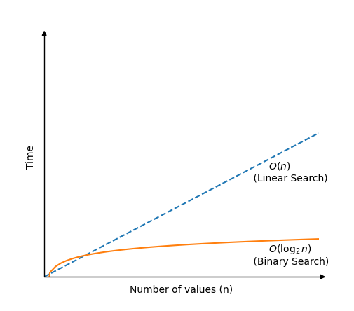

[🏠 Home](../../../README.md) <br/>
[🛠️ DSA Home](../DSA.md)

<hr>

<h1>🔍 Binary Search 🔍</h1>

## Index
- [Index](#index)
- [How it works](#how-it-works)
- [Time Complexity](#time-complexity)
- [Example Run up](#example-run-up)
- [Example Implementation](#example-implementation)
	- [In Java](#in-java)
	- [In C++](#in-c)
	- [In Python](#in-python)

<hr>

👉 [W3schools.com - Binary Search](https://www.w3schools.com/dsa/dsa_algo_binarysearch.php)

<hr>

- Binary Search is an efficient algorithm used to find an element in a sorted array by repeatedly dividing the search interval in half.

## How it works

- Start with two pointers: one at the beginning (`low`) and one at the end (`high`) of the array.
- Find the middle element (`mid`).
- Compare the target element with the middle element:
  - If they are equal, return the index of the middle element.
  - If the target is smaller, search the left half by updating `high = mid - 1`.
  - If the target is larger, search the right half by updating `low = mid + 1`.
- Repeat the process until the element is found or `low > high`.
- If the element is not found, return a failure result (like -1).

[⬆️ Back to TOP ⬆️](#index)

## Time Complexity

- **Worst-case**: `O(log n)`, where n is the number of elements in the array.
- **Best-Case**: `O(1)`, when the element is at `mid`, or at `low` or at `high`



<hr>

💡**Note**💡
When writing time complexity using Big O notation we could also just have written `O(log n)`, but <code>O(log<sub>2</sub> n)</code> reminds us that the array search area is halved for every new comparison, which is the basic concept of Binary Search, so we will just keep the base 2 indication in this case.
<hr>

[⬆️ Back to TOP ⬆️](#index)

## Example Run up

Array: `[1, 3, 5, 7, 9, 11]`, Target: `7`

Start: `low = 0`, `high = 5`, `mid = 2`, Element at `mid = 5`

Since `7 > 5`, update `low = mid + 1 = 3`

New `mid = (3 + 5) // 2 = 4`, Element at `mid = 9`

Since `7 < 9`, update `high = mid - 1 = 3`

New `mid = 3`, Element at `mid = 7`, Target found at index `3`.

[⬆️ Back to TOP ⬆️](#index)

## Example Implementation

### In Java

```java
public class Main {
    public static void main(String[] args) {
        int[] myArray = {1, 3, 5, 7, 9, 11, 13, 15, 17, 19};
        int myTarget = 15;

        int result = binarySearch(myArray, myTarget);

        if (result != -1) {
            System.out.println("Value " + myTarget + " found at index " + result);
        } else {
            System.out.println("Target not found in array.");
        }
    }

    public static int binarySearch(int[] arr, int targetVal) {
        int left = 0;
        int right = arr.length - 1;

        while (left <= right) {
            int mid = (left + right) / 2;

            if (arr[mid] == targetVal) {
                return mid;
            }

            if (arr[mid] < targetVal) {
                left = mid + 1;
            } else {
                right = mid - 1;
            }
        }

        return -1;
    }
}

// Output: Value 15 found at index 7
```

[⬆️ Back to TOP ⬆️](#index)

### In C++

```c++
#include <iostream>
using namespace std;

int binarySearch(int arr[], int size, int targetVal);

int main() {
    int myArray[] = {1, 3, 5, 7, 9, 11, 13, 15, 17, 19};
    int myTarget = 15;
    int size = sizeof(myArray) / sizeof(myArray[0]);

    int result = binarySearch(myArray, size, myTarget);

    if (result != -1) {
        cout << "Value " << myTarget << " found at index " << result << endl;
    } else {
        cout << "Target not found in array." << endl;
    }

    return 0;
}

int binarySearch(int arr[], int size, int targetVal) {
    int left = 0;
    int right = size - 1;

    while (left <= right) {
        int mid = (left + right) / 2;

        if (arr[mid] == targetVal) {
            return mid;
        }

        if (arr[mid] < targetVal) {
            left = mid + 1;
        } else {
            right = mid - 1;
        }
    }

    return -1;
}

// Output: Value 15 found at index 7
```

[⬆️ Back to TOP ⬆️](#index)

### In Python

```python
def binarySearch(arr, targetVal):
    left = 0
    right = len(arr) - 1

    while left <= right:
        mid = (left + right) // 2

        if arr[mid] == targetVal:
            return mid
        
        if arr[mid] < targetVal:
            left = mid + 1
        else:
            right = mid - 1

    return -1

myArray = [1, 3, 5, 7, 9, 11, 13, 15, 17, 19]
myTarget = 15

result = binarySearch(myArray, myTarget)

if result != -1:
    print("Value",myTarget,"found at index", result)
else:
    print("Target not found in array.")

# Output: Value 15 found at index 7
```

<hr>

[🏠 Home](../../../README.md) <br/>
[🛠️ DSA Home](../DSA.md)