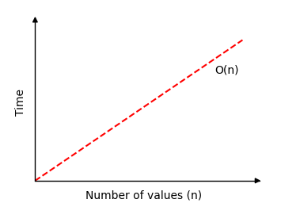

[🏠 Home](../../../README.md) <br/>
[🛠️ DSA Home](../DSA.md)

<hr>

<h1>🔍 Linear Search 🔍</h1>

## Index
- [Index](#index)
- [How it works](#how-it-works)
- [Example Run up](#example-run-up)
- [Time Complexity](#time-complexity)
- [Linear Search Implementation](#linear-search-implementation)
	- [In Java](#in-java)
	- [In C++](#in-c)
	- [In Python](#in-python)

<hr>

👉 [W3schools.com - Linear Search](https://www.w3schools.com/dsa/dsa_algo_linearsearch.php)

<hr>

- Linear Search is a simple search algorithm used to find an element in a list or array. 
- It works by checking each element of the array one by one, starting from the first element, until it finds the target element or reaches the end of the array.

[⬆️ Back to TOP ⬆️](#index)

## How it works

- Start from the first element of the array.
- Compare the current element with the target element.
- If they match, return the index of the element.
- If they don’t match, move to the next element.
- Repeat until the element is found or all elements are checked.
- If the element is not found, return a failure result (like -1).

[⬆️ Back to TOP ⬆️](#index)

## Example Run up

Array: `[4, 2, 7, 1, 9]`, Target: `7`

Start at index 0: `4 != 7`

Index 1: `2 != 7`

Index 2: `7 == 7` → Element found at index `2`.


[⬆️ Back to TOP ⬆️](#index)

## Time Complexity

- **Worst-case**: `O(n)`, where n is the number of elements in the array.
- **Best-case**: `O(1)`, if the element is found at the first position.



[⬆️ Back to TOP ⬆️](#index)

## Linear Search Implementation

To implement the Linear Search algorithm we need:

1. An array with values to search through.
2. A target value to search for.
3. A loop that goes through the array from start to end.
4. An if-statement that compares the current value with the target value, and returns the current index if the target value is found.
5. After the loop, return -1, because at this point we know the target value has not been found.

### In Java

```java
public class Main {
	public static void main(String[] args) {
		int[] arr = { 3, 7, 2, 9, 5 };
		int targetVal = 9;

		int result = linearSearch(arr, targetVal);

		if (result != -1) {
			System.out.println("Value " + targetVal + " found at index " + result);
		} else {
			System.out.println("Value " + targetVal + " not found");
		}
	}

	public static int linearSearch(int[] arr, int targetVal) {
		for (int i = 0; i < arr.length; i++) {
			if (arr[i] == targetVal) {
				return i;
			}
		}
		return -1;
	}
}

// Ouput: Value 9 found at index 3
```

[⬆️ Back to TOP ⬆️](#index)

### In C++

```c++
#include <iostream>
using namespace std;

int linearSearch(int arr[], int size, int targetVal)
{
	for (int i = 0; i < size; i++)
	{
		if (arr[i] == targetVal)
		{
			return i;
		}
	}
	return -1;
}

int main()
{
	int arr[] = {3, 7, 2, 9, 5};
	int targetVal = 9;
	int size = sizeof(arr) / sizeof(arr[0]);

	int result = linearSearch(arr, size, targetVal);

	if (result != -1)
	{
		cout << "Value " << targetVal << " found at index " << result << endl;
	}
	else
	{
		cout << "Value " << targetVal << " not found" << endl;
	}

	return 0;
}

// Output: Value 9 found at index 3
```

[⬆️ Back to TOP ⬆️](#index)

### In Python

```python
def linearSearch(arr, targetVal):
    for i in range(len(arr)):
        if arr[i] == targetVal:
            return i
    return -1

arr = [3, 7, 2, 9, 5]
targetVal = 9

result = linearSearch(arr, targetVal)

if result != -1:
    print("Value",targetVal,"found at index",result)
else:
    print("Value",targetVal,"not found")
# Output: Value 9 found at index 3
```

<hr>

[🏠 Home](../../../README.md) <br/>
[🛠️ DSA Home](../DSA.md)
