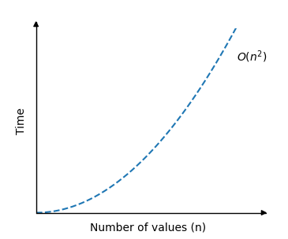

[🏠 Home](../../../README.md) <br/>
[🛠️ DSA Home](../DSA.md)

<hr>

<h1> Bubble Sort </h1>

## Index
- [Index](#index)
- [How it works](#how-it-works)
- [Time Complexity](#time-complexity)
- [Example Run Up](#example-run-up)
- [Bubble Sort Implementation](#bubble-sort-implementation)
  - [In Java](#in-java)
  - [In C++](#in-c)
  - [In Python](#in-python)
- [Improved Bubble Sort](#improved-bubble-sort)
- [How it works (Improved Bubble Sort):](#how-it-works-improved-bubble-sort)
- [Example Run Up](#example-run-up-1)
- [Bubble Sort Implementation (Improved)](#bubble-sort-implementation-improved)
  - [In Java](#in-java-1)
  - [In Python](#in-python-1)


<hr>

👉 [W3schools.com - Bubble Sort](https://www.w3schools.com/dsa/dsa_algo_bubblesort.php)

<hr>

- Bubble Sort is an algorithm that sorts an array from the lowest value to the highest value.
- Bubble Sort is a simple comparison-based sorting algorithm that repeatedly steps through the list, compares adjacent elements, and swaps them if they are in the wrong order.

## How it works

1. Start from the first element and compare it with the next element.
2. If the current element is greater than the next element, swap them.
3. Move to the next pair and repeat the process for the entire array.
4. At the end of each pass, the largest unsorted element "bubbles up" to its correct position.
5. Repeat the process for the remaining unsorted elements until the array is fully sorted.

[⬆️ Back to TOP ⬆️](#index)

## Time Complexity

- **Worst-case**: `O(n²)`, where n is the number of elements (for a fully unsorted array).
- **Best-case**: `O(n)`, when the array is already sorted (with an optimized version that checks for early completion).




[⬆️ Back to TOP ⬆️](#index)

## Example Run Up

Array: `[5, 1, 4, 2, 8]`

- First pass:
  - Compare `5` and `1`, swap → `[1, 5, 4, 2, 8]`
  - Compare `5` and `4`, swap → `[1, 4, 5, 2, 8]`
  - Compare `5` and `2`, swap → `[1, 4, 2, 5, 8]`
  - Compare `5` and `8`, no swap.
- Continue passes until the array is sorted: `[1, 2, 4, 5, 8]`.

[⬆️ Back to TOP ⬆️](#index)

## Bubble Sort Implementation

To implement the Bubble Sort algorithm in a programming language, we need:

1. An array with values to sort.
2. An inner loop that goes through the array and swaps values if the first value is higher than the next value. This loop must loop through one less value each time it runs.
3. An outer loop that controls how many times the inner loop must run. For an array with n values, this outer loop must run n-1 times.

### In Java

```java
public class Main {
    public static void main(String[] args) {
        int[] my_array = {64, 34, 25, 12, 22, 11, 90, 5};
        int n = my_array.length;

        for (int i = 0; i < n-1; i++) {
            for (int j = 0; j < n-i-1; j++) {
                if (my_array[j] > my_array[j+1]) {
                    int temp = my_array[j];
                    my_array[j] = my_array[j+1];
                    my_array[j+1] = temp;
                }
            }
        }

        System.out.print("Sorted array: ");
        for (int i = 0; i < n; i++) {
            System.out.print(my_array[i] + " ");
        }
        System.out.println();
    }
}

// Output: Sorted array: 5 11 12 22 25 34 64 90
```

[⬆️ Back to TOP ⬆️](#index)

### In C++

```c++
#include <iostream>
using namespace std;

int main() {
    int my_array[] = {64, 34, 25, 12, 22, 11, 90, 5};
    int n = sizeof(my_array) / sizeof(my_array[0]);

    // Bubble Sort
    for (int i = 0; i < n-1; i++) {
        for (int j = 0; j < n-i-1; j++) {
            if (my_array[j] > my_array[j+1]) {
                int temp = my_array[j];
                my_array[j] = my_array[j+1];
                my_array[j+1] = temp;
            }
        }
    }

    // Output the sorted array
    cout << "Sorted array: ";
    for (int i = 0; i < n; i++) {
        cout << my_array[i] << " ";
    }
    cout << endl;

    return 0;
}
// Ouptut: Sorted array: [5, 11, 12, 22, 25, 34, 64, 90]
```

[⬆️ Back to TOP ⬆️](#index)

### In Python

```python
my_array = [64, 34, 25, 12, 22, 11, 90, 5]

n = len(my_array)
for i in range(n-1):
    for j in range(n-i-1):
        if my_array[j] > my_array[j+1]:
            my_array[j], my_array[j+1] = my_array[j+1], my_array[j]

print("Sorted array:", my_array)

# Output: Sorted array: [5, 11, 12, 22, 25, 34, 64, 90]
```

[⬆️ Back to TOP ⬆️](#index)

## Improved Bubble Sort

- The improved version of Bubble Sort optimizes the basic algorithm by stopping the process early if no swaps are made during a pass, indicating that the array is already sorted. 
- This prevents unnecessary passes over a sorted list, improving efficiency when the array is nearly sorted.

[⬆️ Back to TOP ⬆️](#index)

## How it works (Improved Bubble Sort):

1. Follow the regular bubble sort process (comparing and swapping adjacent elements if needed).
2. During each pass, keep track of whether any swaps were made.
3. If no swaps occur during a complete pass, the array is already sorted, and the algorithm can terminate early.
4. This reduces the number of unnecessary comparisons in already sorted arrays.

[⬆️ Back to TOP ⬆️](#index)

## Example Run Up

Array: `[1, 2, 3, 4, 5]` (already sorted)

First pass: No swaps are made → The algorithm stops early after the first pass since the array is sorted.

[⬆️ Back to TOP ⬆️](#index)

## Bubble Sort Implementation (Improved)

### In Java

```java
public class Main {
    public static void main(String[] args) {
        int[] my_array = {7, 3, 9, 12, 11};
        int n = my_array.length;

        for (int i = 0; i < n-1; i++) {
            boolean swapped = false;
            for (int j = 0; j < n-i-1; j++) {
                if (my_array[j] > my_array[j+1]) {
                    int temp = my_array[j];
                    my_array[j] = my_array[j+1];
                    my_array[j+1] = temp;
                    swapped = true;
                }
            }
            if (!swapped) {
                break;
            }
        }

        System.out.print("Sorted array: ");
        for (int i = 0; i < n; i++) {
            System.out.print(my_array[i] + " ");
        }
        System.out.println();
    }
}

// Output: Sorted array: 3 7 9 11 12
```

[⬆️ Back to TOP ⬆️](#index)

### In Python

```python
my_array = [7, 3, 9, 12, 11]

n = len(my_array)
for i in range(n-1):
    swapped = False
    for j in range(n-i-1):
        if my_array[j] > my_array[j+1]:
            my_array[j], my_array[j+1] = my_array[j+1], my_array[j]
            swapped = True
    if not swapped:
        break

print("Sorted array:", my_array)

# Output: Sorted array: 3 7 9 11 12
```
<hr>

[🏠 Home](../../../README.md) <br/>
[🛠️ DSA Home](../DSA.md)
