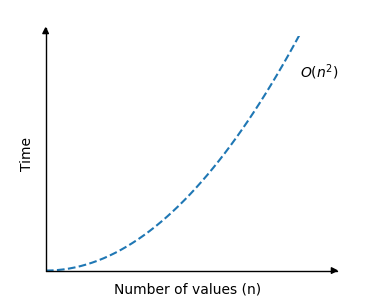

[🏠 Home](../../../README.md) <br/>
[🛠️ DSA Home](../DSA.md)

<hr>

<h1> Selection Sort </h1>

## Index
- [Index](#index)
- [How it works](#how-it-works)
- [Time Complexity](#time-complexity)
- [Example Run Up](#example-run-up)
- [Selection Sort Implementation](#selection-sort-implementation)
  - [In Java](#in-java)
  - [In Python](#in-python)


<hr>

👉 [W3schools.com - Selection Sort](https://www.w3schools.com/dsa/dsa_algo_selectionsort.php)

<hr>

- The Selection Sort algorithm finds the lowest value in an array and moves it to the front of the array.
- Selection Sort is a simple comparison-based sorting algorithm that sorts an array by repeatedly finding the minimum element from the unsorted part and swapping it with the first unsorted element.

[⬆️ Back to TOP ⬆️](#index)

## How it works

1. Start with the first element of the array.
2. Find the minimum element in the unsorted portion of the array.
3. Swap the minimum element with the first unsorted element.
4. Move the boundary of the sorted portion one step to the right.
5. Repeat the process until the entire array is sorted.

[⬆️ Back to TOP ⬆️](#index)

## Time Complexity

- **Worst-case**: `O(n²)`, where n is the number of elements (since it performs n-1 comparisons for each element).
- **Best-case**: `O(n²)` (even if the array is already sorted, it still makes comparisons).



[⬆️ Back to TOP ⬆️](#index)

## Example Run Up

Array: `[29, 10, 14, 37, 13]`

- First pass: Find the minimum (10), swap with the first element → `[10, 29, 14, 37, 13]`
- Second pass: Find the next minimum (13), swap with the second element → `[10, 13, 14, 37, 29]`
- Continue until the array is sorted: `[10, 13, 14, 29, 37]`.

[⬆️ Back to TOP ⬆️](#index)

## Selection Sort Implementation

### In Java

```java
public class Main {
    public static void main(String[] args) {
        int[] my_array = {64, 34, 25, 12, 22, 11, 90, 5};
        int n = my_array.length;

        for (int i = 0; i < n; i++) {
            int min_index = i;
            for (int j = i+1; j < n; j++) {
                if (my_array[j] < my_array[min_index]) {
                    min_index = j;
                }
            }
            int temp = my_array[i];
            my_array[i] = my_array[min_index];
            my_array[min_index] = temp;
        }

        System.out.print("Sorted array: ");
        for (int i = 0; i < n; i++) {
            System.out.print(my_array[i] + " ");
        }
        System.out.println();
    }
}

// Output: Sorted array: 5 11 12 22 25 34 64 90
```

[⬆️ Back to TOP ⬆️](#index)

### In Python

```python
my_array = [64, 34, 25, 12, 22, 11, 90, 5]

n = len(my_array)
for i in range(n):
    min_index = i
    for j in range(i+1, n):
        if my_array[j] < my_array[min_index]:
            min_index = j   
    my_array[i], my_array[min_index] = my_array[min_index], my_array[i]

print("Sorted array:", my_array)

# Ouutput: Sorted array: [5, 11, 12, 22, 25, 34, 64, 90]
```