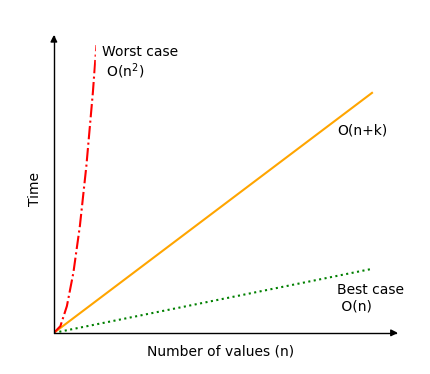

[🏠 Home](../../../README.md) <br/>
[🛠️ DSA Home](../DSA.md)

<hr>

<h1> Counting Sort </h1>

## Index
- [Index](#index)
- [How it works](#how-it-works)
- [Time Complexity](#time-complexity)
- [Example Run Up](#example-run-up)
- [Counting Sort Implementation](#counting-sort-implementation)
  - [In Java](#in-java)
  - [In Python](#in-python)
  - [In C++](#in-c)

<hr>

👉 [W3schools.com - Counting Sort](https://www.w3schools.com/dsa/dsa_algo_countingsort.php)

<hr>

- The Counting Sort algorithm sorts an array by counting the number of times each value occurs.
- Counting Sort is a non-comparison-based sorting algorithm that works efficiently for sorting integers within a known, limited range. 
- It counts the occurrence of each element in the input array and uses this information to place the elements in the correct position in the sorted array.

## How it works

- **Find the range:** Find the range of the input data (minimum and maximum values).
- **Create a count array**: Initialize a count array of size equal to the range of the elements, where each index corresponds to an element in the input array.
- **Count the occurrences**: Traverse the input array and increment the corresponding index in the count array for each element.
- **Modify the count array**: Modify the count array by adding the previous count to each element, making it cumulative, which helps in placing elements in the correct sorted position.
- **Build the output array**: Traverse the input array again, and for each element, place it in the correct position in the output array using the count array.
- **Copy the output array**: Copy the output array back into the original array.

[⬆️ Back to TOP ⬆️](#index)

## Time Complexity

- **Worst-case**: `O(n + k)`, in a worst case scenario, the range of possible different values `k` is very big compared to the number of values `n` and Counting Sort can have time complexity `O(n²)` or even worse.
- **Average-case**: `O(n + k)`
- **Best-case**: `O(n)`, In a best case scenario, the range of possible different values `k` is very small compared to the number of values `n` and Counting Sort has time complexity `O(n)`.

[⬆️ Back to TOP ⬆️](#index)

## Example Run Up

Array: `[1, 4, 1, 2, 7, 5, 2]`

- Step 1: Find the range of elements `(1 to 7)`.
- Step 2: Create a count array: `[0, 0, 0, 0, 0, 0, 0, 0]`.
- Step 3: Count occurrences: `[0, 2, 2, 0, 1, 1, 0, 1]`.
- Step 4: Modify the count array: `[0, 2, 4, 4, 5, 6, 6, 7]`.
- Step 5: Build the output array: `[1, 1, 2, 2, 4, 5, 7]`.



[⬆️ Back to TOP ⬆️](#index)

## Counting Sort Implementation

To implement the Counting Sort algorithm in a programming language, we need:

1. An array with values to sort.
2. A 'countingSort' method that receives an array of integers.
3. An array inside the method to keep count of the values.
4. A loop inside the method that counts and removes values, by incrementing elements in the counting array.
5. A loop inside the method that recreates the array by using the counting array, so that the elements appear in the right order.

**One more thing**: We need to find out what the highest value in the array is, so that the counting array can be created with the correct size. For example, if the highest value is 5, the counting array must be 6 elements in total, to be able count all possible non negative integers 0, 1, 2, 3, 4 and 5.

### In Java

```java
public class Main {
    public static void countingSort(int[] arr) {
        int max_val = arr[0];
        for(int num : arr) {
            if(num > max_val) {
                max_val = num;
            }
        }

        int[] count = new int[max_val + 1];
        
        for(int num : arr) {
            count[num]++;
        }

        int index = 0;
        for(int i = 0; i <= max_val; i++) {
            while(count[i] > 0) {
                arr[index++] = i;
                count[i]--;
            }
        }
    }

    public static void main(String[] args) {
        int[] arr = {4, 2, 2, 6, 3, 3, 1, 6, 5, 2, 3};
        countingSort(arr);

        System.out.print("Sorted array: ");
        for(int num : arr) {
            System.out.print(num + " ");
        }
        System.out.println();
    }
}

// Output: Sorted array: 1 2 2 2 3 3 3 4 5 6 6
```

[⬆️ Back to TOP ⬆️](#index)

### In Python

```python
def countingSort(arr):
    max_val = max(arr)
    count = [0] * (max_val + 1)

    while len(arr) > 0:
        num = arr.pop(0)
        count[num] += 1

    for i in range(len(count)):
        while count[i] > 0:
            arr.append(i)
            count[i] -= 1

    return arr

unsortedArr = [4, 2, 2, 6, 3, 3, 1, 6, 5, 2, 3]
sortedArr = countingSort(unsortedArr)
print("Sorted array:", sortedArr)


# Output: Sorted array: [1, 2, 2, 2, 3, 3, 3, 4, 5, 6, 6]
```

[⬆️ Back to TOP ⬆️](#index)

### In C++

```c++
#include <iostream>
#include <vector>
using namespace std;

void countingSort(vector<int>& arr) {
    int n = arr.size();
    
    // Find the maximum value in the array
    int max_val = arr[0];
    for (int i = 1; i < n; i++) {
        if (arr[i] > max_val) {
            max_val = arr[i];
        }
    }

    // Initialize the count array
    vector<int> count(max_val + 1, 0);

    // Store the count of each element
    for (int i = 0; i < n; i++) {
        count[arr[i]]++;
    }

    // Sort the array using the count array
    int index = 0;
    for (int i = 0; i <= max_val; i++) {
        while (count[i] > 0) {
            arr[index++] = i;
            count[i]--;
        }
    }
}

int main() {
    vector<int> arr = {4, 2, 2, 6, 3, 3, 1, 6, 5, 2, 3};
    
    // Call countingSort function
    countingSort(arr);

    // Print the sorted array
    cout << "Sorted array: ";
    for (int i = 0; i < arr.size(); i++) {
        cout << arr[i] << " ";
    }
    cout << endl;

    return 0;
}

// Output: Sorted array: [1, 2, 2, 2, 3, 3, 3, 4, 5, 6, 6]
```


<hr>

[🏠 Home](../../../README.md) <br/>
[🛠️ DSA Home](../DSA.md)
