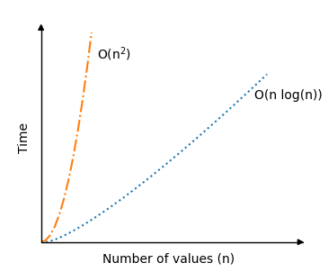

[🏠 Home](../../../README.md) <br/>
[🛠️ DSA Home](../DSA.md)

<hr>

<h1> Quick Sort </h1>

## Index
- [Index](#index)
- [How it works](#how-it-works)
- [Time Complexity](#time-complexity)
- [Example Run Up](#example-run-up)
- [Quick Sort Implementation](#quick-sort-implementation)
  - [In Java](#in-java)
  - [In Python](#in-python)
  - [In C++](#in-c)

<hr>

👉 [W3schools.com - Quick Sort](https://www.w3schools.com/dsa/dsa_algo_quicksort.php)

<hr>

- Quick Sort is a highly efficient, divide-and-conquer sorting algorithm.
- The Quicksort algorithm takes an array of values, chooses one of the values as the 'pivot' element, and moves the other values so that lower values are on the left of the pivot element, and higher values are on the right of it.

## How it works

- Choose a pivot element (can be any element, but often the last or middle element is used).
- Partition the array:
  - Rearrange the elements so that all elements smaller than the pivot come before it and all elements larger than the pivot come after it.
  - The pivot will end up in its correct sorted position.
- Recursively apply the same process to the left and right subarrays (elements before and after the pivot).
- Continue until the base case is reached (subarrays of size 1 or 0).

[⬆️ Back to TOP ⬆️](#index)

## Time Complexity

- **Worst-case**: `O(n²)`, where n is the number of elements (happens when the pivot selection is poor, e.g., if the array is already sorted).
- **Average-case**: `O(n log n)`, making it one of the fastest sorting algorithms for large datasets.
- **Best-case**: `O(n log n)`, when the pivot divides the array into two equal parts.



[⬆️ Back to TOP ⬆️](#index)

## Example Run Up

Array: `[10, 80, 30, 90, 40, 50, 70]`

- Choose `70` as the pivot.
- Partition the array around `70`: `[10, 30, 40, 50, 70, 90, 80]`.
- Recursively apply Quick Sort to the left `[10, 30, 40, 50]` and right `[90, 80]` subarrays.
- Continue until the array is fully sorted: `[10, 30, 40, 50, 70, 80, 90]`.

[⬆️ Back to TOP ⬆️](#index)

## Quick Sort Implementation

To write a 'quickSort' method that splits the array into shorter and shorter sub-arrays we use recursion. This means that the 'quickSort' method must call itself with the new sub-arrays to the left and right of the pivot element.

To implement the Quicksort algorithm in a programming language, we need:

1. An array with values to sort.
2. A `quickSort` method that calls itself (recursion) if the sub-array has a size larger than 1.
3. A `partition` method that receives a sub-array, moves values around, swaps the pivot element into the sub-array and returns the index where the next split in sub-arrays happens.

### In Java

```java
public class Main {
    public static void main(String[] args) {
        int[] myArray = {64, 34, 25, 12, 22, 11, 90, 5};
        quicksort(myArray, 0, myArray.length - 1);

        System.out.print("Sorted array: ");
        for (int value : myArray) {
            System.out.print(value + " ");
        }
    }

    public static void quicksort(int[] array, int low, int high) {
        if (low < high) {
            int pivotIndex = partition(array, low, high);
            quicksort(array, low, pivotIndex - 1);
            quicksort(array, pivotIndex + 1, high);
        }
    }

    public static int partition(int[] array, int low, int high) {
        int pivot = array[high];
        int i = low - 1;

        for (int j = low; j < high; j++) {
            if (array[j] <= pivot) {
                i++;
                int temp = array[i];
                array[i] = array[j];
                array[j] = temp;
            }
        }

        int temp = array[i + 1];
        array[i + 1] = array[high];
        array[high] = temp;
        return i + 1;
    }
}

//
```

[⬆️ Back to TOP ⬆️](#index)

### In Python

```python
def partition(array, low, high):
    pivot = array[high]
    i = low - 1

    for j in range(low, high):
        if array[j] <= pivot:
            i += 1
            array[i], array[j] = array[j], array[i]

    array[i+1], array[high] = array[high], array[i+1]
    return i+1

def quicksort(array, low=0, high=None):
    if high is None:
        high = len(array) - 1

    if low < high:
        pivot_index = partition(array, low, high)
        quicksort(array, low, pivot_index-1)
        quicksort(array, pivot_index+1, high)

my_array = [64, 34, 25, 12, 22, 11, 90, 5]
quicksort(my_array)
print("Sorted array:", my_array)

# Output: Sorted array: [5, 11, 12, 22, 25, 34, 64, 90] 
```

[⬆️ Back to TOP ⬆️](#index)

### In C++

```c++
#include <iostream>
using namespace std;

void quicksort(int array[], int low, int high);
int partition(int array[], int low, int high);

int main() {
    int myArray[] = {64, 34, 25, 12, 22, 11, 90, 5};
    int n = sizeof(myArray) / sizeof(myArray[0]);

    quicksort(myArray, 0, n - 1);

    cout << "Sorted array: ";
    for (int i = 0; i < n; i++) {
        cout << myArray[i] << " ";
    }
    cout << endl;
    return 0;
}

void quicksort(int array[], int low, int high) {
    if (low < high) {
        int pivotIndex = partition(array, low, high);
        quicksort(array, low, pivotIndex - 1);
        quicksort(array, pivotIndex + 1, high);
    }
}

int partition(int array[], int low, int high) {
    int pivot = array[high];
    int i = low - 1;

    for (int j = low; j < high; j++) {
        if (array[j] <= pivot) {
            i++;
            swap(array[i], array[j]);
        }
    }

    swap(array[i + 1], array[high]);
    return i + 1;
}

// Output: Sorted array: [5, 11, 12, 22, 25, 34, 64, 90] 
```


<hr>

[🏠 Home](../../../README.md) <br/>
[🛠️ DSA Home](../DSA.md)