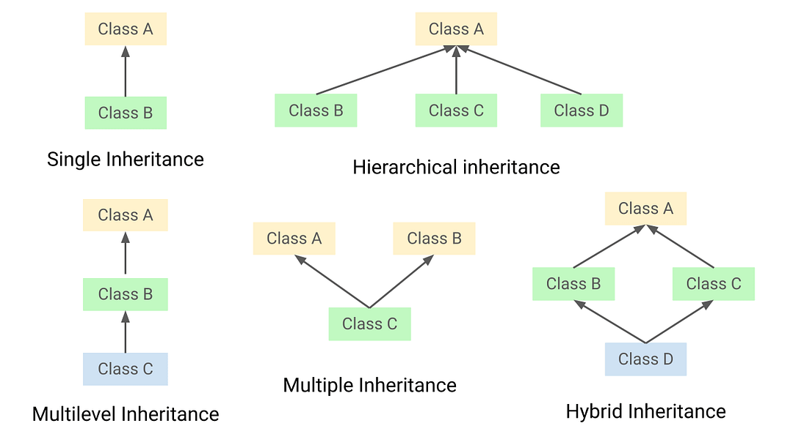

[🏠 Home](../../../README.md) <br/>
[🍵 Java Home](../Java.md)

<hr/>

<h1 style="text-align: center">19. Java Inheritace</h1>

- [Java Inheritance (Subclass and Superclass)](#java-inheritance-subclass-and-superclass)
- [Types of Inheritance](#types-of-inheritance)
- [Inheritance in Java](#inheritance-in-java)
- [The `extend` keyword in Java](#the-extend-keyword-in-java)
- [The `super` keyword in Java](#the-super-keyword-in-java)
- [Different Senarios of using access modiferes in Inheirtance in Java.](#different-senarios-of-using-access-modiferes-in-inheirtance-in-java)
  - [**Example 1:** Classes in the Same File](#example-1-classes-in-the-same-file)
  - [**Example 2:** Classes in the Same Package, Different Files](#example-2-classes-in-the-same-package-different-files)
  - [**Example 3:** Classes in Different Packages](#example-3-classes-in-different-packages)
- [Constructor Chaining](#constructor-chaining)
  - [Problem Without Constructor Chaining](#problem-without-constructor-chaining)
  - [Solution Using Constructor Chaining](#solution-using-constructor-chaining)
  - [Constructor Chaining in Inheritance](#constructor-chaining-in-inheritance)

<hr/>

## Java Inheritance (Subclass and Superclass)

Inheritance is one of the core concepts of Object-Oriented Programming (OOP). It allows a class to inherit properties and behaviors (fields and methods) from another class. The class that inherits is called the subclass (or derived class), and the class being inherited from is called the superclass (or base class).

In Java, it is possible to inherit attributes and methods from one class to another. We group the "inheritance concept" into two categories:

- `subclass` (child) - the class that inherits from another class
- `superclass` (parent) - the class being inherited from
To inherit from a class, use the extends keyword.

**Benefits of Inheritance:**
- Reusability: Code reusability by using the existing class code.
- Extensibility: New features can be added to existing classes without modifying them.
- Polymorphism: It allows for methods to do different things based on the object it is acting upon.

## Types of Inheritance
There are several types of inheritance:

- **Single Inheritance:** A subclass inherits from a single superclass.
- **Multilevel Inheritance:** A subclass inherits from another subclass, creating a chain.
- **Hierarchical Inheritance:** Multiple subclasses inherit from a single superclass.
- **Multiple Inheritance:** A subclass inherits from more than one superclass (Java does not support this directly with classes but can achieve it using interfaces).
- **Hybrid Inheritance:** A combination of two or more types of inheritance.



## Inheritance in Java
Java supports **single**, **multilevel**, and **hierarchical** inheritance but does not support **multiple** inheritance through classes to avoid complexity and ambiguity. **Multiple** inheritance is supported through **interfaces**.

**Example**: Single Inheritance:
```java
class Animal {
  void eat() {
    System.out.println("Eating...");
  }
}

class Dog extends Animal {
  void bark() {
    System.out.println("Barking...");
  }
}

public class Main {
  public static void main(String[] args) {
    Dog d = new Dog();
    d.eat();
    d.bark();
  }
}
// Output:
// Eating...
// Barking...
```

**Example:** Multilevel Inheritance
```java
class Animal {
  void eat() {
    System.out.println("Eating...");
  }
}

class Dog extends Animal {
  void bark() {
    System.out.println("Barking...");
  }
}

class Puppy extends Dog {
  void weep() {
    System.out.println("Weeping...");
  }
}

public class Main {
  public static void main(String[] args) {
    Puppy p = new Puppy();
    p.eat();
    p.bark();
    p.weep();
  }
}

// Output:
// Eating...
// Barking...
// Weeping...
```

**Example:** Hierarchical Inheritance:
```java
class Animal {
  void eat() {
    System.out.println("Eating...");
  }
}

class Dog extends Animal {
  void bark() {
    System.out.println("Barking...");
  }
}

class Cat extends Animal {
  void meow() {
    System.out.println("Meowing...");
  }
}

public class Main {
  public static void main(String[] args) {
    Dog d = new Dog();
    d.eat();
    d.bark();

    Cat c = new Cat();
    c.eat();
    c.meow();
  }
}

// Output:
// Eating...
// Barking...
// Eating...
// Meowing...
```
## The `extend` keyword in Java

In Java, the `extends` keyword is used to create a **subclass** (derived class) that inherits fields and methods from another class, known as the **superclass** (base class).

**Syntax:**
```java
class Subclass extends Superclass {
  // Subclass members
}
```

- **Subclass:** This is the new class you are creating that will inherit from another class.
- **Superclass:** This is the existing class from which the subclass inherits.

**Key Points to Understand:**
- **Inheritance:** By using extends, the subclass inherits all non-private fields and methods from the superclass. This allows code reuse and establishes an "is-a" relationship between the subclass and superclass.

- **Access to Members:**

  - **Public and Protected Members:** Subclasses can access public and protected members (fields and methods) of the superclass directly.
  - **Private Members:** Private members of the superclass are not directly accessible in the subclass.
  - **Default (Package-Private) Members:** Subclasses in the same package can access default members of the superclass, but subclasses in different packages cannot.
  - **Constructor Chaining:** When you create an instance of a subclass, constructors of both the subclass and superclass are called. This allows initialization of both subclass-specific and inherited fields.

- **Overriding Methods:** Subclasses can override methods (provide a new implementation) of the superclass to customize behavior. This is done using the `@Override` annotation. This is the concept of `Polymorphishm: Method Orverrding`

**Example:**
```java
// Superclass
class Animal {
  String name;

  public Animal(String name) {
    this.name = name;
  }

  public void eat() {
    System.out.println(name + " is eating");
  }
}

// Subclass inheriting from Animal
class Dog extends Animal {
  String breed;

  public Dog(String name, String breed) {
    super(name); // Call to superclass constructor
    this.breed = breed;
  }

  @Override
  public void eat() {
    System.out.println(name + " the " + breed + " is eating");
  }

  public void bark() {
    System.out.println(name + " is barking");
  }
}

public class Main {
  public static void main(String[] args) {
    Dog dog = new Dog("Buddy", "Labrador");
    dog.eat(); // Calls overridden eat() method in Dog
    dog.bark();
  }
}


// Output:
// Buddy the Labrador is eating
// Buddy is barking
```


## The `super` keyword in Java

The `super` keyword in Java is used in three contexts:

- To access the superclass's constructor.
- To call the superclass's method.
- To access the superclass's field.

**Example:**
```java
class Animal {
  String color = "white";

  Animal() {
    System.out.println("Animal is created");
  }

  void eat() {
    System.out.println("Animal is eating");
  }
}

class Dog extends Animal {
  String color = "black";

  Dog() {
    super(); // Calling superclass constructor
    System.out.println("Dog is created");
  }

  void displayColor() {
    // Accessing superclass field
    System.out.println(super.color); 
  }

  void eat() {
    super.eat(); // Calling superclass method
    System.out.println("Dog is eating");
  }
}

public class Main {
  public static void main(String[] args) {
    Dog d = new Dog();
    d.displayColor();
    d.eat();
  }
}

// Output:
// ----------
// Animal is created
// Dog is created
// white
// Animal is eating
// Dog is eating
```

## Different Senarios of using access modiferes in Inheirtance in Java.

### **Example 1:** Classes in the Same File
```java
// Example1.java

// Superclass with different access modifiers
class Animal {
  public String publicField = "Public field";
  private String privateField = "Private field";
  protected String protectedField = "Protected field";
  String defaultField = "Default field";

  public void display() {
    System.out.println("Inside Animal class:");
    System.out.println("\tpublicField: " + publicField);
    System.out.println("\tprivateField: Not accessible directly");
    System.out.println("\tprotectedField: " + protectedField);
    System.out.println("\tdefaultField: " + defaultField);
  }
}

// Subclass inheriting from Animal
class Dog extends Animal {
  void showFields() {
    System.out.println("Inside Dog class:");
    System.out.println("\tpublicField: " + publicField);
    // Private fiel not accessible
    // System.out.println("privateField: Not accessible directly"); 
    System.out.println("\tprotectedField: " + protectedField);
    System.out.println("\tdefaultField: " + defaultField);
  }
}

// Main class to demonstrate inheritance and access modifiers
public class Main {
  public static void main(String[] args) {
    Dog dog = new Dog();
    // Accessing public, protected, and default fields via inheritance
    dog.display(); 
    // Accessing inherited fields directly in subclass
    dog.showFields(); 
  }
}
```
**Output:**
```
Inside Animal class:
  publicField: Public field
  privateField: Not accessible directly
  protectedField: Protected field
  defaultField: Default field
Inside Dog class:
  publicField: Public field
  protectedField: Protected field
  defaultField: Default field
```

### **Example 2:** Classes in the Same Package, Different Files

Anmal.java
```java
package mypackage;

// Superclass with different access modifiers
public class Animal {
  public String publicField = "Public field";
  private String privateField = "Private field";
  protected String protectedField = "Protected field";
  String defaultField = "Default field";

  public void display() {
    System.out.println("Inside Animal class:");
    System.out.println("\tpublicField: " + publicField);
    System.out.println("\tprivateField: Not accessible directly");
    System.out.println("\tprotectedField: " + protectedField);
    System.out.println("\tdefaultField: " + defaultField);
  }
}
```

Dog.java
```java
package mypackage;

// Subclass inheriting from Animal
public class Dog extends Animal {
  void showFields() {
    System.out.println("Inside Dog class:");
    System.out.println("\tpublicField: " + publicField);
    // Private field not accessible
    // System.out.println("privateField: Not accessible directly"); 
    System.out.println("\tprotectedField: " + protectedField);
    System.out.println("\tdefaultField: " + defaultField);
  }
}
```

Main.java
```java
package mypackage;

// Main class to demonstrate inheritance and access modifiers
public class Main {
  public static void main(String[] args) {
    Dog dog = new Dog();
    // Accessing public, protected, and default fields via inheritance
    dog.display(); 
    // Accessing inherited fields directly in subclass
    dog.showFields(); 
  }
}
```

For running the above code, the file struture should be as follow:
```
src/
└─ mypackage/
  ├── Animal.java
  ├── Dog.java
  └── Main.java
```

After navigating to `src` directory run the following commands:
Compile Java files:
```
javac mypackage/*.java
```
Run `Main.java` file:
```
java mypackage.Main
```
**Output:**
```
Inside Animal class:
  publicField: Public field
  privateField: Not accessible directly
  protectedField: Protected field
  defaultField: Default field
Inside Dog class:
  publicField: Public field
  protectedField: Protected field
  defaultField: Default field
```

### **Example 3:** Classes in Different Packages

In this example, classes are in different packages, demonstrating how `protected` and ***default*** access modifiers behave across packages.

The file & folder structure should look somthing like this:
```
project-root/
├── src/
│   ├── animals/
│   │   └── Animal.java
│   ├── dogs/
│   │   └── Dog.java
│   └── mainpackage/
│       └── Main.java
```
Animal.java
```java
package example3.animals;

// Superclass with different access modifiers
public class Animal {
  public String publicField = "Public field";
  private String privateField = "Private field";
  protected String protectedField = "Protected field";
  String defaultField = "Default field";

  public void display() {
    System.out.println("Inside Animal class:");
    System.out.println("publicField: " + publicField);
    System.out.println("privateField: Not accessible directly");
    System.out.println("protectedField: " + protectedField);
    System.out.println("defaultField: " + defaultField);
  }
}
```
Dog.java:
```java
package example3.dogs;

import example3.animals.Animal;

// Subclass inheriting from Animal in a different package
public class Dog extends Animal {
  void showFields() {
    System.out.println("Inside Dog class:");
    
    System.out.println("publicField: " + publicField);
    
    // Private field not accessible
    // System.out.println("privateField: Not accessible directly"); 
    
    System.out.println("protectedField: " + protectedField);
    
    // Default field not accessible
    // System.out.println("defaultField: " + defaultField); 
  }
}
```

Main.java
```java
package example3.mainPackage;

import example3.animals.Animal;
import example3.dogs.Dog;

// Main class to demonstrate inheritance and access modifiers
public class Main {
  public static void main(String[] args) {
    Dog dog = new Dog();
    // Accessing public and protected fields via inheritance
    dog.display();

    // Accessing inherited fields directly in subclass
    // It cannot be accessed.
    // dog.showFields();
  }
}
```

Code Compiliation and Execution:
```
javac animals/Animal.java
javac dogs/Dog.java
javac mainpackage/Main.java
java mainpackage.Main
``` 

Output:
```
Inside Animal class:
  publicField: Public field
  privateField: Not accessible directly
  protectedField: Protected field
  defaultField: Default field
```

## Constructor Chaining

Constructor chaining in Java refers to the process of calling one constructor from another constructor in the same class or its superclass. This allows for reusing initialization code and ensuring that all necessary constructors are properly invoked when creating an object. 

### Problem Without Constructor Chaining

Consider a `Person` class with multiple constructors that initialize different combinations of fields. Without constructor chaining, you would have to duplicate initialization code across constructors, leading to redundancy and maintenance issues.

```java
class Person {
  private String name;
  private int age;
  private String address;

  // Constructor 1: Initializes name and age
  public Person(String name, int age) {
    this.name = name;
    this.age = age;
  }

  // Constructor 2: Initializes name, age, and address
  public Person(String name, int age, String address) {
    this.name = name;
    this.age = age;
    this.address = address;
  }

  // Constructor 3: Initializes name only
  public Person(String name) {
    this.name = name;
  }

  public void display() {
    System.out.println("Name: " + name + ", Age: " + age + ", Address: " + address);
  }
}

public class Main {
  public static void main(String[] args) {
    Person p1 = new Person("Alice", 30);
    Person p2 = new Person("Bob", 25, "123 Main St");
    Person p3 = new Person("Charlie");

    p1.display();
    p2.display();
    p3.display();
  }
}
```

**Problems in the Above Code:**
- **Code Duplication:** The initialization of `name` and `age` is repeated in both constructors `public Person(String name, int age)` and `public Person(String name, int age, String address)`.
- **Maintenance Issues:** If you need to change the initialization logic (e.g., add a validation), you must update it in all constructors.


### Solution Using Constructor Chaining

With constructor chaining, you can eliminate code duplication and improve maintainability by centralizing the initialization logic.

```java
class Person {
  private String name;
  private int age;
  private String address;

  // Constructor 1: Initializes name and age
  public Person(String name, int age) {
    this.name = name;
    this.age = age;
  }

  // Constructor 2: Initializes name, age, and address
  public Person(String name, int age, String address) {
    this(name, age); // Chain to the first constructor
    this.address = address;
  }

  // Constructor 3: Initializes name only
  public Person(String name) {
    this(name, 0); // Chain to the first constructor with default age
  }

  public void display() {
    System.out.println("Name: " + name + ", Age: " + age + ", Address: " + address);
  }
}

public class Main {
  public static void main(String[] args) {
    Person p1 = new Person("Alice", 30);
    Person p2 = new Person("Bob", 25, "123 Main St");
    Person p3 = new Person("Charlie");

    p1.display();
    p2.display();
    p3.display();
  }
}
```

**Explanation:**
- The constructor `public Person(String name, int age, String address)` calls `this(name, age)` to reuse the initialization logic of name and age from the first constructor.
- The constructor `public Person(String name)` calls `this(name, 0)` to initialize name and set age to a default value of 0 using the first constructor.

### Constructor Chaining in Inheritance

Constructor chaining in inheritance allows a subclass constructor to call a constructor from its superclass. This ensures that initialization logic from both the subclass and superclass constructors is properly executed when creating an object.

```java
// Superclass
class Animal {
  private String species;

  // Superclass constructor with one parameter
  public Animal(String species) {
    this.species = species;
    System.out.println("Animal constructor with species: " + species);
  }

  // Getter method for species
  public String getSpecies() {
    return species;
  }
}

// Subclass inheriting from Animal
class Dog extends Animal {
  private String name;

  // Subclass constructor with two parameters
  public Dog(String species, String name) {
    super(species); // Call to superclass constructor
    this.name = name;
    System.out.println("Dog constructor with name: " + name);
  }

  // Getter method for name
  public String getName() {
    return name;
  }
}

public class Main {
  public static void main(String[] args) {
    Dog dog = new Dog("Canine", "Buddy");
    System.out.println("Species: " + dog.getSpecies());
    System.out.println("Name: " + dog.getName());
  }
}
```
**Key Points:**
- **Constructor Chaining:** In the `Dog` class, the constructor `public Dog(String species, String name)` uses `super(species)` to call the superclass constructor before initializing its own fields. This ensures proper initialization of both superclass and subclass fields.

- **Inheritance:** The `Dog` class inherits the `getSpecies()` method from Animal and extends it by adding a `getName()` method specific to Dog.

- **Order of Execution:** When creating an instance of `Dog`, first the Animal constructor is called via `super(species)`, then the Dog constructor initializes its name field.

Constructor chaining in inheritance is crucial for ensuring proper initialization of objects across class hierarchies, maintaining clean and efficient code.

<hr/>

[🏠 Home](../../../README.md) <br/>
[🍵 Java Home](../Java.md)
