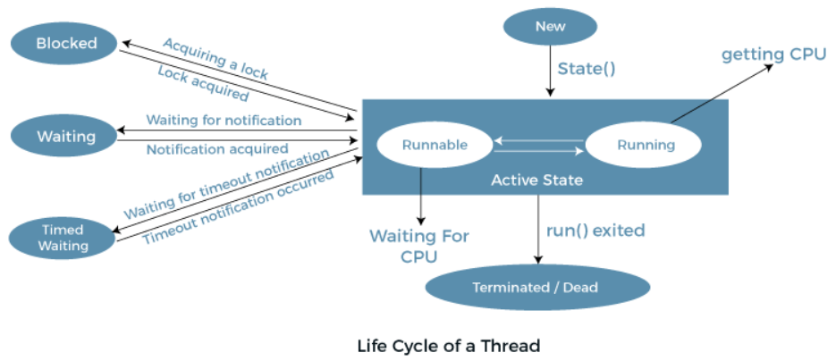

[🏠 Home](../../../README.md) <br/>
[🍵 Java Home](../Java.md)

<hr/>

<h1 style="text-align: center">28. Java Thread</h1>

- [Introduction](#introduction)
- [Thread Life Cycle](#thread-life-cycle)
  - [1. New](#1-new)
  - [2. Active](#2-active)
    - [2.1. Runnable](#21-runnable)
    - [2.2. Running](#22-running)
  - [3. Blocked / Waiting](#3-blocked--waiting)
    - [3.1. Blocked](#31-blocked)
    - [3.2. Waiting](#32-waiting)
    - [3.3. Timed Waiting](#33-timed-waiting)
  - [5. Terminated](#5-terminated)
- [Creating Threads](#creating-threads)
  - [Extending the Thread class](#extending-the-thread-class)
  - [Implementing the Runnable interface](#implementing-the-runnable-interface)
- [Example Demonstrating Working of thread.](#example-demonstrating-working-of-thread)
- [Race Condition](#race-condition)
- [`.join()` Method](#join-method)
- [`synchronize` Keyword](#synchronize-keyword)
- [Built-in methods on `Thread` Class](#built-in-methods-on-thread-class)
- [Real life exaaple of `Runnable` Interface](#real-life-exaaple-of-runnable-interface)


<hr/>

## Introduction

- Threading in Java refers to the ability of a program to execute multiple threads concurrently, allowing tasks to run asynchronously.

## Thread Life Cycle



In Java, a thread always exists in any one of the following states. These states are:

1. New
2. Active
   2. 1. Runnable
   3. 2. Running
3. Blocked / Waiting
4. Timed Waiting
5. Terminated

### 1. New

When a thread is instantiated but not yet started using the `start()` method, it is in the New state. In this state, the thread is considered to exist but has not yet been allocated system resources or initialized by the JVM.

```java
// Thread is in the New state
Thread thread = new Thread(); 
```

### 2. Active

When a thread invokes the start() method, it moves from the new state to the active state. The active state contains two states within it: 
1. `Runnable`
2. `Running`

#### 2.1. Runnable

A thread moves to the Runnable state after invoking its `start()` method. In this state, the thread is ready to run and waiting for the CPU to execute it. The scheduler of the JVM selects threads from the Runnable pool and assigns them to run on the CPU.

```java
// Thread is in the Runnable state
thread.start(); 
```

#### 2.2. Running

Once the scheduler selects a thread from the Runnable pool and starts executing its `run()` method, the thread enters the Running state. In this state, the thread is actively executing its task or code.

```java
// Inside the run() method of the thread
public void run() {
  // Thread is in the Running state while executing this code
  // Perform tasks here
}
```

### 3. Blocked / Waiting

A thread can move into a Blocked or Waiting state for several reasons:

#### 3.1. Blocked

When a thread is waiting for a monitor lock to enter a synchronized block or method, it is in the Blocked state.

#### 3.2. Waiting

A thread enters the Waiting state when it is waiting indefinitely for another thread to perform a particular action. This state occurs under the following conditions:

- When a thread calls `Object.wait()` without a timeout.
- When a thread calls `Thread.join()` without a timeout.
- When a thread calls `Thread.sleep()` without a timeout.
- When a thread calls `LockSupport.park()`.

In the Waiting state, the thread remains in this state until it is explicitly woken up by another thread calling `Object.notify()`, `Object.notifyAll()`, or `Thread.interrupt()`.

#### 3.3. Timed Waiting

A thread enters the Timed Waiting state when it is waiting for a specific amount of time. This state occurs under the following conditions:

- When a thread calls `Thread.sleep(milliseconds)`.
- When a thread calls `Object.wait(milliseconds)`.
- When a thread calls `Thread.join(milliseconds)`.
- When a thread calls `LockSupport.parkNanos()`.
- When a thread calls `LockSupport.parkUntil()`.

In the Timed Waiting state, the thread remains in this state for the specified period of time. Once the time period elapses, the thread automatically transitions back to the Runnable state.

### 5. Terminated

Terminated: A thread enters the Terminated state when its `run()` method completes or it is explicitly terminated. Once in this state, the thread cannot be restarted.

## Creating Threads

In Java, there are two main ways to create threads:

### Extending the Thread class

```java
class MyThread extends Thread {
  public void run() {
    // Thread execution logic
  }
}

public class Main {
  public static void main(String[] args) {
    
    // Creating and starting a thread
    MyThread thread = new MyThread();
    thread.start();
  }
}
```

### Implementing the Runnable interface

```java
class MyRunnable implements Runnable {
  public void run() {
    // Thread execution logic
  }
}

public class Main {
  public static void main(String[] args) {

    // Creating and starting a thread using Runnable
    Thread thread = new Thread(new MyRunnable());
    thread.start();
  }
}
```

## Example Demonstrating Working of thread.

```java
public class Main {

  public static void main(String[] args) {
    // Create threads
    Thread thread1 = new Thread(new NumberPrinter(), "Thread 1");
    Thread thread2 = new Thread(new NumberPrinter(), "Thread 2");

    // Print state after creation
    printThreadState(thread1, "After creation");
    printThreadState(thread2, "After creation");

    // Start threads
    thread1.start();
    thread2.start();

    // Print state after starting
    printThreadState(thread1, "After starting");
    printThreadState(thread2, "After starting");

    // Wait for threads to complete
    try {
      thread1.join();
      thread2.join();
    } catch (InterruptedException e) {
      e.printStackTrace();
    }

    // Print state after completion
    printThreadState(thread1, "After completion");
    printThreadState(thread2, "After completion");
  }

  static class NumberPrinter implements Runnable {
    @Override
    public void run() {
      printThreadState(Thread.currentThread(), "Before number printing");

      // Simulate timed waiting by sleeping
      try {
        for (int i = 1; i <= 10; i++) {
          System.out.println(Thread.currentThread().getName() + " - Number: " + i);
          Thread.sleep(500); // Timed Waiting state for 0.5 seconds
        }
      } catch (InterruptedException e) {
        e.printStackTrace();
      }

      printThreadState(Thread.currentThread(), "After number printing");
    }
  }

  static void printThreadState(Thread thread, String message) {
    // Print the thread state with the provided message
    System.out.println(thread.getName() + " - " + message + ": " + thread.getState());
  }
}
```

**Explanation of the Code:**

1. **Thread Creation and Start:**

Two threads (`thread1` and `thread2`) are created using the `NumberPrinter` class, which implements `Runnable`.
**Initial State:** Threads are in the ***New*** state when created but before calling `start()`.

2. **Thread State after Starting:**

After calling `thread.start()`, threads enter the ***Runnable*** state (they are ready to run but might not be executing yet).

3. **Thread Execution:**

In the `run()` method, each thread prints numbers from 1 to 10.
During the `Thread.sleep(500)` call, the threads enter the ***Timed Waiting*** state for 0.5 seconds.

4. **Thread State after Completion:**

After the `run()` method completes, the threads enter the ***Terminated*** state.

**Output:**
```
Thread 1 - After creation: NEW
Thread 2 - After creation: NEW
Thread 1 - After starting: RUNNABLE
Thread 2 - After starting: RUNNABLE
Thread 1 - Before number printing: RUNNABLE
Thread 2 - Before number printing: RUNNABLE
Thread 1 - Number: 1
Thread 2 - Number: 1
Thread 1 - Number: 2
Thread 2 - Number: 2
Thread 1 - Number: 3
Thread 2 - Number: 3
Thread 1 - Number: 4
Thread 2 - Number: 4
Thread 1 - Number: 5
Thread 2 - Number: 5
Thread 1 - Number: 6
Thread 2 - Number: 6
Thread 1 - Number: 7
Thread 2 - Number: 7
Thread 1 - Number: 8
Thread 2 - Number: 8
Thread 1 - Number: 9
Thread 2 - Number: 9
Thread 1 - Number: 10
Thread 2 - Number: 10
Thread 1 - After number printing: TERMINATED
Thread 2 - After number printing: TERMINATED
```

## Race Condition

A race condition in threading occurs when multiple threads access and manipulate shared data concurrently, and the outcome depends on the timing or interleaving of the thread execution. This can lead to unpredictable and incorrect results because threads can interfere with each other while accessing or modifying shared resources without proper synchronization.

**Example:** Consider a simple example where two threads increment a shared counter. Without proper synchronization, both threads may read and update the counter concurrently, leading to inconsistent or incorrect results.

```java
public class RaceConditionExample {

  public static void main(String[] args) {
    // Create a shared Counter object
    Counter counter = new Counter();

    // Create two threads that increment the counter
    Thread thread1 = new Thread(new IncrementTask(counter), "Thread 1");
    Thread thread2 = new Thread(new IncrementTask(counter), "Thread 2");

    // Start the threads
    thread1.start();
    thread2.start();

    // Wait for threads to complete
    try {
      thread1.join();
      thread2.join();
    } catch (InterruptedException e) {
      e.printStackTrace();
    }

    // Print the final counter value
    System.out.println("Final Counter Value: " + counter.getCount());
  }

  static class Counter {
    private int count = 0;

    // Increment method without synchronization
    public void increment() {
      int temp = count;
      // Simulate delay
      try {
        Thread.sleep(1);
      } catch (InterruptedException e) {
        e.printStackTrace();
      }
      count = temp + 1;
    }

    public int getCount() {
      return count;
    }
  }

  static class IncrementTask implements Runnable {
    private Counter counter;

    public IncrementTask(Counter counter) {
      this.counter = counter;
    }

    @Override
    public void run() {
      for (int i = 0; i < 1000; i++) {
        counter.increment();
      }
    }
  }
}
```

Output 1:
```
1013
```

Output 2:
```
1010
```

**Explanation of the Example:**
1. Shared Counter:

   - The Counter class contains a count variable and an `increment()` method. The `increment()` method reads the current value of `count`, adds 1, and writes it back. There is no synchronization around this method.

2. **Race Condition Scenario:**
   - Two threads (`thread1` and `thread2`) are created and each runs the IncrementTask which calls `counter.increment()` 1000 times.
   - Since the `increment()` method is not synchronized, both threads can read and update the count variable simultaneously.
   - This can lead to race conditions where increments may be lost or overwritten, as the threads might read the same value of count before either has a chance to update it.
3. **Expected Output:**

   - Ideally, with two threads each incrementing 1000 times, the final value of count should be 2000.
   - Due to the race condition, the actual final value may be less than 2000 because some increments may be lost or overwritten.
  
4. **Mitigation:**

To avoid race conditions, you need to ensure that access to shared data is properly synchronized. This can be done by using synchronized methods, synchronized blocks, or concurrent utilities from the **java.util.concurrent** package.

**Corrected Code:**

```java
public class SynchronizedRaceConditionExample {

  public static void main(String[] args) {
    Counter counter = new Counter();

    Thread thread1 = new Thread(new IncrementTask(counter), "Thread 1");
    Thread thread2 = new Thread(new IncrementTask(counter), "Thread 2");

    thread1.start();
    thread2.start();

    try {
      thread1.join();
      thread2.join();
    } catch (InterruptedException e) {
      e.printStackTrace();
    }

    System.out.println("Final Counter Value: " + counter.getCount());
  }

  static class Counter {
    private int count = 0;

    // Synchronized increment method
    public synchronized void increment() {
      int temp = count;
      try {
        Thread.sleep(1);
      } catch (InterruptedException e) {
        e.printStackTrace();
      }
      count = temp + 1;
    }

    public int getCount() {
      return count;
    }
  }

  static class IncrementTask implements Runnable {
    private Counter counter;

    public IncrementTask(Counter counter) {
      this.counter = counter;
    }

    @Override
    public void run() {
      for (int i = 0; i < 1000; i++) {
        counter.increment();
      }
    }
  }
}
```

Output 1:
```
2000
```

Output 2:
```
2000
```

**Explanation of the Corrected Code:**
Synchronized Method: By adding the synchronized keyword to the increment() method, you ensure that only one thread can execute the method at a time. This prevents race conditions by making sure that increments are atomic and consistent.

In Java, both the `.join()` method and the `synchronized` keyword are important tools for managing thread behavior and ensuring thread safety.

## `.join()` Method

The `.join()` method is used to wait for a thread to complete its execution before proceeding further. When you call `join()` on a thread, the calling thread will block until the thread on which `join()` was called has finished executing.

**Use of `.join()`:**

**1. Sequential Execution:**

To ensure that one thread completes before another thread starts or proceeds, you can use `join()`. This is useful when the output of one thread is required as input for another.

**2. Coordination Between Threads:**

When you need to wait for a set of threads to complete before moving on in your main program (e.g., in batch processing or in parallel computation scenarios).

```java
public class JoinExample {

  public static void main(String[] args) {
    Thread thread1 = new Thread(new Task(), "Thread 1");
    Thread thread2 = new Thread(new Task(), "Thread 2");

    thread1.start();
    thread2.start();

    try {
      thread1.join(); // Wait for thread1 to complete
      thread2.join(); // Wait for thread2 to complete
    } catch (InterruptedException e) {
      e.printStackTrace();
    }

    System.out.println("Both threads have finished.");
  }

  static class Task implements Runnable {
    @Override
    public void run() {
      System.out.println(Thread.currentThread().getName() + " is running.");
      for (int i = 1; i <= 5; i++) {
        System.out.println(Thread.currentThread().getName() + " - Number: " + i);
        try {
          Thread.sleep(500); // Simulate work
        } catch (InterruptedException e) {
          e.printStackTrace();
        }
      }
      System.out.println(Thread.currentThread().getName() + " has finished.");
    }
  }
}
```

**Explanation:**

- **Before `join()`:** The main thread starts both `thread1` and `thread2` but does not wait for them to complete.
- **After `join()`:** The main thread calls `join()` on both threads, which makes it wait until both threads finish their execution. Only then does it print "**Both threads have finished.**"

**Output:**

```
Thread 1 is running.
Thread 2 is running.
Thread 2 - Number: 1
Thread 1 - Number: 1
Thread 2 - Number: 2
Thread 1 - Number: 2
Thread 2 - Number: 3
Thread 1 - Number: 3
Thread 1 - Number: 4
Thread 2 - Number: 4
Thread 2 - Number: 5
Thread 1 - Number: 5
Thread 2 has finished.
Thread 1 has finished.
Both threads have finished.
```

## `synchronize` Keyword

The `synchronized` keyword in Java is used to control access to a block of code or an object, ensuring that only one thread can execute a synchronized block at a time. This is crucial for avoiding race conditions when multiple threads are accessing and modifying shared resources.

**Use of synchronized:**

**1. Critical Sections:**
To protect critical sections of code that access shared resources or data, ensuring that these sections are not executed concurrently by multiple threads.

**2. Atomicity:**
To ensure atomicity of operations on shared data, meaning that operations are performed as a single, indivisible unit of work.


```java
public class SynchronizedExample {

  public static void main(String[] args) {
    Counter counter = new Counter();

    Thread thread1 = new Thread(new IncrementTask(counter), "Thread 1");
    Thread thread2 = new Thread(new IncrementTask(counter), "Thread 2");

    thread1.start();
    thread2.start();

    try {
      thread1.join();
      thread2.join();
    } catch (InterruptedException e) {
      e.printStackTrace();
    }

    System.out.println("Final Counter Value: " + counter.getCount());
  }

  static class Counter {
    private int count = 0;

    // Synchronized method to prevent race condition
    public synchronized void increment() {
      int temp = count;
      try {
        Thread.sleep(1); // Simulate delay
      } catch (InterruptedException e) {
        e.printStackTrace();
      }
      count = temp + 1;
    }

    public int getCount() {
      return count;
    }
  }

  static class IncrementTask implements Runnable {
    private Counter counter;

    public IncrementTask(Counter counter) {
      this.counter = counter;
    }

    @Override
    public void run() {
      for (int i = 0; i < 1000; i++) {
        counter.increment();
      }
    }
  }
}
```

**Output:**

```
Final Counter Value: 2000
```

**Explanation:**

- **Critical Section Protection:** The **increment()** method is marked as synchronized, which means that only one thread can execute this method at a time. If multiple threads try to call this method concurrently, they will be blocked until the lock on the Counter object is released.
- **Avoiding Race Condition:** This prevents race conditions where multiple threads could simultaneously modify the count variable, leading to incorrect results.

## Built-in methods on `Thread` Class

[Oracle Java - Thread Class](https://docs.oracle.com/en/java/javase/21/docs/api/java.base/java/lang/Thread.html)

## Real life exaaple of `Runnable` Interface

Imagine you are developing a task management system where tasks need to be executed concurrently. For example, you might have tasks that process data, send notifications, or perform background calculations. Each task should run independently without blocking the main application.

```java
public class TaskManagementSystem {

  public static void main(String[] args) {
    // Create and start threads for different tasks
    Thread dataProcessingThread = new Thread(new DataProcessingTask());
    Thread notificationSendingThread = new Thread(new NotificationSendingTask());
    Thread backgroundCalculationThread = new Thread(new BackgroundCalculationTask());

    dataProcessingThread.start();
    notificationSendingThread.start();
    backgroundCalculationThread.start();

    try {
      // Wait for all tasks to complete
      dataProcessingThread.join();
      notificationSendingThread.join();
      backgroundCalculationThread.join();
    } catch (InterruptedException e) {
      e.printStackTrace();
    }

    System.out.println("All tasks have been completed.");
  }
}

// Task 1: Data Processing
class DataProcessingTask implements Runnable {
  @Override
  public void run() {
    System.out.println("Data processing task started by: " + Thread.currentThread().getName());
    try {
      // Simulate data processing
      Thread.sleep(3000);
    } catch (InterruptedException e) {
      e.printStackTrace();
    }
    System.out.println("Data processing task completed by: " + Thread.currentThread().getName());
  }
}

// Task 2: Notification Sending
class NotificationSendingTask implements Runnable {
  @Override
  public void run() {
    System.out.println("Notification sending task started by: " + Thread.currentThread().getName());
    try {
      // Simulate sending notifications
      Thread.sleep(2000);
    } catch (InterruptedException e) {
      e.printStackTrace();
    }
    System.out.println("Notification sending task completed by: " + Thread.currentThread().getName());
  }
}

// Task 3: Background Calculation
class BackgroundCalculationTask implements Runnable {
  @Override
  public void run() {
    System.out.println("Background calculation task started by: " + Thread.currentThread().getName());
    try {
      // Simulate background calculation
      Thread.sleep(4000);
    } catch (InterruptedException e) {
      e.printStackTrace();
    }
    System.out.println("Background calculation task completed by: " + Thread.currentThread().getName());
  }
}
```

**Output:**

```
Data processing task started by: Thread-0
Notification sending task started by: Thread-1
Background calculation task started by: Thread-2
Notification sending task completed by: Thread-1
Data processing task completed by: Thread-0
Background calculation task completed by: Thread-2
All tasks have been completed.
```

**Explanation:**

1. **Task Classes:**

   - `DataProcessingTask`, `NotificationSendingTask`, and `BackgroundCalculationTask` implement the `Runnable` interface. 
   - Each class represents a specific task that will run concurrently.

2. **Task Execution:**

   - Each task is assigned to a separate thread and started using the `Thread.start()` method.
   - The `run()` method in each class contains the logic for that specific task.

3. **Task Synchronization:**

   - The main thread waits for all tasks to complete using `Thread.join()`.
   - This ensures that the message "All tasks have been completed." is printed only after all tasks have finished executing.

4. **Simulated Work:**

   - Each task simulates work by sleeping for a specific amount of time. 
   - This is to demonstrate concurrent execution and how different tasks can take different amounts of time to complete.

<hr/>
[🏠 Home](../../../README.md) <br/>
[🍵 Java Home](../Java.md)
