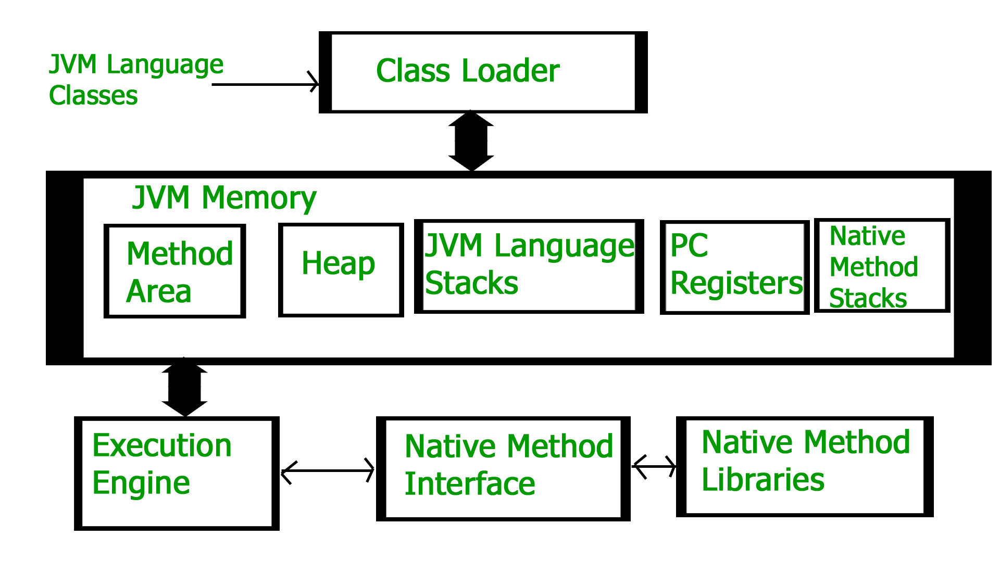

[🏠 Home](../../../README.md) <br/>
[🍵 Java Home](../Java.md)
<hr/>

<h1 style="text-align: center">5. Java JDK & Jshell</h1>

- [JDK](#jdk)
- [JRE](#jre)
- [JVM](#jvm)
	- [What is JVM?](#what-is-jvm)
	- [What JVM does?](#what-jvm-does)
	- [JVM Architecture](#jvm-architecture)
- [Jshell](#jshell)
- [Interview Questions 🎯](#interview-questions-)
	- [1. What is JDK❓](#1-what-is-jdk)
	- [2. What is JRE❓](#2-what-is-jre)
	- [3. What is JVM❓](#3-what-is-jvm)
	- [4. Is Java compiled or interpreted language❓](#4-is-java-compiled-or-interpreted-language)
	- [5. Is Java platform dependent or independent❓](#5-is-java-platform-dependent-or-independent)
	- [6. What does the client system should have in order to run a java application if the client have / doesn't have the `.class` (byte code) files❓](#6-what-does-the-client-system-should-have-in-order-to-run-a-java-application-if-the-client-have--doesnt-have-the-class-byte-code-files)
	- [7. Where are primitive data types stored❓](#7-where-are-primitive-data-types-stored)
	- [8. Does java supports pointer❓](#8-does-java-supports-pointer)
	- [9. Is there a way to use the features of pointers like C/C++ in Java❓](#9-is-there-a-way-to-use-the-features-of-pointers-like-cc-in-java)
	- [10.  Current version of Java and JDK ❓ (August, 2024)](#10--current-version-of-java-and-jdk--august-2024)


## JDK
- JDK is an acronym for Java Development Kit. 
- The Java Development Kit (JDK) is a software development environment which is used to develop Java applications and applets. 
- It physically exists. 
- It contains JRE + development tools.

JDK is an implementation of any one of the below given Java Platforms released by Oracle Corporation:

- Standard Edition Java Platform
- Enterprise Edition Java Platform
- Micro Edition Java Platform

The JDK contains a private Java Virtual Machine (JVM) and a few other resources such as an interpreter/loader (java), a compiler (javac), an archiver (jar), a documentation generator (Javadoc), etc. to complete the development of a Java Application.


<hr/>

## JRE
- JRE is an acronym for Java Runtime Environment. 
- It is also written as Java RTE. 
- The Java Runtime Environment is a set of software tools which are used for developing Java applications. 
- It is used to provide the runtime environment. 
- It is the implementation of JVM. 
- It physically exists. 
- It contains a set of libraries + other files that JVM uses at runtime.

The implementation of JVM is also actively released by other companies besides Sun Micro Systems.

## JVM

### What is JVM?

- JVM (Java Virtual Machine) is an abstract machine.
- It is a specification that provides runtime environment in which java bytecode can be executed.
- JVMs are available for many hardware and software platforms (i.e. JVM is platform dependent).
- Java applications are called WORA (Write Once Run Anywhere). This means a programmer can develop Java code on one system and can expect it to run on any other Java-enabled system without any adjustment. This is all possible because of JVM.
- When we compile a `.java` file, `.class` files(contains byte-code) with the same class names present in `.java` file are generated by the Java compiler. This `.class` file goes into various steps when we run it. These steps together describe the whole JVM.

### What JVM does?

The JVM performs following operation:

- Loads code
- Verifies code
- Executes code
- Provides runtime environment

JVM provides definitions for the:

- Memory area
- Class file format
- Register set
- Garbage-collected heap
- Fatal error reporting etc.

### JVM Architecture



JVM Architecture has following components:
1. Class Loader
2. JVM Memory
   1. Method Area
   2. Heap
   3. Stack
   4. PC Registers
   5. Native Method Stacks
3. Execution Engine
4. Native Interface
5. Native Method Libraries

Details Explanation: 

**1. Class Loader**

- The Class Loader Subsystem is responsible for loading class files into the JVM.
- It is mainly responsible for three activities. 
  - Loading
  - Linking
  - Initialization
- **Loading**: 
  - The Class loader reads the `.class` file, generate the corresponding binary data and save it in the *Method Area*. 
  - For each `.class` file, JVM stores the following information in the *Method Area*:
    - The fully qualified name of the loaded class and its immediate parent class.
    - Whether the `.class` file is related to Class or Interface or Enum. 
    - Modifier, Variables and Method information etc.
- **Linking**:
  - ***Verification:***
    - It ensures the correctness of the `.class` file i.e. it checks whether this file is properly formatted and generated by a valid compiler or not. 
    - If verification fails, we get run-time exception `java.lang.VerifyError`. 
    - This activity is done by the `ByteCodeVerifier` component. 
    - Once this activity is completed then the class file is ready for compilation.
  - ***Preparation:***
    - JVM allocates memory for class static variables and assigns default values.
  - ***Resolution:*** 
    - It is the process of replacing symbolic references from the type with direct references. 
    - It is done by searching into the method area to locate the referenced entity.
- **Initialization:** 
  - Static initializers and static blocks are executed.
  - In this phase, all static variables are assigned with their values defined in the code and static block(if any). 
  - This is executed from top to bottom in a class and from parent to child in the class hierarchy. 
  - In general, there are three class loaders:
    - **Bootstrap Class Loader:** 
      - It is responsible for loading core Java libraries (e.g., `java.lang`, `java.util`) found in the `rt.jar` file.
      - t loads core java API classes present in the `JAVA_HOME/lib` directory. 
      - It is implemented in native languages like C, C++.
    - **Extension class loader:** 
      - It is a child of the bootstrap class loader. 
      - It loads the classes present in the extensions directories `JAVA_HOME/jre/lib/ext`(Extension path) or any other directory specified by the `java.ext.dirs` system property. 
      - It is implemented in java by the `sun.misc.Launcher$ExtClassLoader` class.
    - **System/Application class loader:** 
      - It is a child of the extension class loader. 
      - It is responsible to load classes from the application classpath,including user-defined classes. 
      - It internally uses Environment Variable which mapped to `java.class.path`. 
      - It is also implemented in Java by the `sun.misc.Launcher$AppClassLoader` class.

<hr>
<center>
<b>💡 NOTE 💡</b>
</center>

```
1. JVM follows the Delegation-Hierarchy principle to load classes. 
2. System class loader delegate load request to extension class loader and extension class loader delegate request to the bootstrap class loader. 
3. If a class found in the boot-strap path, the class is loaded otherwise request again transfers to the extension class loader and then to the system class loader. 
4. At last, if the system class loader fails to load class, then we get run-time exception `java.lang.ClassNotFoundException.`
```


<hr>


**2. JVM Memory**

The JVM uses various runtime data areas to store data and manage execution.

- **Method Area:**
  - Stores class structure, including metadata, constant pool, field, and method data.
  - Shared among all threads.
  - In the method area, all class level information like class name, immediate parent class name, methods and variables information etc. are stored, including static variables. 
  - There is only one method area per JVM. 

- **Heap**
  - Stores all object instances and arrays.
  - Also shared among all threads.
  - Garbage collection occurs in this area to reclaim memory.
  - There is only 1 heap memory per JVM.

- **Stack**
  - Each thread has its own JVM stack, which stores frames / activation records.
  - A frame contains local variables, operand stack, and constant pool reference.
  - Memory management is done automatically for the stack as frames are pushed and popped from the stack as methods are invoked and return.
  - After a thread terminates, its run-time stack will be destroyed by JVM. 
  - It is not a shared resource, obviously, as it is related to each thread.

- **PC Registers**
  - Each thread has its own PC register.
  - It holds the address of the JVM instruction currently being executed.

- **Native Method Stacks**
  - This stack is used for native methods (i.e., methods written in a language other than Java, typically C or C++).
  - It holds the state of native methods when they are invoked from Java code.

**3. Execution Engine**

The Execution Engine is responsible for executing the bytecode that has been loaded and is ready to be executed.

- **Interpreter:**
  - The interpreter reads the bytecode line by line, interpreting and executing it.
  - It is simple and portable but relatively slow due to the overhead of interpretation.
  - The disadvantage here is that when one method is called multiple times, every time interpretation is required.
- **Just-In-Time (JIT) Compiler:**
  - It is used to increase the efficiency of an interpreter.
  - To improve performance, the JIT compiler compiles the bytecode into native machine code at runtime.
  - The compiled code is then executed directly by the CPU.
  - The JIT compiler operates on-demand, meaning it compiles methods when they are called, thus optimizing execution over time.
  - It compiles the entire bytecode and changes it to native code so whenever the interpreter sees repeated method calls, JIT provides direct native code for that part so re-interpretation is not required, thus efficiency is improved.
- **Garbage Collector:**
  - The garbage collector automatically reclaims memory by destroying objects that are no longer referenced.
  - JVM uses different garbage collection algorithms, such as Serial, Parallel, CMS (Concurrent Mark-Sweep), and G1 (Garbage First).

**4. Native Interface**

- The JNI acts as a bridge between Java code and native code written in other languages like C or C++. 
- JNI allows Java applications to call native libraries and vice versa. 
- This is particularly useful for tasks that require direct access to hardware or performance optimizations that are not feasible in Java.

**5. Native Method Libraries**

- These are collections of native code libraries (e.g., .dll, .so) that can be invoked via the JNI. 
- These libraries contain platform-specific code that can perform tasks not possible or not efficient in Java alone.

## Jshell

- JShell was introduced in September 2017 with the release of Java 9.
- JShell is an interactive command-line tool introduced in Java 9 as part of the Java Platform. 
- It provides a REPL (Read-Eval-Print Loop) environment for Java, allowing developers to write and evaluate Java code snippets quickly without the need to compile or set up a full project.

- **Purpose:**
  - **Ease of Learning:** 
    - Helps beginners learn Java with instant feedback.
    - JShell was introduced to make learning Java easier for beginners. 
    - With JShell, users can type Java expressions and immediately see the results, similar to how REPL environments work in other languages like Python or JavaScript. 
    - This instant feedback loop helps in understanding language features and syntax more effectively.
  - **Quick Prototyping:** Enables testing small code snippets easily.
  - **Interactive Exploration:** Allows real-time interaction with Java APIs & libraries.
  - **Productivity:** Enhances productivity by reducing the overhead of setting up classes and methods


## Interview Questions 🎯

### 1. What is JDK❓

- The JDK (Java Development Kit) is a software development environment used for building Java applications. 
- It includes:
  - JRE (Java Runtime Environment): To run Java applications.
  - Compiler (javac): To compile Java source code into bytecode.
  - Tools: Such as jshell, javadoc, and jdb for debugging, documentation, and more.
  - Libraries: Core libraries required for Java development.
- In short, the JDK provides everything you need to develop, compile, and run Java programs.

<hr>

### 2. What is JRE❓

<hr>

### 3. What is JVM❓

<hr>

### 4. Is Java compiled or interpreted language❓

- Java is both a compiled and interpreted language. 
- Java source code is first compiled into bytecode by the Java compiler. 
- This bytecode is then interpreted (or just-in-time compiled) by the Java Virtual Machine (JVM) at runtime, allowing it to run on any platform with a compatible JVM.

<hr>

### 5. Is Java platform dependent or independent❓

- Java is platform-independent because of the way it compiles and runs code. 
- Java code is written once and compiled into bytecode by the Java compiler. 
- This bytecode is not specific to any particular operating system or hardware. 
- Instead, it can be executed on any device that has a Java Virtual Machine (JVM) installed. 
- The JVM acts as an intermediary, interpreting the bytecode and converting it into machine code that can run on the underlying platform. This "write once, run anywhere" capability is what makes Java platform-independent.

<hr>

### 6. What does the client system should have in order to run a java application if the client have / doesn't have the `.class` (byte code) files❓

To run a Java application, the client system needs the following:

- If the client has the `.class` (bytecode) files:
  - The client system must have the Java Runtime Environment (JRE) installed. 
  - The JRE includes the Java Virtual Machine (JVM), which is necessary to execute the `.class` files.
- If the client does not have the `.class` (bytecode) files:
  - The client system needs both the Java Development Kit (JDK) and the source code (i.e., `.java` files). 
  - The JDK includes the `javac` compiler to compile the source code into `.class` files and the JRE to run them.
  - Alternatively, the client could receive precompiled `.class` files from the developer and only need the JRE to run them.

<hr>

### 7. Where are primitive data types stored❓

- **Local variables (inside methods):** Stored on the stack.
- **Instance variables (part of objects):** Stored in the heap.
- **Static variables:** Stored in the method area.

<hr>

### 8. Does java supports pointer❓

No, Java does not support pointers directly as C or C++ does. The decision to exclude pointers was made to enhance security, simplicity, and robustness.

Reasons for Not Supporting Pointers in Java:

- **Security:** Pointers can lead to memory access issues like buffer overflows, which can be exploited to corrupt memory or compromise security. By avoiding pointers, Java minimizes the risk of such vulnerabilities.

- **Simplicity:** Pointers add complexity to programming. Java aims to be easier to learn and use by abstracting away lower-level memory management details.

- **Automatic Memory Management:** Java uses an automatic garbage collector to manage memory, eliminating the need for direct memory manipulation through pointers.

<hr>

### 9. Is there a way to use the features of pointers like C/C++ in Java❓

While Java doesn't support pointers as C or C++ does, you can achieve similar functionality using certain features and techniques in Java:

1. **Object References:**
   - In Java, all objects are accessed via references, which are similar to pointers but with more abstraction and safety. 
   - A reference in Java points to an object in the heap, allowing you to pass and manipulate objects without directly using pointers.
    ```java
    class Example {
      int value;
    }

    public class Main {
      public static void main(String[] args) {
        Example obj1 = new Example();
        obj1.value = 10;

				// obj2 is a reference to the same object as obj1
        Example obj2 = obj1; 
        obj2.value = 20;

				// Output will be 20, showing that obj1 and obj2 refer to the same object.
        System.out.println(obj1.value); 
      }
    }
    ```

2. **Arrays:**
   - Java arrays are objects, and you can use them to create similar behaviors to pointer arithmetic. 
   - However, Java strictly bounds checks array accesses, preventing out-of-bounds errors.
		```java
		int[] arr = {1, 2, 3, 4, 5};
		int index = 2;
		// Similar to pointer arithmetic in C/C++
		int value = arr[index]; 
		```

3. **Java NIO (New I/O):**
   - The `java.nio` package provides a `ByteBuffer` class that can be used to manage memory blocks, somewhat akin to pointer manipulation in C. 
   - It allows direct manipulation of memory, which can be used for low-level programming tasks.
		```java
		// Allocates a direct buffer with 10 bytes
		ByteBuffer buffer = ByteBuffer.allocateDirect(10); 
		// Similar to setting value in a memory location
		buffer.put(0, (byte) 10); 
		```

4. **JNI (Java Native Interface):**
   - If you absolutely need to use pointers, you can use the Java Native Interface (JNI) to integrate C or C++ code with Java. 
   - This allows you to use pointers within the native code and then interact with it from Java.
		```java
		public class Main {
			static {
				System.loadLibrary("nativeLib");
			}

			private native void nativeMethod();

			public static void main(String[] args) {
				new Main().nativeMethod();
			}
		}
		```


<hr>

### 10.  Current version of Java and JDK ❓ (August, 2024)

Java 22 & JDK 22

<hr/>

[🏠 Home](../../../README.md) <br/>
[🍵 Java Home](../Java.md)