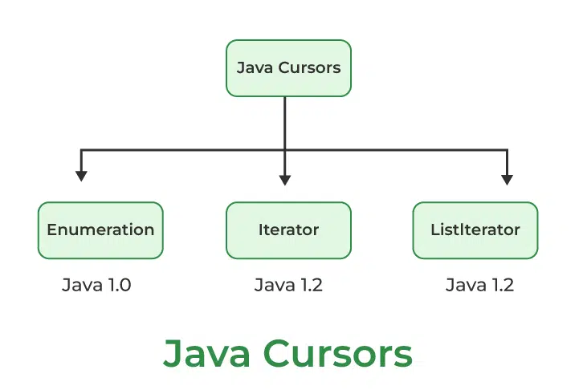

[🏠 Home](../../../README.md) <br/>
[🍵 Java Home](../Java.md)

<hr/>

<h1 style="text-align: center">54. Java 8 New Features</h1>

## Index

- [Index](#index)
- [Cursors in Collections](#cursors-in-collections)
- [Iterator](#iterator)
	- [Methods in Iterator Interface](#methods-in-iterator-interface)
	- [Example of Iterator Interface](#example-of-iterator-interface)
- [ListIterator](#listiterator)
- [Enumeration](#enumeration)
- [Some common frequently used iterate `for`, `forEach` \& `stream API`.](#some-common-frequently-used-iterate-for-foreach--stream-api)

<hr/>

## Cursors in Collections



In Java collections, cursors are not a specific concept. You may refer to iterators, objects used to traverse collections like lists, sets, and maps. Iterators provide methods for iterating over the elements of a collection, allowing you to access and manipulate each element sequentially

There are three different types of iterators in Java.

1. Iterator
2. ListIterator
3. Enumeration

[⬆️ Back to TOP ⬆️](#index)
## Iterator
- It is a universal cursor that can be used with any collection class. 
- It allows you to traverse the collection in a forward direction.
- It supports the read & remove operations of elements during iteration.

### Methods in Iterator Interface

| **Method Name** | **Method Return Type** | **Description**|
| ---------------------------------------------------------|------------------------|---------------------------------------------------------------------------------------------------------------------------------------------------------------------------|
| `hasNext()`| `boolean`| Returns `true` if the iteration has more elements. This method checks whether there is a next element available in the collection to iterate over. |
| `next()` | `E` | Returns the next element in the iteration. If there is no next element, it throws a `NoSuchElementException`. The generic type `E` corresponds to the element type. |
| `remove()`   | `void`                 | Removes the last element returned by the `next()` method. This method can only be called once per call to `next()`, and throws `IllegalStateException` if called before `next()` or after `remove()` has already been called after the last `next()` call. |
| `forEachRemaining (Consumer<? super E> action)` | `void`| Performs the given action for each remaining element until all elements have been processed or an exception is thrown. Introduced in Java 8, this method simplifies iteration by applying the action to each remaining element without needing to manually iterate using `hasNext()` and `next()`. |


### Example of Iterator Interface
```java
import java.util.ArrayList;
import java.util.Iterator;
import java.util.List;

public class IteratorExample {
	public static void main(String[] args) {
		// Create a list of names
		List<String> names = new ArrayList<>();
		names.add("Alice");
		names.add("Bob");
		names.add("Charlie");
		names.add("David");

		// Get an iterator
		Iterator<String> iterator = names.iterator();

		// Example of hasNext() and next()
		System.out.println("Iterating over the list:");
		while (iterator.hasNext()) {
			String name = iterator.next();
			System.out.println(name);

			// Example of remove()
			if (name.equals("Charlie")) {
				// Removes "Charlie" from the list
				iterator.remove(); 
			}
		}

		System.out.println("\nList after removing 'Charlie':");
		System.out.println(names); // Prints the list after removal

		// Example of forEachRemaining()
		System.out.println("\nRemaining elements using forEachRemaining:");
		iterator = names.iterator(); // Resetting the iterator
		iterator.forEachRemaining(System.out::println);
	}
}
```
Output:
```
Iterating over the list:
Alice
Bob
Charlie
David

List after removing 'Charlie':
[Alice, Bob, David]

Remaining elements using forEachRemaining:
Alice
Bob
David
```


[⬆️ Back to TOP ⬆️](#index)
## ListIterator

- This cursor is specific to List implementations (like `ArrayList` and `LinkedList`). 
- It extends the capabilities of the Iterator by allowing bidirectional traversal (both forward and backward).

```java
import java.util.*;

public class CursorDemo {
  public void ListIteratorExample() {
    List<String> names = new ArrayList<>();
    names.add("Galu");
    names.add("Shree");
    names.add("Gugi");
    names.add("Koko");

    System.out.println("name list " + names.size());

    ListIterator<String> listIterator = names.listIterator();
    while (listIterator.hasNext()) {
        System.out.println(listIterator.next());
    }

    System.out.println("************hasPrevious*************");

    while (listIterator.hasPrevious()) {
        System.out.println(listIterator.previous());
    }
  }

  public static void main(String[] args) {
    CursorDemo cursorDemo = new CursorDemo();
    cursorDemo.ListIteratorExample();
  }
}
```

[⬆️ Back to TOP ⬆️](#index)
## Enumeration

- Although not a part of the Java Collections Framework, Enumeration is an older cursor interface present in legacy classes like Vector and Hashtable. 
- It allows forward traversal of elements.
- Limitations:
  - It is applicable only for legacy classes and it is not a universal cursor.
  - While iterating the elements by using enumeration we can perform only read operation and we can't perform any modify/removal operations.

To overcome these problems we should go for `Iterator` interface.

```java
package com.java8features.cursor;

import java.util.*;

public class CursorDemo {

  public void EnumerationExample() {
    Vector<String> names = new Vector<>();

    names.add("Galu");
    names.add("Shree");
    names.add("Gugi");
    names.add("Koko");

    System.out.println("name list " + names.size());

    Enumeration<String> elements = names.elements();

    while (elements.hasMoreElements()) {
      System.out.println(elements.nextElement());
    }
  }

  public static void main(String[] args) {
    CursorDemo cursorDemo = new CursorDemo();
    cursorDemo.EnumerationExample();
  }
}
```

## Some common frequently used iterate `for`, `forEach` & `stream API`.

```java
import java.util.*;
import java.util.stream.Collectors;

public class Main {

  public static void ForEachExample() {
    List<String> names = new ArrayList<>();
    names.add("Zak Crawley");
    names.add("Ollie Pope");
    names.add("Foakes ");
    names.add("Hartleyb ");
    names.add("Mark Wood");
    names.add("Jack Leach");

    System.out.println("size of the list " + names.size());

    System.out.println("***** for *****");

    for (String name : names) {
      System.out.println(name);
    }

    System.out.println("***** foreach stream api java 8*****");
    // foreach stream api java 8
    names.forEach(System.out::println);

    System.out.println("*****");

    ArrayList<String> arrayList = new ArrayList<>();
    arrayList.add("Crawley");
    arrayList.add("Leach");
    arrayList.add("Hartley");
    arrayList.add("Wood");
    arrayList.add("Foakes");

    List<String> list = arrayList.stream()
                                 .filter(x -> x.endsWith("y"))
                                 .map(String::toUpperCase)
                                 .collect(Collectors.toList());

    System.out.println("List: " + list);
  }

  public static void main(String[] args) {
    ForEachExample();
  }
}
```

Output:
```
size of the list 6

***** for *****
Zak Crawley
Ollie Pope
Foakes 
Hartleyb 
Mark Wood
Jack Leach

***** foreach stream api java 8*****
Zak Crawley
Ollie Pope
Foakes 
Hartleyb 
Mark Wood
Jack Leach
*****
List: [CRAWLEY, HARTLEY]
```

<hr/>

[🏠 Home](../../../README.md) <br/>
[🍵 Java Home](../Java.md)