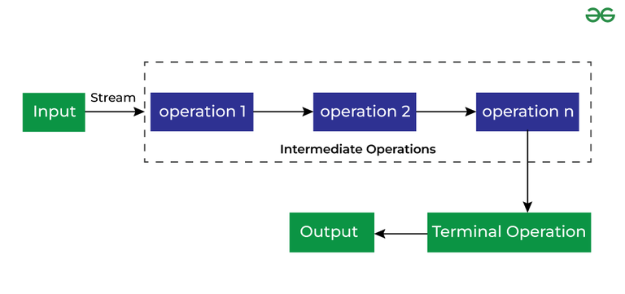

[🏠 Home](../../../README.md) <br/>
[🍵 Java Home](../Java.md)

<hr/>

<h1 style="text-align: center">54. Java 8 New Features</h1>

[Continue from here](https://chatgpt.com/share/c0b8510d-83b6-43f0-a673-c0bae2557194)

## Index
- [Index](#index)
- [Introduction to Stream API](#introduction-to-stream-api)
- [Benefits of Using Stream API](#benefits-of-using-stream-api)
- [Operations in Stream](#operations-in-stream)
- [Intermediate Operations](#intermediate-operations)
	- [1. `filter(Predicate<T> predicate)`](#1-filterpredicatet-predicate)
	- [2. `map(Function<T, R> mapper)`](#2-mapfunctiont-r-mapper)
	- [3. `flatMap(Function<T, Stream<R>> mapper)`](#3-flatmapfunctiont-streamr-mapper)
	- [4. `distinct()`](#4-distinct)
	- [5. `sorted()`](#5-sorted)
	- [6. `sorted(Comparator<T> comparator)`](#6-sortedcomparatort-comparator)
	- [7. `peek(Consumer<T> action)`](#7-peekconsumert-action)
	- [8. `limit(long maxSize)`](#8-limitlong-maxsize)
	- [9. `skip(long n)`](#9-skiplong-n)
- [Terminal Operations](#terminal-operations)
	- [1. `forEach(Consumer<T> action)`](#1-foreachconsumert-action)
	- [2. `forEachOrdered(Consumer<T> action)`](#2-foreachorderedconsumert-action)
	- [3. `toArray()`](#3-toarray)
	- [4. `toArray(IntFunction<A[]> generator)`](#4-toarrayintfunctiona-generator)
	- [5. `reduce(BinaryOperator<T> accumulator)`](#5-reducebinaryoperatort-accumulator)
	- [6. `reduce(T identity, BinaryOperator<T> accumulator)`](#6-reducet-identity-binaryoperatort-accumulator)
	- [7. `collect(Collector<T, A, R> collector)`](#7-collectcollectort-a-r-collector)
	- [8. `collect(Supplier<R> supplier, BiConsumer<R, T> accumulator, BiConsumer<R, R> combiner)`](#8-collectsupplierr-supplier-biconsumerr-t-accumulator-biconsumerr-r-combiner)
	- [9. `min(Comparator<T> comparator)`](#9-mincomparatort-comparator)
	- [10. `max(Comparator<T> comparator)`](#10-maxcomparatort-comparator)
	- [11. `count()`](#11-count)
	- [12. `anyMatch(Predicate<T> predicate)`](#12-anymatchpredicatet-predicate)
	- [13. `allMatch(Predicate<T> predicate)`](#13-allmatchpredicatet-predicate)
	- [14. `noneMatch(Predicate<T> predicate)`](#14-nonematchpredicatet-predicate)
	- [15. `findFirst()`](#15-findfirst)
	- [16. `findAny()`](#16-findany)
- [Short-Circuiting Operations](#short-circuiting-operations)
	- [1. `limit(long maxSize)`](#1-limitlong-maxsize)
	- [2. `skip(long n)`](#2-skiplong-n)
- [Static Methods (Stream class)](#static-methods-stream-class)
	- [1. `Stream.of(T... values)`](#1-streamoft-values)
	- [2. `Stream.empty()`](#2-streamempty)
	- [3. `Stream.generate(Supplier<T> s)`](#3-streamgeneratesuppliert-s)
	- [4. `Stream.iterate(T seed, UnaryOperator<T> f)`](#4-streamiteratet-seed-unaryoperatort-f)
	- [5. `Stream.concat(Stream<? extends T> a, Stream<? extends T> b)`](#5-streamconcatstream-extends-t-a-stream-extends-t-b)
- [Characteristaics of Intermediate Operations](#characteristaics-of-intermediate-operations)
- [Characteristaics of  Terminal Operations](#characteristaics-of--terminal-operations)

<hr/>

## Introduction to Stream API

The uses of Stream in Java are mentioned below:

- Stream API is a way to express and process collections of objects.
- Enable us to perform operations like filtering, mapping, reducing, and sorting.

## Benefits of Using Stream API

- **Concise Code**: Stream API allows writing cleaner and more readable code using functional-style operations.
- **Parallel Processing**: Easily process data in parallel for improved performance on multi-core systems.
- **Lazy Evaluation**: Optimizes performance by delaying computation until it's needed, especially with large or infinite streams.
- **Chainable Operations**: Enables method chaining, allowing complex data transformations with minimal code.
- **Immutable Operations**: Operations do not modify the source data, reducing side effects and potential bugs.
- **Improved Readability**: Functional operations like `map`, `filter`, and `reduce` express intent clearly.


## Operations in Stream

There are two types of Operations in Streams:

- Intermediate Operations
- Terminate Operations




## Intermediate Operations

### 1. `filter(Predicate<T> predicate)`

- Returns a stream consisting of the elements of this stream that match the given predicate.

```java
List<String> names = Arrays.asList("Alice", "Bob", "Charlie");

List<String> filteredNames = names.stream().filter(name -> name.startsWith("A")).collect(Collectors.toList());

System.out.println(filteredNames); 
// Output: [Alice]
```

### 2. `map(Function<T, R> mapper)`

- Returns a stream consisting of the results of applying the given function to the elements of this stream.

```java
List<String> names = Arrays.asList("Alice", "Bob", "Charlie");

List<Integer> nameLengths = names.stream().map(String::length).collect(Collectors.toList());

System.out.println(nameLengths); 
// Output: [5, 3, 7]
```

### 3. `flatMap(Function<T, Stream<R>> mapper)`

- Returns a stream consisting of the results of replacing each element of this stream with the contents of a mapped stream produced by applying the provided mapping function to each element.

```java
List<List<String>> lists = Arrays.asList(
  Arrays.asList("a", "b"),
  Arrays.asList("c", "d")
);

List<String> flatList = lists.stream().flatMap(List::stream).collect(Collectors.toList());

System.out.println(flatList); 
// Output: [a, b, c, d]
```

### 4. `distinct()`

- Returns a stream consisting of the distinct elements (according to `Object.equals(Object)`) of this stream.

```java
List<Integer> numbers = Arrays.asList(1, 2, 2, 3, 4, 4, 5);

List<Integer> distinctNumbers = numbers.stream().distinct().collect(Collectors.toList());

System.out.println(distinctNumbers); 
// Output: [1, 2, 3, 4, 5]
```

### 5. `sorted()`

- Returns a stream consisting of the elements of this stream, sorted according to natural order.

```java
List<Integer> numbers = Arrays.asList(5, 3, 8, 1, 2);

List<Integer> sortedNumbers = numbers.stream().sorted().collect(Collectors.toList());

System.out.println(sortedNumbers); 
// Output: [1, 2, 3, 5, 8]
```

### 6. `sorted(Comparator<T> comparator)`

- Returns a stream consisting of the elements of this stream, sorted according to the provided comparator.

```java
List<String> names = Arrays.asList("Alice", "Bob", "Charlie");

List<String> sortedNames = names.stream().sorted(Comparator.reverseOrder()).collect(Collectors.toList());

System.out.println(sortedNames); 
// Output: [Charlie, Bob, Alice]
```

### 7. `peek(Consumer<T> action)`

- Returns a stream consisting of the elements of this stream, additionally performing the provided action on each element as elements are consumed from the resulting stream.

```java
List<String> names = Arrays.asList("Alice", "Bob", "Charlie");
List<String> result = names.stream().peek(name -> System.out.println("Processing: " + name)).map(String::toUpperCase).collect(Collectors.toList());

// Output: 
// Processing: Alice
// Processing: Bob
// Processing: Charlie
// [ALICE, BOB, CHARLIE]
```

### 8. `limit(long maxSize)`

- Returns a stream consisting of the elements of this stream, truncated to be no longer than the specified size.

```java
List<Integer> numbers = Arrays.asList(1, 2, 3, 4, 5, 6, 7);

List<Integer> limitedNumbers = numbers.stream().limit(3).collect(Collectors.toList());

System.out.println(limitedNumbers); 
// Output: [1, 2, 3]
```

### 9. `skip(long n)`

- Returns a stream consisting of the remaining elements of this stream after discarding the first `n` elements.

```java
List<Integer> numbers = Arrays.asList(1, 2, 3, 4, 5, 6, 7);

List<Integer> skippedNumbers = numbers.stream().skip(4).collect(Collectors.toList());

System.out.println(skippedNumbers); 

// Output: [5, 6, 7]
```

## Terminal Operations

### 1. `forEach(Consumer<T> action)`

- Performs an action for each element of this stream.

```java
List<String> names = Arrays.asList("Alice", "Bob", "Charlie");
names.stream().forEach(name -> System.out.println(name));
// Output: Alice
//         Bob
//         Charlie
```

### 2. `forEachOrdered(Consumer<T> action)`

- Performs an action for each element of this stream, in the encounter order of the stream if it has a defined encounter order.

```java

```

### 3. `toArray()`

- Returns an array containing the elements of this stream.

```java
List<String> names = Arrays.asList("Alice", "Bob", "Charlie");
String[] namesArray = names.stream().toArray(String[]::new);
System.out.println(Arrays.toString(namesArray)); 
// Output: [Alice, Bob, Charlie]
```

### 4. `toArray(IntFunction<A[]> generator)`

- Returns an array containing the elements of this stream, using the provided generator function to allocate the returned array.

```java

```

### 5. `reduce(BinaryOperator<T> accumulator)`

- Performs a reduction on the elements of this stream, using an associative accumulation function, and returns an `Optional` describing the reduced value.

```java
List<Integer> numbers = Arrays.asList(1, 2, 3, 4, 5);
Optional<Integer> sum = numbers.stream()
                                .reduce((a, b) -> a + b);
System.out.println(sum.get()); 
// Output: 15
```

### 6. `reduce(T identity, BinaryOperator<T> accumulator)`

- Performs a reduction on the elements of this stream, using the provided identity value and an associative accumulation function, and returns the reduced value.

```java
List<Integer> numbers = Arrays.asList(1, 2, 3, 4, 5);
int sum = numbers.stream()
                  .reduce(0, (a, b) -> a + b);
System.out.println(sum); 
// Output: 15
```

### 7. `collect(Collector<T, A, R> collector)`

- Performs a mutable reduction operation on the elements of this stream using a `Collector`.

```java
List<String> names = Arrays.asList("Alice", "Bob", "Charlie");
String result = names.stream()
                      .collect(Collectors.joining(", "));
System.out.println(result); 
// Output: Alice, Bob, Charlie
```

### 8. `collect(Supplier<R> supplier, BiConsumer<R, T> accumulator, BiConsumer<R, R> combiner)`

- Performs a mutable reduction operation on the elements of this stream.

```java

```

### 9. `min(Comparator<T> comparator)`

- Returns the minimum element of this stream according to the provided comparator, wrapped in an `Optional`.

```java
List<Integer> numbers = Arrays.asList(5, 2, 8, 1, 3);
Optional<Integer> min = numbers.stream()
                                .min(Comparator.naturalOrder());
System.out.println(min.get()); 
// Output: 1
```

### 10. `max(Comparator<T> comparator)`

- Returns the maximum element of this stream according to the provided comparator, wrapped in an `Optional`.

```java
List<Integer> numbers = Arrays.asList(5, 2, 8, 1, 3);
Optional<Integer> max = numbers.stream()
                                .max(Comparator.naturalOrder());
System.out.println(max.get()); 
// Output: 8
```

### 11. `count()`

- Returns the count of elements in this stream.

```java
List<String> names = Arrays.asList("Alice", "Bob", "Charlie");
long count = names.stream().count();
System.out.println(count); 
// Output: 3
```

### 12. `anyMatch(Predicate<T> predicate)`

- Returns `true` if any elements of this stream match the provided predicate.

```java
List<Integer> numbers = Arrays.asList(1, 2, 3, 4, 5);
boolean hasEven = numbers.stream().anyMatch(n -> n % 2 == 0);
System.out.println(hasEven); 
// Output: true
```

### 13. `allMatch(Predicate<T> predicate)`

- Returns `true` if all elements of this stream match the provided predicate.

```java
List<Integer> numbers = Arrays.asList(2, 4, 6, 8);
boolean allEven = numbers.stream().allMatch(n -> n % 2 == 0);
System.out.println(allEven); 
// Output: true
```

### 14. `noneMatch(Predicate<T> predicate)`

- Returns `true` if no elements of this stream match the provided predicate.

```java
List<Integer> numbers = Arrays.asList(1, 3, 5);
boolean noneEven = numbers.stream().noneMatch(n -> n % 2 == 0);
System.out.println(noneEven); 
// Output: true
```

### 15. `findFirst()`

- Returns an `Optional` describing the first element of this stream, or an empty `Optional` if the stream is empty.

```java
List<String> names = Arrays.asList("Alice", "Bob", "Charlie");
Optional<String> first = names.stream().findFirst();
System.out.println(first.get()); 
// Output: Alice
```

### 16. `findAny()`

- Returns an `Optional` describing some element of the stream, or an empty `Optional` if the stream is empty.

```java
List<String> names = Arrays.asList("Alice", "Bob", "Charlie");
Optional<String> any = names.stream().findAny();
System.out.println(any.get()); 
// Output: Alice (or any element, as order is not guaranteed)
```

## Short-Circuiting Operations

### 1. `limit(long maxSize)`

- Limits the stream to a maximum number of elements.

```java
List<Integer> numbers = Arrays.asList(1, 2, 3, 4, 5, 6, 7);
List<Integer> limitedNumbers = numbers.stream()
                                      .limit(4)
                                      .collect(Collectors.toList());
System.out.println(limitedNumbers); 
// Output: [1, 2, 3, 4]
```

### 2. `skip(long n)`

- Skips the first `n` elements of the stream.

```java
List<Integer> numbers = Arrays.asList(1, 2, 3, 4, 5, 6, 7);
List<Integer> skippedNumbers = numbers.stream()
                                      .skip(3)
                                      .collect(Collectors.toList());
System.out.println(skippedNumbers); 
// Output: [4, 5, 6, 7]
```

## Static Methods (Stream class)

### 1. `Stream.of(T... values)`

- Creates a stream from the provided values.

### 2. `Stream.empty()`

- Returns an empty sequential stream.

### 3. `Stream.generate(Supplier<T> s)`

- Returns an infinite sequential unordered stream where each element is generated by the provided `Supplier`.

### 4. `Stream.iterate(T seed, UnaryOperator<T> f)`

- Returns an infinite sequential ordered stream produced by iterative application of a function.

### 5. `Stream.concat(Stream<? extends T> a, Stream<? extends T> b)`

- Concatenates two streams into one.

## Characteristaics of Intermediate Operations
- **Lazy Evaluation**: Executed only when a terminal operation is invoked.
- **Return Stream**: Always return a stream, allowing method chaining.
- **Non-Terminal**: Prepare the stream for further processing but don't produce a final result.
- **Work with Infinite Streams**: Can operate on infinite streams without processing everything upfront.
- **Stateless or Stateful**: Process elements independently or rely on previous elements.

## Characteristaics of  Terminal Operations
- **Eager Evaluation**: Trigger the execution of the entire stream pipeline.
- **End of Stream**: Consume the stream, making it unusable afterward.
- **Produces a Result**: Provide a final outcome, like a value, collection, or side effect.
- **Non-Chaining**: Do not return a stream, ending the chain of operations.
- **Short-Circuiting**: Some can stop early if conditions are met, optimizing performance.


<hr/>

[🏠 Home](../../../README.md) <br/>
[🍵 Java Home](../Java.md)