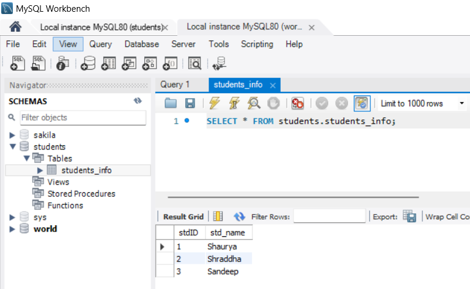

[🏠 Home](../../../README.md) <br/>
[🍵 JDCB Home](../JDBC.md)

<hr/>

<h1 style="text-align: center">2. JDBC DB Connectivy Steps</h1>

## Index
- [Index](#index)
- [1. Import Packages](#1-import-packages)
- [2. Load \& Register Drivers](#2-load--register-drivers)
- [3. Establish Connection](#3-establish-connection)
- [4. Create Statements](#4-create-statements)
  - [1. Statement](#1-statement)
  - [2. PreparedStatement](#2-preparedstatement)
  - [3. CallableStatement](#3-callablestatement)
- [5. Execute Query](#5-execute-query)
- [6. Process Result](#6-process-result)
- [7. Close Connection](#7-close-connection)
- [Complete Example](#complete-example)

<hr/>

There are 7 steps to connect any java application with the database using JDBC:

1. Import Packages
2. Load & Register Drivers
3. Establish Connection
4. Create Statements
5. Execute Query
6. Process Result
7. Close Connection

## 1. Import Packages

- Begin by importing the necessary JDBC classes. 
- These imports are essential for managing connections, executing SQL queries, and handling the results. 
- All neccessary classes and interfaces are available in the `java.sql` package.

importing `java.sql`:

```java
// Importing all packages
import java.sql.*

// OR

// Importing all neccessary packages import explicitly
import java.sql.Connection;
import java.sql.DriverManager;
import java.sql.SQLException;
import java.sql.Statement;
import java.sql.PreparedStatement;
import java.sql.CallableStatement;
import java.sql.ResultSet;
```

[⬆️ Back to TOP ⬆️](#index)

## 2. Load & Register Drivers

Before interacting with the database, you need to load and register the JDBC driver, which enables the Java application to communicate with the specific database.

- **Load the Driver:**
  - **Driver Installation:** If you’re using an IDE like IntelliJ IDEA, Eclipse, or NetBeans, you usually don’t need to manually download the JDBC driver. These IDEs allow you to add the driver as a dependency through Maven, Gradle, or by manually including the JAR file, and the IDE will automatically handle the setup.

  - **Automatic Driver Loading:** Starting with JDBC 4.0, drivers are automatically loaded when added to your project, so you might not need to explicitly call `Class.forName()`.

- **Register the Driver:** Typically, you register the driver using `Class.forName("driver-class-name")`. 

  For example, for MySQL, you would use:

  ```java
  // Example for MySQL
  Class.forName("com.mysql.jdbc.Driver");  
  ```


**NOTE:**
Before **JDBC 4.0** (introduced with **Java 6**), `Class.forName("com.mysql.cj.jdbc.Driver")` was often explicitly used to load a JDBC driver. 

From **JDBC 4.0** onward, the `DriverManager` can automatically load the JDBC driver if the driver JAR file is included in the classpath, making the explicit call to `Class.forName()` unnecessary in most cases. 

[⬆️ Back to TOP ⬆️](#index)

## 3. Establish Connection

- To connect to the database, use `DriverManager.getConnection()`. 
- This requires the database URL, along with your username and password.

**Example:**

```java
String url = "jdbc:mysql://localhost:3306/mydatabase";
String username = "username";
String password = "password";
Connection connection = DriverManager.getConnection(url, username, password);
```

[⬆️ Back to TOP ⬆️](#index)

## 4. Create Statements

After establishing the connection, you can create different types of statements to execute SQL queries. 

In JDBC, there are three main types of statements:

### 1. Statement

- This is the simplest type of statement, used for executing static SQL queries that don’t require any parameters. 
- It’s ideal for executing `SELECT`, `INSERT`, `UPDATE`, or `DELETE` statements that don't change.

```java
Statement statement = connection.createStatement();
```

### 2. PreparedStatement

- This is a more powerful version of Statement, used for executing parameterized queries. 
- It is precompiled and allows you to insert parameters at runtime, making it more secure (prevents SQL injection) and efficient for executing the same query multiple times with different parameters.

```java
String sqlQuery = "SELECT * FROM mytable WHERE column1 = ?";
PreparedStatement preparedStatement = connection.prepareStatement(sqlQuery);
preparedStatement.setString(1, "value1");
```

### 3. CallableStatement

- This type of statement is used to execute stored procedures in the database. 
- Stored procedures are precompiled SQL or PL/SQL statements stored in the database itself, and CallableStatement allows you to call them and pass parameters as needed.

```java
// Assume we have a stored procedure 'getEmployeeById' in the database
// Example creation of a procedure in MySQL:
// CREATE PROCEDURE getEmployeeById(IN emp_id INT)
// BEGIN
//    SELECT * FROM employees WHERE id = emp_id;
// END

CallableStatement callableStatement = connection.prepareCall("{call getEmployeeById(?)}");
callableStatement.setInt(1, 1); // Assuming employee ID 1
```

[⬆️ Back to TOP ⬆️](#index)

## 5. Execute Query

- Depending on the type of statement you created, you execute the SQL query or procedure. 
- For `Statement` and `PreparedStatement`, use `executeQuery()` for `SELECT` statements, or `executeUpdate()` for `INSERT`, `UPDATE`, `DELETE`, etc. 
- For `CallableStatement`, you may also use `execute()` if the procedure returns multiple results.

```java
ResultSet resultSet = statement.executeQuery("SELECT * FROM mytable");
```

[⬆️ Back to TOP ⬆️](#index)

## 6. Process Result

- Once the query is executed, the results are stored in a `ResultSet` object. 
- You can loop through this `ResultSet` to access the data retrieved from the database.

```java
while (resultSet.next()) {
  String column1Value = resultSet.getString("column1");
  int column2Value = resultSet.getInt("column2");
  // Process the data
} 
```

[⬆️ Back to TOP ⬆️](#index)

## 7. Close Connection

- It’s crucial to close all JDBC resources after use, including `ResultSet`, `Statement`, and `Connection`. 
- This ensures that resources are released and that there are no memory leaks.

```java
statement.close();
resultSet.close();
connection.close();
```

[⬆️ Back to TOP ⬆️](#index)

## Complete Example

Data in MySQL:


```java
package myPackage;

/*
There are 7 steps to connect any java application with the database using JDBC:

1. Import Packages
2. Load & Register Drivers
3. Establish Connection
4. Create Statements
5. Execute Query
6. Process Result
7. Close Connection

 * */

// Step 1 - Import Packages
import java.sql.*;

public class Main {

  public static void main(String[] args) {
    try {
      // Step 2 - Load & Register Drivers
      
      /*
       Loading class `com.mysql.jdbc.Driver'. 
       This is deprecated. 
       The new driver class is `com.mysql.cj.jdbc.Driver'. 
       The driver is automatically registered via the SPI and 
       manual loading of the driver class is generally unnecessary.
       */
      // Class.forName("com.mysql.jdbc.Driver");
      
      // Step 3 - Establish Connection
      String url = "jdbc:mysql://localhost:3306/students";
      String username = "root";
      String password = "root";
      String query = "SELECT * FROM students_info";
      Connection con = DriverManager.getConnection(url, username, password);
      
      // Step 4 - Create Statements
      Statement st = con.createStatement();
      
      // Step 5 - Execute Query
      ResultSet rs = st.executeQuery(query);
      
      // Step 6 - Process Result
      while(rs.next()) {        
        String stdData = rs.getInt(1) + " : " + rs.getString(2);
        System.out.println(stdData);
      }
      
      // Step 7 - Close Connection
      st.close();
      rs.close();
      con.close();
      
    
    } catch (SQLException e) {
      // TODO Auto-generated catch block
      e.printStackTrace();
    } 
    // catch (ClassNotFoundException e) {
    //   e.printStackTrace();
    // }
  }
}
```

**Output:**

```
1 : Shaurya
2 : Shraddha
3 : Sandeep
```


<hr/>

[🏠 Home](../../../README.md) <br/>
[🍵 JDCB Home](../JDBC.md)
