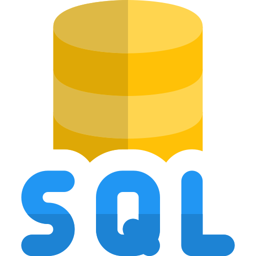

[🏠 Home](../../../README.md) <br/>
<a href="../SQL.md">
	 Home
</a>

<hr/>

<h1 style="text-align: center">1. SQL Introduction</h1>

- [What is SQL?](#what-is-sql)
- [What Can SQL do?](#what-can-sql-do)
- [Characteristics of SQL](#characteristics-of-sql)
- [SQL Case Sensitivity](#sql-case-sensitivity)
	- [1. **SQL Keywords**](#1-sql-keywords)
	- [2. **Identifiers (Table and Column Names)**](#2-identifiers-table-and-column-names)
		- [2.1. MySQL](#21-mysql)
		- [2.2. PostgreSQL](#22-postgresql)
		- [2.3. SQL Server](#23-sql-server)
		- [2.4. Oracle](#24-oracle)
	- [3. Data (String Comparisons)](#3-data-string-comparisons)
- [SQL Comments](#sql-comments)

<hr/>

## What is SQL?
- SQL stands for Structured Query Language
- SQL lets you access and manipulate databases
- SQL became a standard of the American National Standards Institute (ANSI) in 1986, and of the International Organization for Standardization (ISO) in 1987

## What Can SQL do?
- SQL can execute queries against a database
- SQL can retrieve data from a database
- SQL can insert records in a database
- SQL can update records in a database
- SQL can delete records from a database
- SQL can create new databases
- SQL can create new tables in a database
- SQL can create stored procedures in a database
- SQL can create views in a database
- SQL can set permissions on tables, procedures, and views

## Characteristics of SQL

1. **Declarative Language**
SQL is a declarative language, which means users specify what they want to retrieve or manipulate rather than how to do it. This contrasts with procedural languages where the user must specify the exact sequence of operations.

2. **Standardized**
SQL is standardized by organizations such as the American National Standards Institute (ANSI) and the International Organization for Standardization (ISO). This standardization ensures that SQL commands are consistent across different database management systems (DBMS), although some systems may have proprietary extensions.

3. **Relational Database Management**
SQL is specifically designed for working with relational databases. It allows for the definition, manipulation, and control of data and relationships in a tabular format.

4. **Data Definition Language (DDL)**
SQL includes commands that define the structure of a database. 
Common DDL commands include:
   - `CREATE:` to create databases, tables, and other database objects.
   - `ALTER:` to modify existing database objects.
   - `DROP:` to delete database objects.

5. **Data Manipulation Language (DML)**
SQL provides commands to manipulate data within the database. Common DML commands include:

   - `SELECT`: to retrieve data from one or more tables.
   - `INSERT`: to add new records.
   - `UPDATE`: to modify existing records.
   - `DELETE`: to remove records.

6. **Data Control Language (DCL)**
SQL includes commands to control access to data within the database. Common DCL commands include:

   - `GRANT`: to give user access privileges.
   - `REVOKE`: to take back user access privileges.

7. **Transaction Control Language (TCL)**
SQL supports commands to manage transactions, which are sequences of operations performed as a single logical unit. Common TCL commands include:

   - `COMMIT`: to save the changes made during the transaction.
   - `ROLLBACK`: to undo the changes made during the transaction.
   - `SAVEPOINT`: to set a point within a transaction to which you can later roll back.

8. **Powerful Querying Capabilities**
SQL can handle complex queries that involve multiple tables and conditions. It supports:

   - **Joins (`INNER JOIN`, `LEFT JOIN`, `RIGHT JOIN`, `FULL JOIN`)** to combine data from multiple tables.
   - Subqueries to nest queries within other queries.
   - Aggregation functions (e.g., `COUNT`, `SUM`, `AVG`) to perform calculations on data sets.

9. **Portability**
SQL code can be run on various systems with little to no modification, provided the system complies with SQL standards. This portability makes it easier to move databases between different DBMSs.

10. **Extensibility**
While SQL itself is standardized, many DBMSs offer proprietary extensions to enhance functionality. These might include additional functions, data types, or commands specific to the DBMS.

11. **ACID Compliance**
SQL databases typically support ACID (Atomicity, Consistency, Isolation, Durability) properties, which are essential for reliable transaction processing.

12. **Set-Based Operations**
SQL operations work on sets of rows, which allows for efficient data manipulation and retrieval.

13. User-Friendly Syntax
SQL syntax is designed to be close to natural language, making it relatively easy for users to learn and understand.

## SQL Case Sensitivity

### 1. **SQL Keywords**
SQL keywords (such as `SELECT`, `INSERT`, `UPDATE`, `DELETE`, `WHERE`, etc.) are generally case-insensitive. This means that you can write them in uppercase, lowercase, or a mix of both, and the SQL engine will interpret them correctly.

```sql
SELECT * FROM table_name;
select * from table_name;
SeLeCt * FrOm table_name;
```
All three queries are considered the same in SQL.

### 2. **Identifiers (Table and Column Names)**
Case sensitivity for table names, column names, and other identifiers depends on the DBMS:

#### 2.1. MySQL

By default, MySQL is case-insensitive for table and column names on Windows but case-sensitive on Unix-based systems. This behavior can be configured by the `lower_case_table_names` system variable.

#### 2.2. PostgreSQL

PostgreSQL is case-sensitive for table and column names. However, if identifiers are enclosed in double quotes, they are case-sensitive. If they are not, PostgreSQL converts them to lowercase.

```sql
-- Without quotes, interpreted as lowercase
SELECT * FROM TableName; -- Interpreted as tablename

-- With quotes, case-sensitive
SELECT * FROM "TableName"; -- Interpreted as TableName
```

#### 2.3. SQL Server

SQL Server is case-insensitive by default, but it can be configured to be case-sensitive through collation settings.

```sql
SELECT * FROM TableName; -- Case-insensitive by default
SELECT * FROM TABLENAME; -- Treated the same as TableName
```

#### 2.4. Oracle

Oracle treats table and column names as case-insensitive unless they are enclosed in double quotes.

```sql
SELECT * FROM TableName; -- Interpreted as TABLENAME
SELECT * FROM "TableName"; -- Interpreted as TableName (case-sensitive)
```

### 3. Data (String Comparisons)
String comparisons and data handling can be case-sensitive or case-insensitive, depending on the collation settings of the database or the specific SQL query:

- **Collation:** The collation setting of the database or column determines how string comparison and sorting are handled. Some collations are case-sensitive, while others are case-insensitive.

- **Explicit Functions:** SQL provides functions to perform case-insensitive comparisons or transformations, such as `LOWER()`, `UPPER()`, or `ILIKE`(in PostgreSQL for case-insensitive pattern matching).

```sql
-- Case-insensitive comparison
SELECT * FROM table_name WHERE LOWER(column_name) = 'value';

-- Using case-insensitive pattern matching (PostgreSQL)
SELECT * FROM table_name WHERE column_name ILIKE 'value%';
```

## SQL Comments

SQL supports two types of comments:

1. **Single-Line Comments**
Single-line comments begin with `--` (double dash) and continue until the end of the line. Anything after `--` on a line is considered a comment and is ignored by the SQL engine.

```sql
SELECT * FROM employees; -- This is a single-line comment
```

2. **Multi-Line Comments**

Multi-line comments are enclosed between `/*` and `*/`. Anything between these markers, including line breaks, is treated as a comment and ignored by the SQL engine.

```sql
/*
This is a multi-line comment.
It can span multiple lines.
*/

SELECT * FROM departments;
```

<hr/>

[🏠 Home](../../../README.md) <br/>
<a href="../SQL.md">
	 Home
</a>