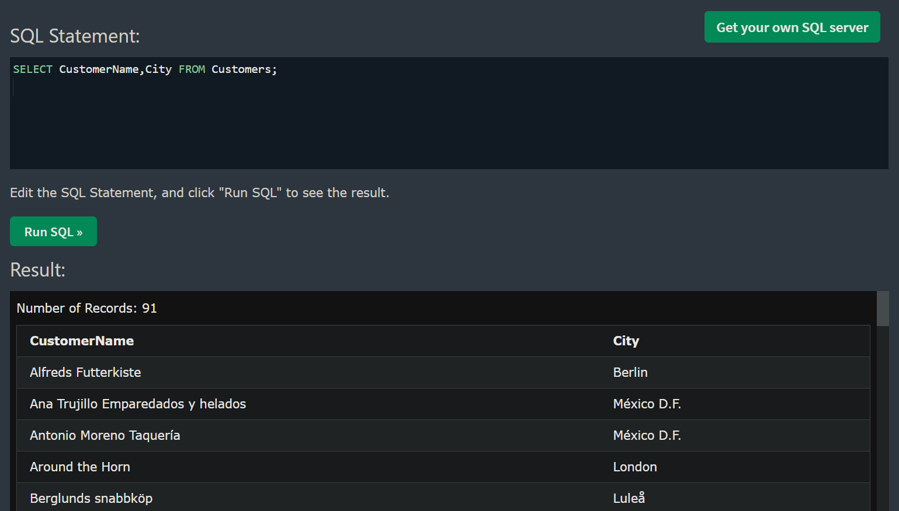

[🏠 Home](../../../README.md) <br/>
<a href="../SQL.md">
	 Home
</a>

<hr/>

<h1 style="text-align: center">2. SQL SELECT</h1>

- [SQL `SELECT` Statement](#sql-select-statement)


<hr/>


## SQL `SELECT` Statement

The `SELECT` statement is used to select data from a database.

**Syntax:**

```sql
SELECT column1, column2, ...
FROM table_name;
```

**Example:**


Original Data base:

<hr/>

[🏠 Home](../../../README.md) <br/>
<a href="../SQL.md">
	 Home
</a>
