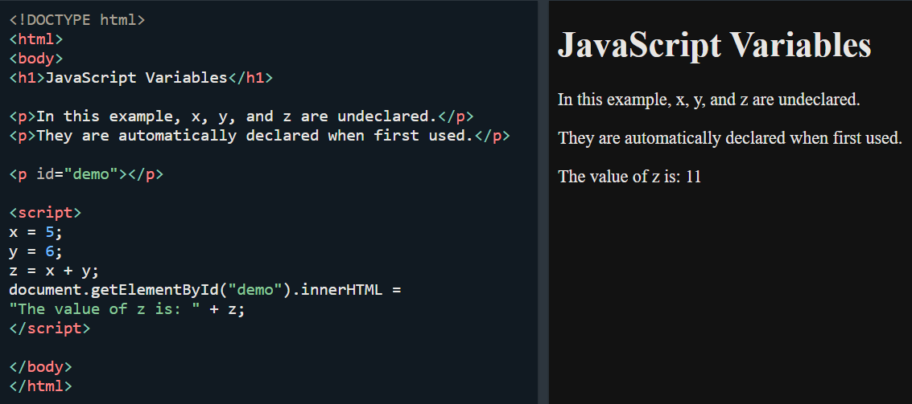
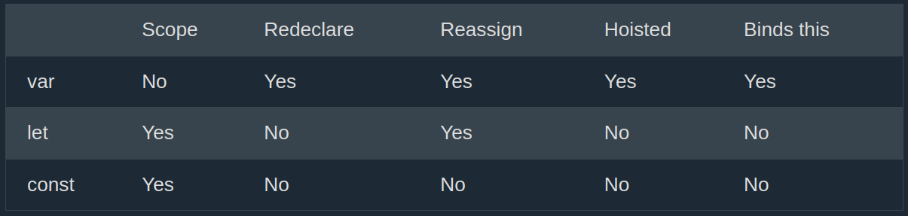
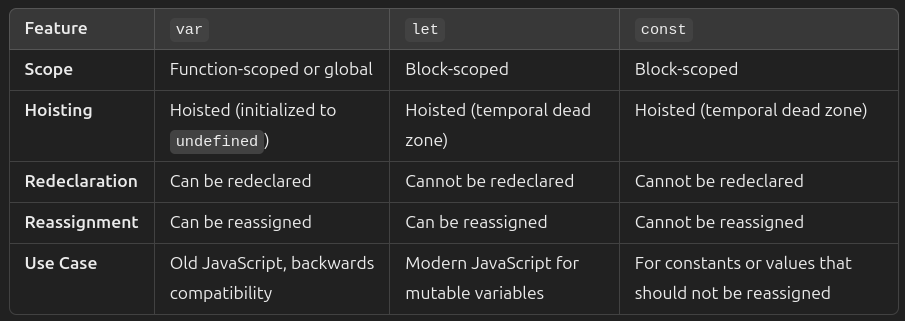

[🏠 Home](../../../README.md) <br/>
<a href="../JavaScript.md" > 

 Home
</a><br/>
[➡️ Next Chap - Input & Output](./3.%20JS%20-%20IO.md)

---

<h1 style="text-align: center">2. JS Variables & Data types</h1>

- [Introduction](#introduction)
	- [When to Use var, let, or const?](#when-to-use-var-let-or-const)
- [JS Identifiers](#js-identifiers)
- [Multiple Declaration in 1 Statement](#multiple-declaration-in-1-statement)
- [Re-Declaring JavaScript Variables](#re-declaring-javascript-variables)
- [The `let` keyword](#the-let-keyword)
- [The `const` keyword](#the-const-keyword)
	- [Constant Objects and Arrays](#constant-objects-and-arrays)
	- [Constant Arrays](#constant-arrays)
	- [Constant Objects](#constant-objects)
- [The `var` vs `let` vs `const` keywords](#the-var-vs-let-vs-const-keywords)
- [Redeclaring](#redeclaring)

---

## Introduction

JavaScript Variables can be declared in 4 ways:

- Automatically
- Using `var`
- Using `let`
- Using `const`

**Example:** Automatically



**NOTE:** It is considered good programming practice to always declare variables before use.

**Example:** Using `var`

```js
var x = 5;
var y = 6;
var z = x + y;
```

**NOTE:**
- The `var` keyword was used in all JavaScript code from 1995 to 2015.
- The `let` and `const` keywords were added to JavaScript in 2015.
- The `var` keyword should only be used in code written for older browsers.

**Example:** Using `let`

```js
let x = 5;
let y = 6;
let z = x + y;
```

**Example:** Using `const`

```js
const x = 5;
const y = 6;
const z = x + y;
```

```js
const price1 = 5;
const price2 = 6;
let total = price1 + price2;
```

### When to Use var, let, or const?

1. Always declare variables
2. Always use `const` if the value should not be changed
3. Always use `const` if the type should not be changed (Arrays and Objects)
4. Only use `let` if you can't use `const`
5. Only use `var` if you MUST support old browsers.

## JS Identifiers

The general rules for constructing names for variables (unique identifiers) are:

- Names can contain letters, digits, underscores, and dollar signs.
- Names must begin with a letter.
- Names can also begin with $ and _ (but we will not use it in this tutorial).
- Names are case sensitive (y and Y are different variables).
- Reserved words (like JavaScript keywords) cannot be used as names.

**Exmaple: of valid variable names**

```js
let firstName = "John";
let _lastName = "Doe";
let $totalAmount = 100;
let version2 = "v2.0";
let camelCaseExample = "This is camel case";
let PascalCaseExample = "This is Pascal case";
```

## Multiple Declaration in 1 Statement

```js
let person = "John Doe", carName = "Volvo", price = 200;

// OR

let person = "John Doe",
carName = "Volvo",
price = 200;
```

## Re-Declaring JavaScript Variables
If you re-declare a JavaScript variable declared with var, it will not lose its value.

The variable carName will still have the value "Volvo" after the execution of these statements:

```js
var carName = "Volvo";
var carName;
```

**⚠️ NOTE ⚠️**
You cannot re-declare a variable declared with `let` or `const`.
This will not work ❌:

```js
let carName = "Volvo";
let carName;
```

---

## The `let` keyword

- The `let` keyword was introduced in ES6 (2015)
- Variables declared with `let` have Block Scope
- Variables declared with `let` must be Declared before use
- Variables declared with `let` cannot be Redeclared in the same scope

```js
// Example: Variables declared with `let` have Block Scope
{
  let blockScoped = "I exist only in this block";
  console.log(blockScoped); // Output: "I exist only in this block"
}
// console.log(blockScoped); // Error: blockScoped is not defined

// Example: Variables declared with `let` must be Declared before use
// console.log(notDeclaredYet); // Error: Cannot access 'notDeclaredYet' before initialization
let notDeclaredYet = "Now I am declared";
console.log(notDeclaredYet); // Output: "Now I am declared"

// Example: Variables declared with `let` cannot be Redeclared in the same scope
let uniqueVar = "I am unique";
// let uniqueVar = "Trying to redeclare"; // Error: Identifier 'uniqueVar' has already been declared
uniqueVar = "I can be reassigned though"; // Valid: Reassignment is allowed
console.log(uniqueVar); // Output: "I can be reassigned though"
```

---

## The `const` keyword

- The `const` keyword was introduced in ES6 (2015)
- Variables defined with `const` cannot be Redeclared
- Variables defined with `const` cannot be Reassigned
- Variables defined with `const` have Block Scope

```js
// Example: Variables defined with `const` cannot be Redeclared
const pi = 3.14;
// const pi = 22 / 7; // Error: Identifier 'pi' has already been declared
console.log(pi); // Output: 3.14

// Example: Variables defined with `const` cannot be Reassigned
const gravity = 9.8;
// gravity = 9.81; // Error: Assignment to constant variable
console.log(gravity); // Output: 9.8

// Example: Variables defined with `const` have Block Scope
{
  const blockScopedConst = "I am block-scoped!";
  console.log(blockScopedConst); // Output: "I am block-scoped!"
}
// console.log(blockScopedConst); // Error: blockScopedConst is not defined
```

### Constant Objects and Arrays

The keyword const is a little misleading.

It does not define a constant value. It defines a constant reference to a value.

Because of this you can NOT:

- Reassign a constant value
- Reassign a constant array
- Reassign a constant object
But you CAN:
- Change the elements of constant array
- Change the properties of constant object

### Constant Arrays

```js
// You can create a constant array:
const cars = ["Saab", "Volvo", "BMW"];

// You can change an element:
cars[0] = "Toyota";

// You can add an element:
cars.push("Audi");

// But the following is not allowed
// cars = ["Toyota", "Volvo", "Audi"];    // ERROR
```

### Constant Objects

```js
// You can create a const object:
const car = {type:"Fiat", model:"500", color:"white"};

// You can change a property:
car.color = "red";

// You can add a property:
car.owner = "Johnson";

// But the following is incorrect:
// car = {type:"Volvo", model:"EX60", color:"red"};    // ERROR
```

---

## The `var` vs `let` vs `const` keywords





---

## Redeclaring

Redeclaring a JavaScript `var` variable is allowed anywhere in a program:

```js
var x = 2;     // Allowed
var x = 3;     // Allowed
x = 4;         // Allowed
```

Redeclaring an existing `var` or `let` variable to const, in the same scope, is not allowed:

```js
var x = 2;     // Allowed
const x = 2;   // Not allowed

{
let x = 2;     // Allowed
const x = 2;   // Not allowed
}

{
const x = 2;   // Allowed
const x = 2;   // Not allowed
}
```

Reassigning an existing `const` variable, in the same scope, is not allowed:

```js
const x = 2;       // Allowed

{
  const x = 3;   // Allowed
}

{
  const x = 4;   // Allowed
}
```

---

[🏠 Home](../../../README.md) <br/>
<a href="../JavaScript.md" > 

 Home
</a><br/>
[➡️ Next Chap - Input & Output](./3.%20JS%20-%20IO.md)