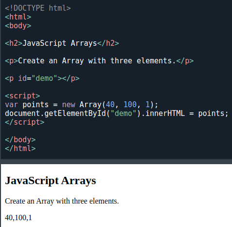
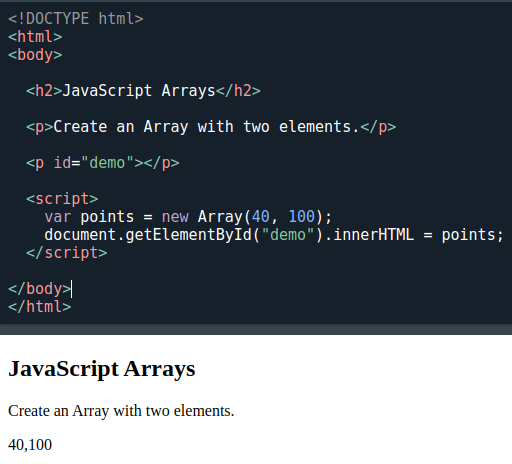
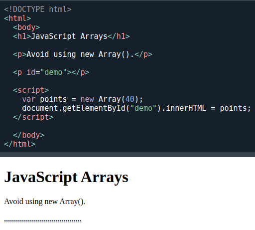

[🏠 Home](../../../README.md) <br/>
<a href="../JavaScript.md" > 

 Home
</a><br/>
[⬅️ Prev Chap - Operators](./6.%20JS%20-%20Events.md)
[➡️ Next Chap - Events](./8.%20JS%20-%20Strings.md)

---

<h1 style="text-align: center">7. Arrays</h1>

## Index

---

## Introduction

An array is a special variable, which can hold more than one value and of different types

This only happens only in JS that an array can store mulitple calues of different types.

---

## Creating an Array

- Using an array literal is the easiest way to create a JavaScript Array.
- Using the JavaScript Keyword new

**Syntax:**

```
const array_name = [item1, item2, ...];

or 

const array_name = new Array(item1, item2, ...);
```

**Example:**

```js
const cars = ["Saab", "Volvo", "BMW"];

// or

const cars = [
  "Saab",
  "Volvo",
  "BMW"
];

// or 

const cars = [];
cars[0]= "Saab";
cars[1]= "Volvo";
cars[2]= "BMW";

// or 

const cars = new Array("Saab", "Volvo", "BMW");
```

---

## Accessing Array Elements

```js
const cars = ["Saab", "Volvo", "BMW"];
let car = cars[0];
```

---

## Changing an Array Element

```js
const cars = ["Saab", "Volvo", "BMW"];
cars[0] = "Opel";
```

---

## Converting an Array to a String

The JavaScript method `toString()` converts an array to a string of (comma separated) array values.

```js
const fruits = ["Banana", "Orange", "Apple", "Mango"];
console.log(fruits.toString());

// Output: Banana,Orange,Apple,Mango
```

---

## Access the Full Array

With JavaScript, the full array can be accessed by referring to the array name:

```js
const cars = ["Saab", "Volvo", "BMW"];
document.getElementById("demo").innerHTML = cars;
```
---

## Arrays are Objects

Arrays are a special type of objects. The `typeof` operator in JavaScript returns "object" for arrays.

But, JavaScript arrays are best described as arrays.

Arrays use numbers to access its "elements". In this example, `person[0]` returns John:

**Array Example:**
```js
const person = ["John", "Doe", 46];
console.log(person[0]);
// Output: John
``` 

Objects use names to access its "members". In this example, person.firstName returns John:

**Object Example:**

```js
const person = {firstName:"John", lastName:"Doe", age:46};
console.log(person.firstName);
// Output: John 
```
---

## Array Elements Can Be Objects

JavaScript variables can be objects. Arrays are special kinds of objects.

Because of this, you can have variables of different types in the same Array.

You can have objects in an Array. You can have functions in an Array. You can have arrays in an Array:

```js
myArray[0] = Date.now;
myArray[1] = myFunction;
myArray[2] = myCars;
```

---

## Accessing the First Array Element

**Example**

```js
const fruits = ["Banana", "Orange", "Apple", "Mango"];
console.lo(fruits[0]);

// Output: Banana
```

---

## Accessing the Last Array Element

**Example**

```js
const fruits = ["Banana", "Orange", "Apple", "Mango"];
console.log(fruits[fruits.length -1]);
// Output: Mango
```

---

## Looping Array Elements

One way to loop through an array, is using a `for` loop:

```js
const fruits = ["Banana", "Orange", "Apple", "Mango"];
let fLen = fruits.length;

for (let i = 0; i < fLen; i++) {
  console.log(fruits[i])
}

/*
Output:
  Banana
  Orange
  Apple
  Mango
*/
```

You can also use the `Array.forEach()` function:

```js
const fruits = ["Banana", "Orange", "Apple", "Mango"];

fruits.forEach(myFunction);
function myFunction(value) {
  console.log(value)
}

/*
Output:

Banana
Orange
Apple
Mango
*/

fruits.forEach((value)=>console.log(value));

/*
Output:

Banana
Orange
Apple
Mango
*/
```

---

## Adding Array Elements

The easiest way to add a new element to an array is using the push() method:

**Example**

```js
const fruits = ["Banana", "Orange", "Apple"];

// Adds a new element (Lemon) to fruits
fruits.push("Lemon");  
```

New element can also be added to an array using the length property:

**Example**

```js
const fruits = ["Banana", "Orange", "Apple"];

// Adds "Lemon" to fruits
fruits[fruits.length] = "Lemon";  
```

========================================

⚠️ WARNING ⚠️

Adding elements with high indexes can create undefined "holes" in an array

**Example**

```js
const fruits = ["Banana", "Orange", "Apple"];
// Creates undefined "holes" in fruits
fruits[6] = "Lemon";  
```
========================================

---

## Associative Arrays

- Many programming languages support arrays with named indexes.
- Arrays with named indexes are called associative arrays (or hashes).
- JavaScript does not support arrays with named indexes.
- In JavaScript, arrays always use numbered indexes.  

**Example**

```js
const person = [];
person[0] = "John";
person[1] = "Doe";
person[2] = 46;
person.length;    // Will return 3
person[0];        // Will return "John"
```

========================================

⚠️ WARNING ⚠️

- If you use named indexes, JavaScript will redefine the array to an object.
- After that, some array methods and properties will produce incorrect results.

========================================

**Example:**

```js
const person = [];
person["firstName"] = "John";
person["lastName"] = "Doe";
person["age"] = 46;
person.length;     // Will return 0
person[0];         // Will return undefined
```

---

## JavaScript `new Array()`

JavaScript has a built-in array constructor new Array().

But you can safely use `[]` instead.

These two different statements both create a new empty array named points:

```js
const points = new Array();
const points = [];
```

These two different statements both create a new array containing 6 numbers:

```js
const points = new Array(40, 100, 1, 5, 25, 10);
const points = [40, 100, 1, 5, 25, 10];
```

The new keyword can produce some unexpected results:

**Case 1**
```js
// Create an array with three elements:
const points = new Array(40, 100, 1);
```

*Complete example*:



**Case 2**

```js
// Create an array with two elements:
const points = new Array(40, 100);
```

*Complete example*:



**Case 3:**

```js
// Create an array with one element ???
const points = new Array(40);  
```



This creates an array of 40 undefined elements ie, length = 40

---

## A Common Error

Following 2 codes are not the same:

```js
// Create an array with one element:
const points = [40];

// Create an array with 40 undefined elements:
const points = new Array(40);
```

---

## How to Recognize an Array

A common question is: **How do I know if a variable is an array?**

The problem is that the JavaScript operator `typeof` returns "`object`":

```js
const fruits = ["Banana", "Orange", "Apple"];
console.log(typeof fruits);
// Output: object
```

The typeof operator returns object because a JavaScript array is an object.

**Solution 1:**

To solve this problem ECMAScript 5 (JavaScript 2009) defined a new method `Array.isArray()`:

```js
Array.isArray(fruits);
```

**Solution 2:**

The `instanceof` operator returns true if an object is created by a given constructor:

```js
const fruits = ["Banana", "Orange", "Apple"];
(fruits instanceof Array);
```

---

## Nested Arrays and Objects

Values in objects can be arrays, and values in arrays can be objects:

**Example**
```js
const myObj = {
  name: "John",
  age: 30,
  cars: [
    {name:"Ford", models:["Fiesta", "Focus", "Mustang"]},
    {name:"BMW", models:["320", "X3", "X5"]},
    {name:"Fiat", models:["500", "Panda"]}
  ]
}

```

To access arrays inside arrays, use a for-in loop for each array:

**Example**

```js
for (let i in myObj.cars) {
  x += "<h1>" + myObj.cars[i].name + "</h1>";
  for (let j in myObj.cars[i].models) {
    x += myObj.cars[i].models[j];
  }
}
```


---

[🏠 Home](../../../README.md) <br/>
<a href="../JavaScript.md" > 

 Home
</a><br/>
[⬅️ Prev Chap - Operators](./6.%20JS%20-%20Events.md)
[➡️ Next Chap - Events](./8.%20JS%20-%20Strings.md)