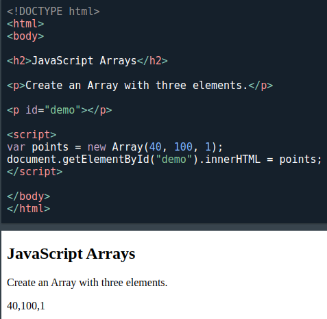
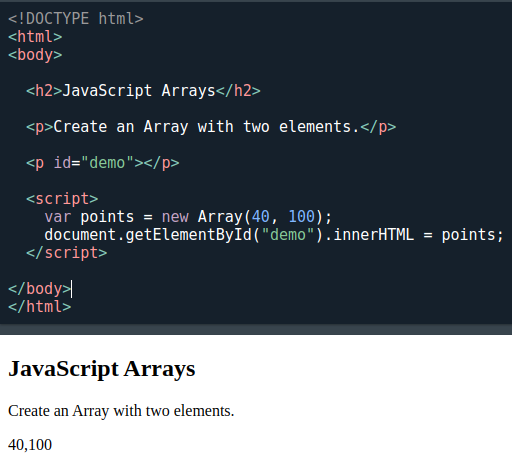
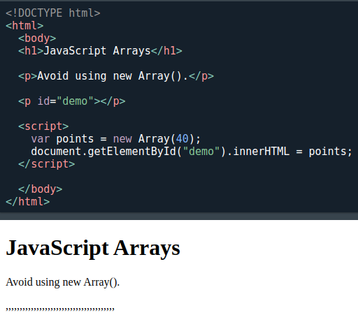

[🏠 Home](../../../README.md) <br/>
<a href="../JavaScript.md" > 

 Home
</a><br/>
[⬅️ Prev Chap - Operators](./6.%20JS%20-%20Events.md)
[➡️ Next Chap - Events](./8.%20JS%20-%20Strings.md)

---

<h1 style="text-align: center">7. Arrays</h1>

## Index

- [Index](#index)
- [Introduction](#introduction)
- [Creating an Array](#creating-an-array)
- [Accessing Array Elements](#accessing-array-elements)
- [Changing an Array Element](#changing-an-array-element)
- [Converting an Array to a String](#converting-an-array-to-a-string)
- [Access the Full Array](#access-the-full-array)
- [Arrays are Objects](#arrays-are-objects)
- [Array Elements Can Be Objects](#array-elements-can-be-objects)
- [Accessing the First Array Element](#accessing-the-first-array-element)
- [Accessing the Last Array Element](#accessing-the-last-array-element)
- [Looping Array Elements](#looping-array-elements)
- [Adding Array Elements](#adding-array-elements)
- [Associative Arrays](#associative-arrays)
- [JavaScript `new Array()`](#javascript-new-array)
- [A Common Error](#a-common-error)
- [How to Recognize an Array](#how-to-recognize-an-array)
- [Nested Arrays and Objects](#nested-arrays-and-objects)
- [Array Methods](#array-methods)
  - [The `[]` array](#the--array)
  - [new Array()](#new-array)
  - [at()](#at)
  - [concat()](#concat)
  - [constructor](#constructor)
  - [copyWithin()](#copywithin)
- [Example:](#example)
  - [entries()](#entries)
  - [every()](#every)
  - [fill()](#fill)
  - [filter()](#filter)
  - [find()](#find)
  - [findIndex()](#findindex)
  - [findLast()](#findlast)
  - [findLastIndex()](#findlastindex)
  - [flat()](#flat)
  - [flatMap()](#flatmap)
  - [forEach()](#foreach)
  - [from()](#from)
  - [includes()](#includes)
  - [indexOf()](#indexof)
  - [isArray()](#isarray)
  - [join()](#join)
  - [keys()](#keys)
  - [lastIndexOf()](#lastindexof)
  - [length](#length)
  - [map()](#map)
  - [of()](#of)
  - [pop()](#pop)
  - [prototype](#prototype)
  - [push()](#push)
  - [reduce()](#reduce)
  - [reduceRight()](#reduceright)
  - [reverse()](#reverse)
  - [shift()](#shift)
  - [slice()](#slice)
  - [some()](#some)
  - [sort()](#sort)
  - [splice()](#splice)
  - [toReversed()](#toreversed)
  - [toSorted()](#tosorted)
  - [toSpliced()](#tospliced)
  - [toString()](#tostring)
  - [unshift()](#unshift)
  - [valueOf()](#valueof)
  - [with()](#with)

---

## Introduction

An array is a special variable, which can hold more than one value and of different types

This only happens only in JS that an array can store mulitple calues of different types.

---

## Creating an Array

- Using an array literal is the easiest way to create a JavaScript Array.
- Using the JavaScript Keyword new

**Syntax:**

```
const array_name = [item1, item2, ...];

or 

const array_name = new Array(item1, item2, ...);
```

**Example:**

```js
const cars = ["Saab", "Volvo", "BMW"];

// or

const cars = [
  "Saab",
  "Volvo",
  "BMW"
];

// or 

const cars = [];
cars[0]= "Saab";
cars[1]= "Volvo";
cars[2]= "BMW";

// or 

const cars = new Array("Saab", "Volvo", "BMW");
```

---

## Accessing Array Elements

```js
const cars = ["Saab", "Volvo", "BMW"];
let car = cars[0];
```

---

## Changing an Array Element

```js
const cars = ["Saab", "Volvo", "BMW"];
cars[0] = "Opel";
```

---

## Converting an Array to a String

The JavaScript method `toString()` converts an array to a string of (comma separated) array values.

```js
const fruits = ["Banana", "Orange", "Apple", "Mango"];
console.log(fruits.toString());

// Output: Banana,Orange,Apple,Mango
```

---

## Access the Full Array

With JavaScript, the full array can be accessed by referring to the array name:

```js
const cars = ["Saab", "Volvo", "BMW"];
document.getElementById("demo").innerHTML = cars;
```
---

## Arrays are Objects

Arrays are a special type of objects. The `typeof` operator in JavaScript returns "object" for arrays.

But, JavaScript arrays are best described as arrays.

Arrays use numbers to access its "elements". In this example, `person[0]` returns John:

**Array Example:**
```js
const person = ["John", "Doe", 46];
console.log(person[0]);
// Output: John
``` 

Objects use names to access its "members". In this example, person.firstName returns John:

**Object Example:**

```js
const person = {firstName:"John", lastName:"Doe", age:46};
console.log(person.firstName);
// Output: John 
```
---

## Array Elements Can Be Objects

JavaScript variables can be objects. Arrays are special kinds of objects.

Because of this, you can have variables of different types in the same Array.

You can have objects in an Array. You can have functions in an Array. You can have arrays in an Array:

```js
myArray[0] = Date.now;
myArray[1] = myFunction;
myArray[2] = myCars;
```

---

## Accessing the First Array Element

**Example**

```js
const fruits = ["Banana", "Orange", "Apple", "Mango"];
console.lo(fruits[0]);

// Output: Banana
```

---

## Accessing the Last Array Element

**Example**

```js
const fruits = ["Banana", "Orange", "Apple", "Mango"];
console.log(fruits[fruits.length -1]);
// Output: Mango
```

---

## Looping Array Elements

One way to loop through an array, is using a `for` loop:

```js
const fruits = ["Banana", "Orange", "Apple", "Mango"];
let fLen = fruits.length;

for (let i = 0; i < fLen; i++) {
  console.log(fruits[i])
}

/*
Output:
  Banana
  Orange
  Apple
  Mango
*/
```

You can also use the `Array.forEach()` function:

```js
const fruits = ["Banana", "Orange", "Apple", "Mango"];

fruits.forEach(myFunction);
function myFunction(value) {
  console.log(value)
}

/*
Output:

Banana
Orange
Apple
Mango
*/

fruits.forEach((value)=>console.log(value));

/*
Output:

Banana
Orange
Apple
Mango
*/
```

---

## Adding Array Elements

The easiest way to add a new element to an array is using the push() method:

**Example**

```js
const fruits = ["Banana", "Orange", "Apple"];

// Adds a new element (Lemon) to fruits
fruits.push("Lemon");  
```

New element can also be added to an array using the length property:

**Example**

```js
const fruits = ["Banana", "Orange", "Apple"];

// Adds "Lemon" to fruits
fruits[fruits.length] = "Lemon";  
```

========================================

⚠️ WARNING ⚠️

Adding elements with high indexes can create undefined "holes" in an array

**Example**

```js
const fruits = ["Banana", "Orange", "Apple"];
// Creates undefined "holes" in fruits
fruits[6] = "Lemon";  
```
========================================

---

## Associative Arrays

- Many programming languages support arrays with named indexes.
- Arrays with named indexes are called associative arrays (or hashes).
- JavaScript does not support arrays with named indexes.
- In JavaScript, arrays always use numbered indexes.  

**Example**

```js
const person = [];
person[0] = "John";
person[1] = "Doe";
person[2] = 46;
person.length;    // Will return 3
person[0];        // Will return "John"
```

========================================

⚠️ WARNING ⚠️

- If you use named indexes, JavaScript will redefine the array to an object.
- After that, some array methods and properties will produce incorrect results.

========================================

**Example:**

```js
const person = [];
person["firstName"] = "John";
person["lastName"] = "Doe";
person["age"] = 46;
person.length;     // Will return 0
person[0];         // Will return undefined
```

---

## JavaScript `new Array()`

JavaScript has a built-in array constructor new Array().

But you can safely use `[]` instead.

These two different statements both create a new empty array named points:

```js
const points = new Array();
const points = [];
```

These two different statements both create a new array containing 6 numbers:

```js
const points = new Array(40, 100, 1, 5, 25, 10);
const points = [40, 100, 1, 5, 25, 10];
```

The new keyword can produce some unexpected results:

**Case 1**
```js
// Create an array with three elements:
const points = new Array(40, 100, 1);
```

*Complete example*:



**Case 2**

```js
// Create an array with two elements:
const points = new Array(40, 100);
```

*Complete example*:



**Case 3:**

```js
// Create an array with one element ???
const points = new Array(40);  
```



This creates an array of 40 undefined elements ie, length = 40

---

## A Common Error

Following 2 codes are not the same:

```js
// Create an array with one element:
const points = [40];

// Create an array with 40 undefined elements:
const points = new Array(40);
```

---

## How to Recognize an Array

A common question is: **How do I know if a variable is an array?**

The problem is that the JavaScript operator `typeof` returns "`object`":

```js
const fruits = ["Banana", "Orange", "Apple"];
console.log(typeof fruits);
// Output: object
```

The typeof operator returns object because a JavaScript array is an object.

**Solution 1:**

To solve this problem ECMAScript 5 (JavaScript 2009) defined a new method `Array.isArray()`:

```js
Array.isArray(fruits);
```

**Solution 2:**

The `instanceof` operator returns true if an object is created by a given constructor:

```js
const fruits = ["Banana", "Orange", "Apple"];
(fruits instanceof Array);
```

---

## Nested Arrays and Objects

Values in objects can be arrays, and values in arrays can be objects:

**Example**
```js
const myObj = {
  name: "John",
  age: 30,
  cars: [
    {name:"Ford", models:["Fiesta", "Focus", "Mustang"]},
    {name:"BMW", models:["320", "X3", "X5"]},
    {name:"Fiat", models:["500", "Panda"]}
  ]
}

```

To access arrays inside arrays, use a for-in loop for each array:

**Example**

```js
for (let i in myObj.cars) {
  x += "<h1>" + myObj.cars[i].name + "</h1>";
  for (let j in myObj.cars[i].models) {
    x += myObj.cars[i].models[j];
  }
}
```

---

## Array Methods

| Name             | Description                                                                 |
|------------------|-----------------------------------------------------------------------------|
| [ [ ] ](#the--array)     | Creates a new Array                                                        |
| [new Array()](#new-array) | Creates a new Array                                               |
| [at()](#at)     | Returns an indexed element of an array                                     |
| [concat()](#concat) | Joins arrays and returns an array with the joined arrays                |
| [constructor](#constructor) | Returns the function that created the Array prototype           |
| [copyWithin()](#copywithin) | Copies array elements within the array, to and from specified positions |
| [entries()](#entries) | Returns a key/value pair Array Iteration Object                      |
| [every()](#every) | Checks if every element in an array pass a test                          |
| [fill()](#fill) | Fill the elements in an array with a static value                          |
| [filter()](#filter) | Creates a new array with every element in an array that pass a test    |
| [find()](#find) | Returns the value of the first element in an array that pass a test        |
| [findIndex()](#findindex) | Returns the index of the first element in an array that pass a test |
| [findLast()](#findlast) | Returns the value of the last element in an array that pass a test |
| [findLastIndex()](#findlastindex) | Returns the index of the last element in an array that pass a test |
| [flat()](#flat) | Concatenates sub-array elements                                            |
| [flatMap()](#flatmap) | Maps all array elements and creates a new flat array                 |
| [forEach()](#foreach) | Calls a function for each array element                              |
| [from()](#from) | Creates an array from an object                                            |
| [includes()](#includes) | Check if an array contains the specified element                   |
| [indexOf()](#indexof) | Search the array for an element and returns its position             |
| [isArray()](#isarray) | Checks whether an object is an array                                 |
| [join()](#join) | Joins all elements of an array into a string                               |
| [keys()](#keys) | Returns an Array Iteration Object, containing the keys of the original array |
| [lastIndexOf()](#lastindexof) | Search the array for an element, starting at the end, and returns its position |
| [length](#length) | Sets or returns the number of elements in an array                      |
| [map()](#map) | Creates a new array with the result of calling a function for each array element |
| [of()](#of) | Creates an array from a number of arguments                                   |
| [pop()](#pop) | Removes the last element of an array, and returns that element              |
| [prototype](#prototype) | Allows you to add properties and methods to an Array object       |
| [push()](#push) | Adds new elements to the end of an array, and returns the new length      |
| [reduce()](#reduce) | Reduce the values of an array to a single value (going left-to-right) |
| [reduceRight()](#reduceright) | Reduce the values of an array to a single value (going right-to-left) |
| [reverse()](#reverse) | Reverses the order of the elements in an array                      |
| [shift()](#shift) | Removes the first element of an array, and returns that element         |
| [slice()](#slice) | Selects a part of an array, and returns the new array                   |
| [some()](#some) | Checks if any of the elements in an array pass a test                    |
| [sort()](#sort) | Sorts the elements of an array                                            |
| [splice()](#splice) | Adds or Removes array elements                                        |
| [toReversed()](#toreversed) | Reverses the order of array elements (to a new array)        |
| [toSorted()](#tosorted) | Sorts the elements of an array (to a new array)                  |
| [toSpliced()](#tospliced) | Adds or Removes array elements (to a new array)                |
| [toString()](#tostring) | Converts an array to a string, and returns the result            |
| [unshift()](#unshift) | Adds new elements to the beginning of an array, and returns the new length |
| [valueOf()](#valueof) | Returns the primitive value of an array                             |
| [with()](#with) | Returns a new array with updated elements                                |


### The `[]` array

Creates a new Array

Example:

```js
// Create an Array
const cars = ["Saab", "Volvo", "BMW"];
```

---

### new Array()

Creates a new Array

Example:

```js
// Create an Array
const cars = new Array(["Saab", "Volvo", "BMW"]);
```

---

### at()

- It returns an indexed element of an array.
- The `at()` method returns the same as [].'
- The `at()` method is supported in all modern browsers since March 2022:

Example:

```js
const fruits = ["Banana", "Orange", "Apple", "Mango"];
let fruit = fruits.at(2);

// is same as 

const fruits = ["Banana", "Orange", "Apple", "Mango"];
let fruit = fruits[2];
```


Many languages allows negative bracket indexing like `[-1]` to access elements from the end of an `object` / `array` / `string`.

This is not possible in JavaScript, because `[]` is used for accessing both arrays and objects. `obj[-1]` refers to the value of key `-1`, not to the last property of the object.

The `at()` method was introduced in ES2022 to solve this problem.

Example:

```js
// Get the first element of fruits:
const fruits = ["Banana", "Orange", "Apple", "Mango"];
let fruit = fruits.at();

// Get the last element of fruits:
const fruits = ["Banana", "Orange", "Apple", "Mango"];
let fruit = fruits.at(-1);
```

---

### concat()

Joins arrays and returns an array with the joined arrays

**Description**

- The `concat()` method concatenates (joins) two or more arrays.
- The `concat()` method returns a new array, containing the joined arrays.
- The `concat()` method does not change the existing arrays.

Example:

```js
// Join 2 arrays
const arr1 = ["Cecilie", "Lone"];
const arr2 = ["Emil", "Tobias", "Linus"];
const children = arr1.concat(arr2);

console.log(children);
// Output: [ 'Cecilie', 'Lone', 'Emil', 'Tobias', 'Linus' ]

// ===============================================

// Join 3 arrays
const arr3 = ["Cecilie", "Lone"];
const arr4 = ["Emil", "Tobias", "Linus"];
const arr5 = ["Robin"];
const childrens = arr3.concat(arr4, arr5);
console.log(childrens);
// Output: [ 'Cecilie', 'Lone', 'Emil', 'Tobias', 'Linus', 'Robin' ]

// ===============================================

// Concatenate strings and numbers:
const arr6 = ["Cecilie", "Lone"];
const arr7 = [1, 2, 3];
const arr8 = arr6.concat(arr7);
console.log(arr8);
// Output: [ 'Cecilie', 'Lone', 1, 2, 3 ]

// ===============================================

// Concatenate nested arrays:
const arr9 = [1, 2, [3, 4]];
const arr10 = [[5, 6], 7, 8];
const arr11 = arr9.concat(arr10);
console.log(arr11);
// Output: [ 1, 2, [ 3, 4 ], [ 5, 6 ], 7, 8 ]
```

---

### constructor

Returns the function that created the Array prototype

---

### copyWithin()

Copies array elements within the array, to and from specified positions

**Description**
- The method copies array elements to another position in an array.
- The method overwrites the existing values.
- The method does not add items to the array.

**Syntax**

```
array.copyWithin(target, start, end)
```

**Parameters**

*Parameter*:	Description
- `target`:   (Required) The index (position) to copy the elements to.
- `start`:    (Optional) The start index (position). Default is 0.
- `end`:      (Optional) The end index (position). Default is the array length.

**Return Value**

*Type*:	Description
- Array: The changed array.

Example: 
---

### entries()

Returns a key/value pair Array Iteration Object

---

### every()

Checks if every element in an array pass a test

---

### fill()

Fill the elements in an array with a static value

---

### filter()

Creates a new array with every element in an array that pass a test

---

### find()

Returns the value of the first element in an array that pass a test

---

### findIndex()

Returns the index of the first element in an array that pass a test

---

### findLast()

Returns the value of the last element in an array that pass a test

---

### findLastIndex()

Returns the index of the last element in an array that pass a test

---

### flat()

Concatenates sub-array elements

---

### flatMap()

Maps all array elements and creates a new flat array

---

### forEach()

Calls a function for each array element

---

### from()

Creates an array from an object

---

### includes()

Check if an array contains the specified element

---

### indexOf()

Search the array for an element and returns its position

---

### isArray()

Checks whether an object is an array

---

### join()

Joins all elements of an array into a string

---

### keys()

Returns an Array Iteration Object, containing the keys of the original array

---

### lastIndexOf()

Search the array for an element, starting at the end, and returns its position

---

### length

Sets or returns the number of elements in an array

---

### map()

Creates a new array with the result of calling a function for each array element

---

### of()

Creates an array from a number of arguments

---

### pop()

Removes the last element of an array, and returns that element

---

### prototype

Allows you to add properties and methods to an Array object

---

### push()

Adds new elements to the end of an array, and returns the new length

---

### reduce()

Reduce the values of an array to a single value (going left-to-right)

---

### reduceRight()

Reduce the values of an array to a single value (going right-to-left)

---

### reverse()

Reverses the order of the elements in an array

---

### shift()

Removes the first element of an array, and returns that element

---

### slice()

Selects a part of an array, and returns the new array

---

### some()

Checks if any of the elements in an array pass a test

---

### sort()

Sorts the elements of an array

---

### splice()

Adds or Removes array elements

---

### toReversed()

Reverses the order of array elements (to a new array)

---

### toSorted()

Sorts the elements of an array (to a new array)

---

### toSpliced()

Adds or Removes array elements (to a new array)

---

### toString()

Converts an array to a string, and returns the result

---

### unshift()

Adds new elements to the beginning of an array, and returns the new length

---

### valueOf()

Returns the primitive value of an array

---

### with()

Returns a new array with updated elements


---

[🏠 Home](../../../README.md) <br/>
<a href="../JavaScript.md" > 

 Home
</a><br/>
[⬅️ Prev Chap - Operators](./6.%20JS%20-%20Events.md)
[➡️ Next Chap - Events](./8.%20JS%20-%20Strings.md)