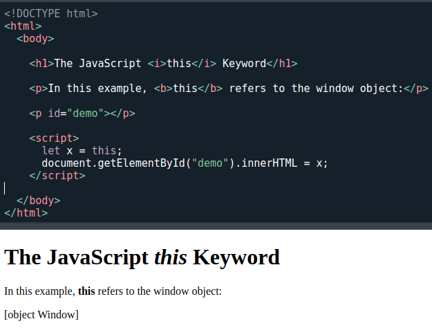

[🏠 Home](../../../README.md) <br/>
<a href="../JavaScript.md" > 

 Home
</a><br/>
[⬅️ Prev Chap - ]()
[➡️ Next Chap - ]()

---

<h1 style="text-align: center">The `this` Keyword</h1>

## Index
- [Index](#index)
- [What is `this`?](#what-is-this)
- [`this` in a Method](#this-in-a-method)
- [`this` Alone](#this-alone)
- [this in a Function (Default)](#this-in-a-function-default)
- [this in a Function (Strict)](#this-in-a-function-strict)
- [this in Event Handlers](#this-in-event-handlers)
- [Object Method Binding](#object-method-binding)
- [Explicit Function Binding](#explicit-function-binding)
- [Function Borrowing](#function-borrowing)
- [This Precedence](#this-precedence)

--- 

## What is `this`?

In JavaScript, the `this` keyword refers to an object.

The `this` keyword refers to different objects depending on how it is used:

- In an object method, `this` refers to the object.
- Alone, `this` refers to the global object.
- In a function, `this` refers to the global object.
- In a function, in strict mode, `this` is undefined.
- In an event, `this` refers to the element that received the event.
- Methods like `call()`, `apply()`, and `bind()` can refer this to any object.

==============================

⚠️ NOTE ⚠️


`this` is not a variable. It is a keyword. You cannot change the value of `this`.

==============================

## `this` in a Method

When used in an object method, `this` refers to the object.

**Example:**

```js
const person = {
  firstName: "John",
  lastName : "Doe",
  id       : 5566,
  fullName : function() {
    return this.firstName + " " + this.lastName;
  }
};
```

In the example above, `this` refers to the `person` object.

Because the `fullName` method is a method of the `person` object.

Complete example:

```js
// Create an object:
const person = {
  firstName: "John",
  lastName: "Doe",
  id: 5566,
  fullName : function() {
    return this.firstName + " " + this.lastName;
  }
};
/* 

`
  fullName : function() {
    return firstName + " " + lastName;
  }
`
The above will trow a reference error

ERROR!
/tmp/8QzvNDrWU0/main.js:10
    return firstName + " " + lastName;
    ^

ReferenceError: firstName is not defined
*/

console.log(person.fullName());

// Output: John Doe
```

--- 

## `this` Alone

- When used alone, `this` refers to the global object.
- Because `this` is running in the global scope.
- In a browser window the global object is `[object Window]`:

Example
```js
let x = this;
```



---

## this in a Function (Default)

In a function, the global object is the default binding for this.

In a browser window the global object is `[object Window]`:

Example
```js
function myFunction() {
  return this;
}
```

--- 

## this in a Function (Strict)

- In strict mode, this still refers to the global object when used alone.

Example:

```js
"use strict";
let x = this; // Here too, `this` refers to the global object.
console.log(x); // Output: [object Window]
```

**Why Does `this` Refer to the Global Object?**

**Global Scope Behavior:**

- When not associated with an object, function, or class, `this` is simply part of the global execution context.
- In a browser, the global execution context is the window object.

**Practical Implication:**

- Using `this` alone in global scope or strict mode is rare in modern JavaScript because most code is written inside modules, objects, or functions.


---

## this in Event Handlers

In HTML event handlers, this refers to the HTML element that received the event:

Example

```js
<button onclick="this.style.display='none'">
  Click to Remove Me!
</button>
```

--- 

## Object Method Binding

In these examples, `this` is the person object:

Example

```js
const person = {
  firstName  : "John",
  lastName   : "Doe",
  id         : 5566,
  myFunction : function() {
    return this;
  }
};

/*
Output:
{
  firstName: 'John',
  lastName: 'Doe',
  id: 5566,
  myFunction: [Function: myFunction]
}

*/
```

Example:
```js
const person = {
  firstName: "John",
  lastName : "Doe",
  id       : 5566,
  fullName : function() {
    return this.firstName + " " + this.lastName;
  }
};

console.log(person.fullName())
// Output: John Doe
```

i.e. `this.firstName` is the `firstName` property of `this` (the person object).

---

## Explicit Function Binding

The `call()` and `apply()` methods are predefined JavaScript methods.

They can both be used to call an object method with another object as argument.

The example below calls `person1.fullName` with `person2` as an argument, this refers to `person2`, even if `fullName` is a method of `person1`:

```js
const person1 = {
  fullName: function() {
    return this.firstName + " " + this.lastName;
  }
}

const person2 = {
  firstName:"John",
  lastName: "Doe",
}

let x = person1.fullName.call(person2); 
console.log(x);

// Output: John Doe
```

---

## Function Borrowing

With the `bind()` method, an object can borrow a method from another object.

This example creates 2 objects (**person** and **member**).

The **member** object borrows the **fullname** method from the **person** object:

```js
const person = {
  firstName:"John",
  lastName: "Doe",
  fullName: function () {
    return this.firstName + " " + this.lastName;
  }
}

const member = {
  firstName:"Hege",
  lastName: "Nilsen",
}

let fullName = person.fullName.bind(member);
console.log(fullName());
// Output: Hege Nilsen
```

---

## This Precedence

| Precedence | Object           |
|------------|------------------|
| 1          | `bind()`         |
| 2          | `apply()` and `call()` |
| 3          | Object method    |
| 4          | Global scope     |

---

[🏠 Home](../../../README.md) <br/>
<a href="../JavaScript.md" > 

 Home
</a><br/>
[⬅️ Prev Chap - ]()
[➡️ Next Chap - ]()