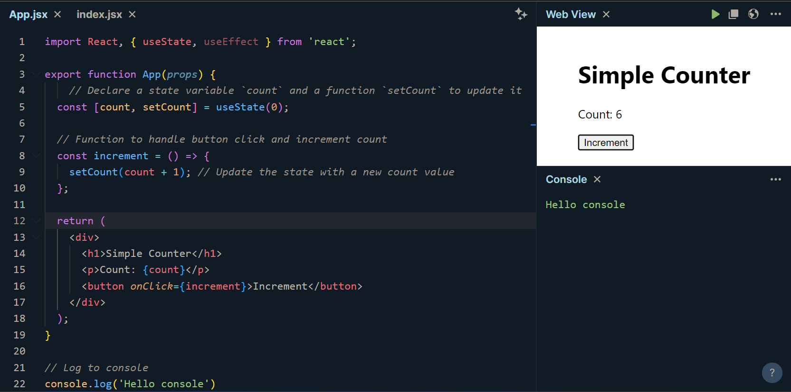

[🏠 Home](../../../../../README.md)

<a href="../React.js.md">

React Home
</a>

---

<h1>11. React `useState` Hook</h1>

## Index

- [Index](#index)
- [What is useState?](#what-is-usestate)
- [How Does useState Work?](#how-does-usestate-work)
- [Basic Example of `useState`](#basic-example-of-usestate)
- [Explanation of Each Line in the Code](#explanation-of-each-line-in-the-code)
- [Component Lifecycle and useState](#component-lifecycle-and-usestate)
- [Output](#output)

---

## What is useState?

- The useState hook is a function that lets you add state variables to your functional components.
- It’s called inside a function component to create a piece of state that React will watch for changes.
- Every time the state changes, React will re-render the component with the updated state value.

---

[🔝 Back to TOP 🔝](#index)

## How Does useState Work?

**Syntax:**

```js
const [state, setState] = useState(initialValue);
```

- `state`: The current state value.
- `setState`: A function to update the state.
- `initialValue`: The initial value of the state. This can be any data type, such as a string, number, object, or array.

---

[🔝 Back to TOP 🔝](#index)

## Basic Example of `useState`

Let’s create a simple counter application that uses `useState` to manage the count. The counter starts at 0, and each time you click the "Increment" button, the count increases by 1.

```js
import React, { useState } from 'react';

function Counter() {
  // Declare a state variable `count` and a function `setCount` to update it
  const [count, setCount] = useState(0);

  // Function to handle button click and increment count
  const increment = () => {
    setCount(count + 1); // Update the state with a new count value
  };

  return (
    <div>
      <h1>Simple Counter</h1>
      <p>Count: {count}</p>
      <button onClick={increment}>Increment</button>
    </div>
  );
}

export default Counter;
```

---

[🔝 Back to TOP 🔝](#index)

## Explanation of Each Line in the Code

1. `import React, { useState } from 'react';`

   - We import `React` and the `useState` hook from the React library.

2. `function Counter()`

   - Defines a functional component named `Counter`.  

3. `const [count, setCount] = useState(0);`
   - Initializes a piece of state named `count` with an initial value of `0`.
   - `setCount` is a function that will allow us to update the value of `count`.
   - `useState(0)` is called with `0` as the initial state, setting the initial `count` to `0`.

4. `const increment = () => { setCount(count + 1); };`

   - Defines a function `increment` that increments the `count` by `1`.
   - Calls `setCount(count + 1)` to update the state, which triggers a re-render of the component.

5. `<p>Count: {count}</p>`
   - Displays the current count value by referencing the `count` state variable.

6. `<button onClick={increment}>Increment</button>`
   - Adds a button that, when clicked, calls the `increment` function to increase the count.

---

[🔝 Back to TOP 🔝](#index)

## Component Lifecycle and useState

- **Initialization:** When the `Counter` component is first rendered, React initializes the `count` state with a value of 0.
- **Update:** Each time `setCount` is called, React updates `count`, and the `Counter` component re-renders with the new value.

---

[🔝 Back to TOP 🔝](#index)

## Output



When this component is rendered, you’ll see:

```
Simple Counter
Count: 0
[Increment Button]
```

Each time you click the "Increment" button, the displayed `count` value will increase by `1`.

1. Initial Render:

```
Simple Counter
Count: 0
[Increment Button]
```

2. After Clicking "Increment" Once:

```
Simple Counter
Count: 1
[Increment Button]
```

3. After Clicking "Increment" Multiple Times:

```
Simple Counter
Count: 4
[Increment Button]
```

---

[🏠 Home](../../../../../README.md)

<a href="../React.js.md">

React Home
</a>
