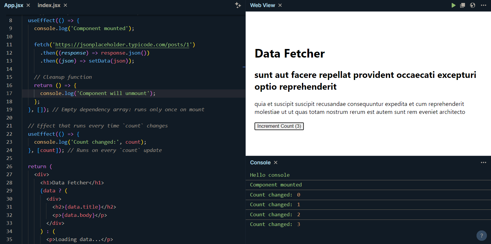

[🏠 Home](../../../../../README.md)

<a href="../React.js.md">

React Home
</a>

---

<h1>12. React `useEffect` Hook</h1>

## Index

---

## What is useEffect?

- The `useEffect` hook lets you perform side effects in functional components.
- Side effects are tasks like fetching data, manually updating the DOM, or subscribing and unsubscribing to external data sources, which are outside the scope of React's pure rendering.

---

## How Does useEffect Work?

**Syntax:**

```js
useEffect(() => {
  // Your side-effect code here

  return () => {
    // Optional cleanup code here
  };
}, [dependencies]);
```

- **Effect function:** The main function that contains the side effect code.
- **Cleanup function:** An optional function returned by the effect function, used to clean up resources when the component unmounts.
- **Dependencies:** An array of values that, when changed, cause the effect to re-run. If the array is empty, the effect runs only once after the initial render.

---

## Basic Example of `useEffect`

Let’s create an example component that uses `useEffect` to demonstrate:

- **Component Mount:** Runs an effect once when the component mounts.
- **Dependency Update:** Runs an effect every time a specific state changes.
- **Cleanup on Unmount:** Executes cleanup when the component unmounts.

In this example, we’ll create a component that fetches data from an API and displays it.

```js
import React, { useState, useEffect } from 'react';

function DataFetcher() {
  const [data, setData] = useState(null); // State to store fetched data
  const [count, setCount] = useState(0);  // State for count to trigger re-renders

  // Effect to fetch data when the component mounts
  useEffect(() => {
    console.log('Component mounted');

    fetch('https://jsonplaceholder.typicode.com/posts/1')
      .then((response) => response.json())
      .then((json) => setData(json));

    // Cleanup function
    return () => {
      console.log('Component will unmount');
    };
  }, []); // Empty dependency array: runs only once on mount

  // Effect that runs every time `count` changes
  useEffect(() => {
    console.log('Count changed:', count);
  }, [count]); // Runs on every `count` update

  return (
    <div>
      <h1>Data Fetcher</h1>
      {data ? (
        <div>
          <h2>{data.title}</h2>
          <p>{data.body}</p>
        </div>
      ) : (
        <p>Loading data...</p>
      )}
      <button onClick={() => setCount(count + 1)}>Increment Count ({count})</button>
    </div>
  );
}

export default DataFetcher;
```

---

## Explanation of Each Line in the Code

1. `import React, { useState, useEffect } from 'react';`

   - We import `React`, `useState` for managing local state, and `useEffect` for handling side effects.

2. `function DataFetcher()`

   - Defines a functional component named `DataFetcher`.

3. `const [data, setData] = useState(null);`

   - Declares a piece of state `data` to store the fetched API data, initializing it to `null`.

4. `const [count, setCount] = useState(0);`

   - Declares a `count` state to keep track of button clicks and trigger re-renders when updated.

5. `useEffect(() => {...}, []);`

   - This `useEffect` hook runs only once when the component mounts.
   - It logs "Component mounted" and then fetches data from an API.
   - When the data is fetched, it updates the data state using `setData(json)`.
   - **Cleanup Function:** The `return () => {...}` function logs "Component will unmount" when the component is about to unmount.

6. `useEffect(() => {...}, [count]);`

   - This `useEffect` runs every time `count` changes. It logs the new value of `count` each time the button is clicked.
   - **Dependency Array:** By including `[count]` in the dependency array, this effect re-runs whenever count changes.

7. `<button onClick={() => setCount(count + 1)}>Increment Count ({count})</button>`

   - A button that increments the count state each time it’s clicked, triggering a re-render and re-running the second `useEffect`.

---

## Component Lifecycle and useEffect

- **Mount:** The first `useEffect` (with an empty dependency array) runs once after the initial render, logging "Component mounted" and fetching data.
- `Update:` Every time `count` changes, the second `useEffect` runs, logging the new `count`.
- **Unmount:** When the component is removed from the DOM, the cleanup function of the first `useEffect` runs, logging "Component will unmount".

---

## Output



- Initial Render:
  - The component fetches data, and while it's loading, you’ll see:
	```
	Data Fetcher
	Loading data...
	[Increment Count (0)]
	```
  - After the data is fetched, it displays the data from the API and shows the initial count:
	```
	Data Fetcher
	Title of the post
	Body of the post
	[Increment Count (0)]
	```
- After Clicking "Increment Count":
  - Each click increases count by 1, and useEffect logs the updated count to the console without re-fetching the data:
	```
	Count changed: 1
	Count changed: 2
	```
---

[🏠 Home](../../../../../README.md)

<a href="../React.js.md">

React Home
</a>
