<a href="../../../README.md">🏠 Home</a><br/>
<a href="../React.js.md">

React Home
</a>

<hr/>

<h1>2. React Tic-Tac-Toe (Tutorial)</h1>

- [Overview](#overview)
  - [What are you building?](#what-are-you-building)
- [Setup for the tutorial](#setup-for-the-tutorial)
- [Getting Started](#getting-started)
  - [Inspecting the starter code](#inspecting-the-starter-code)
    - [`App.js `](#appjs-)
    - [`styles.css`](#stylescss)
    - [`index.js`](#indexjs)
  - [Building the board](#building-the-board)
  - [Passing data through props](#passing-data-through-props)
  - [Making an interactive component](#making-an-interactive-component)
  - [React Developer Tools](#react-developer-tools)
- [Completing the game](#completing-the-game)
  - [Lifting state up](#lifting-state-up)
  - [Why immutability is important](#why-immutability-is-important)
  - [Taking turns](#taking-turns)
  - [Declaring a winner](#declaring-a-winner)
- [Adding time travel](#adding-time-travel)
  - [Storing a history of moves](#storing-a-history-of-moves)
  - [Lifting state up, again](#lifting-state-up-again)

<hr/>

## Overview

You will build a small tic-tac-toe game during this tutorial. This tutorial does not assume any existing React knowledge. The techniques you’ll learn in the tutorial are fundamental to building any React app, and fully understanding it will give you a deep understanding of React.

**NOTE**

This tutorial is designed for people who prefer to learn by doing and want to quickly try making something tangible. If you prefer learning each concept step by step, start with [Describing the UI](./5.%20React%20-%20Describing%20UI.md).

The tutorial is divided into several sections:

1. Setup for the tutorial will give you a starting point to follow the tutorial.
2. Overview will teach you the fundamentals of React: components, props, and state.
3. Completing the game will teach you the most common techniques in React development.
4. Adding time travel will give you a deeper insight into the unique strengths of React.

### What are you building? 
In this tutorial, you’ll build an interactive tic-tac-toe game with React.

You can see what it will look like when you’re finished here:

[Code Sand Box 👨‍💻](https://codesandbox.io/s/q2z497?file=%2Fsrc%2FApp.js&utm_medium=sandpack)

[Pay 🕹️](https://q2z497.csb.app/)

App.js
```js
import { useState } from 'react';

function Square({ value, onSquareClick }) {
  return (
    <button className="square" onClick={onSquareClick}>
      {value}
    </button>
  );
}

function Board({ xIsNext, squares, onPlay }) {
  function handleClick(i) {
    if (calculateWinner(squares) || squares[i]) {
      return;
    }
    const nextSquares = squares.slice();
    if (xIsNext) {
      nextSquares[i] = 'X';
    } else {
      nextSquares[i] = 'O';
    }
    onPlay(nextSquares);
  }

  const winner = calculateWinner(squares);
  let status;
  if (winner) {
    status = 'Winner: ' + winner;
  } else {
    status = 'Next player: ' + (xIsNext ? 'X' : 'O');
  }

  return (
    <>
      <div className="status">{status}</div>
      <div className="board-row">
        <Square value={squares[0]} onSquareClick={() => handleClick(0)} />
        <Square value={squares[1]} onSquareClick={() => handleClick(1)} />
        <Square value={squares[2]} onSquareClick={() => handleClick(2)} />
      </div>
      <div className="board-row">
        <Square value={squares[3]} onSquareClick={() => handleClick(3)} />
        <Square value={squares[4]} onSquareClick={() => handleClick(4)} />
        <Square value={squares[5]} onSquareClick={() => handleClick(5)} />
      </div>
      <div className="board-row">
        <Square value={squares[6]} onSquareClick={() => handleClick(6)} />
        <Square value={squares[7]} onSquareClick={() => handleClick(7)} />
        <Square value={squares[8]} onSquareClick={() => handleClick(8)} />
      </div>
    </>
  );
}

export default function Game() {
  const [history, setHistory] = useState([Array(9).fill(null)]);
  const [currentMove, setCurrentMove] = useState(0);
  const xIsNext = currentMove % 2 === 0;
  const currentSquares = history[currentMove];

  function handlePlay(nextSquares) {
    const nextHistory = [...history.slice(0, currentMove + 1), nextSquares];
    setHistory(nextHistory);
    setCurrentMove(nextHistory.length - 1);
  }

  function jumpTo(nextMove) {
    setCurrentMove(nextMove);
  }

  const moves = history.map((squares, move) => {
    let description;
    if (move > 0) {
      description = 'Go to move #' + move;
    } else {
      description = 'Go to game start';
    }
    return (
      <li key={move}>
        <button onClick={() => jumpTo(move)}>{description}</button>
      </li>
    );
  });

  return (
    <div className="game">
      <div className="game-board">
        <Board xIsNext={xIsNext} squares={currentSquares} onPlay={handlePlay} />
      </div>
      <div className="game-info">
        <ol>{moves}</ol>
      </div>
    </div>
  );
}

function calculateWinner(squares) {
  const lines = [
    [0, 1, 2],
    [3, 4, 5],
    [6, 7, 8],
    [0, 3, 6],
    [1, 4, 7],
    [2, 5, 8],
    [0, 4, 8],
    [2, 4, 6],
  ];
  for (let i = 0; i < lines.length; i++) {
    const [a, b, c] = lines[i];
    if (squares[a] && squares[a] === squares[b] && squares[a] === squares[c]) {
      return squares[a];
    }
  }
  return null;
}
```

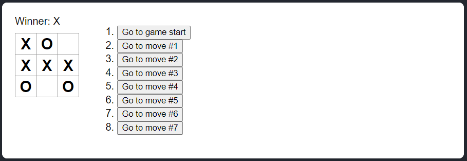

[Code Sand Box 👨‍💻](https://codesandbox.io/s/q2z497?file=%2Fsrc%2FApp.js&utm_medium=sandpack)

[Pay 🕹️](https://q2z497.csb.app/)

If the code doesn’t make sense to you yet, or if you are unfamiliar with the code’s syntax, don’t worry! The goal of this tutorial is to help you understand React and its syntax.

We recommend that you check out the tic-tac-toe game above before continuing with the tutorial. One of the features that you’ll notice is that there is a numbered list to the right of the game’s board. This list gives you a history of all of the moves that have occurred in the game, and it is updated as the game progresses.

Once you’ve played around with the finished tic-tac-toe game, keep scrolling. You’ll start with a simpler template in this tutorial. Our next step is to set you up so that you can start building the game.

## Setup for the tutorial 

In the live code editor below, click ***Fork*** in the top-right corner to open the editor in a new tab using the website ***CodeSandbox***. ***CodeSandbox*** lets you write code in your browser and preview how your users will see the app you’ve created. The new tab should display an empty square and the starter code for this tutorial.

App.js

```js
export default function Square() {
  return <button className="square">X</button>;
}
```

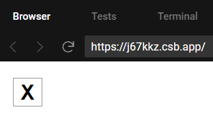

<hr/>

**NOTE**

You can also follow this tutorial using your local development environment. To do this, you need to:

1. Install [Node.js](https://nodejs.org/en/)
2. In the CodeSandbox tab you opened earlier, press the top-left corner button to open the menu, and then choose **Download Sandbox** in that menu to download an archive of the files locally
3. Unzip the archive, then open a terminal and `cd` to the directory you unzipped
4. Install the dependencies with `npm install`
5. Run `npm start` to start a local server and follow the prompts to view the code running in a browser

If you get stuck, don’t let this stop you! Follow along online instead and try a local setup again later.

<hr/>

## Getting Started

Now that you’re set up, let’s get an overview of React!

### Inspecting the starter code 

In CodeSandbox you’ll see three main sections:

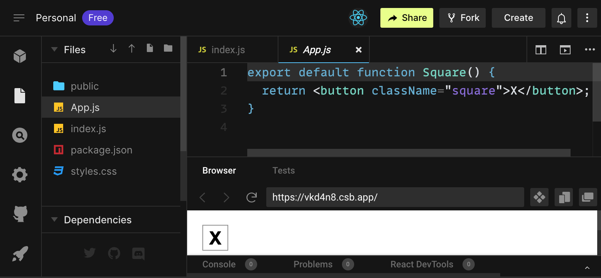

1. The *Files* section with a list of files like `App.js`, `index.js`, `styles.css` and a folder called `public`
2. The *code* editor where you’ll see the source code of your selected file
3. The *browser* section where you’ll see how the code you’ve written will be displayed

The `App.js` file should be selected in the *Files* section. The contents of that file in the *code editor* should be:

```js
export default function Square() {
  return <button className="square">X</button>;
}
```

The browser section should be displaying a square with a X in it like this:


Now let’s have a look at the files in the starter code.

#### `App.js `

The code in `App.js` creates a *component*. In React, a *component* is a piece of reusable code that represents a part of a user interface. Components are used to render, manage, and update the UI elements in your application. Let’s look at the *component* line by line to see what’s going on:

```js
1. export default function Square() {
2.   return <button className="square">X</button>;
3. }
```

- 1st Line: 
  - The first line defines a function called `Square`. 
  - The `export` JavaScript keyword makes this function accessible outside of this file. 
  - The `default` keyword tells other files using your code that it’s the main function in your file.
- 2nd Line:
  - The second line returns a button. 
  - The `return` JavaScript keyword means whatever comes after is returned as a value to the caller of the function. 
  - `<button>` is a JSX element. 
  - A JSX element is a combination of JavaScript code and HTML tags that describes what you’d like to display. 
  - `className="square"` is a button property or prop that tells CSS how to style the button. 
  - `X` is the text displayed inside of the button and `</button>` closes the JSX element to indicate that any following content shouldn’t be placed inside the button.

#### `styles.css`

Click on the file labeled `styles.css` in the Files section of CodeSandbox. This file defines the styles for your React app. The first two CSS selectors (`*` and `body`) define the style of large parts of your app while the `.square` selector defines the style of any component where the `className` property is set to `square`. In your code, that would match the button from your Square component in the `App.js` file.

#### `index.js`

Click on the file labeled `index.js` in the Files section of CodeSandbox. You won’t be editing this file during the tutorial but it is the bridge between the component you created in the `App.js` file and the web browser.

```js
import { StrictMode } from 'react';
import { createRoot } from 'react-dom/client';
import './styles.css';

import App from './App';
```

Lines 1-5 bring all the necessary pieces together:

- React
- React’s library to talk to web browsers (React DOM)
- the styles for your components
- the component you created in App.js.

The remainder of the file brings all the pieces together and injects the final product into `index.html` in the `public`folder.

### Building the board 

Let’s get back to `App.js`. This is where you’ll spend the rest of the tutorial.

Currently the board is only a single square, but you need nine! If you just try and copy paste your square to make two squares like this:

```js
export default function Square() {
  return (
		<button className="square">X</button>
		<button className="square">X</button>
	)
}
```

You’ll get this error:

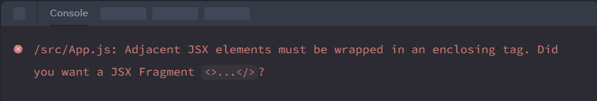

React components need to return a single JSX element and not multiple adjacent JSX elements like two buttons. To fix this you can use Fragments (`<>` and `</>`) to wrap multiple adjacent JSX elements like this:

```js
export default function Square() {
  return (
    <>
      <button className="square">X</button>
      <button className="square">X</button>
    </>
  );
}
```
Now you should see:

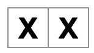

Great! Now you just need to copy-paste a few times to add nine squares and ...

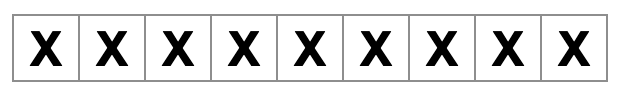

Oh no! The squares are all in a single line, not in a grid like you need for our board. To fix this you’ll need to group your squares into rows with `div`s and add some CSS classes. While you’re at it, you’ll give each square a number to make sure you know where each square is displayed.

In the `App.js` file, update the `Square` component to look like this:

```js
export default function Square() {
  return (
    <>
      <div className="board-row">
        <button className="square">1</button>
        <button className="square">2</button>
        <button className="square">3</button>
      </div>
      <div className="board-row">
        <button className="square">4</button>
        <button className="square">5</button>
        <button className="square">6</button>
      </div>
      <div className="board-row">
        <button className="square">7</button>
        <button className="square">8</button>
        <button className="square">9</button>
      </div>
    </>
  );
}
```

The CSS defined in `styles.css` styles the `div`s with the `className` of `board-row`. Now that you’ve grouped your components into rows with the styled `div`s you have your tic-tac-toe board:

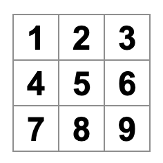

But you now have a problem. Your component named `Square`, really isn’t a square anymore. Let’s fix that by changing the name to `Board`:

```js
export default function Board() {
  //...
}
```

At this point your code should look something like this:

App.js

```js
export default function Board() {
  return (
    <>
      <div className="board-row">
        <button className="square">1</button>
        <button className="square">2</button>
        <button className="square">3</button>
      </div>
      <div className="board-row">
        <button className="square">4</button>
        <button className="square">5</button>
        <button className="square">6</button>
      </div>
      <div className="board-row">
        <button className="square">7</button>
        <button className="square">8</button>
        <button className="square">9</button>
      </div>
    </>
  );
}
```


### Passing data through props 

Next, you’ll want to change the value of a square from empty to “X” when the user clicks on the square. With how you’ve built the board so far you would need to copy-paste the code that updates the square nine times (once for each square you have)! Instead of copy-pasting, React’s component architecture allows you to create a reusable component to avoid messy, duplicated code.

First, you are going to copy the line defining your first square (`<button className="square">1</button>`) from your Board component into a new Square component:

```js
function Square() {
  return <button className="square">1</button>;
}

export default function Board() {
  // ...
}
```

Then you’ll update the Board component to render that `Square` component using JSX syntax:

```js
function Square() {
  return <button className="square">1</button>;
}

export default function Board() {
  return (
    <>
      <div className="board-row">
        <Square />
        <Square />
        <Square />
      </div>
      <div className="board-row">
        <Square />
        <Square />
        <Square />
      </div>
      <div className="board-row">
        <Square />
        <Square />
        <Square />
      </div>
    </>
  );
}
```

<hr/>

**NOTE:** that how unlike the browser `div`s, your own components **Board** and **Square** must start with a capital letter.

<hr/>

Till now the output is:

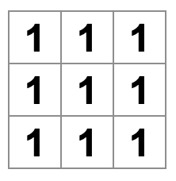

Oh no! You lost the numbered squares you had before. Now each square says “1”. To fix this, you will use ***props*** to pass the value to each square such that each `Square` should have the value from the parent component ie. (`Board`) to its child (`Square`).

Update the `Square` component to read the `value` prop that you’ll pass from the `Board`:

```js
function Square({ value }) {
  return <button className="square">1</button>;
}
```

`function Square({ value })` indicates the `Square` component can be passed/received a prop called `value`.

Now you want to display that `value` instead of `1` inside every square. 

Try doing it like this:

```js
function Square({ value }) {
  return <button className="square">value</button>;
}
```
Oops, this is not what you wanted:


You wanted to render the JavaScript variable called `value` from your component, not the word “value”. To “escape into JavaScript” from JSX, you need curly braces. Add curly braces around `value` in JSX like so:

```js
function Square({ value }) {
  return <button className="square">{value}</button>;
}
```

For now, you should see an empty board:

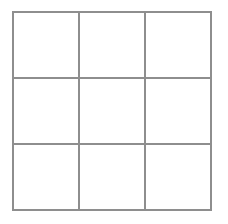

This is because the `Board` component hasn’t passed the `value` prop to each `Square` component it renders yet. To fix it you’ll add the value prop to each `Square` component rendered by the `Board` component:

```js
export default function Board() {
  return (
    <>
      <div className="board-row">
        <Square value="1" />
        <Square value="2" />
        <Square value="3" />
      </div>
      <div className="board-row">
        <Square value="4" />
        <Square value="5" />
        <Square value="6" />
      </div>
      <div className="board-row">
        <Square value="7" />
        <Square value="8" />
        <Square value="9" />
      </div>
    </>
  );
}
```
Now you should see a grid of numbers again:


Your updated code should look like this:

App.js
```js
function Square({ value }) {
  return <button className="square">{value}</button>;
}

export default function Board() {
  return (
    <>
      <div className="board-row">
        <Square value="1" />
        <Square value="2" />
        <Square value="3" />
      </div>
      <div className="board-row">
        <Square value="4" />
        <Square value="5" />
        <Square value="6" />
      </div>
      <div className="board-row">
        <Square value="7" />
        <Square value="8" />
        <Square value="9" />
      </div>
    </>
  );
}
```


### Making an interactive component

Let’s fill the `Square` component with an `X` when you click it. Declare a function called `handleClick` inside of the `Square`. Then, add `onClick` to the props of the button JSX element returned from the `Square`:

```js
function Square({ value }) {
  function handleClick() {
    console.log('clicked!');
  }

  return (
    <button
      className="square"
      onClick={handleClick}
    >
      {value}
    </button>
  );
}
```

If you click on a square now, you should see a log saying `"clicked!"` in the Console tab at the bottom of the Browser section in CodeSandbox. Clicking the square more than once will log `"clicked!"` again. Repeated console logs with the same message will not create more lines in the console. Instead, you will see an incrementing counter next to your first `"clicked!"` log.

<hr/>

**⚠️ NOTE ⚠️**

If you are following this tutorial using your local development environment, you need to open your browser’s Console. For example, if you use the Chrome browser, you can view the Console with the keyboard shortcut Shift + Ctrl + J (on Windows/Linux) or Option + ⌘ + J (on macOS).

<hr/>

As a next step, you want the Square component to “remember” that it got clicked, and fill it with an “X” mark. To “remember” things, components use state.

React provides a special function called `useState` that you can call from your component to let it “remember” things. Let’s store the current value of the `Square` in state, and change it when the `Square` is clicked.

Import `useState` at the top of the file. Remove the `value` prop from the `Square` component. Instead, add a new line at the start of the `Square` that calls `useState`. Have it return a state variable called value:

```js
import { useState } from 'react';

function Square() {
  const [value, setValue] = useState(null);

  function handleClick() {
    //...
```

`value` stores the value and `setValue` is a function that can be used to change the value. 
The `null` passed to `useState` is used as the initial value for this state variable, so `value` here starts off equal to `null`.

Since the `Square` component no longer accepts props anymore, you’ll remove the `value` prop from all nine of the Square components created by the Board component:

```js
// ...
export default function Board() {
  return (
    <>
      <div className="board-row">
        <Square />
        <Square />
        <Square />
      </div>
      <div className="board-row">
        <Square />
        <Square />
        <Square />
      </div>
      <div className="board-row">
        <Square />
        <Square />
        <Square />
      </div>
    </>
  );
}
```

Now you’ll change `Square` to display an “X” when clicked. Replace the `console.log("clicked!");` event handler with `setValue('X');`. Now your Square component looks like this:

```js
function Square() {
  const [value, setValue] = useState(null);

  function handleClick() {
    setValue('X');
  }

  return (
    <button
      className="square"
      onClick={handleClick}
    >
      {value}
    </button>
  );
}
```

By calling this `set` function from an `onClick` handler, you’re telling React to re-render that `Square` whenever its `<button>` is clicked. After the update, the `Square`’s `value` will be `'X'`, so you’ll see the “X” on the game board. Click on any Square, and “X” should show up:

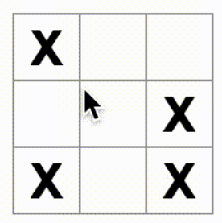

Each Square has its own state: the `value` stored in each Square is completely independent of the others. When you call a `set` function in a component, React automatically updates the child components inside too.

After you’ve made the above changes, your code will look like this:

App.js

```js
import { useState } from 'react';

function Square() {
  const [value, setValue] = useState(null);

  function handleClick() {
    setValue('X');
  }

  return (
    <button
      className="square"
      onClick={handleClick}
    >
      {value}
    </button>
  );
}

export default function Board() {
  return (
    <>
      <div className="board-row">
        <Square />
        <Square />
        <Square />
      </div>
      <div className="board-row">
        <Square />
        <Square />
        <Square />
      </div>
      <div className="board-row">
        <Square />
        <Square />
        <Square />
      </div>
    </>
  );
}
```

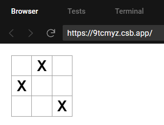

### React Developer Tools 

React DevTools let you check the props and the state of your React components. You can find the React DevTools tab at the bottom of the browser section in CodeSandbox:

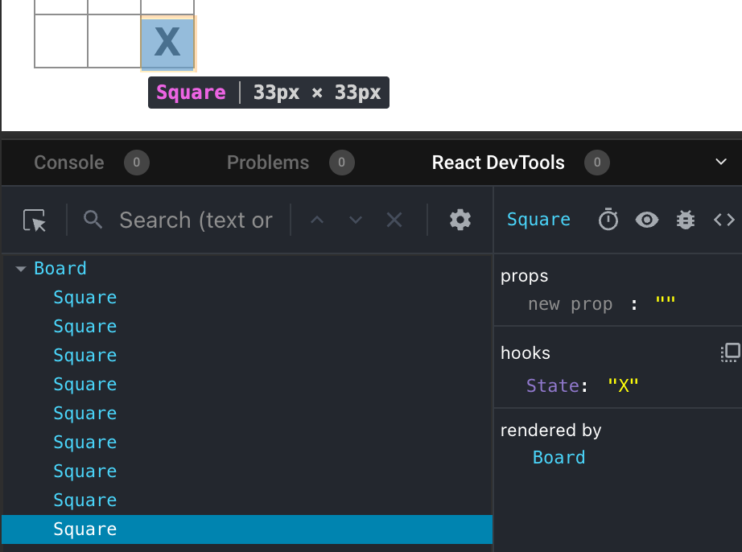

<hr/>

**⚠️ NOTE ⚠️**

For local development, React DevTools is available as a Chrome, Firefox, and Edge browser extension. Install it, and the Components tab will appear in your browser Developer Tools for sites using React.

<hr/>

## Completing the game 

By this point, you have all the basic building blocks for your tic-tac-toe game. To have a complete game, you now need to alternate placing “X”s and “O”s on the board, and you need a way to determine a winner.

### Lifting state up 

Currently, each Square component maintains a part of the game’s state. To check for a winner in a tic-tac-toe game, the Board would need to somehow know the state of each of the 9 Square components.

How would you approach that? At first, you might guess that the Board needs to “ask” each Square for that Square’s state. Although this approach is technically possible in React, we discourage it because the code becomes difficult to understand, susceptible to bugs, and hard to refactor. Instead, the best approach is to store the game’s state in the parent Board component instead of in each Square. The Board component can tell each Square what to display by passing a prop, like you did when you passed a number to each Square.

To collect data from multiple children, or to have two child components communicate with each other, declare the shared state in their parent component instead. The parent component can pass that state back down to the children via props. This keeps the child components in sync with each other and with their parent.

Lifting state into a parent component is common when React components are refactored.

Let’s take this opportunity to try it out. Edit the Board component so that it declares a state variable named squares that defaults to an array of 9 nulls corresponding to the 9 squares:

```js
// ...
export default function Board() {
  const [squares, setSquares] = useState(Array(9).fill(null));
  return (
    // ...
  );
}
```

`Array(9).fill(null)` creates an array with nine elements and sets each of them to `null`. The `useState()` call around it declares a `squares` state variable that’s initially set to that array. Each entry in the array corresponds to the value of a square. When you fill the board in later, the `squares` array will look like this:

```js
['O', null, 'X', 'X', 'X', 'O', 'O', null, null]
```

Now your `Board` component needs to pass the `value` prop down to each `Square` that it renders:

```js
export default function Board() {
  const [squares, setSquares] = useState(Array(9).fill(null));
  return (
    <>
      <div className="board-row">
        <Square value={squares[0]} />
        <Square value={squares[1]} />
        <Square value={squares[2]} />
      </div>
      <div className="board-row">
        <Square value={squares[3]} />
        <Square value={squares[4]} />
        <Square value={squares[5]} />
      </div>
      <div className="board-row">
        <Square value={squares[6]} />
        <Square value={squares[7]} />
        <Square value={squares[8]} />
      </div>
    </>
  );
}
```

Next, you’ll edit the `Square` component to receive the `value` prop from the `Board` component. This will require removing the `Square` component’s own stateful tracking of `value` and the button’s `onClick` prop:

```js
function Square({value}) {
  return <button className="square">{value}</button>;
}
```

At this point you should see an empty tic-tac-toe board:


And your code should look like this:

App.js

```js
import { useState } from 'react';

function Square({ value }) {
  return <button className="square">{value}</button>;
}

export default function Board() {
  const [squares, setSquares] = useState(Array(9).fill(null));
  return (
    <>
      <div className="board-row">
        <Square value={squares[0]} />
        <Square value={squares[1]} />
        <Square value={squares[2]} />
      </div>
      <div className="board-row">
        <Square value={squares[3]} />
        <Square value={squares[4]} />
        <Square value={squares[5]} />
      </div>
      <div className="board-row">
        <Square value={squares[6]} />
        <Square value={squares[7]} />
        <Square value={squares[8]} />
      </div>
    </>
  );
}
```

Each Square will now receive a `value` prop that will either be `'X'`, `'O'`, or `null` for empty squares.

Next, you need to change what happens when a `Square` is clicked. The `Board` component now maintains which squares are filled. You’ll need to create a way for the `Square` to update the `Board`’s state. Since state is private to a component that defines it, you cannot update the `Board`’s state directly from Square.

Instead, you’ll pass down a function from the `Board` component to the `Square` component, and you’ll have `Square` call that function when a square is clicked. You’ll start with the function that the `Square` component will call when it is clicked. 

So You’ll call that function `onSquareClick` and then you’ll add the `onSquareClick` function to the `Square` component’s props:

```js
function Square({ value, onSquareClick }) {
  return (
    <button className="square" onClick={onSquareClick}>
      {value}
    </button>
  );
}
```

Now you’ll connect the `onSquareClick` prop to a function in the `Board` component that you’ll name `handleClick`. To connect `onSquareClick` to `handleClick` you’ll pass a function to the `onSquareClick` prop of the first `Square` component:

```js
export default function Board() {
  const [squares, setSquares] = useState(Array(9).fill(null));

  return (
    <>
      <div className="board-row">
        <Square value={squares[0]} onSquareClick={handleClick} />
        //...
  );
}
```

Lastly, you will define the `handleClick` function inside the `Board` component to update the `squares` array holding your board’s state:

```js
export default function Board() {
  const [squares, setSquares] = useState(Array(9).fill(null));

  function handleClick() {
    const nextSquares = squares.slice();
    nextSquares[0] = "X";
    setSquares(nextSquares);
  }

  return (
    // ...
  )
}
```

The `handleClick` function creates a copy of the `squares` array (`nextSquares`) with the JavaScript `slice()` Array method. Then, `handleClick` updates the `nextSquares` array to add `X` to the first (`[0]` index) square.

Calling the `setSquares` function lets React know the state of the component has changed. This will trigger a re-render of the components that use the squares state (Board) as well as its child components (the Square components that make up the board).

<hr/>

**⚠️ NOTE ⚠️**

JavaScript supports closures which means an inner function (e.g. `handleClick`) has access to variables and functions defined in a outer function (e.g. `Board`). The `handleClick` function can read the `squares` state and call the `setSquares` method because they are both defined inside of the `Board` function.

<hr/>

Now you can add X’s to the board…  but only to the upper left square. Your handleClick function is hardcoded to update the index for the upper left square (`0`). Let’s update `handleClick` to be able to update any square. Add an argument `i` to the `handleClick` function that takes the index of the square to update:

```js
export default function Board() {
  const [squares, setSquares] = useState(Array(9).fill(null));

  function handleClick(i) {
    const nextSquares = squares.slice();
    nextSquares[i] = "X";
    setSquares(nextSquares);
  }

  return (
    // ...
  )
}
```

Next, you will need to pass that i to `handleClick`. You could try to set the `onSquareClick` prop of square to be `handleClick(0)` directly in the JSX like this, but it won’t work:

```js
<Square value={squares[0]} onSquareClick={handleClick(0)} />
```

Here is why this doesn’t work. The `handleClick(0)` call will be a part of rendering the board component. Because `handleClick(0)` alters the state of the board component by calling `setSquares`, your entire board component will be re-rendered again. But this runs `handleClick(0)` again, leading to an infinite loop:

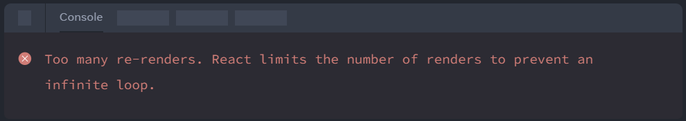

**Why didn’t this problem happen earlier?**

When you were passing `onSquareClick={handleClick}`, you were passing the `handleClick` function down as a prop. You were not calling it! But now you are calling that function right away — notice the parentheses in `handleClick(0)` — and that’s why it runs too early. You don’t want to call `handleClick` until the user clicks!

You could fix this by creating a function like `handleFirstSquareClick` that calls `handleClick(0)`, a function like `handleSecondSquareClick` that calls `handleClick(1)`, and so on. You would pass (rather than call) these functions down as props like `onSquareClick={handleFirstSquareClick}`. This would solve the infinite loop.

However, defining nine different functions and giving each of them a name is too verbose. Instead, let’s do this:

```js
export default function Board() {
  // ...
  return (
    <>
      <div className="board-row">
        <Square value={squares[0]} onSquareClick={() => handleClick(0)} />
        // ...
  );
}
```

Notice the new `() =>` syntax. Here, `() => handleClick(0)` is an arrow function, which is a shorter way to define functions. When the square is clicked, the code after the `=>` “arrow” will run, calling `handleClick(0)`.

Now you need to update the other eight squares to call `handleClick` from the arrow functions you pass. Make sure that the argument for each call of the `handleClick` corresponds to the index of the correct square:

```js
export default function Board() {
  // ...
  return (
    <>
      <div className="board-row">
        <Square value={squares[0]} onSquareClick={() => handleClick(0)} />
        <Square value={squares[1]} onSquareClick={() => handleClick(1)} />
        <Square value={squares[2]} onSquareClick={() => handleClick(2)} />
      </div>
      <div className="board-row">
        <Square value={squares[3]} onSquareClick={() => handleClick(3)} />
        <Square value={squares[4]} onSquareClick={() => handleClick(4)} />
        <Square value={squares[5]} onSquareClick={() => handleClick(5)} />
      </div>
      <div className="board-row">
        <Square value={squares[6]} onSquareClick={() => handleClick(6)} />
        <Square value={squares[7]} onSquareClick={() => handleClick(7)} />
        <Square value={squares[8]} onSquareClick={() => handleClick(8)} />
      </div>
    </>
  );
};
```
Now you can again add X’s to any square on the board by clicking on them:


But this time all the state management is handled by the Board component!

This is what your code should look like:

App.js

```js
import { useState } from 'react';

function Square({ value, onSquareClick }) {
  return (
    <button className="square" onClick={onSquareClick}>
      {value}
    </button>
  );
}

export default function Board() {
  const [squares, setSquares] = useState(Array(9).fill(null));

  function handleClick(i) {
    const nextSquares = squares.slice();
    nextSquares[i] = 'X';
    setSquares(nextSquares);
  }

  return (
    <>
      <div className="board-row">
        <Square value={squares[0]} onSquareClick={() => handleClick(0)} />
        <Square value={squares[1]} onSquareClick={() => handleClick(1)} />
        <Square value={squares[2]} onSquareClick={() => handleClick(2)} />
      </div>
      <div className="board-row">
        <Square value={squares[3]} onSquareClick={() => handleClick(3)} />
        <Square value={squares[4]} onSquareClick={() => handleClick(4)} />
        <Square value={squares[5]} onSquareClick={() => handleClick(5)} />
      </div>
      <div className="board-row">
        <Square value={squares[6]} onSquareClick={() => handleClick(6)} />
        <Square value={squares[7]} onSquareClick={() => handleClick(7)} />
        <Square value={squares[8]} onSquareClick={() => handleClick(8)} />
      </div>
    </>
  );
}
```

Now that your state handling is in the `Board` component, the parent `Board` component passes props to the child `Square` components so that they can be displayed correctly. When clicking on a `Square`, the child `Square` component now asks the parent `Board` component to update the state of the board. When the Board’s state changes, both the `Board` component and every child `Square` re-renders automatically. Keeping the state of all squares in the `Board` component will allow it to determine the winner in the future.

Let’s recap what happens when a user clicks the top left square on your board to add an `X` to it:

1. Clicking on the upper left square runs the function that the button received as its `onClick` prop from the `Square`. The `Square` component received that function as its `onSquareClick` prop from the `Board`. The `Board` component defined that function directly in the JSX. It calls `handleClick` with an argument of `0`.
2. `handleClick` uses the argument (`0`) to update the first element of the squares array from `null` to `X`.
3. The `squares` state of the `Board` component was updated, so the `Board` and all of its children re-render. This causes the value prop of the `Square` component with index `0` to change from `null` to `X`.

In the end the user sees that the upper left square has changed from empty to having a `X` after clicking it.

<hr/>

⚠️ NOTE ⚠️

The DOM `<button>` element’s `onClick` attribute has a special meaning to React because it is a built-in component. For custom components like `Square`, the naming is up to you. You could give any name to the `Square`’s `onSquareClick` prop or `Board’s` `handleClick` function, and the code would work the same. In React, it’s conventional to use `onSomething` names for props which represent events and `handleSomething` for the function definitions which handle those events.

<hr/>

### Why immutability is important 

Note how in `handleClick`, you call `.slice()` to create a copy of the `squares` array instead of modifying the existing array. To explain why, we need to discuss immutability and why immutability is important to learn.

There are generally two approaches to changing data. The first approach is to mutate the data by directly changing the data’s values. The second approach is to replace the data with a new copy which has the desired changes. Here is what it would look like if you mutated the `squares` array: 

```js
const squares = [null, null, null, null, null, null, null, null, null];

squares[0] = 'X';

// Now `squares` is 
// ["X", null, null, null, null, null, null, null, null];
```

And here is what it would look like if you changed data without mutating the `squares` array:

```js
const squares = [null, null, null, null, null, null, null, null, null];

const nextSquares = ['X', null, null, null, null, null, null, null, null];

// Now `squares` is unchanged, but `nextSquares` first element is 'X' rather than `null`
```

The result is the same but by not mutating (changing the underlying data) directly, you gain several benefits.

Immutability makes complex features much easier to implement. Later in this tutorial, you will implement a “time travel” feature that lets you review the game’s history and “jump back” to past moves. This functionality isn’t specific to games—an ability to undo and redo certain actions is a common requirement for apps. Avoiding direct data mutation lets you keep previous versions of the data intact, and reuse them later.

There is also another benefit of immutability. By default, all child components re-render automatically when the state of a parent component changes. This includes even the child components that weren’t affected by the change. Although re-rendering is not by itself noticeable to the user (you shouldn’t actively try to avoid it!), you might want to skip re-rendering a part of the tree that clearly wasn’t affected by it for performance reasons. Immutability makes it very cheap for components to compare whether their data has changed or not. You can learn more about how React chooses when to re-render a component in [the memo API reference](https://react.dev/reference/react/memo).

### Taking turns 

It’s now time to fix a major defect in this tic-tac-toe game: the “O”s cannot be marked on the board.

You’ll set the first move to be “X” by default. Let’s keep track of this by adding another piece of state to the Board component:

```js
function Board() {
  const [xIsNext, setXIsNext] = useState(true);
  const [squares, setSquares] = useState(Array(9).fill(null));

  // ...
}
```

Each time a player moves, `xIsNext` (a boolean) will be flipped to determine which player goes next and the game’s state will be saved. You’ll update the Board’s handleClick function to flip the value of `xIsNext`:

```js
export default function Board() {
  const [xIsNext, setXIsNext] = useState(true);
  const [squares, setSquares] = useState(Array(9).fill(null));

  function handleClick(i) {
    const nextSquares = squares.slice();
➡️    if (xIsNext) {
➡️      nextSquares[i] = "X";
➡️    } else {
➡️      nextSquares[i] = "O";
➡️    }
    setSquares(nextSquares);
➡️    setXIsNext(!xIsNext);
  }

  return (
    //...
  );
}
```

Now, as you click on different squares, they will alternate between `X`and `O`, as they should!

But wait, there’s a problem. Try clicking on the same square multiple times:

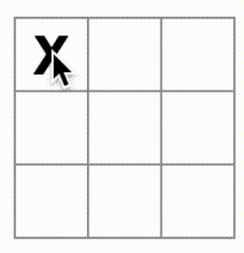
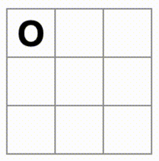


The `X` is overwritten by an `O`! While this would add a very interesting twist to the game, we’re going to stick to the original rules for now.

When you mark a square with a `X` or an `O` you aren’t first checking to see if the square already has a `X` or `O` value. You can fix this by ***returning early***. You’ll check to see if the square already has a `X` or an `O`. If the square is already filled, you will `return` in the `handleClick` function early—before it tries to update the board state.

```js
function handleClick(i) {
➡️  if (squares[i]) {
➡️    return;
➡️  }
  const nextSquares = squares.slice();
  //...
}
```

Now you can only add X’s or O’s to empty squares! Here is what your code should look like at this point:

App.js

```js
import { useState } from 'react';

function Square({value, onSquareClick}) {
  return (
    <button className="square" onClick={onSquareClick}>
      {value}
    </button>
  );
}

export default function Board() {
  const [xIsNext, setXIsNext] = useState(true);
  const [squares, setSquares] = useState(Array(9).fill(null));

  function handleClick(i) {
    if (squares[i]) {
      return;
    }
    const nextSquares = squares.slice();
    if (xIsNext) {
      nextSquares[i] = 'X';
    } else {
      nextSquares[i] = 'O';
    }
    setSquares(nextSquares);
    setXIsNext(!xIsNext);
  }

  return (
    <>
      <div className="board-row">
        <Square value={squares[0]} onSquareClick={() => handleClick(0)} />
        <Square value={squares[1]} onSquareClick={() => handleClick(1)} />
        <Square value={squares[2]} onSquareClick={() => handleClick(2)} />
      </div>
      <div className="board-row">
        <Square value={squares[3]} onSquareClick={() => handleClick(3)} />
        <Square value={squares[4]} onSquareClick={() => handleClick(4)} />
        <Square value={squares[5]} onSquareClick={() => handleClick(5)} />
      </div>
      <div className="board-row">
        <Square value={squares[6]} onSquareClick={() => handleClick(6)} />
        <Square value={squares[7]} onSquareClick={() => handleClick(7)} />
        <Square value={squares[8]} onSquareClick={() => handleClick(8)} />
      </div>
    </>
  );
}
```


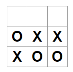

### Declaring a winner

Now that the players can take turns, you’ll want to show when the game is won and there are no more turns to make. To do this you’ll add a helper function called `calculateWinner` that takes an array of 9 squares, checks for a winner and returns `'X'`, `'O'`, or `null` as appropriate. Don’t worry too much about the `calculateWinner` function; it’s not specific to React:

```js
export default function Board() {
  //...
}

function calculateWinner(squares) {
  const lines = [
    [0, 1, 2],
    [3, 4, 5],
    [6, 7, 8],
    [0, 3, 6],
    [1, 4, 7],
    [2, 5, 8],
    [0, 4, 8],
    [2, 4, 6]
  ];
  for (let i = 0; i < lines.length; i++) {
    const [a, b, c] = lines[i];
    if (squares[a] && squares[a] === squares[b] && squares[a] === squares[c]) {
      return squares[a];
    }
  }
  return null;
}
```

<hr/>

**⚠️ NOTE ⚠️**

It does not matter whether you define calculateWinner before or after the Board. Let’s put it at the end so that you don’t have to scroll past it every time you edit your components.
<hr/>

You will call `calculateWinner(squares)` in the `Board` component’s `handleClick` function to check if a player has won. You can perform this check at the same time you check if a user has clicked a square that already has a `X` or and `O`. We’d like to return early in both cases:

```js
function handleClick(i) {
  if (squares[i] || calculateWinner(squares)) {
    return;
  }
  const nextSquares = squares.slice();
  //...
}
```

To let the players know when the game is over, you can display text such as “Winner: X” or “Winner: O”. To do that you’ll add a `status` section to the `Board` component. The status will display the winner if the game is over and if the game is ongoing you’ll display which player’s turn is next:

```js
export default function Board() {
  // ...
➡️  const winner = calculateWinner(squares);
➡️  let status;
➡️  if (winner) {
➡️    status = "Winner: " + winner;
➡️  } else {
➡️    status = "Next player: " + (xIsNext ? "X" : "O");
➡️  }

  return (
    <>
➡️    <div className="status">{status}</div>
      <div className="board-row">
        // ...
  )
}
```

Congratulations! 🎉 You now have a working tic-tac-toe game. And you’ve just learned the basics of React too. So you are the real winner here. Here is what the code should look like:

App.js

```js
import { useState } from 'react';

function Square({value, onSquareClick}) {
  return (
    <button className="square" onClick={onSquareClick}>
      {value}
    </button>
  );
}

export default function Board() {
  const [xIsNext, setXIsNext] = useState(true);
  const [squares, setSquares] = useState(Array(9).fill(null));

  function handleClick(i) {
    if (calculateWinner(squares) || squares[i]) {
      return;
    }
    const nextSquares = squares.slice();
    if (xIsNext) {
      nextSquares[i] = 'X';
    } else {
      nextSquares[i] = 'O';
    }
    setSquares(nextSquares);
    setXIsNext(!xIsNext);
  }

  const winner = calculateWinner(squares);
  let status;
  if (winner) {
    status = 'Winner: ' + winner;
  } else {
    status = 'Next player: ' + (xIsNext ? 'X' : 'O');
  }

  return (
    <>
      <div className="status">{status}</div>
      <div className="board-row">
        <Square value={squares[0]} onSquareClick={() => handleClick(0)} />
        <Square value={squares[1]} onSquareClick={() => handleClick(1)} />
        <Square value={squares[2]} onSquareClick={() => handleClick(2)} />
      </div>
      <div className="board-row">
        <Square value={squares[3]} onSquareClick={() => handleClick(3)} />
        <Square value={squares[4]} onSquareClick={() => handleClick(4)} />
        <Square value={squares[5]} onSquareClick={() => handleClick(5)} />
      </div>
      <div className="board-row">
        <Square value={squares[6]} onSquareClick={() => handleClick(6)} />
        <Square value={squares[7]} onSquareClick={() => handleClick(7)} />
        <Square value={squares[8]} onSquareClick={() => handleClick(8)} />
      </div>
    </>
  );
}

function calculateWinner(squares) {
  const lines = [
    [0, 1, 2],
    [3, 4, 5],
    [6, 7, 8],
    [0, 3, 6],
    [1, 4, 7],
    [2, 5, 8],
    [0, 4, 8],
    [2, 4, 6],
  ];
  for (let i = 0; i < lines.length; i++) {
    const [a, b, c] = lines[i];
    if (squares[a] && squares[a] === squares[b] && squares[a] === squares[c]) {
      return squares[a];
    }
  }
  return null;
}
```

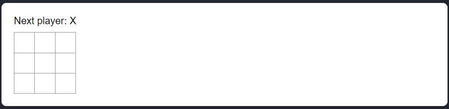
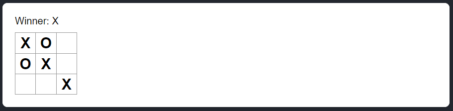

## Adding time travel

As a final exercise, let’s make it possible to “go back in time” to the previous moves in the game.

### Storing a history of moves

If you mutated the `squares` array, implementing time travel would be very difficult.

However, you used `slice()` to create a new copy of the `squares` array after every move, and treated it as immutable. This will allow you to store every past version of the `squares` array, and navigate between the turns that have already happened.

You’ll store the past `squares` arrays in another array called `history`, which you’ll store as a new state variable. The `history` array represents all board states, from the first to the last move, and has a shape like this:

```js
[
  // Before first move
  [null, null, null, null, null, null, null, null, null],
  // After first move
  [null, null, null, null, 'X', null, null, null, null],
  // After second move
  [null, null, null, null, 'X', null, null, null, 'O'],
  // ...
]
```

### Lifting state up, again

You will now write a new top-level component called `Game` to display a list of past moves. That’s where you will place the `history` state that contains the entire game history.

Placing the `history` state into the `Game` component will let you remove the squares state from its child `Board` component. Just like you “lifted state up” from the Square component into the `Board` component, you will now lift it up from the `Board` into the top-level `Game` component. This gives the `Game` component full control over the Board’s data and lets it instruct the `Board` to render previous turns from the `history`.

First, add a `Game` component with `export default`. Have it render the `Board` component and some markup:

```js
➡️ function Board() {
  // ...
}

➡️ export default function Game() {
➡️   return (
➡️     <div className="game">
➡️       <div className="game-board">
➡️         <Board />
➡️       </div>
➡️       <div className="game-info">
➡️         <ol>{/*TODO*/}</ol>
➡️       </div>
➡️     </div>
➡️   );
➡️ }
```

<hr/>

⚠️ NOTE ⚠️

Note that you are removing the `export default` keywords before the `function Board() {` declaration and adding them before the `function Game() {` declaration. This tells your `index.js` file to use the `Game` component as the top-level component instead of your `Board` component. The additional divs returned by the `Game` component are making room for the game information you’ll add to the board later.

Add some state to the `Game` component to track which player is next and the history of moves:

```js
export default function Game() {
    const [xIsNext, setXIsNext] = useState(true);
➡️  const [history, setHistory] = useState([Array(9).fill(null)]);
  // ...
```

Notice how `[Array(9).fill(null)]` is an array with a single item, which itself is an array of 9 `null`s.

To render the squares for the current move, you’ll want to read the last squares array from the `history`. You don’t need `useState` for this—you already have enough information to calculate it during rendering:

```js
export default function Game() {
  const [xIsNext, setXIsNext] = useState(true);
  const [history, setHistory] = useState([Array(9).fill(null)]);
➡️  const currentSquares = history[history.length - 1];
  // ...
```

<hr/>
<hr/>

[🏠 Home](../../../README.md)<br/>
<a href="../React.js.md">

React Home
</a>
