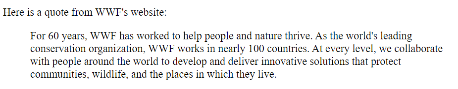
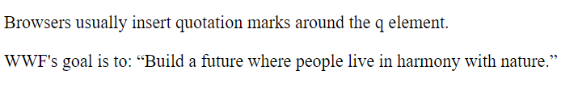
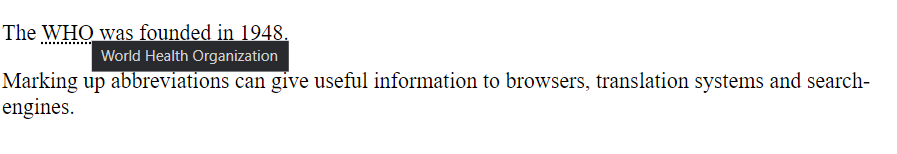
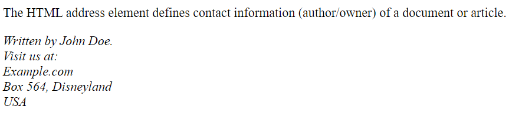
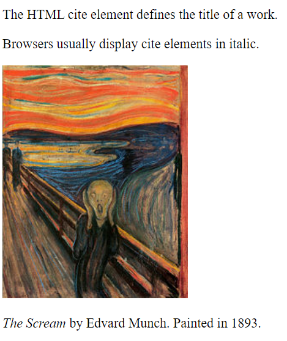
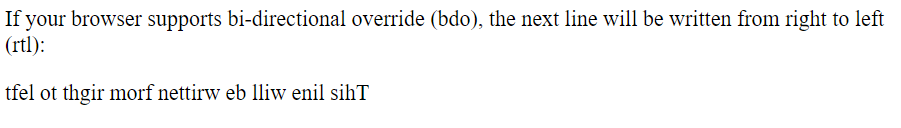

[🏠 Home](../../../README.md)
[🔙 HTML Home](../HTML.md)

<hr>

<h1>5. HTML Quotation and Citation Elements</h1>

## Index 📚
- [Index 📚](#index-)
- [HTML `<blockquote>` for Quotations](#html-blockquote-for-quotations)
- [HTML `<q>` for Short Quotations](#html-q-for-short-quotations)
- [HTML `<abbr>` for Abbreviations](#html-abbr-for-abbreviations)
- [HTML `<address>` for Contact Information](#html-address-for-contact-information)
- [HTML `<cite>` for Work Title](#html-cite-for-work-title)
- [HTML `<bdo>` for Bi-Directional Override](#html-bdo-for-bi-directional-override)

<hr>

## HTML `<blockquote>` for Quotations

The HTML `<blockquote>` element defines a section that is quoted from another source.

Browsers usually indent `<blockquote>` elements.
```html
<blockquote cite="http://www.worldwildlife.org/who/index.html">

For 60 years, WWF has worked to help people and nature thrive. As the world's leading conservation organization, WWF works in nearly 100 countries. At every level, we collaborate with people around the world to develop and deliver innovative solutions that protect communities, wildlife, and the places in which they live.

</blockquote>
```

**Output:**



<hr/>

[⬆️ Back to Top ⬆️](#index)

## HTML `<q>` for Short Quotations

The HTML `<q>` tag defines a short quotation.

Browsers normally insert quotation marks around the quotation.

```html
<p>WWF's goal is to: <q>Build a future where people live in harmony with nature.</q></p>
```

**Output:**



<hr/>

[⬆️ Back to Top ⬆️](#index)

## HTML `<abbr>` for Abbreviations
The HTML `<abbr>` tag defines an abbreviation or an acronym, like "HTML", "CSS", "Mr.", "Dr.", "ASAP", "ATM".

Marking abbreviations can give useful information to browsers, translation systems and search-engines.

Tip: Use the global title attribute to show the description for the abbreviation/acronym when you mouse over the element.

```html
<p>The <abbr title="World Health Organization">WHO</abbr> was founded in 1948.</p>
```

**Output:** when hovered:



<hr/>

[⬆️ Back to Top ⬆️](#index)

## HTML `<address>` for Contact Information
The HTML `<address>` tag defines the contact information for the author/owner of a document or an article.

The contact information can be an email address, URL, physical address, phone number, social media handle, etc.

The text in the `<address>` element usually renders in *italic*, and browsers will always add a line break before and after the `<address>` element.

```html
<address>
Written by John Doe.<br> 
Visit us at:<br>
Example.com<br>
Box 564, Disneyland<br>
USA
</address>
```

**Output:**



<hr/>

[⬆️ Back to Top ⬆️](#index)

## HTML `<cite>` for Work Title

The HTML `<cite>` tag defines the title of a creative work (e.g. a book, a poem, a song, a movie, a painting, a sculpture, etc.).

Note: A person's name is not the title of a work.

The text in the `<cite>` element usually renders in *italic*.

```html

<p><cite>The Scream</cite> by Edvard Munch. Painted in 1893.</p>
```

**Output:**




<hr/>

[⬆️ Back to Top ⬆️](#index)

## HTML `<bdo>` for Bi-Directional Override

BDO stands for Bi-Directional Override.

The HTML `<bdo>` tag is used to override the current text direction:

```html
<bdo dir="rtl">This line will be written from right to left</bdo>
```

**Output:**



<hr/>

[🏠 Home](../../../README.md)
[🔙 HTML Home](../HTML.md)