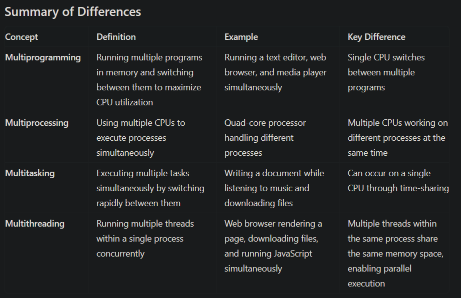

<h1 style="text-align: center">Notes By Shaurya - Operating Systems</h1>

<h2> Table of Content</h2>

- [What is Operating System \& Types of OS](#what-is-operating-system--types-of-os)
- [Program vs Process vs Thread](#program-vs-process-vs-thread)
	- [Program](#program)
	- [Process](#process)
	- [Thread](#thread)
- [Multiprogramming vs Multiprocessing vs Multitasking vs Multithreading](#multiprogramming-vs-multiprocessing-vs-multitasking-vs-multithreading)
	- [Multiprogramming](#multiprogramming)
	- [Multiprocessing](#multiprocessing)
	- [Multitasking](#multitasking)
	- [Multithreading](#multithreading)
	- [Summary](#summary)
- 

## What is Operating System & Types of OS
<ul>
  <li>
    An Operating System is a software that acts as an interface between computer
    hardware and user applications.
  </li>
  <li>
    It manages the resources and provides services for the efficient and secure
    execution of programs.
  </li>
  <li>
    The primary functions of an operating system include process management,
    memory management, file system management, device management and user
    interface.
  </li>
</ul>
<b>Types of OS:</b>
<ol>
  <li>Windows:</li>
  <ul>
    <li>
      Developed by Microsoft (Founder: Bill Gates, Current CEO: Satya Nadella)
    </li>
    <li>Widely used OS personal computers.</li>
  </ul>
  <li>macOS:</li>
  <ul>
    <li>Developed by Apple (Founder: Steve Jobs, Current CEO: Tim Cook)</li>
    <li>It is used on Apple Mac Computers.</li>
  </ul>
  <li>Linux:</li>
  <ul>
    <li>An open source OS that is highly customizable.</li>
    <li>Widley used in server environments and embedded systems.</li>
    <li>It is known for its stability, security and flexibility.</li>
    <li>Famous distribution: Ubuntu, Fedora, CentOS, Kali, etc..</li>
  </ul>
  <li>Unix:</li>
  <ul>
    <li>
      A powerful multiuser operating system that serves as the foundation for
      many other operating systems including Linux and macOS.
    </li>
    <li>It is known for its stability and secure environment.</li>
    <li>Widely used in server applications.</li>
  </ul>
  <li>Android:</li>
  <ul>
    <li>
      Developed by Google (Founder: Larry Page and Sergey Brin, Current CEO:
      Sundar Pichai)
    </li>
    <li>
      It is an open-source operating system maintained and governed by Google.
    </li>
    <li>
      Primarily designed for mobile devices such as smartphones and tablets, but
      now is used in Wear OS, Desktop, TV and Automative.
    </li>
  </ul>
  <li>iOS:</li>
  <ul>
    <li>Developed by Apple (Founder: Steve Jobs, Current CEO: Tim Cook)</li>
    <li>It is used in iPads and iPods.</li>
  </ul>
  <li>RTOS:</li>
  <ul>
    <li>Widely used in embedded systems, control systems, and IoT devices.</li>
  </ul>
</ol>

## Program vs Process vs Thread

### Program
<ul>
  <li>
    A program is a set of instructions written in a programming language that
    performs a specific task or set of tasks.
  </li>
  <li>
    It is typically stored in a file on disk and represents an executable
    entity.
  </li>
  <li>
    Programs can be compiled or interpreted, and they serve as a blueprint for
    the execution of tasks on a computer system.
  </li>
</ul>

### Process

<ul>
  <li>
    A process is an instance of a program in execution. When a program is loaded
    into memory and executed, it becomes a process.
  </li>
  <li>
    A process is an independent entity with its own PCB unit ie. memory space,
    resources, and execution context.
  </li>
  <li>
    PCB:
    <ul>
      <li>
        A Process Control Block (PCB) is a data structure used by the operating
        system to manage information about a process.
      </li>
      <li>Process ID: A unique identifier for each process</li>
      <li>Priority: The process’s scheduling priority</li>
      <li>
        State: The current state of the process (e.g., running, sleeping,
        waiting)
      </li>
      <li>CPU Registers: The current values of CPU registers</li>
      <li>Memory Pointers: Pointers to the process’s memory segments</li>
      <li>
        Open Files: A list of open files and their corresponding file
        descriptors
      </li>
      <li>I/O Status: The current I/O status of the process</li>
    </ul>
  </li>
  <li>
    Processes are managed by the operating system, and each process runs in its
    own protected memory space.
  </li>
  <li>
    Processes can be concurrent and communicate with each other through
    inter-process communication (IPC) mechanisms.
  </li>
</ul>

### Thread

<ul>
  <li>A thread is a unit of execution within a process.</li>
  <li>
    It represents a sequence of instructions that can be scheduled and executed
    independently.
  </li>
  <li>Threads share the same memory space and resources within a process.</li>
  <li>
    Multiple threads within a process can run concurrently, allowing for
    parallel execution of tasks.
  </li>
  <li>
    Threads within the same process can communicate and share data more easily
    compared to inter-process communication (IPC).
  </li>
  <li>However, each thread has its own program counter and stack.</li>
</ul>

## Multiprogramming vs Multiprocessing vs Multitasking vs Multithreading

### Multiprogramming
<ul>
  <li>
    Multiprogramming is a technique where multiple programs are loaded into
    memory and executed concurrently by a single CPU.
  </li>
  <li>
    The CPU switches between programs, giving the illusion of simultaneous
    execution.
  </li>
  <li>Allows full utilization of CPU.</li>
  <li>
    Example: Consider a scenario where you have three programs: a text editor, a
    web browser, and a media player. In a multiprogramming environment, the CPU
    switches between these programs so that when one program is waiting for an
    I/O operation (like reading from a disk), the CPU can execute another
    program. This way, the CPU is kept busy almost all the time.
  </li>
</ul>

### Multiprocessing
<ul>
  <li>
    Multiprocessing involves using multiple CPUs or CPU cores to execute
    multiple processes simultaneously.
  </li>
  <li>Each processor works on a different task or part of a task.</li>
  <li>
    Example: A modern computer with a quad-core processor running four different
    applications, each on its own core.
  </li>
</ul>

### Multitasking
<ul>
  <li>
    Multitasking is the ability of an operating system to execute multiple tasks
    (processes) concurrently by rapidly switching between them.
  </li>
  <li>
    This creates the impression that multiple tasks are running simultaneously.
  </li>
  <li>
    Example: Using a smartphone to listen to music while browsing the web and
    receiving text messages.
  </li>
</ul>

### Multithreading
<ul>
  <li>
    Multithreading is a programming concept where a single process is divided
    into multiple threads that can execute concurrently.
  </li>
  <li>Threads share the same memory space but can run independently.</li>
</ul>

### Summary 
<ul>
  <li>
    Multiprogramming vs Multiprocessing:
    <ul>
      <li>Multiprogramming uses a single CPU to run multiple programs.</li>
      <li>
        Multiprocessing uses multiple CPUs or cores to run multiple programs
        simultaneously.
      </li>
    </ul>
  </li>
  <li>
    Multiprogramming vs Multitasking:
    <ul>
      <li>
        Multiprogramming focuses on running multiple programs concurrently.
      </li>
      <li>
        Multitasking is a broader concept that includes both process-level and
        thread-level concurrency.
      </li>
    </ul>
  </li>
  <li>
    Multiprocessing vs Multithreading:
    <ul>
      <li>Multiprocessing involves multiple CPUs working on separate tasks.</li>
      <li>
        Multithreading involves multiple threads within a single process sharing
        the same memory space.
      </li>
    </ul>
  </li>
  <li>
    Multiprocessing vs Multitasking:
    <ul>
      <li>
        Multiprocessing uses multiple CPUs to execute tasks simultaneously.
      </li>
      <li>
        Multitasking rapidly switches between tasks to create the illusion of
        simultaneous execution, potentially on a single CPU.
      </li>
    </ul>
  </li>
  <li>
    Multitasking vs Multithreading:
    <ul>
      <li>
        Multitasking deals with multiple processes with separate memory spaces.
      </li>
      <li>
        Multithreading deals with multiple threads within a single process
        sharing the same memory space.
      </li>
    </ul>
  </li>
</ul>

## 